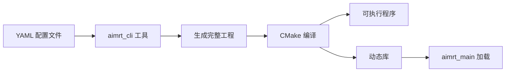
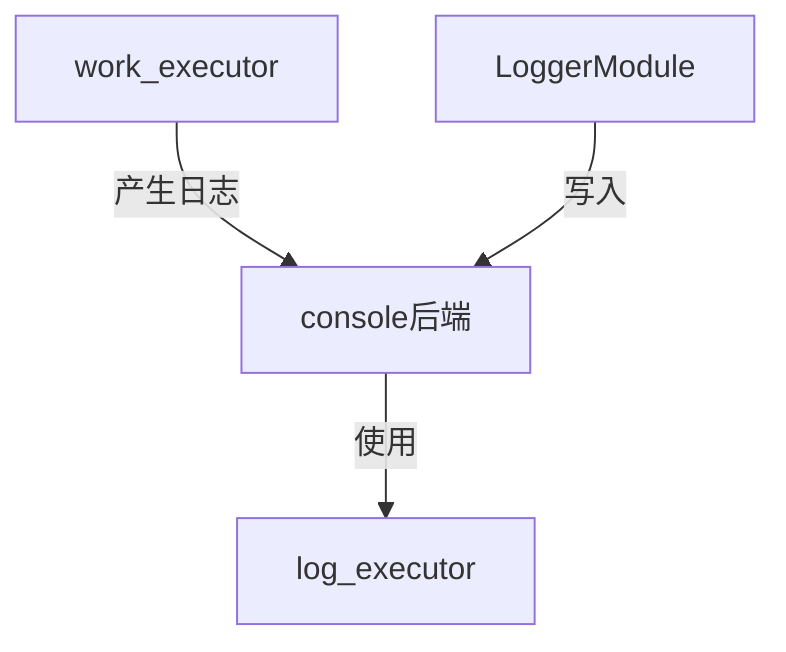

# 工具链与基本概念

## `aimrt_cli`​ 工具

### 用法示例

```shell
aimrt_cli gen -p [config.yaml] -o [output_folder]
# 示例：
aimrt_cli gen -p helloworld.yaml -o ./helloworld/
```

* **配置驱动**：通过 YAML 定义项目结构/编译选项/部署模式
* **工程生成**：自动创建 CMake 工程、模块模板、配置文件
* **安全机制**：输出目录需为空，避免文件覆盖冲突

### 配置文档示例：

直接看示例可能无法理解，快进到后续示例中我们自行编写的[配置文件](#20250402155159-hybss8y)，对照学习

```cpp
# 基础信息配置（必填项）
base_info:
  # 项目名称，将作为代码的命名空间
  project_name: test_prj

  # 构建模式标签，可自定义编译选项
  # 格式为 {PROJECT_NAME}_{OPTION_NAME}，若无需要可置为空列表 []
  build_mode_tags: ["EXAMPLE", "SIMULATION", "TEST_CAMERA"]

  # AIMRT引入选项配置（必须使用单引号包裹值）
  aimrt_import_options:
    # 是否构建运行时
    AIMRT_BUILD_RUNTIME: 'ON'
    # 是否使用fmt库
    AIMRT_USE_FMT_LIB: 'ON'
    # 是否使用protobuf构建
    AIMRT_BUILD_WITH_PROTOBUF: 'ON'
    # 是否使用本地protoc编译器
    AIMRT_USE_LOCAL_PROTOC_COMPILER: 'OFF'
    # 是否使用protoc python插件
    AIMRT_USE_PROTOC_PYTHON_PLUGIN: 'OFF'
    # 是否与ROS2一起构建
    AIMRT_BUILD_WITH_ROS2: 'ON'

# 依赖的标准模块配置（可选）
depends_std_modules:
  - name: xxx  # 依赖库名称（应与实际库名一致）
    git_repository: https://github.com/xxx/xxx.git  # 库地址
    git_tag: v0.1.5  # 版本标签
    import_options:  # 导入选项（暂不支持）
      XXX: 'ON'
  - name: yyy
    git_repository: https://github.com/yyy/yyy.git
    git_tag: v0.1.11

# 协议配置（可选）
protocols:
  - name: my_proto  # 协议名称
    type: protobuf   # 协议类型（protobuf/ros2）
    options:         # 选项（暂不支持）
      xxx: xxx

  - name: my_ros2_proto
    type: ros2
    options:
      zzz: zzz
    # 构建模式标签，仅在指定模式下构建
    build_mode_tag: ["EXAMPLE"]

  - name: example_proto
    type: protobuf
    # 未设置build_mode_tag表示在所有模式下都构建
    build_mode_tag: ["EXAMPLE"]

# 模块配置（可选）
modules:
  - name: my_foo_module  # 模块名称

  - name: my_bar_module

  - name: exmaple_module
    # 仅在EXAMPLE模式下构建
    build_mode_tag: ["EXAMPLE"]
    options:  # 选项（暂不支持）
      aaa: aaa

# 模块包配置（可选）
pkgs:
  - name: pkg1  # 包名称
    modules:    # 包含的模块
      - name: my_foo_module  # 模块名
        namespace: local     # 命名空间（自定义模块用local）
      - name: my_bar_module
        namespace: local
    options:
      sss: sss

  - name: pkg2
    modules:
      - name: exmaple_module
        namespace: local
      - name: ep_example_bar_module
        namespace: ep_example_aimrt_module  # 外部模块使用其实际命名空间
    build_mode_tag: ["EXAMPLE"]  # 仅在EXAMPLE模式下构建
    options:
      sss: sss

# 部署配置（可选）
deploy_modes:
  - name: exmaple_mode  # 部署模式名称
    build_mode_tag: ["EXAMPLE"]  # 构建模式检查
    deploy_ins:  # 部署实例配置
      - name: local_ins_1  # 实例名称
        pkgs:    # 依赖的包
          - name: pkg1
            options:
              disable_modules: []  # 禁用的模块列表
      - name: local_ins_2  # 简单实例（无包配置）
      - name: remote_ins_123

  # 简单部署模式（默认在所有模式下构建）
  - name: deploy_mode_1
  - name: deploy_mode_2
```

### CMake 依赖修正（`cmake/GetAimRT.cmake`​）

由`aimrt_cli`​工具生成的项目框架，还需要指定仓库和版本

```bash
# cmake/GetAimRT.cmake
FetchContent_Declare(
  aimrt
  GIT_REPOSITORY https://github.com/AimRT/aimrt.git
  GIT_TAG v0.8.3)  # 必须指定版本号
```

## aimrt_main主进程

AimRT 提供的`aimrt_main`​可执行程序，在运行时根据配置文件加载动态库形式的`Pkg`​，导入其中的`Module`​

## 项目工作流程



## 集成业务逻辑的两种方式(App与Pkg)

AimRT 框架可以通过两种方式来集成业务逻辑，分别是 **App模式** 和 **Pkg模式**，实际采用哪种方式需要根据具体场景进行判断。两者的区别如下：

* **App模式**：在开发者自己的 Main 函数中直接链接 AimRT 运行时库，编译时直接将业务逻辑代码编译进主程序：

  * **优势**：没有 dlopen 这个步骤，没有 so，只会有最终一个 exe。
  * **劣势**：可能会有第三方库的冲突；无法独立的发布`Module`​，想要二进制发布只能直接发布 exe。
  * **使用场景**：一般用于小工具、小型 Demo 场景，没有太大的模块解耦需求；
* **Pkg模式**：使用 AimRT 提供的 **aimrt_main** 可执行程序，在运行时根据配置文件加载动态库形式的`Pkg`​，导入其中的`Module`​类:

  * **优势**：编译业务`Module`​时只需要链接非常轻量的 AimRT 接口层，不需要链接 AimRT 运行时库，减少潜在的依赖冲突问题；可以二进制发布 so；独立性较好。
  * **劣势**：框架基于 dlopen 加载`Pkg`​，极少数场景下会有一些兼容性问题。
  * **使用场景**：一般用于中大型项目，对模块解耦、二进制发布等有较强烈需求时；

无论采用哪种方式都不影响业务逻辑，且两种方式可以共存，实际采用哪种方式需要根据具体场景进行判断。

注意，上述说的两种方式只是针对 Cpp 开发接口。如果是使用 Python 开发，则只支持App模式。

## 执行器

​`Executor`​，或者叫执行器，是指一个可以运行任务的抽象概念，一个执行器可以是一个 Fiber、Thread 或者 Thread Pool，我们平常写的代码也是默认的直接指定了一个执行器：Main 线程。一般来说，能提供以下接口的就可以算是一个执行器：

```
void Execute(std::function<void()>&& task);
```

还有一种`Executor`​提供定时执行的功能，可以指定在某个时间点或某段时间之后再执行任务。其接口类似如下：

```
void ExecuteAt(std::chrono::system_clock::time_point tp, std::function<void()>&& task);
void ExecuteAfter(std::chrono::nanoseconds dt, std::function<void()>&& task);
```

在 AimRT 中，执行器功能由**接口层**和**实际执行器的实现**两部分组成，两者相互解耦。接口层定义了执行器的抽象 Api，提供投递任务的接口。而实现层则负责实际的任务执行，根据实现类型的不同有不一样的表现。AimRT 官方提供了几种执行器，例如基于 Asio 的线程池、基于 Tbb 的无锁线程池、基于时间轮的定时执行器等。

开发者使用 AimRT 的执行器功能时，在业务层将任务打包成一个闭包，然后调用接口层的 API，将任务投递到具体的执行器内，而执行器会根据自己的调度策略，在一定时机执行投递过来的任务。具体逻辑流程如下图所示：


# HelloWorld示例

<span id="20250402154912-h5xyvvd" style="display: none;"></span>官方仓库：[helloworld](https://github.com/AimRT/AimRT/blob/main/src/examples/cpp/helloworld)

## 配置文件（`configuration_helloworld.yaml`​ ）

<span id="20250402155159-hybss8y" style="display: none;"></span>依据官方示例项目结构自行编写YAML配置文件

```bash
# 基础信息
base_info:
  project_name: helloworld  # 项目名称
  build_mode_tags: ["EXAMPLE", "SIMULATION", "TEST_CAMERA"]  # 构建模式标签
  aimrt_import_options:  # AimRT框架的构建选项
    AIMRT_BUILD_TESTS: "OFF"  # 是否构建测试代码
    AIMRT_BUILD_EXAMPLES: "ON"  # 是否构建示例代码
    AIMRT_BUILD_DOCUMENT: "OFF"  # 是否构建文档
    AIMRT_BUILD_RUNTIME: "ON"  # 是否构建运行时核心
    AIMRT_BUILD_CLI_TOOLS: "OFF"  # 是否构建命令行工具
    AIMRT_BUILD_WITH_PROTOBUF: "ON"  # 是否启用Protobuf支持
    AIMRT_USE_LOCAL_PROTOC_COMPILER: "OFF"  # 是否使用本地protoc编译器
    AIMRT_BUILD_WITH_ROS2: "OFF"  # 是否集成ROS2支持
    AIMRT_BUILD_NET_PLUGIN: "OFF"  # 是否构建网络插件
    AIMRT_BUILD_ROS2_PLUGIN: "OFF"  # 是否构建ROS2插件
    # ...  # 其他插件选项（MQTT、Zenoh等）

# 模块  会生成 ./helloworld/src/module/helloworld_module/helloworld_module.h
modules:
  - name: HelloWorld_module  # 自定义模块名称，同时会据此生成module的类名
  #   build_mode_tag: ["EXAMPLE"]  # 可选：指定模块的构建标签

# pkg   会生成 ./helloworld/src/pkg/helloworld_pkg/pkg_main.cc
pkgs:
  - name: HelloWorld_pkg  # 包名
    modules:
      - name: HelloWorld_module  # 包含的模块

# 部署  会生成 ./helloworld/src/install 目录及相应的启动脚本、配置文件
deploy_modes:
  - name: local_deploy  # 部署模式名称
    deploy_ins: # 部署实例
      - name: local_ins_helloworld  # 实例名称
        pkgs:
          - name: HelloWorld_pkg  # 实例加载的包
```

运行`aimrt_cli`​工具，生成脚手架代码

```bash
aimrt_cli gen -p configuration_helloworld.yaml -o helloworld
```

## module目录

### HelloWorld_module

完整代码查看[官方仓库](#20250402154912-h5xyvvd)，这里只讨论核心逻辑，建议对照源码阅读。

#### 模块定义（`helloworld_module.h`​）

```cpp
class HelloworldModule : public aimrt::ModuleBase {
public:
  // 必须实现的三大生命周期方法
  bool Initialize(aimrt::CoreRef core) override;  // 初始化配置
  bool Start() override;                         // 业务逻辑入口
  void Shutdown() override;                      // 资源释放

private:
  aimrt::CoreRef core_;  // 框架核心句柄
};
```

#### 模块实现（`helloworld_module.cc`​）

##### 初始化阶段

AimRT会在这一过程初始化自己的资源、例如日志、通信等模块。

官方文档提到：*需要注意的是，AimRT 的Initialize阶段仅仅是 AimRT 框架自身的初始化阶段，可能只是整个服务初始化阶段的一部分。使用者可能还需要在 AimRT 的Start阶段先初始化自己的一些业务逻辑，比如检查上下游资源、进行一些配置等，然后再真正的进入整个服务的运行阶段。*

思考能否将自己的一些资源获取相关的业务逻辑也放在这一阶段（似乎没必要）

```cpp
bool HelloworldModule::Initialize(aimrt::CoreRef core) {
  core_ = core;  // 绑定框架核心

  // 读取 YAML 配置示例
  auto cfg_path = core_.GetConfigurator().GetConfigFilePath();
  YAML::Node cfg = YAML::LoadFile(cfg_path);
  AIMRT_INFO("Loaded config: {}", cfg["param"].as<std::string>());

  return true;  // 初始化成功标志
}
```

##### 运行阶段

初始化结束后，AimRT就会调用`Start`​进入运行阶段，执行开发人员自己的业务逻辑。

```cpp
bool Start() {
  AIMRT_INFO("Module Started");  // 日志输出演示
  return true;
}
```

##### 停止阶段

AimRT 收到停止信号后会调用`Shutdown`​方法，进行资源释放等操作。

```bash
void Shutdown() {
  AIMRT_INFO("Cleanup resources");
}
```

所有的业务逻辑我们都会在Module类中进行实现，具体加载运行方式会由AimRT根据配置文件进行集成

## Pkg目录

### Pkg模式集成（pkg\_main.cc）

AimRT 提供的 `aimrt_main`​ 可执行程序，在运行时会根据配置文件加载 **动态库** 形式的 Pkg，并导入其中的 Module 类。加载后，框架会自动调用 `Initialize`​ 进行初始化，随后执行 `Start`​ 启动模块。

具体流程可参考 `aimrt_main`​ 源码：[aimrt_main主函数代码](https://github.com/AimRT/AimRT/blob/v0.8.x/src/runtime/main/main.cc)

### 注册表定义

```cpp
static std::tuple<std::string_view, FactoryFunc>
    aimrt_module_register_array[] = {
  {"HelloWorldModule",  // 模块标识名
   []() { return new HelloWorldModule(); }}  // 工厂函数
};
```

* **模块名称**：用于标识 `HelloWorldModule`​，框架会通过它查找模块。
* **工厂函数**：返回 `HelloWorldModule`​ 的实例，供 AimRT 运行时调用。

### 注册宏

```cpp
AIMRT_PKG_MAIN(aimrt_module_register_array)  // 框架入口宏
```

​**​`AIMRT_PKG_MAIN`​**​ **宏展开后，会生成 4 个 C 接口函数，供** **​`aimrt_main`​**​ **调用：**

* ​`AimRTDynlibGetModuleNum()`​：获取当前动态库中的模块数量。
* ​`AimRTDynlibGetModuleNameList()`​：获取所有可用的模块名称。
* ​`AimRTDynlibCreateModule()`​：根据模块名称创建模块实例。
* ​`AimRTDynlibDestroyModule()`​：销毁模块实例，释放资源。

### 加载运行

运行 `build`​ 目录下的 `start_local_deploy_local_ins_helloworld.sh`​ 启动进程。

> **脚本名称** 由创建工程时的((20250401152311-auw052s "配置文件"))自动生成。

```sh
# 这是启动脚本的具体内容
./aimrt_main --cfg_file_path=./cfg/local_deploy_local_ins_helloworld_cfg.yaml
```

**运行流程：**

1. **解析配置文件**，查找需要加载的模块名称。
2. **在注册表中匹配模块名**，调用对应的工厂函数创建实例。
3. **依次执行** **​`Initialize()`​** ​ **和** **​`Start()`​** ​，完成模块启动。

## App目录

**App模式官网概念：**​*开发者在自己的 Main 函数中注册/创建各个模块，编译时直接将业务逻辑编译进主程序；*

可以简单理解为我们手动实现了`aimrt_main`​启动逻辑，分别有两种实现方式：[创建模块](https://docs.aimrt.org/v0.10.0/tutorials/interface_cpp/runtime.html#app) 和 [注册模块](https://docs.aimrt.org/v0.10.0/tutorials/interface_cpp/runtime.html#id3)

### 核心接口

需要在CMake中引用相关库：

```cpp
# Set link libraries of target
target_link_libraries(
  ${CUR_TARGET_NAME}
  PRIVATE gflags::gflags
          aimrt::runtime::core)
```

此时即可使用 `core/aimrt_core.h`​ 文件中的`aimrt::runtime::core::AimRTCore`​类，核心接口如下：

```cpp
namespace aimrt::runtime::core {

class AimRTCore {
 public:
  struct Options {
    std::string cfg_file_path;
  };

 public:
  void Initialize(const Options& options);

  void Start();
  std::future<void> AsyncStart();

  void Shutdown();

  module::ModuleManager& GetModuleManager();

};

}  // namespace aimrt::runtime::core
```

接口使用说明如下：

* ​`void Initialize(const Options& options)`​：用于初始化框架。

  * 接收一个`AimRTCore::Options`​作为初始化参数。其中最重要的项是`cfg_file_path`​，用于设置配置文件路径。
  * 如果初始化失败，会抛出一个异常。
* ​`void Start()`​：启动框架。

  * 如果启动失败，会抛出一个异常。
  * 必须在 Initialize 方法之后调用，否则行为未定义。
  * 如果启动成功，会阻塞当前线程，并将当前线程作为本`AimRTCore`​实例的主线程。
* ​`std::future<void> AsyncStart()`​：异步启动框架。

  * 如果启动失败，会抛出一个异常。
  * 必须在 Initialize 方法之后调用，否则行为未定义。
  * 如果启动成功，会返回一个`std::future<void>`​句柄，需要在调用 `Shutdown`​ 方法后调用该句柄的 `wait`​ 方法阻塞等待结束。
  * 该方法会在内部新启动一个线程作为本`AimRTCore`​实例的主线程
  * 阅读函数源码可以发现，创建的**后台线程**的**唯一作用**就是**等待 shutdown 信号，并执行清理工作**。
* ​`void Shutdown()`​：停止框架。

  * 可以在任意线程、任意阶段调用此方法，也可以调用任意次数。
  * 调用此方法后，`Start`​方法将在执行完主线程中的所有任务后，退出阻塞。
  * 需要注意，有时候业务会阻塞住主线程中的任务，导致`Start`​方法无法退出阻塞、优雅结束整个框架，此时需要在外部强制 kill。

### 注册模块（`helloworld_app_registration_mode`​）（推荐方案）

通过`RegisterModule`​可以直接注册一个标准模块。开发者需要先实现一个继承于`ModuleBase`​基类的`Module`​，然后在`AimRTCor`​e实例调用`Initialize`​方法之前注册该`Module`​实例，在此方式下仍然有一个比较清晰的`Module`​边界。

参考代码：

```cpp
#include <csignal>
#include <iostream>

#include "HelloWorld_module/HelloWorld_module.h"	// 这里引用的是我们之前创建的Module类
#include "core/aimrt_core.h"

using namespace aimrt::runtime::core;
using namespace helloworld::HelloWorld_module;

AimRTCore* global_core_ptr = nullptr;

void SignalHandler(int sig) {
  if (global_core_ptr && (sig == SIGINT || sig == SIGTERM)) {
    global_core_ptr->Shutdown();
    return;
  }

  raise(sig);
};

int32_t main(int32_t argc, char** argv) {
  signal(SIGINT, SignalHandler);
  signal(SIGTERM, SignalHandler);

  std::cout << "AimRT start." << std::endl;

  try {
    AimRTCore core;
    global_core_ptr = &core;

    // register module
    HelloworldModule helloworld_module;
    core.GetModuleManager().RegisterModule(helloworld_module.NativeHandle());

    AimRTCore::Options options;
    if (argc > 1) options.cfg_file_path = argv[1];

    core.Initialize(options);

    core.Start();

    core.Shutdown();

    global_core_ptr = nullptr;
  } catch (const std::exception& e) {
    std::cout << "AimRT run with exception and exit. " << e.what() << std::endl;
    return -1;
  }

  std::cout << "AimRT exit." << std::endl;

  return 0;
}
```

通过下面的命令启动编译后的可执行文件

```cpp
./helloworld_app_registration_mode ./cfg/examples_cpp_helloworld_app_mode_cfg.yaml
```

### **创建模块（**​`helloworld_app`​）

在`AimRTCore`​实例调用Initialize方法之后，通过`CreateModule`​可以创建一个模块，并返回一个`aimrt::CoreRef`​句柄，开发者可以直接基于此句柄调用一些框架的方法，比如 **RPC** 或者 **Log** 等。在此方式下没有一个比较清晰的`Module`​边界，不利于大型项目的组织，一般仅用于快速做一些小工具。

参考代码：

```cpp
// Copyright (c) 2023, AgiBot Inc.
// All rights reserved.

#include <csignal>
#include <iostream>

#include "aimrt_module_cpp_interface/core.h"
#include "core/aimrt_core.h"

using namespace aimrt::runtime::core;

// 全局指针，指向 AimRTCore 实例，用于在信号处理函数中进行关闭操作
AimRTCore* global_core_ptr = nullptr;

/**
 * @brief 信号处理函数
 *
 * 处理 SIGINT (Ctrl+C) 和 SIGTERM 信号，如果 AimRTCore 实例存在，则调用其
 * Shutdown 方法进行关闭。
 */
void SignalHandler(int sig) {
  if (global_core_ptr && (sig == SIGINT || sig == SIGTERM)) {
    global_core_ptr->Shutdown();  // 调用 Shutdown 方法，优雅退出
    return;
  }

  raise(sig);  // 传递其他信号，按照默认行为处理
}

int32_t main(int32_t argc, char** argv) {
  // 注册信号处理函数，确保进程收到终止信号时能正确清理资源
  signal(SIGINT, SignalHandler);
  signal(SIGTERM, SignalHandler);

  std::cout << "AimRT 启动." << std::endl;  // 日志：AimRT 启动

  try {
    AimRTCore core;
    global_core_ptr = &core;  // 赋值全局指针，以便信号处理时可以访问

    // 配置 AimRTCore 选项
    AimRTCore::Options options;
    if (argc > 1)
      options.cfg_file_path =
          argv[1];  // 如果传入了参数，则使用该参数作为配置文件路径

    core.Initialize(options);  // 初始化 AimRTCore 实例

    // 创建 AimRT 模块，并获取模块句柄
    aimrt::CoreRef module_handle(
        core.GetModuleManager().CreateModule("HelloWorldModule"));

    // 记录日志，表示模块创建成功
    AIMRT_HL_INFO(module_handle.GetLogger(), "这是一个示例日志。");

    // 读取并解析 YAML 配置文件
    auto file_path = module_handle.GetConfigurator().GetConfigFilePath();
    if (!file_path.empty()) {
      YAML::Node cfg_node = YAML::LoadFile(std::string(file_path));
      for (const auto& itr : cfg_node) {
        std::string k = itr.first.as<std::string>();
        std::string v = itr.second.as<std::string>();
        AIMRT_HL_INFO(module_handle.GetLogger(), "cfg [{} : {}]", k, v);
      }
    }

    // 异步启动 AimRT 实例，返回一个 future 对象
    auto fu = core.AsyncStart();

    AIMRT_HL_INFO(module_handle.GetLogger(), "启动成功。");
    // 日志：启动成功。

    // 等待 AimRT 运行结束（即 shutdown 触发）
    fu.wait();

    // 关闭 AimRT 实例
    core.Shutdown();

    // 清空全局指针，避免悬空指针问题
    global_core_ptr = nullptr;
  } catch (const std::exception& e) {
    std::cout << "AimRT 运行时发生异常，退出: " << e.what() << std::endl;
    return -1;
  }

  std::cout << "AimRT 退出." << std::endl;  // 日志：AimRT 退出

  return 0;
}
```

通过下面的命令启动编译后的可执行文件：

```cpp
./helloworld_app_registration_mode ./cfg/examples_cpp_helloworld_app_mode_cfg.yaml
```

---

# Executor示例

官方仓库：[executor](https://github.com/AimRT/AimRT/blob/main/src/examples/cpp/executor)

## 配置文件（`configuration_executor.yaml`​）

依据官方示例项目结构自行编写YAML配置文件：

```cpp
# 基础信息
base_info:
  project_name: Logger # 项目名称
  build_mode_tags: ["EXAMPLE", "SIMULATION", "TEST_CAMERA"] # 构建模式标签
  aimrt_import_options: # AimRT框架的构建选项
    AIMRT_BUILD_TESTS: "OFF" # 是否构建测试代码
    AIMRT_BUILD_EXAMPLES: "ON" # 是否构建示例代码
    AIMRT_BUILD_DOCUMENT: "OFF" # 是否构建文档
    AIMRT_BUILD_RUNTIME: "ON" # 是否构建运行时核心
    AIMRT_BUILD_CLI_TOOLS: "OFF" # 是否构建命令行工具
    AIMRT_BUILD_WITH_PROTOBUF: "ON" # 是否启用Protobuf支持
    AIMRT_USE_LOCAL_PROTOC_COMPILER: "OFF" # 是否使用本地protoc编译器
    AIMRT_BUILD_WITH_ROS2: "OFF" # 是否集成ROS2支持
    AIMRT_BUILD_NET_PLUGIN: "OFF" # 是否构建网络插件
    AIMRT_BUILD_ROS2_PLUGIN: "OFF" # 是否构建ROS2插件

# 模块
modules:
  - name: executor_module # 最基本的 cpp executor 示例
  - name: executor_co_module # 基于协程接口使用 executor 功能的示例
  - name: executor_co_loop_module # 基于协程接口使用 executor 功能实现定时循环的示例
  - name: real_time_module #  executor 实时性相关功能的示例

# pkg
pkgs:
  - name: executor_pkg # 包名
    modules:
      - name: executor_module
      - name: executor_co_module
      - name: executor_co_loop_module
      - name: real_time_module

# 部署
deploy_modes:
  - name: local_deploy # 部署模式名称
    deploy_ins: # 部署实例
      - name: local_ins_executor # 实例名称
        pkgs:
          - name: executor_pkg # 实例加载的包

```

运行`aimrt_clt`​工具生成脚手架代码

```cpp
aimrt_cli gen -p configuration_executor.yaml -o executor
```

## module目录

### executor_module

一个最基本的 cpp executor 示例，演示内容包括：

* 如何获取执行器；
* 如何投递任务到执行器中执行；
* 如何使用**线程安全型**执行器；
* 如何投递定时任务到执行器中；

说明：

* 此示例创建了一个 `ExecutorModule`​，会在`Initialize`​时获取以下三种执行器：

  * 名称为`work_executor`​的普通执行器；
  * 名称为`thread_safe_executor`​的线程安全型执行器；
  * 名称为`time_schedule_executor`​的支持定时任务的执行器；
* ​`ExecutorModule`​模块在 `Start`​ 阶段会依次使用获取的执行器运行具体的逻辑任务：

  * ​`work_executor`​：投递一个简单的任务到其中执行；
  * ​`thread_safe_executor`​：向该执行器中一次性投递 10000 个任务，用于递增一个整数 n，并在最终打印出 n 的值，由于执行器是线程安全，故 n 最终值还是 10000；
  * ​`time_schedule_executor`​：通过该执行器实现了一个间隔 1s 的定时循环；
* 此示例将 `ExecutorModule`​ 集成到 `executor_pkg`​ 中，并在配置文件中加载此 Pkg；

#### 模块定义（`executor_module.h`​）

```cpp
#pragma once

#include "aimrt_module_cpp_interface/module_base.h"

namespace Executor::executor_module {

// 执行器模块类，继承自模块基类
class ExecutorModule : public aimrt::ModuleBase {
 public:
  ExecutorModule() = default;
  ~ExecutorModule() override = default;

  // 获取模块信息
  aimrt::ModuleInfo Info() const override {
    return aimrt::ModuleInfo{.name = "ExecutorModule"};
  }  // 复制官方代码过来后需要添加命名空间  aimrt

  // 初始化模块
  bool Initialize(aimrt::CoreRef aimrt_ptr) override;

  // 启动模块
  bool Start() override;

  // 关闭模块
  void Shutdown() override;

 private:
  // 获取日志记录器
  auto GetLogger() { return core_.GetLogger(); }

  // 简单执行演示
  void SimpleExecuteDemo();
  // 线程安全演示
  void ThreadSafeDemo();
  // 时间调度演示
  void TimeScheduleDemo();

 private:
  aimrt::CoreRef core_;  // AIMRT框架核心引用

  aimrt::executor::ExecutorRef work_executor_;         // 普通执行器
  aimrt::executor::ExecutorRef thread_safe_executor_;  // 线程安全执行器

  std::atomic_bool run_flag_ = true;                     // 运行标志(原子变量)
  uint32_t loop_count_ = 0;                              // 循环计数器
  aimrt::executor::ExecutorRef time_schedule_executor_;  // 时间调度执行器
};

}  // namespace Executor::executor_module
```

这里主要是定义了几个AimRT的执行器句柄和会用到的变量

#### 模块实现（`executor_module.cc`​）

##### 初始化阶段

```cpp
// 初始化模块
bool ExecutorModule::Initialize(aimrt::CoreRef core) {
  // 保存AIMRT框架句柄
  core_ = core;

  // 获取工作执行器
  work_executor_ = core_.GetExecutorManager().GetExecutor("work_executor");
  AIMRT_CHECK_ERROR_THROW(work_executor_, "无法获取工作执行器(work_executor)");

  // 获取线程安全执行器
  thread_safe_executor_ =
      core_.GetExecutorManager().GetExecutor("thread_safe_executor");
  AIMRT_CHECK_ERROR_THROW(
      thread_safe_executor_ && thread_safe_executor_.ThreadSafe(),
      "无法获取线程安全执行器(thread_safe_executor)");

  // 获取时间调度执行器
  time_schedule_executor_ =
      core_.GetExecutorManager().GetExecutor("time_schedule_executor");
  AIMRT_CHECK_ERROR_THROW(
      time_schedule_executor_ && time_schedule_executor_.SupportTimerSchedule(),
      "无法获取时间调度执行器(time_schedule_executor)");

  AIMRT_INFO("初始化成功");

  return true;
}
```

主要操作是根据名称获取执行器，执行器名称会在启动时由config.yaml文件确定，例如：

```cpp
  executor:
    executors:
      - name: work_executor # 执行器名称
        type: asio_thread # 执行器类型：基于 ASIO 的线程池，
        options:
          thread_num: 2 # 分配的线程数量，用于并发处理任务

      - name: thread_safe_executor # 线程安全执行器：通过 ASIO Strand 实现串行执行，避免竞态条件
        type: asio_strand # 执行器类型：基于 ASIO 的 strand 包装，确保线程安全
        options:
          bind_asio_thread_executor_name: work_executor # 绑定的基础执行器，实际任务由其线程池调度执行

      - name: time_schedule_executor # 定时任务执行器：用于周期性/定时调度任务
        type: asio_thread # 执行器类型：使用独立的 ASIO 线程池执行定时任务
        options:
          thread_num: 2 # 分配的线程数量，可根据定时任务复杂度调整
```

##### 运行阶段

```cpp
// 启动模块
bool ExecutorModule::Start() {
  // 测试简单执行
  SimpleExecuteDemo();

  // 测试线程安全执行
  ThreadSafeDemo();

  // 测试时间调度执行
  TimeScheduleDemo();

  AIMRT_INFO("启动成功");

  return true;
}

// 任务函数实现

// 简单执行演示
void ExecutorModule::SimpleExecuteDemo() {
  work_executor_.Execute([this]() { AIMRT_INFO("这是一个简单任务"); });
}

// 线程安全演示
void ExecutorModule::ThreadSafeDemo() {
  uint32_t n = 0;
  for (uint32_t ii = 0; ii < 10000; ++ii) {
    thread_safe_executor_.Execute([&n]() { n++; });  // 线程安全执行器
    // work_executor_.Execute([&n]() { n++; }); // 普通执行器
  }

  std::this_thread::sleep_for(std::chrono::seconds(1));  // 等待1秒

  AIMRT_INFO("n的值为: {}", n);
}

// 时间调度演示
void ExecutorModule::TimeScheduleDemo() {
  if (!run_flag_) return;  // 检查运行标志

  AIMRT_INFO("循环计数: {}", loop_count_++);

  // 1秒后再次执行本函数
  time_schedule_executor_.ExecuteAfter(
      std::chrono::seconds(1),
      std::bind(&ExecutorModule::TimeScheduleDemo, this));
}
```

通过调用执行器句柄的`Execute`​或者`ExecuteAfter`​向执行器中投递任务

##### 停止阶段

```cpp
// 关闭模块
void ExecutorModule::Shutdown() {
  run_flag_ = false;  // 设置运行标志为false

  std::this_thread::sleep_for(std::chrono::seconds(1));  // 等待1秒

  AIMRT_INFO("关闭成功");
}
```

将`run_flag_`​变量置false，用于控制定时器执行器的任务停止。

#### 对应的启动配置文件

```cpp
# Copyright (c) 2023, AgiBot Inc.
# All rights reserved.

aimrt:
  log:
    core_lvl: INFO # Trace/Debug/Info/Warn/Error/Fatal/Off
    backends:
      - type: console
  executor:
    executors:
      - name: work_executor
        type: asio_thread
        options:
          thread_num: 2
      - name: thread_safe_executor
        type: asio_strand
        options:
          bind_asio_thread_executor_name: work_executor
      - name: time_schedule_executor
        type: asio_thread
        options:
          thread_num: 2
  module:
    pkgs:
      - path: ./libexecutor_pkg.so
        enable_modules: [ExecutorModule]
    modules:
      - name: ExecutorModule
        log_lvl: INFO
```

### executor_co_module

一个基于协程接口使用 executor 功能的示例，演示内容包括：

* 如何以协程的方式使用执行器；

#### 模块定义（`executor_co_module.h`​）

```cpp
#pragma once

#include "aimrt_module_cpp_interface/co/aimrt_context.h"
#include "aimrt_module_cpp_interface/co/async_scope.h"
#include "aimrt_module_cpp_interface/co/task.h"
#include "aimrt_module_cpp_interface/module_base.h"

namespace Executor::executor_co_module {

using namespace aimrt;

// 定义一个协程模块，继承自 AimRT 的 ModuleBase 接口
class ExecutorCoModule : public aimrt::ModuleBase {
 public:
  ExecutorCoModule() = default;
  ~ExecutorCoModule() override = default;

  // 返回模块信息
  aimrt::ModuleInfo Info() const override {
    return ModuleInfo{.name = "ExecutorCoModule"};
  }

  // 初始化模块
  bool Initialize(aimrt::CoreRef aimrt_ptr) override;

  // 启动模块，执行实际的协程逻辑
  bool Start() override;

  // 模块关闭逻辑，清理资源
  void Shutdown() override;

 private:
  // 获取日志器
  auto GetLogger() { return core_.GetLogger(); }

  // 简单执行器示例：演示普通线程池调度
  co::Task<void> SimpleExecuteDemo();

  // 线程安全执行器示例：演示多个任务安全执行
  co::Task<void> ThreadSafeDemo();

  // 定时执行器示例：定时打印计数
  co::Task<void> TimeScheduleDemo();

 private:
  aimrt::CoreRef core_;  // 框架核心引用

  co::AimRTContext
      ctx_;  // 协程上下文对象，可以用来获取某个执行器的"协程封装接口"

  co::AsyncScope
      scope_;  // 协程作用域，用于启动协程(spawn)和等待协程完成(complete),可以跟踪和管理多个异步协程的生命周期

  std::atomic_bool run_flag_ = true;  // 控制定时任务运行的标志位
};

}  // namespace Executor::executor_co_module

```

#### 模块实现（`executor_co_module.cc`​）

##### 初始化阶段

```cpp

bool ExecutorCoModule::Initialize(aimrt::CoreRef core) {
  // 保存框架核心引用
  core_ = core;

  // 创建协程上下文对象
  ctx_ = co::AimRTContext(core_.GetExecutorManager());

  // 检查普通执行器是否可用
  auto work_executor = core_.GetExecutorManager().GetExecutor("work_executor");
  AIMRT_CHECK_ERROR_THROW(work_executor, "无法获取 work_executor 执行器");

  // 检查线程安全执行器是否可用
  auto thread_safe_executor =
      core_.GetExecutorManager().GetExecutor("thread_safe_executor");
  AIMRT_CHECK_ERROR_THROW(
      thread_safe_executor && thread_safe_executor.ThreadSafe(),
      "无法获取 thread_safe_executor 执行器或不支持线程安全");

  // 检查定时执行器是否可用
  auto time_schedule_executor =
      core_.GetExecutorManager().GetExecutor("time_schedule_executor");
    AIMRT_CHECK_ERROR_THROW(
        time_schedule_executor &&
        time_schedule_executor.SupportTimerSchedule(), "无法获取
        time_schedule_executor 执行器或不支持定时调度");

  // 初始化成功
  AIMRT_INFO("模块初始化成功。");

  return true;
}
```

* 注意这里获取的三个执行器，只是用来检查是否可用，将错误限制在初始化阶段

##### 运行阶段

```cpp

bool ExecutorCoModule::Start() {
  // 启动普通协程任务
  scope_.spawn(co::On(co::InlineScheduler(), SimpleExecuteDemo()));

  // 启动线程安全的协程任务
  scope_.spawn(co::On(co::InlineScheduler(), ThreadSafeDemo()));

  // 启动定时执行的协程任务
  scope_.spawn(co::On(co::InlineScheduler(), TimeScheduleDemo()));

  AIMRT_INFO("模块启动成功。");

  return true;
}
```

调用三个任务函数

* ​`scope_.spawn(...)`​用于向协程`scope_`​这个协程作用域中启动一个协程任务
* ​`co::InlineScheduler()`​指的是在当前线程执行协程的第一段代码
* ​`co::On(scheduler, SimpleExecuteDemo())`​表示让`SimpleExecuteDemo()`​协程在 `scheduler`​ 上开始执行

```cpp
co::Task<void> ExecutorCoModule::SimpleExecuteDemo() {
  // 获取 work_executor 的调度器
  auto work_scheduler = ctx_.GetScheduler("work_executor");

  // 打印当前协程的线程 ID
  std::ostringstream oss1;
  oss1 << std::this_thread::get_id();
  std::cout << "[SimpleExecuteDemo] 当前协程的线程 ID: " << oss1.str()
            << std::endl;

  // 将当前协程调度到 work_executor 上执行
  co_await co::Schedule(work_scheduler);

  // 打印切换后的线程 ID
  std::ostringstream oss2;
  oss2 << std::this_thread::get_id();
  std::cout << "[SimpleExecuteDemo] 切换执行器后的线程 ID: " << oss2.str()
            << std::endl;

  // 执行任务内容
  AIMRT_INFO("执行普通任务：SimpleExecuteDemo");

  co_return;
}
```

* ​`ctx_.GetScheduler("work_executor")`​通过执行器名称获取协程封装版本的调度器
* ​`co_await co::Schedule(work_scheduler)`​挂起当前线程，后续让`work_scheduler`​异步执行后续代码
* 可以简单添加两个日志打印，观察不同线程执行协程函数的切换效果

```cpp
co::Task<void> ExecutorCoModule::ThreadSafeDemo() {
  // 获取 thread_safe_executor 的调度器
  auto thread_safe_scheduler = ctx_.GetScheduler("thread_safe_executor");

  co::AsyncScope scope;

  uint32_t n = 0;  // 计数器
  auto task = [&n]() -> co::Task<void> {
    n++;
    co_return;
  };

  // 启动 10000 个线程安全任务
  for (size_t ii = 0; ii < 10000; ++ii) {
    scope.spawn(co::On(thread_safe_scheduler, task()));
  }

  // 等待所有任务执行完毕
  co_await co::On(co::InlineScheduler(), scope.complete());

  // 输出最终计数值
  AIMRT_INFO("线程安全任务已完成，n 的值为 {}", n);

  co_return;
}
```

* 这里的区别是协程内部再启动了10000个异步的协程

* `co::On(co::InlineScheduler(), ...)`​让恢复操作 **在当前线程（InlineScheduler）中执行**

```cpp
co::Task<void> ExecutorCoModule::TimeScheduleDemo() {
  AIMRT_INFO("开始定时任务循环。");

  // 获取 time_schedule_executor 的调度器
  auto time_scheduler = ctx_.GetScheduler("time_schedule_executor");

  // 切换协程到定时调度线程池
  co_await co::Schedule(time_scheduler);

  uint32_t count = 0;
  while (run_flag_) {
    count++;
    AIMRT_INFO("定时循环第 {} 次 -------------------------", count);

    // 延迟 1 秒后再次调度（实现定时循环）
    co_await co::ScheduleAfter(time_scheduler, std::chrono::seconds(1));
  }

  AIMRT_INFO("退出定时任务循环。");

  co_return;
}
```

* ​`co_await co::ScheduleAfter(time_scheduler,...)`​让等待任务完成后，由 `time_scheduler`​ 执行器中的线程恢复

##### 停止阶段

```cpp
void ExecutorCoModule::Shutdown() {
  // 停止定时任务循环
  run_flag_ = false;

  // 等待所有协程任务完成
  co::SyncWait(scope_.complete());

  AIMRT_INFO("模块已关闭。");
}
```

* 停止定时任务
* ​`co::SyncWait(scope_.complete())`​**阻塞当前线程**，直到 `scope_.complete()`​ 所控制的所有协程任务完成

#### 对应的启动配置文件

```yaml
# Copyright (c) 2023, AgiBot Inc.
# All rights reserved.

aimrt:
  log:
    core_lvl: INFO # Trace/Debug/Info/Warn/Error/Fatal/Off
    backends:
      - type: console
  executor:
    executors:
      - name: work_executor
        type: asio_thread
        options:
          thread_num: 2
      - name: thread_safe_executor
        type: asio_thread
        options:
          thread_num: 1
      - name: time_schedule_executor
        type: asio_thread
        options:
          thread_num: 2
  module:
    pkgs:
      - path: ./libexecutor_pkg.so
        enable_modules: [ExecutorCoModule]
    modules:
      - name: ExecutorCoModule
        log_lvl: INFO
```

### executor_co_loop_module

一个基于协程接口使用 executor 功能实现定时循环的示例，演示内容包括：

* 如何以协程的方式使用执行器实现定时循环；

*与上一个示例中的定时器类似，因此这里只简单地分析。*

#### 模块定义（`executor_co_loop_module.h`​）

```cpp
#pragma once

// 引入原子操作支持，用于线程安全的布尔变量
#include <atomic>

// 引入 AimRT 协程相关的接口
#include "aimrt_module_cpp_interface/co/aimrt_context.h"
#include "aimrt_module_cpp_interface/co/async_scope.h"
#include "aimrt_module_cpp_interface/co/task.h"

#include "aimrt_module_cpp_interface/module_base.h"

// 所有代码都放在对应命名空间下，防止命名冲突
namespace Executor::executor_co_loop_module {

using namespace aimrt;

// 自定义模块类，继承自 AimRT 框架的 ModuleBase 基类
class ExecutorCoLoopModule : public aimrt::ModuleBase {
 public:
  // 构造函数：默认构造
  ExecutorCoLoopModule() = default;

  // 析构函数：使用默认析构
  ~ExecutorCoLoopModule() override = default;

  // 模块信息，用于注册模块时描述其名称
  ModuleInfo Info() const override {
    return ModuleInfo{.name = "ExecutorCoLoopModule"};
  }

  // 初始化函数，框架会在模块加载时调用
  bool Initialize(aimrt::CoreRef aimrt_ptr) override;

  // 启动函数，框架会在模块 Start 时调用
  bool Start() override;

  // 关闭函数，框架会在模块卸载或退出时调用
  void Shutdown() override;

 private:
  // 获取模块的日志对象，用于打印日志
  auto GetLogger() { return core_.GetLogger(); }

  // 主逻辑循环，使用协程定义
  co::Task<void> MainLoop();

 private:
  // 框架核心对象引用，用于访问其他模块/调度器等
  aimrt::CoreRef core_;

  // 指向时间调度执行器的引用，用于控制调度策略
  aimrt::executor::ExecutorRef time_schedule_executor_;

  // 异步任务作用域，用于批量管理协程任务
  co::AsyncScope scope_;

  // 控制循环运行状态的原子布尔标志，线程安全
  std::atomic_bool run_flag_ = true;
};

}  // namespace aimrt::examples::cpp::executor::executor_co_loop_module
```

* 创建变量：核心句柄、执行器句柄、协程作用域管理器、循环控制标志

#### 模块实现(`executor_co_loop_module.cc`​)

##### 初始化阶段

```cpp
bool ExecutorCoLoopModule::Initialize(aimrt::CoreRef core) {
  // 保存框架核心对象引用
  core_ = core;

  // 从框架中获取名为 "time_schedule_executor" 的调度器执行器
  time_schedule_executor_ =
      core_.GetExecutorManager().GetExecutor("time_schedule_executor");

  // 校验是否成功获取，并且该执行器支持定时调度功能
  AIMRT_CHECK_ERROR_THROW(
      time_schedule_executor_ && time_schedule_executor_.SupportTimerSchedule(),
      "无法获取支持定时调度的执行器：time_schedule_executor");

  // 打印初始化成功日志（中文）
  AIMRT_INFO("模块初始化成功。");

  return true;
}
```

##### 运行阶段

```cpp
bool ExecutorCoLoopModule::Start() {
  // 在内联调度器上启动主协程循环任务
  scope_.spawn(co::On(co::InlineScheduler(), MainLoop()));

  // 打印启动成功日志（中文）
  AIMRT_INFO("模块启动成功。");

  return true;
}

// 模块的主协程逻辑
co::Task<void> ExecutorCoLoopModule::MainLoop() {
  // 打印循环开始日志（中文）
  AIMRT_INFO("协程主循环开始。");

  // 使用 time_schedule_executor 创建调度器对象
  auto scheduler = aimrt::co::AimRTScheduler(time_schedule_executor_);

  // 切换协程到定时调度线程池
  co_await co::Schedule(scheduler);

  uint32_t count = 0;

  // 开始循环，直到 run_flag_ 被设置为 false
  while (run_flag_) {
    count++;
    // 打印当前循环次数（中文）
    AIMRT_INFO("协程主循环第 {} 次 -------------------------", count);

    // 延迟 1 秒后再次调度，实现定时循环逻辑
    co_await co::ScheduleAfter(scheduler, std::chrono::seconds(1));
  }

  // 循环结束后打印退出日志（中文）
  AIMRT_INFO("协程主循环已退出。");

  co_return;
}
```

##### 停止阶段

```cpp
void ExecutorCoLoopModule::Shutdown() {
  // 设置运行标志为 false，用于结束循环
  run_flag_ = false;

  // 阻塞等待所有协程任务完成
  co::SyncWait(scope_.complete());

  // 打印关闭成功日志（中文）
  AIMRT_INFO("模块已关闭。");
}
```

#### 对应的启动配置文件

```yaml
# Copyright (c) 2023, AgiBot Inc.
# All rights reserved.

aimrt:
  log:
    core_lvl: INFO # Trace/Debug/Info/Warn/Error/Fatal/Off
    backends:
      - type: console
  executor:
    executors:
      - name: time_schedule_executor
        type: asio_thread
  module:
    pkgs:
      - path: ./libexecutor_pkg.so
        enable_modules: [ExecutorCoLoopModule]
    modules:
      - name: ExecutorCoLoopModule
        log_lvl: INFO
```

### real_time_module

一个 executor 实时性相关功能的示例，演示内容包括：

* 如何通过配置文件设置执行器的线程调度策略和优先级、绑核策略等；
* 本示例仅在 linux 上有效；
* 本示例重点在于最后的配置文件

#### 模块定义（`real_time_module.h`​）

```cpp
#pragma once  // 防止头文件被多次包含

#include <atomic>  // 提供原子类型 std::atomic，用于线程安全标志控制

// 引入协程相关接口
#include "aimrt_module_cpp_interface/co/async_scope.h"  // 异步作用域，管理协程生命周期
#include "aimrt_module_cpp_interface/co/task.h"         // 协程任务 Task 定义
#include "aimrt_module_cpp_interface/module_base.h"  // AIMRT 模块基类定义

namespace Executor::real_time_module {

// RealTimeModule 是一个继承自 AIMRT 框架的 ModuleBase 的模块实现
class RealTimeModule : public aimrt::ModuleBase {
 public:
  RealTimeModule() = default;            // 默认构造函数
  ~RealTimeModule() override = default;  // 析构函数，确保虚析构行为

  // 实现模块信息接口，返回模块的名称
  ModuleInfo Info() const override {
    return ModuleInfo{.name = "RealTimeModule"};
  }

  // 模块初始化函数，在模块被加载时调用
  bool Initialize(aimrt::CoreRef aimrt_ptr) override;

  // 模块启动函数，在模块开始运行时调用
  bool Start() override;

  // 模块关闭函数，在模块卸载或退出时调用
  void Shutdown() override;

 private:
  // 获取模块的日志接口，用于打印日志信息
  auto GetLogger() { return core_.GetLogger(); }

  // 通过指定执行器名称启动一个协程工作循环
  void StartWorkLoopByExecutor(std::string_view executor_name);

  // 工作循环协程函数，接收一个执行器引用作为参数
  co::Task<void> WorkLoop(aimrt::executor::ExecutorRef executor_ptr);

 private:
  aimrt::CoreRef core_;               // AIMRT 框架核心引用，用于访问系统资源
  co::AsyncScope scope_;              // 管理模块中所有异步协程任务的作用域
  std::atomic_bool run_flag_ = true;  // 控制定时循环协程是否继续运行的标志位
};

}  // namespace Executor::real_time_module
```

#### 模块实现（`real_time_module.cc`​）

##### 初始化阶段

```cpp
// 初始化模块，保存 AIMRT 核心引用
bool RealTimeModule::Initialize(aimrt::CoreRef core) {
  // 保存 AIMRT 框架句柄
  core_ = core;

  // 日志：初始化成功
  AIMRT_INFO("初始化成功（Init succeeded）.");

  return true;
}
```

##### 运行阶段

```cpp
// 启动模块，分别在三个不同类型的执行器上启动工作协程
bool RealTimeModule::Start() {
  StartWorkLoopByExecutor("sched_fifo_thread");   // 启动 FIFO 调度线程的协程
  StartWorkLoopByExecutor("sched_other_thread");  // 启动 OTHER 调度线程的协程
  StartWorkLoopByExecutor("sched_rr_thread");  // 启动 RR（轮询）调度线程的协程

  // 日志：启动成功
  AIMRT_INFO("启动成功（Start succeeded）.");
  return true;
}


// 启动指定执行器名的协程工作循环
void RealTimeModule::StartWorkLoopByExecutor(std::string_view executor_name) {
  auto executor = core_.GetExecutorManager().GetExecutor(executor_name);
  // 校验执行器存在并支持定时调度
  AIMRT_CHECK_ERROR_THROW(executor && executor.SupportTimerSchedule(),
                          "获取执行器 '{}' 失败（Get executor '{}' failed）.",
                          executor_name);
  // 使用指定执行器调度 WorkLoop 协程，并托管给 scope_
  scope_.spawn(co::On(co::AimRTScheduler(executor), WorkLoop(executor)));
}

// 工作协程逻辑：定时执行并打印线程和 CPU 信息
co::Task<void> RealTimeModule::WorkLoop(aimrt::executor::ExecutorRef executor) {
  try {
    // 日志：启动工作循环
    AIMRT_INFO("在执行器 {} 中启动工作循环（Start WorkLoop in {}）.",
               executor.Name());

#ifdef __linux__
    // 获取当前线程名称
    char thread_name[16];
    pthread_getname_np(pthread_self(), thread_name, sizeof(thread_name));

    // 获取线程调度策略和优先级
    int policy = 0;
    struct sched_param param;
    pthread_getschedparam(pthread_self(), &policy, &param);

    // 日志：打印线程信息
    AIMRT_INFO(
        "执行器名: {}, 线程名: {}, 调度策略: {}, 优先级: {}（Executor name: "
        "{}, thread_name: {}, policy: {}, priority: {}）",
        executor.Name(), thread_name, policy, param.sched_priority);
#endif

    uint32_t count = 0;
    while (run_flag_) {
      count++;

      // 记录当前时间戳（用于计算 sleep 时间）
      auto start_tp = std::chrono::steady_clock::now();

      // 协程挂起 1000 毫秒（使用指定调度器）
      co_await co::ScheduleAfter(co::AimRTScheduler(executor),
                                 std::chrono::milliseconds(1000));
      auto end_tp = std::chrono::steady_clock::now();

#ifdef __linux__
      // 获取当前线程使用的 CPU 集合
      cpu_set_t cur_cpuset;
      CPU_ZERO(&cur_cpuset);
      auto pthread_getaffinity_np_ret = pthread_getaffinity_np(
          pthread_self(), sizeof(cpu_set_t), &cur_cpuset);
      AIMRT_CHECK_ERROR_THROW(
          pthread_getaffinity_np_ret == 0,
          "调用 pthread_getaffinity_np 失败，错误码：{}（Call "
          "'pthread_getaffinity_np' get error: {}）",
          pthread_getaffinity_np_ret);

      // 构造当前线程使用的 CPU ID 字符串
      uint32_t cpu_size = std::thread::hardware_concurrency();
      std::string cur_cpuset_str;
      for (int ii = 0; ii < cpu_size; ii++) {
        if (CPU_ISSET(ii, &cur_cpuset)) {
          cur_cpuset_str += (std::to_string(ii) + ", ");
        }
      }
      cur_cpuset_str = cur_cpuset_str.substr(0, cur_cpuset_str.size() - 2);

      // 获取当前运行在哪个 CPU 上（逻辑核）
      unsigned int current_cpu = 0, current_node = 0;
      int getcpu_ret = getcpu(&current_cpu, &current_node);
      AIMRT_CHECK_ERROR_THROW(
          getcpu_ret == 0,
          "调用 getcpu 失败，错误码：{}（Call 'getcpu' get error: {}）",
          getcpu_ret);

      // 日志：打印循环次数、耗时、CPU 信息等
      AIMRT_INFO(
          "循环次数: {}, 执行器名: {}, 睡眠时间: {}, 当前 CPU: {}, NUMA 节点: "
          "{}, 使用 CPU 集合: '{}'（"
          "Loop count: {}, executor name: {}, sleep for {}, cpu: {}, node: {}, "
          "use cpu: '{}'）",
          count, executor.Name(), end_tp - start_tp, current_cpu, current_node,
          cur_cpuset_str);
#else
      // 非 Linux 下仅打印次数与耗时
      AIMRT_INFO(
          "循环次数: {}, 执行器名: {}, 睡眠时间: {}（Loop count: {}, executor "
          "name: {}, sleep for {}）",
          count, executor.Name(), end_tp - start_tp);
#endif
    }

    // 日志：协程正常退出
    AIMRT_INFO("退出工作循环（Exit WorkLoop）.");
  } catch (const std::exception& e) {
    // 日志：协程因异常退出
    AIMRT_ERROR(
        "工作循环异常退出，原因：{}（Exit WorkLoop with exception, {}）",
        e.what());
  }

  co_return;
}
```

##### 停止阶段

```cpp
// 关闭模块，停止协程并等待其完成
void RealTimeModule::Shutdown() {
  try {
    // 设置退出标志，等待所有协程完成
    run_flag_ = false;
    co::SyncWait(scope_.complete());
  } catch (const std::exception& e) {
    // 日志：关闭失败，打印异常信息
    AIMRT_ERROR("关闭失败（Shutdown failed），异常信息：{}", e.what());
    return;
  }

  // 日志：关闭成功
  AIMRT_INFO("关闭成功（Shutdown succeeded）.");
}
```

#### 对应的启动配置文件

官网文档：[配置文件-执行器相关](https://docs.aimrt.org/v0.10.0/tutorials/cfg/executor.html#aimrt-executor)

```yaml
# Copyright (c) 2023, AgiBot Inc.
# All rights reserved.

aimrt:
  log:
    core_lvl: INFO # AimRT 框架核心日志级别，可选值：Trace / Debug / Info / Warn / Error / Fatal / Off
    backends:
      - type: console  # 日志输出后端，console 表示打印到终端控制台

  executor:
    executors:
      - name: sched_fifo_thread  # 执行器名称（唯一标识）
        type: asio_thread         # 执行器类型：基于 Boost.Asio 的线程池模型
        options:
          thread_num: 1            # 启动的线程数
          thread_sched_policy: SCHED_FIFO:80 # 调度策略为实时 FIFO，优先级 80（Linux 实时调度）
          thread_bind_cpu: [0, 1]  # 将该线程绑定到第 0 和 1 号 CPU 核心上（用于控制 CPU 亲和性）
          timeout_alarm_threshold_us: 100  # 执行超时时间阈值（单位微秒），超过则记录报警日志

      - name: sched_other_thread  # 普通时间片调度策略执行器
        type: asio_thread
        options:
          thread_num: 1
          thread_sched_policy: SCHED_OTHER  # 普通调度策略（非实时）
          thread_bind_cpu: [2, 3]
          timeout_alarm_threshold_us: 100

      - name: sched_rr_thread  # 轮转调度策略执行器
        type: asio_thread
        options:
          thread_num: 1
          thread_sched_policy: SCHED_RR:80  # 轮转（Round Robin）调度策略，优先级 80
          thread_bind_cpu: [4, 5, 6]
          timeout_alarm_threshold_us: 100

  module:
    pkgs:
      - path: ./libexecutor_pkg.so  # 模块包路径（编译出的动态库）
        enable_modules: [RealTimeModule]  # 从该库中启用哪些模块类（可包含多个）

    modules:
      - name: RealTimeModule      # 启用的模块名称（对应继承自 ModuleBase 的类名）
        log_lvl: INFO             # 该模块的日志级别（覆盖 core_lvl，仅对模块本身有效）
```

# logger示例

官方仓库：[logger](https://github.com/AimRT/AimRT/blob/main/src/examples/cpp/logger)

## 配置文件(`configuration_logger.yaml`​)

依据官方示例项目结构自行编写YAML配置文件：

```cpp
# 基础信息
base_info:
  project_name: Logger # 项目名称
  build_mode_tags: ["EXAMPLE", "SIMULATION", "TEST_CAMERA"] # 构建模式标签
  aimrt_import_options: # AimRT框架的构建选项
    AIMRT_BUILD_TESTS: "OFF" # 是否构建测试代码
    AIMRT_BUILD_EXAMPLES: "ON" # 是否构建示例代码
    AIMRT_BUILD_DOCUMENT: "OFF" # 是否构建文档
    AIMRT_BUILD_RUNTIME: "ON" # 是否构建运行时核心
    AIMRT_BUILD_CLI_TOOLS: "OFF" # 是否构建命令行工具
    AIMRT_BUILD_WITH_PROTOBUF: "ON" # 是否启用Protobuf支持
    AIMRT_USE_LOCAL_PROTOC_COMPILER: "OFF" # 是否使用本地protoc编译器
    AIMRT_BUILD_WITH_ROS2: "OFF" # 是否集成ROS2支持
    AIMRT_BUILD_NET_PLUGIN: "OFF" # 是否构建网络插件
    AIMRT_BUILD_ROS2_PLUGIN: "OFF" # 是否构建ROS2插件

# 模块
modules:
  - name: logger_module
  - name: logger_bench_module

# pkg
pkgs:
  - name: logger_pkg # 包名
    modules:
      - name: logger_module
      - name: logger_bench_module

# 部署
deploy_modes:
  - name: local_deploy # 部署模式名称
    deploy_ins: # 部署实例
      - name: local_ins_logger # 实例名称
        pkgs:
          - name: logger_pkg # 实例加载的包
```

## module目录

### logger

一个最基本的 cpp logger 示例，演示内容包括：

* 如何在 AimRT 中打印 Log 到控制台；
* 如何使用不同的日志级别；

#### 模块定义（`logger_module.h`​）

```cpp
#pragma once
#include <atomic>
#include <future>

#include "aimrt_module_cpp_interface/module_base.h"

namespace Logger::logger_module {
using namespace aimrt;

// 日志模块类，继承自AIMRT模块基类
class LoggerModule : public aimrt::ModuleBase {
 public:
  LoggerModule() = default;
  ~LoggerModule() override = default;

  // 获取模块信息
  ModuleInfo Info() const override {
    return ModuleInfo{.name = "LoggerModule"};
  }

  // 初始化模块
  bool Initialize(aimrt::CoreRef aimrt_ptr) override;

  // 启动模块
  bool Start() override;

  // 关闭模块
  void Shutdown() override;

 private:
  aimrt::CoreRef core_;                    // AIMRT核心引用
  aimrt::executor::ExecutorRef executor_;  // 执行器引用

  std::atomic_bool run_flag_ = false;  // 运行标志位
  std::promise<void> stop_sig_;        // 停止信号
};

}  // namespace Logger::logger_module
```

#### 模块实现（`logger_module.cc`​）

```cpp
#include "logger_module/logger_module.h"

#include "yaml-cpp/yaml.h"

namespace Logger::logger_module {

using namespace aimrt::logger;

bool LoggerModule::Initialize(aimrt::CoreRef core) {
  // 保存AIMRT框架句柄
  core_ = core;

  // 获取执行器句柄
  executor_ = core_.GetExecutorManager().GetExecutor("work_executor");
  AIMRT_HL_CHECK_ERROR_THROW(core_.GetLogger(), executor_,
                             "获取执行器'work_thread_pool'失败");

  AIMRT_HL_INFO(core_.GetLogger(), "初始化成功");

  return true;
}

bool LoggerModule::Start() {
  run_flag_ = true;
  executor_.Execute([this]() {
    // 为当前作用域创建日志句柄
    auto GetLogger = [this]() { return core_.GetLogger(); };

    std::string s = "abc";
    int n = 0;

    while (run_flag_.load()) {
      ++n;

      // 输出各级别日志
      AIMRT_TRACE("测试跟踪日志, 字符串 = {}, 计数器 = {}", s, n);
      AIMRT_DEBUG("测试调试日志, 字符串 = {}, 计数器 = {}", s, n);
      AIMRT_INFO("测试信息日志, 字符串 = {}, 计数器 = {}", s, n);
      AIMRT_WARN("测试警告日志, 字符串 = {}, 计数器 = {}", s, n);
      AIMRT_ERROR("测试错误日志, 字符串 = {}, 计数器 = {}", s, n);
      AIMRT_FATAL("测试致命日志, 字符串 = {}, 计数器 = {}", s, n);

      std::this_thread::sleep_for(std::chrono::seconds(1));
    }

    stop_sig_.set_value();
  });

  AIMRT_HL_INFO(core_.GetLogger(), "启动成功");

  return true;
}

void LoggerModule::Shutdown() {
  if (run_flag_) {
    run_flag_ = false;
    stop_sig_.get_future().wait();
  }
  AIMRT_HL_INFO(core_.GetLogger(), "关闭成功");
}

}  // namespace Logger::logger_module

```

* **注意**，提供的日志宏基于 C++20 Format 语法

实现内容很简单，不在此做具体分析，只需要关注配置文件的部分

#### 对应的启动配置文件

```yaml
# AIMRT框架主配置
aimrt:
  # 日志系统配置
  log:
    # 核心日志级别，可选值：Trace/Debug/Info/Warn/Error/Fatal/Off
    # 设置INFO表示只记录INFO及以上级别的日志
    core_lvl: INFO

    # 日志后端配置
    backends:
      # 使用控制台作为日志输出
      - type: console

  # 执行器配置
  executor:
    # 执行器列表
    executors:
      # 定义一个名为work_executor的执行器
      - name: work_executor
        # 执行器类型为简单线程
        type: simple_thread

  # 模块配置
  module:
    # 模块包配置
    pkgs:
      # 指定模块包路径
      - path: ./liblogger_pkg.so
        # 启用该包中的LoggerModule模块
        enable_modules: [LoggerModule]

    # 模块详细配置
    modules:
      # LoggerModule模块的配置
      - name: LoggerModule
        # 该模块的日志级别设置为TRACE（最详细）
        log_lvl: TRACE
```

* ​`core_lvl`​设置的是AimRT核心的日志等级；`modules`​中的`log_lvl`​控制的是本模块的日志等级
* ​`backends`​：日志输出后端，支持`console`​(控制台)、`rotate_file`​(滚动文件)等多种类型

### logger rotate file

一个最基本的 cpp logger 示例，演示内容包括：

* 如何使用 rotate\_file 类型 Log 后端并了解其配置项；

* 代码与上一个`logger`​示例完全相同

#### 对应的启动配置文件

```yaml
aimrt:  # AIMRT框架根配置节点
  # 日志系统配置部分
  log:
    # 核心日志级别配置（框架自身日志输出级别）
    # 可选值（区分大小写）:
    #   TRACE   - 最详细跟踪信息（开发调试用）
    #   DEBUG   - 调试信息
    #   INFO    - 常规运行信息（推荐生产环境使用）
    #   WARN    - 警告信息
    #   ERROR   - 错误信息
    #   FATAL   - 致命错误
    #   OFF     - 关闭所有日志
    core_lvl: INFO  # 当前设置为INFO级别

    # 日志输出后端配置（支持同时配置多个输出目标）
    backends:
      # 控制台输出配置（必选）
      - type: console  # 输出到标准控制台

      # 滚动文件输出配置（可选）
      - type: rotate_file  # 滚动文件类型
        options:  # 文件输出专属配置
          path: ./log  # 日志文件存储目录（相对路径）
          filename: examples_cpp_logger_rotate_file.log  # 日志文件名
          max_file_size_m: 4  # 单个文件最大大小（单位MB）
          max_file_num: 10  # 最大保留文件数（达到后自动删除最旧文件）

  # 执行器（线程池）配置部分
  executor:
    # 执行器列表（可配置多个执行器）
    executors:
      # 工作执行器配置
      - name: work_executor  # 执行器名称（需与代码中引用名称一致）
        type: simple_thread  # 执行器类型：简单线程模式

  # 模块系统配置部分
  module:
    # 动态模块包配置（可配置多个模块包）
    pkgs:
      # 第一个模块包配置
      - path: ./liblogger_pkg.so  # 模块动态库路径（相对/绝对路径）
        enable_modules: [LoggerModule]  # 需要启用的模块列表（数组格式）

    # 模块详细参数配置（可覆盖模块默认参数）
    modules:
      # Logger模块配置
      - name: LoggerModule  # 必须与代码中模块类名完全一致
        log_lvl: TRACE  # 模块专用日志级别（可独立于core_lvl设置）
```

### logger specify executor

一个最基本的 cpp logger 示例，演示内容包括：

* 如何使用指定的执行器作为日志后端的执行线程；
* 代码与示例`logger`​相同

#### 对应的启动配置文件

```yaml
aimrt:  # AIMRT框架根配置节点
  # 日志系统配置
  log:
    # 核心日志级别（框架自身日志输出级别）
    # 可选值（区分大小写）：
    #   TRACE   - 最详细跟踪信息
    #   DEBUG   - 调试信息
    #   INFO    - 常规信息（推荐生产环境使用）
    #   WARN    - 警告信息
    #   ERROR   - 错误信息
    #   FATAL   - 致命错误
    #   OFF     - 关闭日志
    core_lvl: INFO  # 当前设置为INFO级别

    # 日志输出后端配置
    backends:
      # 控制台日志输出配置
      - type: console  # 控制台输出类型
        options:
          log_executor_name: log_executor  # 指定专用的日志执行器

  # 执行器（线程池）配置
  executor:
    # 执行器列表（可配置多个）
    executors:
      # 工作执行器（用于业务逻辑）
      - name: work_executor  # 执行器名称
        type: simple_thread   # 简单线程模式

      # 专用日志执行器（确保日志输出不阻塞业务线程）
      - name: log_executor    # 执行器名称需与日志配置一致
        type: simple_thread  # 简单线程模式

  # 模块系统配置
  module:
    # 动态模块包配置
    pkgs:
      # 日志模块包配置
      - path: ./liblogger_pkg.so  # 模块动态库路径
        enable_modules: [LoggerModule]  # 启用的模块列表

    # 模块参数配置
    modules:
      # 日志模块配置
      - name: LoggerModule  # 必须与代码中模块名一致
        log_lvl: TRACE      # 模块日志级别（开发时可用TRACE）
```

* 这里创建了一个单独的日志执行器，避免日志I/O操作阻塞业务线程
* 要求日志执行器是线程安全的



### logger format

一个最基本的 cpp logger 示例，演示内容包括：

* 如何使用自定义的 format 格式输出日志；
* 代码与示例`logger`​相同

#### 对应的启动配置文件

```yaml
aimrt:  # AIMRT框架根配置节点
  # 日志系统配置
  log:
    # 核心日志级别（框架自身日志输出级别）
    # 可选值（区分大小写）：
    #   TRACE   - 最详细跟踪信息
    #   DEBUG   - 调试信息
    #   INFO    - 常规信息（推荐生产环境使用）
    #   WARN    - 警告信息
    #   ERROR   - 错误信息
    #   FATAL   - 致命错误
    #   OFF     - 关闭日志
    core_lvl: INFO  # 当前设置为INFO级别

    # 日志输出后端配置
    backends:
      # 控制台日志输出配置
      - type: console  # 控制台输出类型
        options:
          # 日志格式模板（支持自定义格式）
          # 可用占位符说明：
          #   %c - 日志器名称
          #   %f - 文件名（短格式）
          #   %A - 完整文件名
          #   %l - 行号
          #   %t - 线程ID
          #   %n - 模块名称
          #   %G - 日志分组
          #   %v - 实际日志内容
          #   %L - 日志级别
          #   %D - 日期时间（可带格式修饰，如%D{%Y-%m-%d %H:%M:%S}）
          pattern: "[%c.%f][%A][%l][%t][%n][%G] %v"

  # 执行器（线程池）配置
  executor:
    # 执行器列表（可配置多个）
    executors:
      # 工作执行器配置
      - name: work_executor  # 执行器名称
        type: simple_thread  # 简单线程模式

  # 模块系统配置
  module:
    # 动态模块包配置
    pkgs:
      # 日志模块包配置
      - path: ./liblogger_pkg.so  # 模块动态库路径
        enable_modules: [LoggerModule]  # 启用的模块列表

    # 模块参数配置
    modules:
      # 日志模块配置
      - name: LoggerModule  # 必须与代码中模块名一致
        log_lvl: TRACE      # 模块日志级别（开发时可用TRACE）
```

* 配置了日志打印格式为[%c.%f][%A][%l][%t][%n][%G] %v，日志输出示例如下：

```cpp
[2024-10-31 20:35:28.378443][Thursday][Info][126632][LoggerModule][logger_module.cc] Test info log
```

### logger rotate file with sync（0.8.x版本不支持，最新main分支开始支持）

一个最基本的 cpp logger 示例，演示内容包括：

* 如何使用 rotate\_file 类型 Log 后端并了解其配置项；
* 如何配置相关配置选项以开启定期落盘机制，保证数据完整性；

#### 对应的启动配置文件

```yaml
aimrt:  # AIMRT框架根配置节点
  # 日志系统配置
  log:
    # 核心日志级别（框架自身日志输出级别）
    # 可选值（区分大小写）：
    #   TRACE   - 最详细跟踪信息（开发调试用）
    #   DEBUG   - 调试信息
    #   INFO    - 常规运行信息（推荐生产环境使用）
    #   WARN    - 警告信息
    #   ERROR   - 错误信息
    #   FATAL   - 致命错误
    #   OFF     - 关闭所有日志
    core_lvl: INFO  # 当前设置为INFO级别

    # 日志输出后端配置（支持多后端同时输出）
    backends:
      # 控制台输出配置（实时输出）
      - type: console  # 标准控制台输出

      # 轮转文件输出配置（持久化存储）
      - type: rotate_file  # 支持日志文件轮转
        options:
          path: ./log  # 日志存储目录（相对路径）
          filename: examples_cpp_logger_rotate_file.log  # 日志文件名
          max_file_size_m: 4  # 单个文件最大4MB
          max_file_num: 10  # 最多保留10个历史文件

          # 日志同步配置（确保日志完整性）
          enable_sync: true  # 启用定期同步
          sync_interval_ms: 5000  # 每5秒同步到磁盘
          sync_executor_name: sync_timer_executor  # 使用专用执行器

  # 执行器（线程池）配置
  executor:
    executors:
      # 工作执行器（处理业务逻辑）
      - name: work_executor
        type: simple_thread  # 简单线程模式

      # 日志同步定时器执行器
      - name: sync_timer_executor
        type: asio_thread

  # 模块系统配置
  module:
    # 动态模块包配置
    pkgs:
      - path: ./liblogger_pkg.so  # 模块动态库路径
        enable_modules: [LoggerModule]  # 启用的模块列表

    # 模块参数配置
    modules:
      - name: LoggerModule  # 模块名称（需与代码一致）
        log_lvl: TRACE  # 模块日志级别（开发调试用TRACE）
```

# Parameter示例

官方仓库：[parameter](https://github.com/AimRT/AimRT/blob/main/src/examples/cpp/parameter)

AimRT 中提供了一个简单的模块级 Key-Val 参数功能，模块可以通过调用`CoreRe`​f句柄的`GetParameterHandle()`​接口，获取`aimrt::parameter::ParameterHandleRef`​句柄，来使用此功能。

该句柄提供的核心接口如下：

```
namespace aimrt::parameter {

class ParameterHandleRef {
 public:
  std::string GetParameter(std::string_view key) const;

  void SetParameter(std::string_view key, std::string_view val) const;
};

}  // namespace aimrt::parameter
```

使用注意点如下：

* ​`std::string GetParameter(std::string_view key)`​接口：用于获取参数。

  * 如果不存在 key，则返回空字符串。
  * 该接口是线程安全的。
* ​`void SetParameter(std::string_view key, std::string_view val)`​接口：用于设置/更新参数。

  * 如果不存在 key，则新建一个 key-val 参数对。
  * 如果存在 key，则更新 key 所对应的 val 值为最新值。
  * 该接口是线程安全的。
* 无论是设置参数还是获取参数，都是模块级别的，不同模块的参数互相独立、互不可见。

## 配置文件(`configuration_parameter.yaml`​)

依据官方示例项目结构自行编写YAML配置文件：

```yaml
# 基础信息
base_info:
  project_name: Parameter # 项目名称
  build_mode_tags: ["EXAMPLE", "SIMULATION", "TEST_CAMERA"] # 构建模式标签
  aimrt_import_options: # AimRT框架的构建选项
    AIMRT_BUILD_TESTS: "OFF" # 是否构建测试代码
    AIMRT_BUILD_EXAMPLES: "ON" # 是否构建示例代码
    AIMRT_BUILD_DOCUMENT: "OFF" # 是否构建文档
    AIMRT_BUILD_RUNTIME: "ON" # 是否构建运行时核心
    AIMRT_BUILD_CLI_TOOLS: "OFF" # 是否构建命令行工具
    AIMRT_BUILD_WITH_PROTOBUF: "ON" # 是否启用Protobuf支持
    AIMRT_USE_LOCAL_PROTOC_COMPILER: "OFF" # 是否使用本地protoc编译器
    AIMRT_BUILD_WITH_ROS2: "OFF" # 是否集成ROS2支持
    AIMRT_BUILD_NET_PLUGIN: "OFF" # 是否构建网络插件
    AIMRT_BUILD_ROS2_PLUGIN: "OFF" # 是否构建ROS2插件

# 模块
modules:
  - name: parameter_module

# pkg
pkgs:
  - name: parameter_pkg # 包名
    modules:
      - name: parameter_module

# 部署
deploy_modes:
  - name: local_deploy # 部署模式名称
    deploy_ins: # 部署实例
      - name: local_ins_parameter # 实例名称
        pkgs:
          - name: parameter_pkg # 实例加载的包
```

## module目录

### parameter_module

一个最基本的 cpp parameter 示例，演示内容包括：

* 如何使用 AimRT 的 Parameter 功能；
* 此示例创建了一个 `ParameterModule`​，会在其 `Start`​ 的阶段循通过 SetParameter 和 GetParameter 方法设置和获取参数的值，并通过日志打印出来；

#### 模块定义

```yaml
#pragma once

#include "aimrt_module_cpp_interface/module_base.h"

namespace Parameter::parameter_module {

// 参数模块类，继承自AIMRT模块基类
class ParameterModule : public aimrt::ModuleBase {
 public:
  ParameterModule() = default;
  ~ParameterModule() override = default;

  // 返回模块信息
  ModuleInfo Info() const override {
    return ModuleInfo{.name = "ParameterModule"};  // 模块名称
  }

  // 模块初始化接口
  bool Initialize(aimrt::CoreRef core) override;

  // 模块启动接口
  bool Start() override;

  // 模块关闭接口
  void Shutdown() override;

 private:
  // 获取日志记录器
  auto GetLogger() { return core_.GetLogger(); }

  // 设置参数的循环任务
  void SetParameterLoop();
  // 获取参数的循环任务
  void GetParameterLoop();

 private:
  aimrt::CoreRef core_;                                    // AIMRT核心引用
  aimrt::executor::ExecutorRef work_executor_;             // 执行器
  aimrt::parameter::ParameterHandleRef parameter_handle_;  // 参数操作句柄

  std::atomic_bool run_flag_ = true;      // 运行标志，控制循环是否继续
  std::promise<void> set_loop_stop_sig_;  // 设置参数循环停止信号
  std::promise<void> get_loop_stop_sig_;  // 获取参数循环停止信号
};

}  // namespace Parameter::parameter_module
```

* ​`parameter_handle_`​句柄可以用来设置和获取参数

#### 模块实现

##### 初始化阶段

```cpp
bool ParameterModule::Initialize(aimrt::CoreRef core) {
  // 保存AIMRT框架核心引用
  core_ = core;

  try {
    // 获取执行器
    work_executor_ = core_.GetExecutorManager().GetExecutor("work_thread_pool");
    AIMRT_CHECK_ERROR_THROW(
        work_executor_ && work_executor_.SupportTimerSchedule(),
        "获取执行器'work_thread_pool'失败");

    // 获取参数操作句柄
    parameter_handle_ = core_.GetParameterHandle();
    AIMRT_CHECK_ERROR_THROW(parameter_handle_, "获取参数句柄失败");

  } catch (const std::exception& e) {
    AIMRT_ERROR("初始化失败, {}", e.what());
    return false;
  }

  AIMRT_INFO("初始化成功");
  return true;
}
```

* 获取执行器`work_executor_`​

* 获取参数操作句柄`parameter_handle_`​

##### 运行阶段

```cpp

// 启动模块
bool ParameterModule::Start() {
  try {
    // 将SetParameterLoop方法绑定到当前对象，并提交到工作线程池执行
    work_executor_.Execute(std::bind(&ParameterModule::SetParameterLoop, this));
    // 将GetParameterLoop方法绑定到当前对象，并提交到工作线程池执行
    work_executor_.Execute(std::bind(&ParameterModule::GetParameterLoop, this));
  } catch (const std::exception& e) {
    AIMRT_ERROR("启动失败, {}", e.what());
    return false;
  }
  AIMRT_INFO("启动成功");
  return true;
}


// 设置参数循环任务
void ParameterModule::SetParameterLoop() {
  try {
    AIMRT_INFO("开始设置参数循环");

    uint32_t count = 0;
    while (run_flag_) {
      count++;
      AIMRT_INFO("设置参数循环计数: {} -------------------------", count);

      // 构造键值对
      std::string key = "key-" + std::to_string(count);
      std::string val = "val-" + std::to_string(count);

      // 设置参数
      parameter_handle_.SetParameter(key, val);
      AIMRT_INFO("设置参数, 键: '{}', 值: '{}'", key, val);

      // 休眠1秒
      std::this_thread::sleep_for(std::chrono::milliseconds(1000));
    }

    AIMRT_INFO("退出设置参数循环");
  } catch (const std::exception& e) {
    AIMRT_ERROR("设置参数循环异常退出, {}", e.what());
  }

  // 通知循环已停止
  set_loop_stop_sig_.set_value();
}

// 获取参数循环任务
void ParameterModule::GetParameterLoop() {
  try {
    AIMRT_INFO("开始获取参数循环");

    uint32_t count = 0;
    while (run_flag_) {
      count++;
      AIMRT_INFO("获取参数循环计数: {} -------------------------", count);

      // 构造键
      std::string key = "key-" + std::to_string(count);

      // 获取参数值
      auto val = parameter_handle_.GetParameter(key);
      AIMRT_INFO("获取参数, 键: '{}', 值: '{}'", key, val);

      // 休眠1秒
      std::this_thread::sleep_for(std::chrono::milliseconds(1000));
    }

    AIMRT_INFO("退出获取参数循环");
  } catch (const std::exception& e) {
    AIMRT_ERROR("获取参数循环异常退出, {}", e.what());
  }

  // 通知循环已停止
  get_loop_stop_sig_.set_value();
}
```

* 两个循环独立运行但通过共享的`parameter_handle_`​交互

**设置参数循环工作流程：**​`SetParameterLoop()`​

1. 进入无限循环，直到`run_flag_`​变为false
2. 每次循环生成递增的键值对(key-1/val-1, key-2/val-2...)
3. 通过参数句柄存储这些参数
4. 每次操作后休眠1秒
5. 退出时发送停止信号

**获取参数循环工作流程：**​`GetParameterLoop()`​

1. 进入无限循环，直到`run_flag_`​变为false
2. 每次循环尝试获取对应键的参数值
3. 记录获取到的参数值
4. 每次操作后休眠1秒
5. 退出时发送停止信号

##### 停止阶段

```cpp
void ParameterModule::Shutdown() {
  try {
    run_flag_ = false;                       // 设置停止标志
    set_loop_stop_sig_.get_future().wait();  // 等待设置参数循环停止
    get_loop_stop_sig_.get_future().wait();  // 等待获取参数循环停止
  } catch (const std::exception& e) {
    AIMRT_ERROR("关闭失败, {}", e.what());
    return;
  }

  AIMRT_INFO("关闭成功");
}
```

#### 对应的启动配置文件

```cpp
aimrt:
  log:
    core_lvl: INFO # Trace/Debug/Info/Warn/Error/Fatal/Off
    backends:
      - type: console
  executor:
    executors:
      - name: work_thread_pool
        type: asio_thread
        options:
          thread_num: 2
  module:
    pkgs:
      - path: ./libparameter_pkg.so
        enable_modules: [ParameterModule]
    modules:
      - name: ParameterModule
        log_lvl: INFO
```

# pb_chn示例

官方仓库：[pb_chn](https://github.com/AimRT/AimRT/tree/main/src/examples/cpp/pb_chn)

这个官方示例展示了如何基于 protobuf 协议和 local 后端实现 channel 通信。主要包括四种场景：

1. **基础示例**：分别用两个模块（Publisher 和 Subscriber）发布和订阅 protobuf 消息，使用 local channel 通信。
2. **单 Pkg 集成**：与基础示例类似，但将发布和订阅模块集成到同一个 Pkg 运行。
3. **Publisher App 模式**：以 App 模式直接运行 Publisher，同时以 Module 方式运行 Subscriber。
4. **Subscriber App 模式**：以 App 模式直接运行 Subscriber，同时以 Module 方式运行 Publisher。

需要先阅读一下官方文档的相关内容：[Channel](https://docs.aimrt.org/v0.10.0/tutorials/interface_cpp/channel.html#channel) 章节

*这里我们没有复现*​*​`benchmark`​*​*两个模块，只关注通信相关内容。*

## 配置文件(configuration_protobuf_channel.yaml)

依据官方示例项目结构自行编写YAML配置文件：

```cpp
# ============== 基础信息 ==============
base_info:
  project_name: Protobuf_channel # 项目名称
  build_mode_tags: ["EXAMPLE", "SIMULATION", "TEST_CAMERA"] # 构建模式标签
  aimrt_import_options: # AimRT 框架构建选项
    AIMRT_BUILD_WITH_PROTOBUF: "ON" # 启用 Protobuf 支持（必须开启）
    AIMRT_BUILD_RUNTIME: "ON" # 启用模块化运行支持（必须开启）
    AIMRT_BUILD_TESTS: "OFF" # 关闭测试模块构建
    AIMRT_BUILD_EXAMPLES: "OFF" # 关闭示例构建（实际跑示例需打开）
    AIMRT_BUILD_DOCUMENT: "OFF" # 关闭文档构建
    AIMRT_BUILD_CLI_TOOLS: "OFF" # 关闭命令行工具
    AIMRT_USE_LOCAL_PROTOC_COMPILER: "OFF" # 使用内置 Protoc 编译器
    AIMRT_BUILD_WITH_ROS2: "OFF" # 关闭 ROS2 支持
    AIMRT_BUILD_NET_PLUGIN: "OFF" # 关闭网络插件
    AIMRT_BUILD_ROS2_PLUGIN: "OFF" # 关闭 ROS2 插件

# ============== 协议配置 ==============
protocols:
  - name: my_proto
    type: protobuf
    options:
      xxx: xxx # 预留可扩展选项

  # 以下为注释掉的备用协议示例：
  # - name: my_ros2_proto
  #   type: ros2
  #   options:
  #     zzz: zzz
  #   build_mode_tag: ["EXAMPLE"]
  #
  # - name: example_proto
  #   type: protobuf
  #   build_mode_tag: ["EXAMPLE"] # 仅在 EXAMPLE 模式启用

# ============== 模块定义 ==============
modules:
  - name: normal_publisher_module # 定期发布 ExampleEventMsg 消息
  - name: normal_subscriber_module # 订阅并处理 ExampleEventMsg 消息

# ============== 包组合配置 ==============
pkgs:
  - name: protobuf_channel_pkg # 单包整合示例
    modules:
      - name: normal_publisher_module
      - name: normal_subscriber_module

  - name: protobuf_channel_pub_pkg # 发布模块包（仅发布者）
    modules:
      - name: normal_publisher_module

  - name: protobuf_channel_sub_pkg # 订阅模块包（仅订阅者）
    modules:
      - name: normal_subscriber_module

# ============== 部署方案 ==============
deploy_modes:
  - name: local_deploy # 本地部署方案
    deploy_ins:
      - name: local_ins_protobuf_channel # 双包部署（发布+订阅分开）
        pkgs:
          - name: protobuf_channel_pub_pkg
          - name: protobuf_channel_sub_pkg

      - name: local_ins_protobuf_channel_single_pkg # 单包部署（发布+订阅合一）
        pkgs:
          - name: protobuf_channel_pkg

## ========================================================
## 官方工具似乎不支持 App 模式，因此相关文件需要手动配置。
## 发布配置主要影响后续生成的 cfg 文件和启动脚本。
## 可以将以下内容添加到配置文件中，但仍需手动调整。
## ========================================================
# - name: local_ins_protobuf_channel_publisher_app # app发布
#   pkgs:
#     - name: protobuf_channel_sub_pkg # 订阅模块包，用于订阅app发布的消息

# - name: local_ins_protobuf_channel_subscriber_app # app订阅
#   pkgs:
#     - name: protobuf_channel_pub_pkg # 发布模块包，用于向app发布消息

```

## protocols目录

这是配置文件中 **协议** 部分生成的目录，管理通信协议相关的文件

```shell
protocols/
└── my_proto
    ├── CMakeLists.txt
    └── my_proto.proto
```

### my_proto.proto文件

用来定义通信的消息类型

```protobuf
syntax = "proto3";

package Protobuf_channel.my_proto;	// 命名空间：Protobuf_channel::my_proto

// 在这里定义您的消息
message ExampleEventMsg {
  string msg = 1;
  int32 num = 2;
}
```

### CMakeLists.txt文件

AimRT框架封装了从Protobuf生成c++代码的操作，只需要使用提供的CMake 方法即可。相关内容见官方文档：[Protobuf封装](https://docs.aimrt.org/v0.10.0/tutorials/interface_cpp/channel.html#protobuf)

```cmake
# Get the current folder name
string(REGEX REPLACE ".*/\(.*\)" "\\1" CUR_DIR ${CMAKE_CURRENT_SOURCE_DIR})

# Get namespace
get_namespace(CUR_SUPERIOR_NAMESPACE)
string(REPLACE "::" "_" CUR_SUPERIOR_NAMESPACE_UNDERLINE ${CUR_SUPERIOR_NAMESPACE})

# Set target name
set(CUR_TARGET_NAME ${CUR_SUPERIOR_NAMESPACE_UNDERLINE}_${CUR_DIR})
set(CUR_TARGET_ALIAS_NAME ${CUR_SUPERIOR_NAMESPACE}::${CUR_DIR})

# Add target
add_protobuf_gencode_target_for_proto_path(
  TARGET_NAME ${CUR_TARGET_NAME}_pb_gencode
  PROTO_PATH ${CMAKE_CURRENT_SOURCE_DIR}
  GENCODE_PATH ${CMAKE_CURRENT_BINARY_DIR})
add_library(${CUR_TARGET_ALIAS_NAME}_pb_gencode ALIAS ${CUR_TARGET_NAME}_pb_gencode)

# Set installation
install(
  DIRECTORY ${CMAKE_CURRENT_SOURCE_DIR}
  DESTINATION "share"
  FILES_MATCHING
  PATTERN "*.proto")

set_property(TARGET ${CUR_TARGET_NAME}_pb_gencode PROPERTY EXPORT_NAME ${CUR_TARGET_ALIAS_NAME}_pb_gencode)
install(
  TARGETS ${CUR_TARGET_NAME}_pb_gencode
  EXPORT ${INSTALL_CONFIG_NAME}
  ARCHIVE DESTINATION lib
          FILE_SET HEADERS
          DESTINATION include/${CUR_TARGET_NAME}_pb_gencode)
```

最终生成的Target需要链接到模块，可以在Cmake文件最后添加下面的内容，查看Target名称

```cmake
# 打印最终Target名称
message(STATUS "最终Target名称 - CUR_TARGET_NAME: ${CUR_TARGET_NAME}_pb_gencode")
```

## module目录

### normal_publisher_module

#### 链接生成的消息文件(`CMakeLists.txt`​)

```cmake
# 略

# Set link libraries of target
target_link_libraries(
  ${CUR_TARGET_NAME}
  PRIVATE yaml-cpp::yaml-cpp
  PUBLIC aimrt::interface::aimrt_module_cpp_interface
  PUBLIC Protobuf_channel_my_proto_pb_gencode)  # 在这里进行链接
```

#### 模块定义(`normal_publisher_module.h`​)

```cpp
#pragma once
#include <atomic>
#include <future>

#include "aimrt_module_cpp_interface/module_base.h"

namespace Protobuf_channel::normal_publisher_module {
using namespace aimrt;

/**
 * @brief 普通发布者模块类
 *
 * 该模块用于定期发布Protobuf格式的消息到指定主题
 */
class NormalPublisherModule : public aimrt::ModuleBase {
 public:
  NormalPublisherModule() = default;
  ~NormalPublisherModule() override = default;

  // 获取模块基本信息
  ModuleInfo Info() const override {
    return ModuleInfo{.name = "NormalPublisherModule"};
  }

  bool Initialize(aimrt::CoreRef core) override;

  bool Start() override;

  void Shutdown() override;

 private:
  // 获取日志记录器
  auto GetLogger() { return core_.GetLogger(); }

  // 主工作循环
  void MainLoop();

 private:
  aimrt::CoreRef core_;                    // 核心系统引用
  aimrt::executor::ExecutorRef executor_;  // 任务执行器引用

  std::atomic_bool run_flag_ = false;  // 运行状态标志
  std::promise<void> stop_sig_;        // 停止信号量

  std::string topic_name_ = "test_topic";   // 发布主题名称
  double channel_frq_ = 0.5;                // 发布频率(Hz)
  aimrt::channel::PublisherRef publisher_;  // 消息发布器引用
};

}  // namespace Protobuf_channel::normal_publisher_module
```

* 定期发布Protobuf格式的消息到指定主题

#### 模块实现(`normal_publisher_module.cc`​)

##### 初始化阶段

```cpp
bool NormalPublisherModule::Initialize(aimrt::CoreRef core) {
  core_ = core;  // 保存 CoreRef，后续模块操作需要用到

  try {
    // === Step 1: 从配置文件读取 topic 和发布频率 ===
    auto file_path = core_.GetConfigurator().GetConfigFilePath();
    if (!file_path.empty()) {
      YAML::Node cfg_node = YAML::LoadFile(std::string(file_path));
      topic_name_ = cfg_node["topic_name"].as<std::string>();
      channel_frq_ = cfg_node["channel_frq"].as<double>();
    }

    // === Step 2: 获取执行器 ExecutorRef（用来安排任务执行） ===
    executor_ = core_.GetExecutorManager().GetExecutor("work_thread_pool");
    AIMRT_CHECK_ERROR_THROW(executor_ && executor_.SupportTimerSchedule(),
                            "获取执行器'work_thread_pool'失败");
    // ➔ Note: Executor 是 AimRT
    // 中安排异步任务的组件，类似“线程池”或“定时器调度器”

    // === Step 3: 获取 PublisherRef（即通道的发布句柄） ===
    publisher_ = core_.GetChannelHandle().GetPublisher(topic_name_);
    AIMRT_CHECK_ERROR_THROW(publisher_, "获取主题'{}'的发布者失败",
                            topic_name_);
    // ➔ Note: PublisherRef 是发布消息用的关键对象，相当于“话题写入器”

    // === Step 4: 注册消息类型（必须要做！）===
    bool ret = aimrt::channel::RegisterPublishType<
        Protobuf_channel::my_proto::ExampleEventMsg>(publisher_);
    AIMRT_CHECK_ERROR_THROW(ret, "注册发布类型失败");
    // ➔ Note: 必须告诉系统：这个 Publisher 上发送的是 ExampleEventMsg 类型的
    // Protobuf 消息。

  } catch (const std::exception& e) {
    AIMRT_ERROR("初始化失败, 错误信息: {}", e.what());
    return false;
  }

  AIMRT_INFO("模块初始化成功");
  return true;
}
```

* 获取了配置文件中的相关配置
* 获取了执行器`executor_`​

* 获取了消息发布者`publisher_`​
* 对消息类型进行注册

##### 运行阶段

```cpp
bool NormalPublisherModule::Start() {
  try {
    run_flag_ = true;  // 设置运行标志，控制主循环

    // === 启动主循环任务 ===
    executor_.Execute(std::bind(&NormalPublisherModule::MainLoop, this));
    // ➔ Note: 这里没有直接启动线程，而是通过 executor 异步调度执行
    // MainLoop（即委托给了 AimRT 的调度器管理）

  } catch (const std::exception& e) {
    AIMRT_ERROR("模块启动失败, 错误信息: {}", e.what());
    return false;
  }

  AIMRT_INFO("模块启动成功");
  return true;
}

void NormalPublisherModule::MainLoop() {
  try {
    AIMRT_INFO("主工作循环开始运行");

    // === 创建 PublisherProxy，简化消息发布过程 ===
    aimrt::channel::PublisherProxy<Protobuf_channel::my_proto::ExampleEventMsg>
        publisher_proxy(publisher_);
    // ➔ Note: 绑定 publisher_，后面发布时只需要传 msg，不用每次带 PublisherRef
    // ➔ Note: Proxy 还能管理 Context，更高级

    uint32_t count = 0;

    while (run_flag_) {
      // === 按配置的发布频率休眠 ===
      std::this_thread::sleep_for(std::chrono::milliseconds(
          static_cast<uint32_t>(1000 / channel_frq_)));

      count++;
      AIMRT_INFO("发布循环计数: {}", count);

      // === 构造并填充消息 ===
      Protobuf_channel::my_proto::ExampleEventMsg msg;
      msg.set_msg("当前计数: " + std::to_string(count));  // 设置文本字段
      msg.set_num(count);                                 // 设置数字字段

      // === 发布消息 ===
      AIMRT_INFO("发布新消息, 内容: {}", aimrt::Pb2CompactJson(msg));
      publisher_proxy.Publish(msg);
      // ➔ Note: Publish是异步的，实际发送取决于通道后端的实现
      // ➔ Note: 如果后端阻塞，可能导致 Publish 耗时不稳定，但一般很快返回
    }

    AIMRT_INFO("主工作循环正常退出");

  } catch (const std::exception& e) {
    AIMRT_ERROR("主工作循环异常退出, 错误信息: {}", e.what());
  }

  // 通知 Shutdown 主线程，主循环已经结束
  stop_sig_.set_value();
}
```

* 通过执行器绑定`MainLoop`​函数
* ​`MainLoop`​函数首先创建了一个发布代理`publisher_proxy`​，用来简化消息发布操作（绑定 publisher_，后面发布时只需要传 msg，不用每次带 PublisherRef）

* 构造并填充消息，进行发布

##### 停止阶段

```cpp
void NormalPublisherModule::Shutdown() {
  try {
    if (run_flag_) {
      run_flag_ = false;              // 通知主循环退出
      stop_sig_.get_future().wait();  // 等待 MainLoop 退出信号
    }
  } catch (const std::exception& e) {
    AIMRT_ERROR("模块关闭失败, 错误信息: {}", e.what());
    return;
  }

  AIMRT_INFO("模块已正常关闭");
}
```

* 通过信号量通知进行优雅退出

### normal_subscriber_module

#### 链接生成的消息文件(`CMakeLists.txt`​)

```cmake
# 略

# Set link libraries of target
target_link_libraries(
  ${CUR_TARGET_NAME}
  PRIVATE yaml-cpp::yaml-cpp
  PUBLIC aimrt::interface::aimrt_module_cpp_interface
  PUBLIC Protobuf_channel_my_proto_pb_gencode)	# 链接生成的消息文件
```

#### 模块定义(`normal_subscriber_module.h`​)

```cmake
#pragma once

#include "aimrt_module_cpp_interface/module_base.h"
#include "my_proto.pb.h"  // 自定义Protobuf消息头文件

namespace Protobuf_channel::normal_subscriber_module {
using namespace aimrt;

/**
 * @brief 普通订阅者模块类
 *
 * 该模块用于订阅并处理Protobuf格式的消息
 */
class NormalSubscriberModule : public aimrt::ModuleBase {
 public:
  NormalSubscriberModule() = default;
  ~NormalSubscriberModule() override = default;

  // 获取模块基本信息
  ModuleInfo Info() const override {
    return ModuleInfo{.name = "NormalSubscriberModule"};
  }

  bool Initialize(aimrt::CoreRef core) override;  // 初始化模块
  bool Start() override;                          // 启动模块
  void Shutdown() override;                       // 关闭模块

 private:
  // 获取日志记录器
  auto GetLogger() { return core_.GetLogger(); }

  /**
   * @brief 事件处理回调函数
   * @param ctx 消息上下文
   * @param data 接收到的消息数据
   */
  void EventHandle(
      aimrt::channel::ContextRef
          ctx,  // 上下文信息是由AimRT系统框架传递的，在编译期确定
      const std::shared_ptr<const Protobuf_channel::my_proto::ExampleEventMsg>&
          data);

 private:
  aimrt::CoreRef core_;                       // 核心系统引用
  std::string topic_name_ = "test_topic";     // 订阅主题名称
  aimrt::channel::SubscriberRef subscriber_;  // 消息订阅者引用
};

}  // namespace Protobuf_channel::normal_subscriber_module
```

#### 模块实现(`normal_subscriber_module.cc`​)

##### 初始化阶段

```cpp
bool NormalSubscriberModule::Initialize(aimrt::CoreRef core) {
  core_ = core;  // 保存 CoreRef，后续操作模块需要用到

  try {
    // === Step 1: 读取配置文件，拿到订阅的话题名 ===
    auto file_path = core_.GetConfigurator().GetConfigFilePath();
    if (!file_path.empty()) {
      YAML::Node cfg_node = YAML::LoadFile(std::string(file_path));
      topic_name_ = cfg_node["topic_name"].as<std::string>();
    }

    // === Step 2: 获取SubscriberRef，准备订阅主题 ===
    subscriber_ = core_.GetChannelHandle().GetSubscriber(topic_name_);
    AIMRT_CHECK_ERROR_THROW(subscriber_, "获取主题'{}'的订阅者失败",
                            topic_name_);

    // === Step 3: 注册消息订阅回调 ===
    bool ret =
        aimrt::channel::Subscribe<Protobuf_channel::my_proto::ExampleEventMsg>(
            subscriber_,
            std::bind(&NormalSubscriberModule::EventHandle, this,
                      std::placeholders::_1, std::placeholders::_2));
    AIMRT_CHECK_ERROR_THROW(ret, "订阅消息失败");

    // ➔ Note: 这里使用的是【函数风格】【带 Context
    // 参数】【智能指针回调】的订阅形式
    // ➔ Note: 必须在 Initialize阶段完成订阅，运行中不允许动态订阅

  } catch (const std::exception& e) {
    AIMRT_ERROR("初始化失败，错误信息: {}", e.what());
    return false;
  }

  AIMRT_INFO("模块初始化成功");
  return true;
}

void NormalSubscriberModule::EventHandle(
    aimrt::channel::ContextRef ctx,
    const std::shared_ptr<const Protobuf_channel::my_proto::ExampleEventMsg>&
        data) {
  // === Step 4: 处理收到的新消息 ===
  AIMRT_INFO("收到新消息，上下文: {}, 数据内容: {}", ctx.ToString(),
             aimrt::Pb2CompactJson(*data));

  // ➔ Note: ContextRef
  // 提供了消息链路、来源、发送时间等上下文信息，可以根据需要提取
  // ➔ Note: data 是 Protobuf 消息的【const智能指针】，直接解引用使用即可
}
```

* 获取配置文件中的相关配置
* 获取订阅者`subscriber_`​
* 注册消息订阅回调`EventHandle`​函数
* **注意点：可以看到回调函数会接收一个**​**​`ctx`​**​**上下文参数，而我们编写的发布者并没有看到这个数据。**
* **这个上下文参数是由AimRT框架自动传入的，也可以只保留**​**​`data`​**​**一个参数。这一过程是在编译期确定的**

##### 运行阶段

```cpp
bool NormalSubscriberModule::Start() {
  // 当前 Start 阶段无特定动作，AimRT 框架会自动管理订阅回调的调度
  return true;
}
```

##### 停止阶段

```cpp
void NormalSubscriberModule::Shutdown() {
  // 当前 Shutdown 阶段无特定动作，SubscriberRef 生命周期随模块销毁而结束
}
```

## 启动Pkg模式通信示例

### protobuf channel

一个最基本的、基于 protobuf 协议与 local 后端的 channel 示例，演示内容包括：

* 如何使用 protobuf 协议作为 channel 传输协议；
* 如何基于 Module 方式使用 Executor、Channel publish 和 subscribe 功能；
* 如何使用 local 类型的 channel 后端；
* 如何以 Pkg 模式集成 Module 并启动；

#### 对应配置文件(`cfg/local_deploy_local_ins_protobuf_channel_cfg.yaml`​)

```yaml
aimrt:
  log:
    core_lvl: INFO # Trace/Debug/Info/Warn/Error/Fatal/Off
    backends:
      - type: console
  executor:
    executors:
      - name: work_thread_pool
        type: asio_thread
        options:
          thread_num: 4
  # 消息通道相关配置官方文档：https://docs.aimrt.org/v0.10.0/tutorials/cfg/channel.html#aimrt-channel
  channel:
    backends:
      - type: local # local类型的 Channel 后端是 AimRT 官方提供的一种 Channel 后端，用于将消息发布到同进程中的其他模块，它会自动判断发布端和订阅端是否在同一个Pkg内，从而采用各种方式进行性能的优化
        options:
          subscriber_use_inline_executor: false # 如果配置为true，则直接使用发布端的执行器来执行订阅端的回调，会阻塞发布端的 Publish 方法直到所有的订阅端回调都执行完成
          subscriber_executor: work_thread_pool # 仅在subscriber_use_inline_executor为false时生效，后端会将订阅端的回调都投递进此执行器中异步执行，发布端的 Publish 方法会立即返回
    pub_topics_options:
      - topic_name: "(.*)"
        enable_backends: [local]
    sub_topics_options:
      - topic_name: "(.*)"
        enable_backends: [local]

  module:
    pkgs:
      - path: ./libprotobuf_channel_pub_pkg.so
      - path: ./libprotobuf_channel_sub_pkg.so
    modules:
      - name: NormalPublisherModule
        log_lvl: INFO
      - name: NormalSubscriberModule
        log_lvl: INFO

# 模块自定义配置
NormalPublisherModule:
  topic_name: test_topic # topic名称
  channel_frq: 0.5 # 0.5Hz

NormalSubscriberModule:
  topic_name: test_topic
```

消息通道相关配置官方文档：[配置文件-通道](https://docs.aimrt.org/v0.10.0/tutorials/cfg/channel.html#aimrt-channel)

说明：

* 此示例创建了以下两个模块：

  * ​`NormalPublisherModule`​：会基于 `work_thread_pool`​ 执行器，以配置的频率、向配置的 topic 中发布 `ExampleEventMsg`​ 类型的消息；
  * ​`NormalSubscriberModule`​：会订阅配置的 topic 下的 `ExampleEventMsg`​ 类型的消息；
* 此示例将 `NormalPublisherModule`​ 和 `NormalSubscriberModule`​ 分别集成到 `pb_chn_pub_pkg`​ 和 `pb_chn_sub_pkg`​ 两个 Pkg 中，并在配置文件中加载这两个 Pkg 到一个 AimRT 进程中；
* 此示例使用 local 类型的 channel 后端进行通信；

#### 以pkg模式启动

启动命令为：

```bash
./aimrt_main --cfg_file_path=./cfg/local_deploy_local_ins_protobuf_channel_cfg.yaml
```

如果是通过`aimrt_cli`​工具生成代码框架，则执行`start_local_deploy_local_ins_protobuf_channel.sh`​脚本

### protobuf channel single pkg

一个最基本的、基于 protobuf 协议与 local 后端的 channel 示例，演示内容包括：

* 如何使用 protobuf 协议作为 channel 传输协议；
* 如何基于 Module 方式使用 Executor、Channel publish 和 subscribe 功能；
* 如何使用 local 类型的 channel 后端；
* 如何以 Pkg 模式集成 Module 并启动；

#### 对应配置文件(`cfg/local_deploy_local_ins_protobuf_channel_single_pkg_cfg.yaml`​)

```yaml
aimrt:
  log:
    core_lvl: INFO # Trace/Debug/Info/Warn/Error/Fatal/Off
    backends:
      - type: console
  executor:
    executors:
      - name: work_thread_pool
        type: asio_thread
        options:
          thread_num: 4
  channel:
    backends:
      - type: local
        options:
          subscriber_use_inline_executor: false
          subscriber_executor: work_thread_pool
    pub_topics_options:
      - topic_name: "(.*)"
        enable_backends: [local]
    sub_topics_options:
      - topic_name: "(.*)"
        enable_backends: [local]
  module:
    pkgs:
      - path: ./libprotobuf_channel_pkg.so
        disable_modules: []
    modules:
      - name: NormalPublisherModule
        log_lvl: INFO
      - name: NormalSubscriberModule
        log_lvl: INFO

# Module custom configuration
NormalPublisherModule:
  topic_name: test_topic
  channel_frq: 0.5

NormalSubscriberModule:
  topic_name: test_topic

```

说明：

* 此示例与 **protobuf channel** 示例基本一致，唯一的区别是将 `NormalPublisherModule`​ 和 `NormalSubscriberModule`​ 集成到 `protobuf_channel_pkg`​ 一个 Pkg 中；

#### 以pkg模式启动

启动命令为：

```bash
./aimrt_main --cfg_file_path=./cfg/local_deploy_local_ins_protobuf_channel_single_pkg_cfg.yaml
```

如果是通过`aimrt_cli`​工具生成代码框架，则执行`start_local_deploy_local_ins_protobuf_channel_single_pkg.sh`​脚本

## App目录

### normal_pb_chn_publisher_app

#### 链接Protobuf生成的消息文件(`CMakeLists.txt`​)

```cmake
# 略

target_link_libraries(
  ${CUR_TARGET_NAME}
  PRIVATE gflags::gflags
          aimrt::runtime::core
          aimrt::interface::aimrt_module_protobuf_interface
          Protobuf_channel_my_proto_pb_gencode)
```

#### 主函数(`main.cpp`​)

```cpp
#include <csignal>   // 信号处理
#include <iostream>  // 标准输入输出

// 包含AIMRT框架相关头文件
#include "aimrt_module_cpp_interface/core.h"
#include "aimrt_module_protobuf_interface/channel/protobuf_channel.h"
#include "aimrt_module_protobuf_interface/util/protobuf_tools.h"
#include "core/aimrt_core.h"
#include "my_proto.pb.h"  // Protobuf生成的消息定义

using namespace aimrt::runtime::core;  // 使用AIMRT核心命名空间

bool run_flag = true;  // 全局运行标志

// 信号处理函数
void SignalHandler(int sig) {
  if (sig == SIGINT || sig == SIGTERM) {  // 处理中断和终止信号
    run_flag = false;                     // 设置运行标志为false以优雅退出
    return;
  }
  raise(sig);  // 其他信号原样抛出
};

// 主函数
int32_t main(int32_t argc, char** argv) {
  // 注册信号处理函数
  signal(SIGINT, SignalHandler);
  signal(SIGTERM, SignalHandler);

  std::cout << "AimRT 启动." << std::endl;

  try {
    AimRTCore core;  // 创建AIMRT核心对象

    // 初始化配置
    AimRTCore::Options options;
    if (argc > 1)
      options.cfg_file_path = argv[1];  // 从命令行参数获取配置文件路径

    core.Initialize(options);  // 初始化核心

    // 创建模块
    aimrt::CoreRef module_handle(core.GetModuleManager().CreateModule(
        "NormalPublisherModule"));  // 创建发布者模块

    std::string topic_name = "test_topic";  // 默认主题名
    double channel_frq = 0.5;               // 默认发布频率(Hz)

    // 读取配置文件
    auto file_path = module_handle.GetConfigurator().GetConfigFilePath();
    if (!file_path.empty()) {
      YAML::Node cfg_node =
          YAML::LoadFile(std::string(file_path));             // 加载YAML配置
      topic_name = cfg_node["topic_name"].as<std::string>();  // 获取主题名配置
      channel_frq = cfg_node["channel_frq"].as<double>();  // 获取发布频率配置
    }

    // 注册发布类型
    auto publisher = module_handle.GetChannelHandle().GetPublisher(
        topic_name);  // 获取发布者
    // 检查发布者是否有效(失败会抛出异常)
    AIMRT_HL_CHECK_ERROR_THROW(module_handle.GetLogger(), publisher,
                               "获取主题'{}'的发布者失败", topic_name);

    // 创建发布者代理(用于发布Protobuf消息)
    aimrt::channel::PublisherProxy<Protobuf_channel::my_proto::ExampleEventMsg>
        publisher_proxy(publisher);
    bool ret = publisher_proxy.RegisterPublishType();  // 注册发布类型
    AIMRT_HL_CHECK_ERROR_THROW(module_handle.GetLogger(), ret,
                               "注册发布类型失败");

    // 启动核心(异步)
    auto fu = core.AsyncStart();

    // 发布消息循环
    uint32_t count = 0;
    while (run_flag) {
      // 按配置频率休眠
      std::this_thread::sleep_for(
          std::chrono::milliseconds(static_cast<uint32_t>(1000 / channel_frq)));

      count++;
      AIMRT_HL_INFO(module_handle.GetLogger(),
                    "循环计数 : {} -------------------------", count);

      // 构造并发布Protobuf消息
      Protobuf_channel::my_proto::ExampleEventMsg msg;
      msg.set_msg("计数: " + std::to_string(count));  // 设置消息内容
      msg.set_num(count);                             // 设置消息编号

      // 记录日志并发布
      AIMRT_HL_INFO(module_handle.GetLogger(), "发布新的Protobuf事件, 数据: {}",
                    aimrt::Pb2CompactJson(msg));  // 将Protobuf转为JSON格式日志
      publisher_proxy.Publish(msg);               // 发布消息
    }

    // 优雅关闭
    core.Shutdown();  // 关闭核心
    fu.wait();        // 等待异步操作完成

  } catch (const std::exception& e) {
    std::cout << "AimRT 运行异常并退出: " << e.what() << std::endl;
    return -1;  // 异常退出
  }

  std::cout << "AimRT 退出." << std::endl;  // 正常退出日志
  return 0;
}
```

* 基于 App 模式创建模块的方式使用 Channel publish 功能

* 创建 NormalPublisherModule 模块，获取 CoreRef 句柄，以配置的频率、向配置的 topic 中发布 ExampleEventMsg 类型的消息

### normal_pb_chn_subscriber_app

#### 链接Protobuf生成的消息文件(`CMakeLists.txt`​)

```cmake
target_link_libraries(
  ${CUR_TARGET_NAME}
  PRIVATE gflags::gflags
          aimrt::runtime::core
          aimrt::interface::aimrt_module_protobuf_interface
          Protobuf_channel_my_proto_pb_gencode)
```

#### 主函数(`main.cpp`​)

```cpp
#include <csignal>
#include <iostream>

#include "aimrt_module_cpp_interface/core.h"
#include "aimrt_module_protobuf_interface/channel/protobuf_channel.h"
#include "aimrt_module_protobuf_interface/util/protobuf_tools.h"
#include "core/aimrt_core.h"
#include "my_proto.pb.h"

using namespace aimrt::runtime::core;

// 全局核心指针，用于信号处理
AimRTCore* global_core_ptr = nullptr;

/**
 * @brief 信号处理函数
 * @param sig 接收到的信号
 */
void SignalHandler(int sig) {
  // 如果是SIGINT(中断)或SIGTERM(终止)信号，且全局核心指针有效，则优雅关闭
  if (global_core_ptr && (sig == SIGINT || sig == SIGTERM)) {
    global_core_ptr->Shutdown();
    return;
  }

  // 其他信号继续传递
  raise(sig);
};

/**
 * @brief 主函数
 */
int32_t main(int32_t argc, char** argv) {
  // 注册信号处理函数
  signal(SIGINT, SignalHandler);
  signal(SIGTERM, SignalHandler);

  std::cout << "AimRT 启动中..." << std::endl;

  try {
    // 创建核心对象
    AimRTCore core;
    global_core_ptr = &core;

    // 初始化配置
    AimRTCore::Options options;
    if (argc > 1) {
      options.cfg_file_path = argv[1];  // 从命令行参数获取配置文件路径
    }

    core.Initialize(options);

    // 创建模块
    aimrt::CoreRef module_handle(
        core.GetModuleManager().CreateModule("NormalSubscriberModule"));

    std::string topic_name = "test_topic";  // 默认主题名

    // 从配置文件读取主题名
    auto file_path = module_handle.GetConfigurator().GetConfigFilePath();
    if (!file_path.empty()) {
      YAML::Node cfg_node = YAML::LoadFile(std::string(file_path));
      topic_name = cfg_node["topic_name"].as<std::string>();
    }

    // 获取订阅者
    auto subscriber =
        module_handle.GetChannelHandle().GetSubscriber(topic_name);
    AIMRT_HL_CHECK_ERROR_THROW(module_handle.GetLogger(), subscriber,
                               "获取主题 '{}' 的订阅者失败", topic_name);

    // 订阅事件
    bool ret =
        aimrt::channel::Subscribe<Protobuf_channel::my_proto::ExampleEventMsg>(
            subscriber,
            [module_handle](
                const std::shared_ptr<
                    const Protobuf_channel::my_proto::ExampleEventMsg>& data) {
              // 收到消息时的回调函数
              AIMRT_HL_INFO(module_handle.GetLogger(),
                            "收到新的PB协议事件消息, 内容: {}",
                            aimrt::Pb2CompactJson(*data));
            });
    AIMRT_HL_CHECK_ERROR_THROW(module_handle.GetLogger(), ret, "订阅失败");

    // 启动核心
    core.Start();

    // 关闭核心
    core.Shutdown();

    global_core_ptr = nullptr;  // 清除全局指针
  } catch (const std::exception& e) {
    std::cout << "AimRT 运行时发生异常并退出: " << e.what() << std::endl;
    return -1;
  }

  std::cout << "AimRT 正常退出" << std::endl;

  return 0;
}
```

* 基于 App 模式创建模块的方式使用 Channel subscribe 功能
* 创建 NormalSubscriberModule 模块，获取 CoreRef 句柄，会订阅配置的 topic 下的 ExampleEventMsg 类型的消息

## 启动APP模式通信示例

### protobuf channel publisher app

一个基于 protobuf 协议与 local 后端的 channel 示例，演示内容包括：

* 如何使用 protobuf 协议作为 channel 传输协议；
* 如何基于 App 模式创建模块的方式使用 Channel publish 功能；
* 如何基于 Module 方式使用 Channel subscribe 功能；
* 如何使用 local 类型的 channel 后端；
* 如何以 App 模式启动；

#### 配置文件(`cfg/local_deploy_local_ins_protobuf_channel_publisher_app_cfg.yaml`​)

```yaml
aimrt:
  log:
    core_lvl: INFO # Trace/Debug/Info/Warn/Error/Fatal/Off
    backends:
      - type: console
  executor:
    executors:
      - name: work_thread_pool
        type: asio_thread
        options:
          thread_num: 4
  channel:
    backends:
      - type: local
        options:
          subscriber_use_inline_executor: false
          subscriber_executor: work_thread_pool
    pub_topics_options:
      - topic_name: "(.*)"
        enable_backends: [local]
    sub_topics_options:
      - topic_name: "(.*)"
        enable_backends: [local]
  module:
    pkgs:
      - path: ./libprotobuf_channel_sub_pkg.so # 订阅方使用的是之前以module模式编写的包
        enable_modules: []
    modules:
      - name: NormalPublisherModule # 启动发布模块 (App模式编写)
        log_lvl: INFO
      - name: NormalSubscriberModule # 启动订阅模块 (pkg模式编写)
        log_lvl: INFO

# Module custom configuration
NormalPublisherModule:
  topic_name: test_topic
  channel_frq: 0.5

NormalSubscriberModule:
  topic_name: test_topic
```

#### 以app模式启动

启动命令为：

```bash
./normal_pb_chn_publisher_app ./cfg/local_deploy_local_ins_protobuf_channel_publisher_app_cfg.yaml
```

**注意：**​`aim_cli`​工具不支持生成App模式代码框架，因此不会有相应的启动脚本，需要自行编写。

* 可以在生成代码框架时，先使用pkg模式进行设置，之后对生成的配置文件、启动脚本进行修改即可

编写一个app模式的启动脚本`start_local_deploy_local_ins_protobuf_channel_publisher_app.sh`​:

```bsh
#!/bin/bash

./normal_pb_chn_publisher_app ./cfg/local_deploy_local_ins_protobuf_channel_publisher_app_cfg.yaml
```

### protobuf channel subscriber app

一个基于 protobuf 协议与 local 后端的 channel 示例，演示内容包括：

* 如何使用 protobuf 协议作为 channel 传输协议；
* 如何基于 App 模式创建模块的方式使用 Channel subscribe 功能；
* 如何基于 Module 方式使用 Channel publish 功能；
* 如何使用 local 类型的 channel 后端；
* 如何以 App 模式启动；

#### 配置文件(`cfg/local_deploy_local_ins_protobuf_channel_subscriber_app_cfg.yaml`​)

```yaml
aimrt:
  log:
    core_lvl: INFO # Trace/Debug/Info/Warn/Error/Fatal/Off
    backends:
      - type: console
  executor:
    executors:
      - name: work_thread_pool
        type: asio_thread
        options:
          thread_num: 4
  channel:
    backends:
      - type: local
        options:
          subscriber_use_inline_executor: false
          subscriber_executor: work_thread_pool
    pub_topics_options:
      - topic_name: "(.*)"
        enable_backends: [local]
    sub_topics_options:
      - topic_name: "(.*)"
        enable_backends: [local]
  module:
    pkgs:
      - path: ./libprotobuf_channel_pub_pkg.so
        enable_modules: [NormalPublisherModule]
    modules:
      - name: NormalPublisherModule
        log_lvl: INFO
      - name: NormalSubscriberModule
        log_lvl: INFO

# Module custom configuration
NormalPublisherModule:
  topic_name: test_topic
  channel_frq: 0.5

NormalSubscriberModule:
  topic_name: test_topic
```

#### 以app模式启动

启动命令为：

```bash
./normal_pb_chn_subscriber_app ./cfg/local_deploy_local_ins_protobuf_channel_subscriber_app_cfg.yaml
```

**注意：**​`aim_cli`​工具不支持生成App模式代码框架，因此不会有相应的启动脚本，需要自行编写。

* 可以在生成代码框架时，先使用pkg模式进行设置，之后对生成的配置文件、启动脚本进行修改即可

编写一个app模式的启动脚本`start_local_deploy_local_ins_protobuf_channel_publisher_app.sh`​:

```bash
#!/bin/bash

./normal_pb_chn_subscriber_app ./cfg/local_deploy_local_ins_protobuf_channel_subscriber_app_cfg.yaml
```

## 知识点

### 发布消息的流程

#### ✅ 1. 读取配置参数（如 topic 名称、发布频率）

* **作用**：动态配置 topic 名、发布频率等运行参数。
* **接口示例**：

  ```cpp
  auto file_path = core_.GetConfigurator().GetConfigFilePath();
  YAML::Node cfg_node = YAML::LoadFile(std::string(file_path));
  topic_name_ = cfg_node["topic_name"].as<std::string>();
  channel_frq_ = cfg_node["channel_frq"].as<double>();
  ```

---

#### ✅ 2. 获取执行器 ExecutorRef（用于任务调度）

* **作用**：用于安排主发布任务的异步执行。
* **接口**：

  ```cpp
  executor_ = core_.GetExecutorManager().GetExecutor("work_thread_pool");
  ```
* **验证是否支持定时调度**：

  ```cpp
  AIMRT_CHECK_ERROR_THROW(executor_ && executor_.SupportTimerSchedule(), ...);
  ```

---

#### ✅ 3. 获取发布者 PublisherRef（指定 topic）

* **作用**：绑定发布主题，用于后续发送消息。
* **接口**：

  ```cpp
  publisher_ = core_.GetChannelHandle().GetPublisher(topic_name_);
  ```

---

#### ✅ 4. 注册发布消息类型（绑定 Protobuf 类型）

* **作用**：向系统注册将要发送的 Protobuf 消息类型。
* **接口**：

  ```cpp
  bool ret = aimrt::channel::RegisterPublishType<Protobuf_channel::my_proto::ExampleEventMsg>(publisher_);
  AIMRT_CHECK_ERROR_THROW(ret, "注册发布类型失败");
  ```

---

#### ✅ 5. 创建 PublisherProxy（可选，简化发布）

* **作用**：封装 PublisherRef，便于发布消息，自动处理上下文。
* **接口**：

  ```cpp
  aimrt::channel::PublisherProxy<Protobuf_channel::my_proto::ExampleEventMsg> publisher_proxy(publisher_);
  ```

---

#### ✅ 6. 构造并填充消息对象

* **作用**：设置消息字段（如文本、数值）。
* **接口**：

  ```cpp
  Protobuf_channel::my_proto::ExampleEventMsg msg;
  msg.set_msg("当前计数: " + std::to_string(count));
  msg.set_num(count);
  ```

---

#### ✅ 7. 发布消息

* **作用**：将消息写入通道，供订阅者消费。
* **接口**：

  ```cpp
  publisher_proxy.Publish(msg);
  ```

‍

#### 🗂️ 总结表（含具体接口）

| 步骤 | 描述                | 接口/代码片段                                                                                          |
| ---- | ------------------- | ------------------------------------------------------------------------------------------------------ |
| 1    | 获取配置参数        | ​`cfg_node["topic_name"].as[std::string](std::string)()`​<br />`cfg_node["channel_frq"].as<double>()`​ |
| 2    | 获取执行器          | ​`core_.GetExecutorManager().GetExecutor("work_thread_pool")`​                                         |
| 3    | 获取 Publisher      | ​`core_.GetChannelHandle().GetPublisher(topic_name_)`​                                                 |
| 4    | 注册消息类型        | ​`RegisterPublishType<ExampleEventMsg>(publisher_)`​                                                   |
| 5    | 创建 PublisherProxy | ​`PublisherProxy<ExampleEventMsg> proxy(publisher_)`​                                                  |
| 6    | 构造消息            | ​`msg.set_msg(...)`​,`msg.set_num(...)`​                                                               |
| 7    | 发布消息            | ​`proxy.Publish(msg)`​                                                                                 |

### 接收消息的流程

#### ✅ 1. 读取配置参数（如 topic 名称）

* **作用**：动态配置接收的 topic 名，便于部署时灵活调整。
* **接口示例**：

  ```cpp
  auto file_path = core_.GetConfigurator().GetConfigFilePath();
  YAML::Node cfg_node = YAML::LoadFile(std::string(file_path));
  topic_name_ = cfg_node["topic_name"].as<std::string>();
  ```

---

#### ✅ 2. 获取订阅者 SubscriberRef（绑定到 topic）

* **作用**：从通道系统获取订阅者句柄，准备订阅对应的消息通道。
* **接口**：

  ```cpp
  subscriber_ = core_.GetChannelHandle().GetSubscriber(topic_name_);
  AIMRT_CHECK_ERROR_THROW(subscriber_, "获取主题'{}'的订阅者失败", topic_name_);
  ```

---

#### ✅ 3. 注册订阅消息类型 + 绑定回调函数（完成订阅）

* **作用**：声明要接收的消息类型 + 注册回调函数； 回调函数将在消息到达时被自动触发。
* **接口**：

  ```cpp
  bool ret = aimrt::channel::Subscribe<Protobuf_channel::my_proto::ExampleEventMsg>(
      subscriber_,
      std::bind(&NormalSubscriberModule::EventHandle, this,
                std::placeholders::_1, std::placeholders::_2));
  AIMRT_CHECK_ERROR_THROW(ret, "订阅消息失败");
  ```
* **说明**：

  * 使用的是【函数风格】接口；
  * 回调形式为【带 Context 参数】+【智能指针消息】；
  * **只能在模块的** **​`Initialize()`​** ​ **阶段调用订阅函数**；
  * 一个 `SubscriberRef`​ 不能重复订阅相同类型。

---

#### ✅ 4. 实现回调函数，处理接收到的消息

* **作用**：处理订阅消息的内容，可访问上下文信息、执行业务逻辑。
* **接口**：

  ```cpp
  void NormalSubscriberModule::EventHandle(
      aimrt::channel::ContextRef ctx,
      const std::shared_ptr<const Protobuf_channel::my_proto::ExampleEventMsg>& data) {
    AIMRT_INFO("收到新消息，上下文: {}, 数据内容: {}", ctx.ToString(),
               aimrt::Pb2CompactJson(*data));
  }
  ```
* **说明**：

  * ​`ctx`​ 提供上下文信息（如消息来源、时间戳）；
  * ​`data`​ 是 Protobuf 消息的 const 智能指针，可直接使用；
  * 处理逻辑可以轻量，也可以将任务调度到其它执行器中（但执行器不是在订阅处指定的）。

---

#### 🗂️ 总结表（含具体接口）

| 步骤 | 描述                  | 接口/代码片段                                             |
| ---- | --------------------- | --------------------------------------------------------- |
| 1    | 获取配置参数（topic） | ​`cfg_node["topic_name"].as[std::string](std::string)()`​ |
| 2    | 获取 SubscriberRef    | ​`core_.GetChannelHandle().GetSubscriber(topic_name_)`​   |
| 3    | 注册消息回调          | ​`Subscribe<ExampleEventMsg>(subscriber_, callback)`​     |
| 4    | 实现回调处理函数      | ​`EventHandle(ContextRef, shared_ptr<const Msg>)`​        |

### 关于订阅方的执行器

#### ❓1. 为什么订阅方在代码中没有显式指定执行器？

在 AimRT 中，订阅方执行器的配置 **不在订阅模块代码中指定**，而是 **通过配置文件的 Channel 后端参数进行集中管理**，原因如下：

* **解耦设计理念**：AimRT 框架采用高度模块化设计，模块本身只声明对 Topic 的订阅关系，具体使用哪个执行器（或是否同步处理）由 `channel.backends.options`​ 统一决定；
* **配置驱动、逻辑清晰**：通过配置控制订阅执行行为可以更灵活地调整运行时特性，例如从同步切换为异步、调整执行线程数，而无需更改模块实现；
* **利于跨模块优化调度**：在同一 Channel 后端中集中处理执行策略，有助于线程资源的统一调度和优化，避免各模块各自为政、造成资源浪费或线程争抢。

因此：**订阅方是否使用执行器，由** **​`channel.backends[].options`​**​ **中的** **​`subscriber_executor`​**​ **决定，而非模块代码内部。**

#### 🛠️ 2. 相关配置解释

```yaml
  executor:
    executors:
      - name: work_thread_pool
        type: asio_thread
        options:
          thread_num: 4
```

🔸 定义了一个线程池执行器 `work_thread_pool`​，基于 `asio_thread`​ 类型，拥有 4 个线程。

🔸 这个线程池将会执行消息发布循环、消息接收回调的代码

```yaml
  channel:
    backends:
      - type: local
        options:
          subscriber_use_inline_executor: false
          subscriber_executor: work_thread_pool
```

🔸 配置了一个 `local`​ 类型的 Channel 后端：

* ​`subscriber_use_inline_executor: false`​：表示不使用同步执行模式；
* ​`subscriber_executor: work_thread_pool`​：所有订阅回调将异步投递到 `work_thread_pool`​ 执行器中；
* 因此，**订阅模块的回调逻辑不会阻塞发布方的** **​`Publish()`​** ​ **调用。**

```yaml
    pub_topics_options:
      - topic_name: "(.*)"
        enable_backends: [local]
    sub_topics_options:
      - topic_name: "(.*)"
        enable_backends: [local]
```

🔸 通配符 `(.*)`​ 匹配所有 Topic，使其均由 `local`​ 后端处理。

🔸 因此可以实现不同话题使用不同后端处理

#### 🔌 3. AimRT 插件机制

AimRT 的 `Channel`​ 通信机制是高度可扩展的 —— **其后端实现支持插件化架构**。除了内置的 `local`​ 后端之外，官方或第三方还可以实现如下多种通信形式的插件：

* **网络通信（如 TCP、UDP、Http）**
* **中间件集成（如 ROS2 DDS）**

这些插件均可作为 `channel.backends`​ 的新类型，通过配置加载并与发布/订阅模块联动，实现模块间的远程、跨进程或跨平台消息传递。

**相关内容后续学习插件章节时再进行详细记录**

# pb_rpc示例

‍
