- 现代CMake指的是 CMake 3.x
- 古代CMake指的是 CMake 2.x

- 现代CMake比古代CMake使用更加方便，功能更加强大

## 命令行小技巧

#### 传统构建方式对比：

```shell
# 古代 CMake
mkdir -p build	# 创建build目录
cd build	# 切换到build目录
cmake ..	# 在build目录运行cmake <源码目录>生成Makefile
make -j4	# 执行本地的构建系统 make 真正开始构建（4进程并行）
make install	# 让本地构建系统执行安装步骤

# 现代 CMake
cmake -B build	# 在源码目录直接使用-B选项创建build目录并生成build/Makefile
cmake --build build --parallel 4 或 cmake --build build -j4	# 自动调用本地构建系统在build里构建，即：make -C build -j4 
cmake --build build --target install # 调用本地构建系统执行install目标进行安装
```

- cmake -B build避免了创建目录、切换目录的麻烦
- cmake --build build同意了不同平台（Linux上自动调用make，windows上调用devenv.exe）

结论：我们应该使用更方便的 -B 和 --build命令

#### -D选项：指定配置变量（又称缓存变量）

CMake项目的构建分为两步：

1. cmake -B build，称为配置阶段(configure)，这时只检测环境并生成构建规则。会在build目录下生成本地构建系统能识别的项目文件(Makefile或.sln)
2. cmake --build build，称为构建阶段(build)，这是才实际调用编译器来编译代码

在配置阶段我们可以通过 -D 参数设置缓存变量。第二次配置是，之前的 -D 添加仍然会被保留。

- cmake -B build -DCMAKE_INSTALL_PREFIX=/opt/opencvdb-8.0
- ↑设置安装路径为/opt/opencvdb-8.0

- cmake -B build _DCMAKE_BUILD_TYPE=Release
- ↑设置构建模式为发布模式（开启全部优化）

之后再运行cmake -B build，没有 -D 参数，但是之前的 -D  设置的变量都会被保留

（此时缓存里仍然存有之前定义的CMAKE_INSTALL_PREFIX和CMAKE_BUILD_TYPE）

#### -G 选项：指定要使用的生成器

Linux系统上CMake默认使用 Unix Makefiles生成器；Windows系统默认是Visual Studio 2019生成器；MacOS系统默认是Xcode生成器。

可以使用 -G 选项改用别的生成器，例如cmake -GNinja 会生成使用Ninja这个构建系统的构建规则。

- Ninja是一个高性能、跨平台的构建系统，主流操作系统都可以使用。
- Ninja可以使用包管理器安装，在Windows上也可以使用Python的包管理器(pip install ninja)

MSbuild、Makefile(Make)、Ninja对比：

- MSbuild主要用于Windows平台，与Visual Studio深度集成，且多核心并行编译不够方便。
- Makefile(Make)主要用于Linux，也可以用于Windows(通过MinGW等工具)，灵活性高，生态成熟、支持多核心构建。但是历史包袱较重，考虑兼容问题导致效率一般
- Ninja是专为性能优化的构建系统，构建速度更快，非常适合CI/CD流水线。但是构建文件不容易编写，依赖CMake等构建工具生成，功能较少，专注于速度优化缺乏灵活性。与CMake结合非常适合。

```shell
cmake -GNinja -B build
```

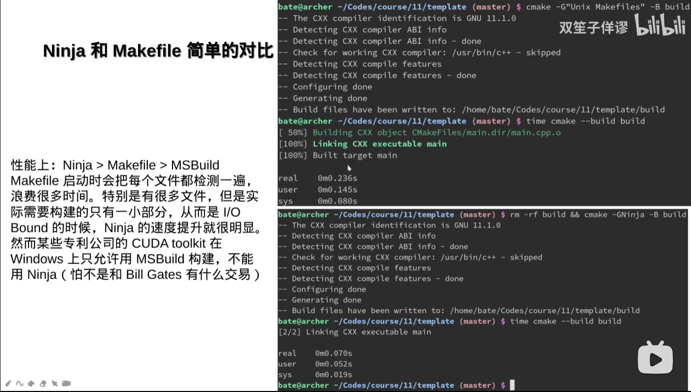

##### 对并行编译的补充

`cmake --build -j8` 在 Linux 下等效于 `make -j8`, 但在 Windows 上搭配 msbuild generator（例如VS2022）时并没有相同的加速效果， 相关解释：

###### **MSBuild**

- **项目级并行**：
  - `cmake --build` 的 `-j <[jobs]>` 映射到了 msbuild 的 `-maxcpucount`(`-m`) 参数。
  - 使用 `/m` 参数，可以在多个项目（Project）之间实现并行构建。
  - 适用于解决方案（Solution）包含多个相互独立或无直接依赖关系的项目。
- **Target 级并行**：
  - 默认情况下，MSBuild 不会在同一项目的 Targets 间进行并行构建，因为 Targets 通常存在依赖关系。
  - 通过设置 `BuildInParallel` 属性，可以在特定情况下实现 Targets 的并行执行。
- **文件级并行**：
  - 对于同一 Target 内的任务（如编译多个源文件），需要设置环境变量 `UseMultiToolTask=true`，才能启用多线程编译。

###### **Make**

- 对于Make来说，并没有明确的“Project”概念，Makefile本身就是对项目的顶层定义。

- **Target 级并行**：

  - 使用 `-j` 选项（如 `make -j4`），Make 可以在可能的情况下并行执行多个 Targets。
  - 依赖于正确的依赖关系定义，确保没有依赖关系的 Targets 可以同时构建。

- **文件级并行**：

  - 如果编译规则定义得当，Make 可以在同一 Target 内并行编译多个源文件（如 `.c` 文件生成 `.o` 文件）。

  

## 一、添加源文件

一个.cpp源文件用于测试

``` cpp
// main.cpp
#include <cstdio>
int main(){
    printf("hello,world!\n");
}
```

CMake中添加一个可执行文件作为构建目标

``` cmake
# CMakeLists.txt
add_executable(main main.cpp)
```

另一种方式：先创建目标，稍后再添加源文件

``` cmake
# CMakeLists.txt
add_executable(main)
target_sources(main PUBLIC main.cpp)
```

多个源文件：逐个添加即可

``` cmake
# CMakeLists.txt
add_executable(main)
target_sources(main PUBLIC main.cpp other.cpp)
```

使用变量来存储

```cmake
add_executable(main)
set(sources main.cpp other.cpp) # 创建一个变量sources
target_sources(main PUBLIC ${sources}) # 访问变量使用${变量名}语法
```

使用GLOB自动查找当前目录下指定扩展名的文件，实现批量添加源文件

```cmake
add_executable(main)
file(GLOB sources *.h *.cpp)
target_sources(main PUBLIC ${sources})
```

启动CONFIGURE_DEPENDS选项，当添加新文件时，自动更新变量

``` cmake
add_executable(main)
file(GLOB sources CONFIGURE_DEPENDS *.h *.cpp)
target_sources(main PUBLIC ${sources})
```

如果源码放在子文件夹中：

不必将路径名和文件名全部写出，使用aux_source_directory，自动搜索需要的文件后缀名

```cmake
add_executable(main)
aux_source_directory(. sources) # 搜索当前文件夹
aux_source_directory(mylib sources) # 搜索mylib文件夹
target_sources(main PUBLIC ${sources})
```

同样的，使用GLOB_RECURSE，可以递归的查找指定后缀的文件。需要注意的是，build文件夹中的一些临时文件也会被加进来，因此需要将源码放在src目录下。

```cmake
add_executable(main)
file(GLOB_RECURSE sources CONFIGURE_DEPENDS src/*.h src/*.cpp)
target_sources(main PUBLIC ${sources})
```

## 二、项目配置变量

#### cmake_minimum_required指定最低所需的CMake版本

```cmake
cmake_minimum_required(VERSION 3.15)
```

- 可以通过在命令行中运行cmake --version查看当前版本

- 也可以通过 CMAKE_VERSION 这个变量来获得当前 CMake 版本号

假如你写的 CMakeLists.txt 包含了 3.15 版本才有的特性，如果用户在老版本上使用，就会出现各种奇怪的错误。

因此最好在第一行加个 cmake_minimum_required(VERSION 3.15)表示本 CMakeLists.txt 至少需要 CMake 版本 3.15 以上才能运行。如果用户的 CMake 版本小于 3.15，会出现“CMake 版本不足”的提示

###### 注意：cmake_mimimum_required不仅是“最小所需版本”

虽然名字叫 minimum_required，实际上不光是 >= 3.15 就不出错这么简单。根据你指定的不同的版本号，还会决定接下来一系列 CMake 指令的行为。

此外，你还可以通过 3.15...3.20 来表示最高版本不超过 3.20。这会对 cmake_policy 有所影响，稍后再提。

```cmake
cmake_minimum_required(VERSION 3.15...3.20)
```

#### CMAKE_BUILD_TYPE 构建的类型，调试模式还是发布模式

- CMAKE_BUILD_TYPE是CMake中一个特殊变量，用于控制构建类型，它的值可以是：
- Debug调试模式，完全不优化，生成调试信息，方便调试程序
- Release发布模式，优化成都最高，性能最佳，但是编译会比Debug慢
- MinSizeRel最小体积发布，生成的文件比Release更小，不完全优化，减少二进制体积
- RelWithDebInfo带调试信息发布，生成的文件比Release更大，因为带有调试的符号信息
- 默认情况下 CMAKE_BUILD_TYPR 为空字符串，这是相当于Debug。

各种构建模式在编译器选项上的区别

``` shell
Debug: '-O0 -g'
Release: '-O3 -DNDEBUG'
MinSizeRel: '-Os -DNDEBUG'
RelWithDebInfo: '-O2 -g -DNDEBUG'
```

- 在Release模式下，追求程序的最佳性能表现，在此情况下，编译器会对程序做最大的代码优化以达到最快的运行速度。另一方面，由于代码优化后与源代码不一致，此模式下一般会丢失大量调试信息。
- 此外，注意定义了NDEBUG宏会使`assert`被去除掉。`assert` 是 C 语言和 C++ 中的一个宏，定义在 `<cassert>` 或 `<assert.h>` 头文件中，通常用于在调试阶段检查表达式是否为真。它的工作原理是在运行时检查条件是否成立，如果条件为假，则程序会终止并打印错误信息

小技巧：CMAKE_BUILD_TYPE默认使debug模式，在文件开头添加下面的内容，使默认为release

```cmake
if (NOT CMAKE_BUILD_TYPE)
	set(CMAKE_BUILD_TYPE Release)
endif()
```

#### project：初始化项目信息，并把当前CMakeLists.txt所在的位置作为根目录

```cmake
cmake_minimum_required(VERSION 3.15)
project(hellocmake)

message("PROJECT_NAME: ${PROJECT_NAME}")
message("PROJECT_SOURCE_DIR: ${PROJECT_SOURCE_DIR}")
message("PROJECT_BINARY_DIR: ${PROJECT_BINARY_DIR}")
message("CMAKE_CURRENT_SOURCE_DIR: ${CMAKE_CURRENT_SOURCE_DIR}")
message("CMAKE_CURRENT_BINARY_DIR: ${CMAKE_CURRENT_BINARY_DIR}")
add_executable(main main.cpp)

add_subdirectory(mylib)
```

还有一些关于projrct的预定义变量可以使用

**PROJECT_IS_TOP_LEVEL**：BOOL类型，表示当前项目是否是最顶层的根项目

**PROJECT_NAME**：当前项目名

**CMAKE_PROJECT_NAME**：根项目的项目名

**PROJECT_NAME**：当前项目的名称。

**PROJECT_SOURCE_DIR**：项目源代码的根目录路径。

**PROJECT_BINARY_DIR**：项目构建文件的输出目录路径。

**CMAKE_SOURCE_DIR**：表示整个项目的根源代码目录，始终指向最上层CMakeLists.txt文件所在的目录。

**CMAKE_CURRENT_SOURCE_DIR**：当前CMakeLists.txt文件所在的源目录。

**CMAKE_CURRENT_BINARY_DIR**：当前CMakeLists.txt文件对应的构建目录。

- PROJECT_SOURCE_DIR 表示最近一次设置 project 的 CMakeLists.txt 所在的源码目录。
- CMAKE_CURRENT_SOURCE_DIR 表示当前处理的CMakeLists.txt文件所在的源目录。
- CMAKE_SOURCE_DIR 表示最为外层 CMakeLists.txt 的源码根目录。
- 利用 PROJECT_SOURCE_DIR 可以实现从子模块里直接获得项目最外层目录的路径。
- 不建议用 CMAKE_SOURCE_DIR，那样会让你的项目无法被人作为子模块使用。

##### 子模块里也可以使用project命令，将当前目录作为一个独立的子项目

这样一来 PROJECT_SOURCE_DIR 就会是子模块的源码目录而不是外层了。

这时候 CMake 会认为这个子模块是个独立的项目，会额外做一些初始化。

他的构建目录 PROJECT_BINARY_DIR 也会变成 build/<源码相对路径>。

这样在 MSVC 上也会看见 build/mylib/mylib.vcxproj 的生成。

##### project的初始化：LANGUAGES字段

•project(项目名 LANGUAGES 使用的语言列表...) 指定了该项目使用了哪些编程语言。

目前支持的语言包括：

```shell
C：C语言
CXX：C++语言
ASM：汇编语言
Fortran：老年人的编程语言
CUDA：英伟达的 CUDA（3.8 版本新增）
OBJC：苹果的 Objective-C（3.16 版本新增）
OBJCXX：苹果的 Objective-C++（3.16 版本新增）
ISPC：一种因特尔的自动 SIMD 编程语言（3.18 版本新增）
```

如果不指定 LANGUAGES，默认为 C 和 CXX。

- 也可以线设置LANGUAGES NONE，之后再调用enable_languages(CXX)来启用
- 这样可以把enable_languages放到if语句中，达到只有某些选项开启才启用某语言的功能

##### project的初始化：VERSION字段

project(项目名 VERSION x.y.z) 可以把当前项目的版本号设定为 x.y.z。之后可以通过 PROJECT_VERSION 来获取当前项目的版本号。

PROJECT_VERSION_MAJOR 获取 x（主版本号）。

PROJECT_VERSION_MINOR 获取 y（次版本号）。

PROJECT_VERSION_PATCH 获取 z（补丁版本号）。

```cmake
cmake_minimum_required(VERSION 3.15...3.20)
project(hellocmake LANGUAGES CXX)

message("CMAKE_VERSION: ${CMAKE_VERSION}")
message("PROJECT_VERSION: ${PROJECT_VERSION}")
message("PROJECT_VERSION_MAJOR: ${PROJECT_VERSION_MAJOR}")
message("PROJECT_VERSION_MINOR: ${PROJECT_VERSION_MINOR}")
message("PROJECT_VERSION_PATCH: ${PROJECT_VERSION_PATCH}")
add_executable(main main.cpp)
```

##### 项目名的一大作用：设置<项目名>_SOURCE_DIR等变量

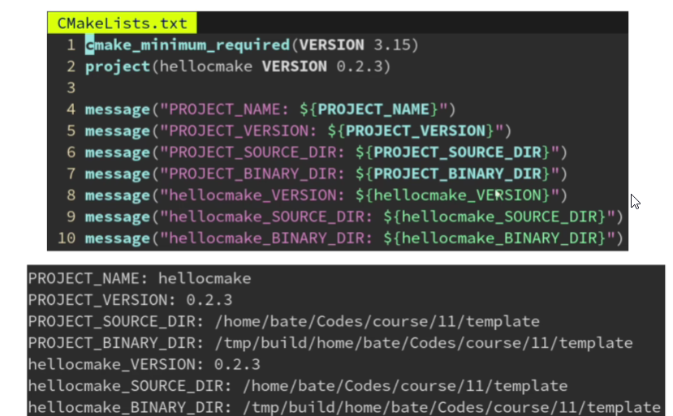

###### 小技巧：CMake的`${} `表达式可以嵌套

```cmake
message("hellocmake_VERSION: ${${PROJECT_NAME}_VERSION}")
```

因为`${PROJECT_NAME}`求值结果使hellocmake，所以`${${PROJECT_NAME}_VERSION}`相当于`${hellocmake_VERSION}`

#### 设置 c++标准：CMAKE_CXX_STANDARD

```cmake
cmake_minimum_required(VERSION 3.15)

set(CMAKE_CXX_STANDARD 17)
set(CMAKE_CXX_STANDARD_REQUIRED ON)
set(CMAKE_CXX_EXTENSIONS ON)

project(hellocmake LANGUAGES CXX)
```

#### CMAKE_CXX_STANDARD

是一个整数，表示要用的 C++ 标准。比如需要 C++17 那就设为 17，需要 C++23 就设为 23。

#### CMAKE_CXX_STANDARD_REQUIRED

是 BOOL 类型，可以为 ON 或 OFF，默认 OFF。他表示是否一定要支持你指定的 C++ 标准：如果为 OFF 则 CMake 检测到编译器不支持 C++17 时不报错，而是默默调低到 C++14 给你用；为 ON 则发现不支持报错，更安全。

#### CMAKE_CXX_EXTENSIONS 

也是 BOOL 类型，默认为 ON。设为 ON 表示启用 GCC 特有的一些扩展功能；OFF 则关闭 GCC 的扩展功能，只使用标准的 C++。

- 要兼容其他编译器（如 MSVC）的项目，都会设为 OFF 防止不小心用了 GCC 才有的特性。

此外，最好是在 project 指令前设置 CMAKE_CXX_STANDARD 这一系列变量，这样 CMake 可以在 project 函数里对编译器进行一些检测，看看他能不能支持 C++17 的特性

###### 常见误区：手动添加 -std=c++17

- 请勿直接修改 CMAKE_CXX_FLAGS 来添加 -std=c++17（你在百度 CSDN 学到的用法）。

- 使用 CMake 帮你封装好的 CMAKE_CXX_STANDARD（从业人员告诉你的正确用法）。

为什么百度不对：你 GCC 用户手动指定了 -std=c++17，让 MSVC 的用户怎么办？

此外 CMake 已经自动根据 CMAKE_CXX_STANDARD 的默认值 11 添加 -std=c++11 选项了，你再添加个 -std=c++17 选项不就冲突了吗？所以请用 CMAKE_CXX_STANDARD

#### 其他的一些变量：

- CMAKE_BUILD_TOOL: 执行构建过程的工具。该变量设置为CMake构建时输出所需的程序。对于VS 6， CMAKE_BUILD_TOOL设置为msdev， 对于Unix，它被设置为make 或 gmake。 对于 VS 7， 它被设置为devenv. 对于Nmake构建文件，它的值为nmake。
- CMAKE_DL_LIBS: 包含dlopen和dlclose的库的名称。
- CMAKE_COMMAND: 指向cmake可执行程序的全路径。
- CMAKE_CTEST_COMMAND: 指向ctest可执行程序的全路径。
- CMAKE_EDIT_COMMAND: cmake-gui或ccmake的全路径。
- CMAKE_EXECUTABLE_SUFFIX: 该平台上可执行程序的后缀。
- CMAKE_SIZEOF_VOID_P: void指针的大小。
- CMAKE_SKIP_RPATH: 如果为真，将不添加运行时路径信息。默认情况下是如果平台支持运行时信息，将会添加运行时信息到可执行程序当中。这样从构建树中运行程序将很容易。为了在安装过程中忽略掉RPATH，使用CMAKE_SKIP_INSTALL_RPATH。
- CMAKE_GENERATOR: 构建工程的产生器。它将产生构建文件 (e.g. "Unix Makefiles", "Visual Studio 2019", etc.)

#### 一个标准的CMakeLists.txt模板

```cmake
# 指定CMake的最低版本要求为3.15
cmake_minimum_required(VERSION 3.15)

# 设置C++标准为C++17，并强制使用该标准
set(CMAKE_CXX_STANDARD 17)
set(CMAKE_CXX_STANDARD_REQUIRED ON)

# 定义项目名称为 ming，并指定支持的语言为C、C++和CUDA
project(ming LANGUAGES C CXX CUDA)

# 检查编译目录是否与源代码目录相同，若相同则发出警告
if (PROJECT_BINARY_DIR STREQUAL PROJECT_SOURCE_DIR)
    message(WARNING "The binary directory of CMake cannot be the same as source directory!")
endif()

# 如果未指定构建类型，默认设置为Release
if (NOT CMAKE_BUILD_TYPE)
    set(CMAKE_BUILD_TYPE Release)
endif()

# 如果是Windows系统，添加一些编译选项定义
if (WIN32)
    # -DNOMINMAX：避免Windows头文件定义min和max宏
    # -D_USE_MATH_DEFINES：启用数学常量（如M_PI）在Windows环境中
    add_definitions(-DNOMINMAX -D_USE_MATH_DEFINES)
endif()

# 如果不是使用Microsoft编译器（MSVC），则寻找CMake缓存编译器（ccache）
if (NOT MSVC)
    # 查找系统中的ccache程序
    find_program(CCACHE_PROGRAM ccache)
    
    # 如果找到ccache，启用ccache来加速编译和链接
    if (CCACHE_PROGRAM)
        # 打印找到的ccache路径
        message(STATUS "Found CCache: ${CCACHE_PROGRAM}")
        # 设置全局属性，使CMake在编译时使用ccache
        set_property(GLOBAL PROPERTY RULE_LAUNCH_COMPILE ${CCACHE_PROGRAM})
        # 设置全局属性，使CMake在链接时使用ccache
        set_property(GLOBAL PROPERTY RULE_LAUNCH_LINK ${CCACHE_PROGRAM})
    endif()
endif()

```


## 三、链接库文件

####  应用场景：

main.cpp调用mylib.cpp里的say_hello函数

```c++
// mylib.cpp
#include "mylib.h"
#include <cstdio>

void say_hello(){
    printf("hello, mylib!")
}
```

```cpp
// main.cpp
#include "mylib.h"

int main(){
    say_hello();
}
```

```cmake
add_executable(main main.cpp mylib.cpp)
```

#### 引用改进：

关于动静态库的内容这里不做介绍

##### mylib作为一个静态库	STATIC

```cmake
add_library(mylib STATIC mylib.cpp)	# 生成静态库
add_executable(main main.cpp)	# 生成可执行文件
target_link_libraries(main PUBLIC mylib)	# 为main链接静态库
```

##### mylib作为一个动态库	SHARED

```cmake
add_library(mylib SHARED mylib.cpp)	# 生成动态库
add_executable(main main.cpp)	# 生成可执行文件
target_link_libraries(main PUBLIC mylib)	# 为main链接动态库
```

##### mylib作为一个对象库	 OBJECT

```cmake
add_library(mylib OBJECT mylib.cpp)	# 生成对象库
add_executable(main main.cpp)	# 生成可执行文件
target_link_libraries(main PUBLIC mylib)	# 为main链接对象库
```

对象库类似于静态库，但不生成 .a 文件，只由 CMake 记住该库生成了哪些对象文件

对象库是 CMake 自创的，绕开了编译器和操作系统的各种繁琐规则，保证了跨平台统一性。

推荐全部用对象库(OBJECT)替代静态库(STATIC)避免跨平台的麻烦。

对象库仅仅作为组织代码的方式，而实际生成的可执行文件只有一个，减轻了部署的困难

#### 其他补充：

##### 静态库的麻烦：

GCC编译器自作聪明，会自动提出没有引用符号的那些对象

```c++
//mylib.cpp
#include <cstido>

static int unused = printf("mylib initialized\n");	//c++静态初始化语法，正常会在main之前运行
```

```c++
//main.cpp

int main(){
    printf("main function\n");
}
```

```cmake
# CMakeLists.txt
add_executable(mylib STATIC mylib.cpp)
add_executable(main main.cpp)
```

运行结果：

```shell
# 预期结果：
mylib initialized
main function
# 实际结果：
main function
```

编译时gcc发现没有人引用这个mylib.cpp编译出的mylib.o文件，就会将这个.o文件删掉。

对象库可以绕开编译器的不统一：保证不会自动剔除没引用到的对象文件

```c++
//mylib.cpp
#include <cstido>

static int unused = printf("mylib initialized\n");	//c++静态初始化语法，正常会在main之前运行
```

```c++
//main.cpp

int main(){
    printf("main function\n");
}
```

```cmake
# CMakeLists.txt
add_executable(mylib STATIC mylib.cpp)
add_executable(main main.cpp)
```

运行结果：

```shell
# 预期结果：
mylib initialized
main function
# 实际结果：
mylib initialized
main function
```

当然，动态库也能避免剔除没引用的对象文件，但会引入运行时链接的麻烦，特别是在windows平台。

##### add_library参数

当add_library无参数时，会根据 BUILD_SHARED_LIBS 这个变量的值决定是动态库还是静态库。

ON 则相当于 SHARED，OFF 则相当于 STATIC。

如果未指定 BUILD_SHARED_LIBS 变量，则默认为 STATIC。

因此，如果发现一个项目里的 add_library 都是无参数的，意味着你可以用：cmake -B build -DBUILD_SHARED_LIBS:BOOL=ON来让他全部生成为动态库。稍后会详解命令行传递变量的规则。

###### 小技巧

要让 BUILD_SHARED_LIBS 默认为 ON，可以用这个方法：

```cmake
if (NOT DEFINED BUILD_SHARED_LIBS)
	set(BUILD_SHARED_LIBRED_LIBS ON)
endif()
```

如果该变量没有定义，则设为 ON，否则保持用户指定的值不变。

这样当用户没有指定 BUILD_SHARED_LIBS 这个变量时，会默认变成 ON。也就是说除非用户指定了 -DBUILD_SHARED_LIBS:BOOL=OFF 才会生成静态库，否则默认是生成动态库。

##### 常见坑点：动态库无法链接静态库

```cmake
add_library(otherlib STATIC otherlib.cpp)
add_library(mylib SHARED mylib.cpp)
target_link_libraries(mylib PUBLIC otherlib)
add_executable(main main.cpp)
target_link_libraries(main PUBLIC mylib)
```

因为静态库认为应该链接到一个可执行文件，现在链接到一个动态库中。

但是动态库在内存中的位置是会变化的，静态库静态库中可能包含非位置无关代码，编译器就会报错，

- 动态库在程序运行时可以被加载到内存的不同地址，而不是在编译时就固定到某个地址。

**位置无关代码 PIC**

为了使动态库能够在任意内存地址加载，编译时生成的位置无关代码（PIC）允许程序在运行时根据加载位置进行必要的地址重定位。这确保了无论动态库被加载到哪个地址，程序都能正确访问库中的函数和变量。

- **实现方式**：编译器生成的代码中，所有的绝对地址都被替换为相对地址，函数调用和全局变量访问通常通过间接寻址来实现。

解决：让静态库编译时也生成位置无关的代码(PIC)，这样才能装在动态库里。

```cmake
set(CMAKE_POSITION_INDEPENEDENT_CODE ON)
add_library(otherlib STATIC otherlib.cpp)
add_library(mylib SHARED mylib.cpp)
target_link_libraries(mylib PUBLIC otherlib)
add_executable(main main.cpp)
target_link_libraries(main PUBLIC mylib)
```

将CMAKE_POSITION_INDEPENEDENT_CODE属性设置为ON，会强制所有代码都生成位置无关的代码PIC。

也可以只针对一个库：

```cmake
add_library(otherlib STATIC otherlib.cpp)
set_property(TARGET otherlib CMAKE_POSITION_INDEPENEDENT_CODE ON)
add_library(mylib SHARED mylib.cpp)
target_link_libraries(mylib PUBLIC otherlib)
add_executable(main main.cpp)
target_link_libraries(main PUBLIC mylib)
```

这里就只针对otherlib设置启动PIC

## 四、对象的属性

 刚才提到的CMAKE_POSITION_INDEPENEDENT_CODE就是一个otherlib对象的一个属性

#### 常见属性

##### 使用set_property设置

```cmake
add_executable(main main.cpp)

set_property(TARGET main PROPERTY CXX_STANDARD 17)           # 采用 C++17 标准进行编译（默认 11）
set_property(TARGET main PROPERTY CXX_STANDARD_REQUIRED ON)  # 如果编译器不支持 C++17，则直接报错（默认 OFF）
set_property(TARGET main PROPERTY WIN32_EXECUTABLE ON)       # 在 Windows 系统中，运行时不启动控制台窗口，只有 GUI 界面（默认 OFF）
set_property(TARGET main PROPERTY LINK_WHAT_YOU_USE ON)      # 告诉编译器不要自动剔除没有引用符号的链接库（默认 OFF会剔除）
set_property(TARGET main PROPERTY LIBRARY_OUTPUT_DIRECTORY ${CMAKE_SOURCE_DIR}/lib)   # 设置动态链接库的输出路径（默认 ${CMAKE_BINARY_DIR}）
set_property(TARGET main PROPERTY ARCHIVE_OUTPUT_DIRECTORY ${CMAKE_SOURCE_DIR}/lib)   # 设置静态链接库的输出路径（默认 ${CMAKE_BINARY_DIR}）
set_property(TARGET main PROPERTY RUNTIME_OUTPUT_DIRECTORY ${CMAKE_SOURCE_DIR}/bin)   # 设置可执行文件的输出路径（默认 ${CMAKE_BINARY_DIR}）
```

##### 另一种方式：set_target_properties批量设置多个属性

```cmake
add_executable(main main.cpp)

set_target_properties(main PROPERTIES
    CXX_STANDARD 17           # 采用 C++17 标准进行编译（默认 11）
    CXX_STANDARD_REQUIRED ON  # 如果编译器不支持 C++17，则直接报错（默认 OFF）
    WIN32_EXECUTABLE ON       # 在 Windows 系统中，运行时不启动控制台窗口，只有 GUI 界面（默认 OFF）
    LINK_WHAT_YOU_USE ON      # 告诉编译器不要自动剔除没有引用符号的链接库（默认 OFF）
    LIBRARY_OUTPUT_DIRECTORY ${CMAKE_SOURCE_DIR}/lib   # 设置动态链接库的输出路径（默认 ${CMAKE_BINARY_DIR}）
    ARCHIVE_OUTPUT_DIRECTORY ${CMAKE_SOURCE_DIR}/lib   # 设置静态链接库的输出路径（默认 ${CMAKE_BINARY_DIR}）
    RUNTIME_OUTPUT_DIRECTORY ${CMAKE_SOURCE_DIR}/bin   # 设置可执行文件的输出路径（默认 ${CMAKE_BINARY_DIR}）
    )
```

##### 另一种方式：通过全局变量，设置之后的所有对象

相当于改变了各个属性的默认值，要注意此时 **set(CMAKE_XXX) **必须在add_executable之前才有效

```cmake
set(CMAKE_CXX_STANDARD 17)           # 采用 C++17 标准进行编译（默认 11）
set(CMAKE_CXX_STANDARD_REQUIRED ON)  # 如果编译器不支持 C++17，则直接报错（默认 OFF）
set(CMAKE_WIN32_EXECUTABLE ON)       # 在 Windows 系统中，运行时不启动控制台窗口，只有 GUI 界面（默认 OFF）
set(CMAKE_LINK_WHAT_YOU_USE ON)      # 告诉编译器不要自动剔除没有引用符号的链接库（默认 OFF）
set(CMAKE_LIBRARY_OUTPUT_DIRECTORY ${CMAKE_SOURCE_DIR}/lib)   # 设置动态链接库的输出路径（默认 ${CMAKE_BINARY_DIR}）
set(CMAKE_ARCHIVE_OUTPUT_DIRECTORY ${CMAKE_SOURCE_DIR}/lib)   # 设置静态链接库的输出路径（默认 ${CMAKE_BINARY_DIR}）
set(CMAKE_RUNTIME_OUTPUT_DIRECTORY ${CMAKE_SOURCE_DIR}/bin)   # 设置可执行文件的输出路径（默认 ${CMAKE_BINARY_DIR}）

add_executable(main main.cpp)

```

#### 常见问题

```cmake
add_executable(main main.cpp)

set_property(TARGET main PROPERTY CXX_STANDARD 17)        # 正确
target_compile_options(main PUBLIC "-std=c++17")          # 错误
set_property(TARGET main PROPERTY CUDA_ARCHITECTURES 75)  # 正确
target_compile_options(main PUBLIC "-arch=sm_75")         # 错误
```

对于 CXX_STANDARD 这种 CMake 本就提供了变量来设置的东西，就不要自己去设置 -std=c++17 选项，会和 CMake 自己设置好的冲突，导致出错。

请始终用 CXX_STANDARD 或是全局变量 CMAKE_CXX_STANDARD 来设置 -std=c++17 这个 flag，CMake 会在配置阶段检测编译器是否支持 C++17。

CUDA 的 -arch=sm_75 也是同理，请使用 CUDA_ARCHITECTURES 属性。

再说了 -std=c++17 只是 GCC 编译器的选项，无法跨平台用于 MSVC 编译器。

#### windows动态链接

如果要使用动态链接，需要在代码中进行一些定义

```cpp
// mylib.h
#pragma once

#ifdef _MSC_VER
__declspec(dllimport)
#endif
void say_hello();

```

```cpp
#include <cstdio>

#ifdef _MSC_VER
__declspec(dllexport)
#endif
void say_hello() {
    printf("Hello, world!\n");
}
```

同时，还会有经典错误：

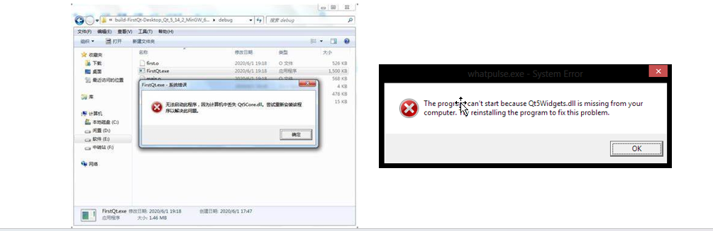

这是因为你的 dll 和 exe 不在同一目录。Windows 比较蠢，他只会找当前 exe 所在目录，然后查找 PATH，找不到就报错。而你的 dll 在其他目录，因此 Windows 会找不到 dll。

- 解决1：把 dll 所在位置加到你的 PATH 环境变量里去，一劳永逸。
- 解决2：把这个 dll，以及这个 dll 所依赖的其他 dll，全部拷贝到和 exe 文件同一目录下。

**实现解决1：xx_OUTPUT_DIRECTORY系列属性**

CMake中设置xx_OUTPUT_DIRECTORY系列属性，让我们的dll文件输出到PROJECT_BINARY_DIR（可执行程序所在的目录）

```cmake
add_library(mylib SHARED mylib.cpp mylib.h)
set_property(TARGET mylib PROPERTY RUNTIME_OUTPUT_DIRECTORY ${PROJECT_BINARY_DIR})
set_property(TARGET mylib PROPERTY ARCHIVE_OUTPUT_DIRECTORY ${PROJECT_BINARY_DIR})
set_property(TARGET mylib PROPERTY LIBRARY_OUTPUT_DIRECTORY ${PROJECT_BINARY_DIR})
set_property(TARGET mylib PROPERTY RUNTIME_OUTPUT_DIRECTORY_DEBUG ${PROJECT_BINARY_DIR})
set_property(TARGET mylib PROPERTY ARCHIVE_OUTPUT_DIRECTORY_DEBUG ${PROJECT_BINARY_DIR})
set_property(TARGET mylib PROPERTY LIBRARY_OUTPUT_DIRECTORY_DEBUG ${PROJECT_BINARY_DIR})
set_property(TARGET mylib PROPERTY RUNTIME_OUTPUT_DIRECTORY_RELEASE ${PROJECT_BINARY_DIR})
set_property(TARGET mylib PROPERTY ARCHIVE_OUTPUT_DIRECTORY_RELEASE ${PROJECT_BINARY_DIR})
set_property(TARGET mylib PROPERTY LIBRARY_OUTPUT_DIRECTORY_RELEASE ${PROJECT_BINARY_DIR})
```

为了满足Windows，这样的操作非常繁琐。为什么说Linux系统YYDS？

- Linux 系统支持 RPATH，CMake 会让生成出来可执行文件的 RPATH 字段指向他链接了的 .so 文件所在目录，运行时会优先从 RPATH 里找链接库，所以即使不在同目录也能找到。
- 需要手动修改或查看一个 ELF 文件的 RPATH，可以用 chrpath 或 patchelf 命令

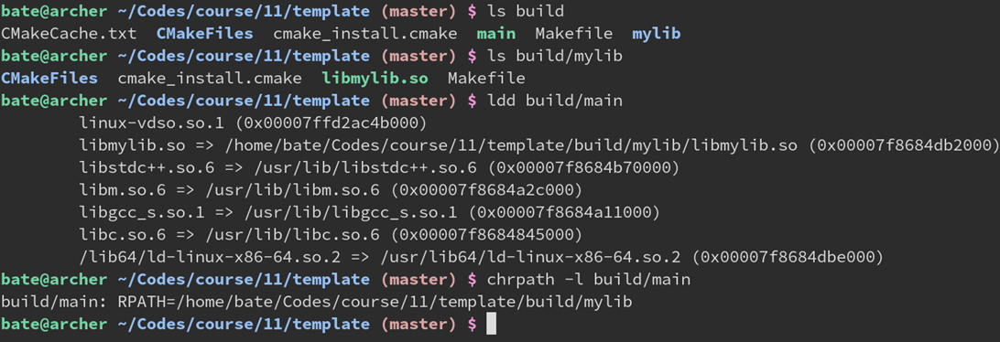

#### 作用域

属性通常可以在目标级别（`TARGET`）设置，也可以在全局级别（`GLOBAL`）设置。目标级别的属性只影响特定的目标，而全局级别的属性影响整个项目。

## 五、链接第三方库

###### 案例：需要使用tbb库

```cmake
# CMakeLists.txt
add_executable(main main.cpp)
target_link_libraries(main PUBLIC tbb)
```

```cpp
// main.cpp
#include <tbb/parallel_for.h>
int main() {
    tbb::parallel_for(0, 4, [&] (int i) {
        printf("hello, %d!\n", i);
    });
}
```

###### 直接链接的缺点

如果这样直接指定 tbb，CMake 会让链接器在系统的库目录里查找 tbb，他会找到 /usr/lib/libtbb.so 这个系统自带的，但这对于没有一个**固定库安装位置**的 Windows 系统并不适用。

此外，他还要求 tbb 的头文件就在 /usr/include 这个系统默认的头文件目录，这样才能 #include <tbb/parallel_for.h> 不出错，如果 tbb 的头文件在其他地方就需要再加一个 **target_include_directories** 设置额外的头文件查找目录。

###### 硬核解决：直接写出全部路径

```cmake
# CMakeLists.txt
add_executable(main main.cpp)
target_link_libraries(main PUBLIC C:/Users/archibate/installed/tbb/tbb.dll)
```

这样也可以让没有默认系统路径的 Windows 找到安装在奇怪位置的 tbb……不过这样根本不跨平台，你这样改了别人如果装在不同地方就出错了。

顺便一提，CMake 的路径分割符始终是 /。即使在 Windows 上，也要把所有的 \ 改成 /，这是出于跨平台的考虑。请放心，CMake 会自动在调用 MSVC 的时候转换成 \，你可以放心的用 ${x}/bin 来实现和 Python 的 os.path.join(x, ‘bin’) 一样的效果。

**高情商：Windows是最适合练习C语言转义符使用水平的平台。**

### find_package：更通用的做法

使用CMake的find_package命令

```cmake
add_executable(main main.cpp)

find_package(TBB REQUIRED)	# 查找库
target_link_libraries(main PUBLIC TBB::tbb)	# 链接
```

find_package(TBB REQUIRED)会查找/usr/lib/cmake/TBB/TBBConfig.cmake(由TBB安装)这个配置文件，并根据里面的配置信息创建TBB::tbb这个伪对象（它实际指向真正的tbb库文件路径/usr/lib/libtbb.so），之后通过target_link_libraries链接TBB::tbb就可以正常工作了

#### CONFIG参数选项

find_package(TBB CONFIG REQUIRED) 

添加了一个 **CONFIG** 选项。这样他会优先查找 TBBConfig.cmake（系统自带的）而不是 FindTBB.cmake（项目作者常把他塞在 cmake/ 目录里并添加到 CMAKE_MODULE_PATH）。这样能保证寻找包的这个 .cmake 脚本是和系统自带的 tbb 版本是适配的，而不是项目作者当年下载的那个版本的 .cmake 脚本

- 没有 CONFIG 选项：先找 FindTBB.cmake，再找 TBBConfig.cmake，找不到则报错

- 有 CONFIG 选项：只会找 TBBConfig.cmake，找不到则报错

此外，一些老年项目（例如 OpenVDB）只提供 Find 而没有 Config 文件，这时候就必须用 find_package(OpenVDB REQUIRED) 而不能带 CONFIG 选项

#### /usr/lib/cmake/TBB/TBBConfig.cmake长啥样？

不论是 TBBConfig.cmake 还是 FindTBB.cmake，这个文件通常由库的作者提供，在 Linux 的包管理器安装 tbb 后也会自动安装这个文件。少部分对 CMake 不友好的第三方库，需要自己写FindXXX.cmake 才能使用。

```cmake
# Create imported target TBB::tbb
add_library(TBB::tbb SHARED IMPORTED)

set_target_properties(TBB::tbb PROPERTIES
  INTERFACE_COMPILE_DEFINITIONS "\$<\$<CONFIG:DEBUG>:TBB_USE_DEBUG>"
  INTERFACE_INCLUDE_DIRECTORIES "${_IMPORT_PREFIX}/include"
)

# Create imported target TBB::tbbmalloc
add_library(TBB::tbbmalloc SHARED IMPORTED)

set_target_properties(TBB::tbbmalloc PROPERTIES
  INTERFACE_COMPILE_DEFINITIONS "\$<\$<CONFIG:DEBUG>:TBB_USE_DEBUG>"
  INTERFACE_INCLUDE_DIRECTORIES "${_IMPORT_PREFIX}/include"
)

# Create imported target TBB::tbbmalloc_proxy
add_library(TBB::tbbmalloc_proxy SHARED IMPORTED)

set_target_properties(TBB::tbbmalloc_proxy PROPERTIES
  INTERFACE_COMPILE_DEFINITIONS "\$<\$<CONFIG:DEBUG>:TBB_USE_DEBUG>"
  INTERFACE_INCLUDE_DIRECTORIES "${_IMPORT_PREFIX}/include"
)
```


#### PUBIC属性

关于TBB::tbb：自带了一些PUBIC属性

TBB::tbb 是一个伪对象(imported)，除了他会指向 /usr/lib/libtbb.so 之外，TBBConfig.cmake 还会给 TBB::tbb 添加一些 PUBLIC 属性，用于让链接他了的对象带上一些 flag 之类。

比如，TBB 安装在 /opt/tbb 目录下，头文件在 /opt/tbb/include 里，那么这时 TBBConfig.cmake 里就会有：

target_include_directories(TBB::tbb PUBLIC /opt/tbb/include)

这样 main 在链接了 TBB::tbb 的时候也会被“传染”上 /opt/tbb/include 这个目录，不用调用者手动添加了。

再比如，TBB::tbb 链接了另一个库 Blosc::blosc，那这个库也会自动链接到 main 上，无需调用者手动添加。

###### PUBLIC属性传播机制的便利

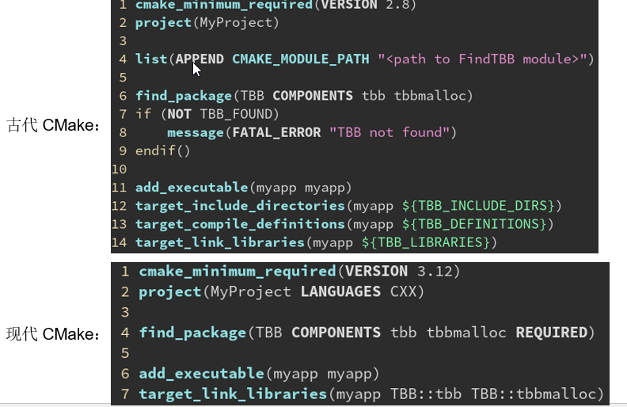

### 常见问题：Qt5查找出错

```cmake
find_package(Qt5 REQUIRED)
target_link_libraries(main PUBLIC Qt5::Widgets Qt5::Gui)
```

报错：

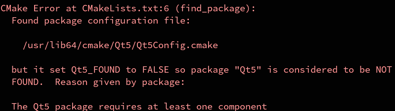

与 TBB 不同，**Qt5 是一个包含多个模块的框架**，如 `Qt5Core`, `Qt5Widgets`, `Qt5Gui` 等。每个模块相当于一个独立的库，CMake 需要知道你具体想使用哪个模块。这就是为什么在使用 `Qt5` 时，必须明确指定要查找的组件。

```cmake
find_package(Qt5 COMPONENTS Core Widgets REQUIRED)  # 查找指定组件
target_link_libraries(main PUBLIC Qt5::Core Qt5::Widgets)  # 链接所需的 Qt5 组件
```

- **TBB** 是单一库，使用 `find_package(TBB REQUIRED)` 即可找到并链接，不需要指定组件。

- **Qt5** 是模块化框架，必须明确指出需要哪些模块，否则 CMake 会提示错误，要求至少指定一个组件。

#### REQUIRED参数

```cmake
add_executable(main main.cpp)

find_package(TBB)
if (TBB_FOUND)
    message(STATUS "TBB found at: ${TBB_DIR}")
    target_link_libraries(main PUBLIC TBB::tbb)
    target_compile_definitions(main PUBLIC WITH_TBB)
else()
    message(WARNING "TBB not found! using serial for")
endif()
```

**不指定** **REQUIRED****，找不到时不报错，只会设置** **TBB_FOUND** **为** **FALSE

这样可以用于添加一些可选的依赖，如果没有也不要紧的那种，这时我们可以抛出一个警告。

找到了会把 TBB_FOUND 设为 TRUE，TBB_DIR 设为 TBBConfig.cmake 所在路径。

找不到会把 TBB_FOUND 设为 FALSE，TBB_DIR 为空。

这里我们在找到 TBB 时定义 WITH_TBB 宏，稍后 .cpp 里就可以根据这个判断。

如果找不到 TBB 可以 fallback 到保守的实现。

```c++
// main.cpp
#include <cstdio>
#ifdef WITH_TBB
#include <tbb/parallel_for.h>
#endif

int main() {
#ifdef WITH_TBB
    tbb::parallel_for(0, 4, [&] (int i) {
#else
    for (int i = 0; i < 4; i++) {
#endif
        printf("hello, %d!\n", i);
#ifdef WITH_TBB
    });
#else
    }
#endif
}
```

**在.cpp 里可以判断WITH_TBB宏，找不到TBB时退化到串行for循环**

也可以使用TARGET判断是否存在**TBB::tbb**这个伪对象，实现同样的效果

```cmake
find_package(TBB)
if (TARGET TBB::tbb)
    message(STATUS "TBB found at: ${TBB_DIR}")
    target_link_libraries(main PUBLIC TBB::tbb)
    target_compile_definitions(main PUBLIC WITH_TBB)
else()
    message(WARNING "TBB not found! using serial for")
endif()
```

## 六、输出与变量

### message指令

#### message("打印的字符串")

在运行cmake --B build时，打印字符串

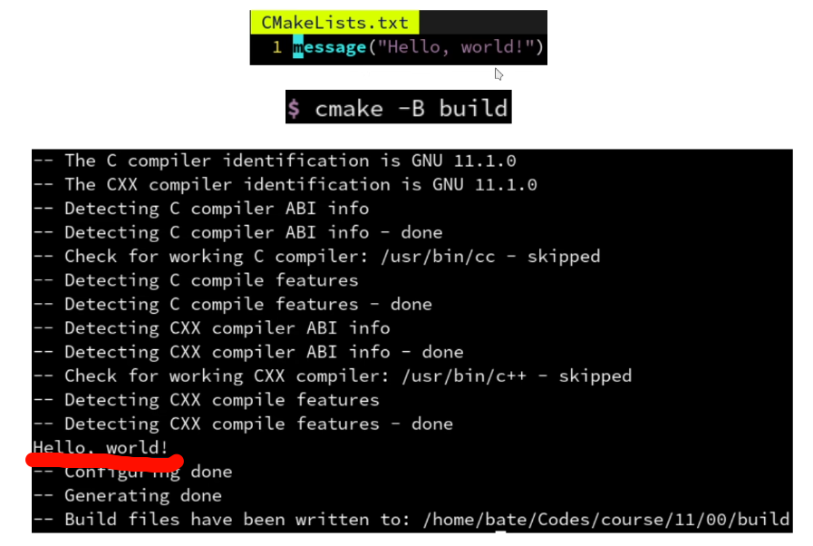

#### message(STATUS "打印的字符串")

表示信息类型是状态信息，有 --前缀

```cmake
message(STATUS "Hello，world!")
```


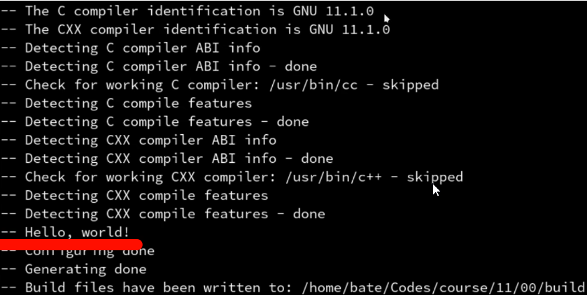

#### message(WARNING "警告信息")

表示警告信息，会以黄色字体显示，并且会出现几个换行

```cmake
message(WARNING "This is a warning sign!")
```

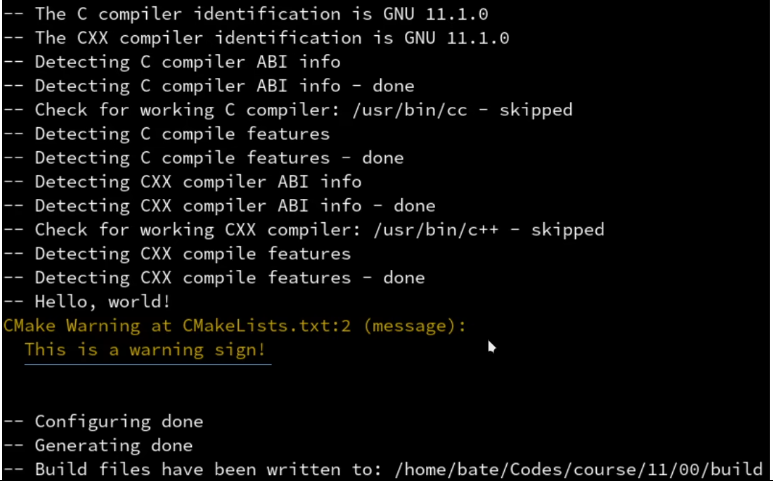

#### message(AUTHOR_WARNING "作者警告信息")

表示仅仅是给项目作者看的警告信息，可以通过-Wno-dev关闭

```cmake
message(WARNING "This warning is for project developers.")
# cmake -B build -Wno-dev
```

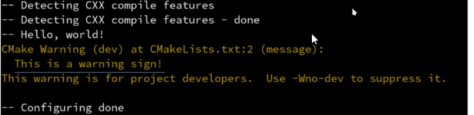

#### message(FATAL_ERROR "错误信息")

表示的是错误信息，会终止CMake的运行

```cmake
message(FATAL_ERROR "This is an error message")
message(STATUS "After error...")# 不执行
```

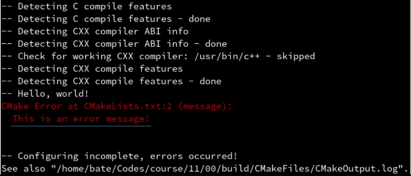

#### message(SEND_ERROR "错误信息")

表示的是错误信息，但之后的语句仍继续执行

```cmake
message(SEND_ERROR "This is an error message")
message(STATUS "After error...")# 继续执行
```

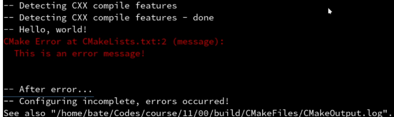

#### message打印变量

```cmake
set(myvar "hello world")
message("myvar is: ${myvar}")
```

```shell
# 输出：
myvar is: hello world
```

- 如果set没有加引号，会编程分号分割列表，即`set(myvar hello world)`等价于`set(myvar "hello;world")`

  输出：```myvar is: hello;world```

- 如果message没加引号，会把列表里的字符串当成它的关键字

结论：除非确实需要列表，建议始终在不确定的地方加上引号

## 七、变量与缓存

重复执行cmake -B build会有什么区别？

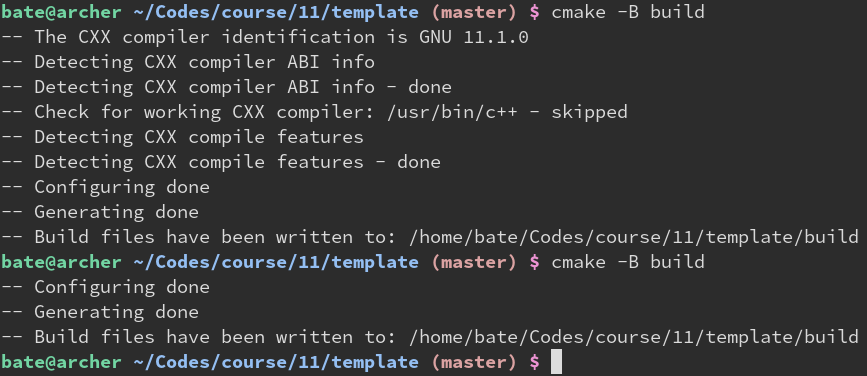

可以看到第二次的输出少了很多，这是因为 CMake 第一遍需要检测编译器和 C++ 特性等，比较耗时。检测完会把结果存储到**缓存**中，这样第二遍运行cmake -B build 时就可以直接用缓存的值，就不需要再检测一遍了。

### 清除缓存

然而有时候外部的情况有所更新，这时候 CMake 里缓存的却是旧的值，会导致一系列问题。

这时我们需要清除缓存，最简单的办法就是删除 build 文件夹，然后重新运行 cmake -B build。缓存是很多 CMake 出错的根源，因此如果出现诡异的错误，可以试试看删 build 全部重新构建。

经典 CMake 笑话：“99%的cmake错误可以用删build解决”“删 build 大法好”

#### build/CMakeCache.txt

清除缓存，只需要删除build/CMakeCache.txt就可以。

删 build 虽然彻底，也会导致编译的中间结果（.o文件）都没了，重新编译要花费很长时间。

如果只想清除缓存，不想从头重新编译，可以只删除 build/CMakeCache.txt 这个文件。

这文件里面装的就是缓存的变量，删了他就可以让 CMake 强制重新检测一遍所有库和编译器。

### 变量缓存

#### find_package缓存机制

变量缓存的意义在于能够把 find_package 找到的库文件位置等信息，储存起来。

这样下次执行 find_package 时，就会利用上次缓存的变量，直接返回。

避免重复执行 cmake -B 时速度变慢的问题

#### 设置缓存变量

语法：set(变量名 "变量值" CACHE 变量类型 "注释")

```cmake
set(myvar "hello" CACHE STRING "this is the docstring.")
message("myvar is: ${myvar}")
```

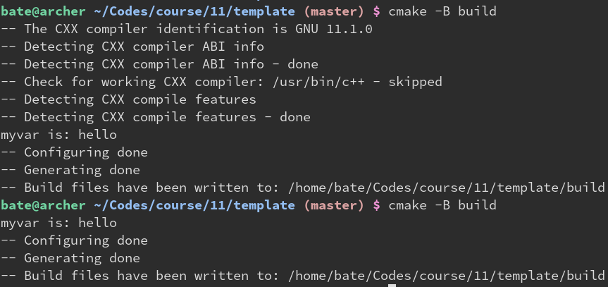

查看CMakeCache.txt文件，能够发现缓存的myvar

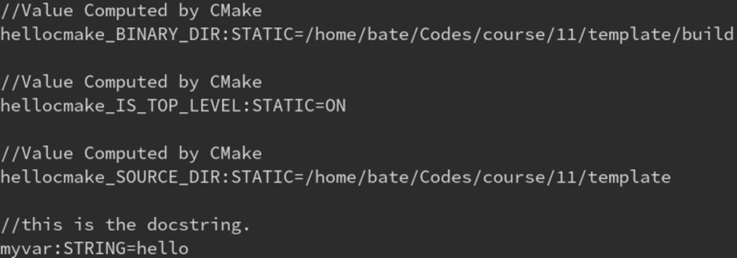

#### 常见问题

修改了CMakeLists.txt里set的值，却没有更新

```cmake
set(myvar "world" CACHE STRING "this is the docstring.")
message("myvar is: ${myvar}")
```

为了更新缓存变量，有的同学偷懒直接修改 CMakeLists.txt 里的值，这是没用的。

因为 set(... CACHE ...) 在缓存变量已经存在时，不会更新缓存的值！

CMakeLists.txt 里 set 的被认为是“默认值”因此不会在第二次 set 的时候更新。

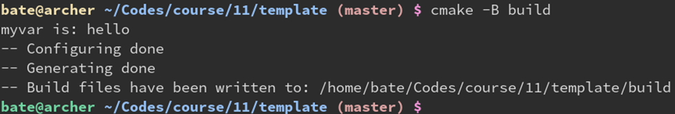

##### 标准解法：通过命令行 -D 参数

```cmake
cmake -B build -Dmyvar=world
```

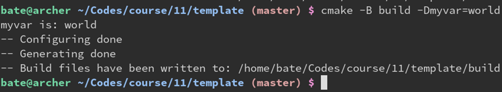

##### 其他解法

通过指定FORCE来强制set更新缓存

```cmake
set(myvar "world" CACHE STRING "this is the docstring." FORCE)
message("myvar is: ${myvar}")
```

set 可以在后面加一个 FORCE 选项，表示不论缓存是否存在，都强制更新缓存。不过这样会导致没办法用 -Dmyvar=othervalue 来更新缓存变量

图形化的缓存编辑器

- 在 Linux 中，可以运行 ccmake -B build 来启动基于终端的可视化缓存编辑菜单。
- 在 Windows 则可以 cmake-gui -B build 来启动图形界面编辑各个缓存选项。
- 当然，直接用编辑器打开 build/CMakeCache.txt 修改后保存也是可以的。
- CMakeCache.txt 用文本存储数据，就是可供用户手动编辑，或是被第三方软件打开并解析的。

### 其他类型的缓存变量

- STRING 字符串，例如 “hello, world”
- FILEPATH 文件路径，例如 “C:/vcpkg/scripts/buildsystems/vcpkg.cmake”
- PATH 目录路径，例如 “C:/Qt/Qt5.14.2/msvc2019_64/lib/cmake/”
- BOOL 布尔值，只有两个取值：ON 或 OFF。

- 注意：TRUE 和 ON 等价，FALSE 和 OFF 等价；YES 和 ON 等价，NO 和 OFF 等价

##### 案例：添加一个BOOL类型的缓存变量，用于控制某些特性

例如添加WITH_TBB变量，用于控制是否启用TBB

```cmake
add_executable(main main.cpp)

set(WITH_TBB ON CACHE BOOL "set to ON to enable TBB, OFF to disable TBB.")
if (WITH_TBB)
    target_compile_definitions(main PUBLIC WITH_TBB)	# 添加预定义选项
    find_package(TBB REQUIRED)
    target_link_libraries(main PUBLIC TBB::tbb)
endif()
```

可以在命令行进行控制

```shell
cmake -B build -DWITH_TBB:BOOL=OFF
```

可以在源码中检查这个变量

```cpp
#include <cstdio>

int main() {
#ifdef WITH_TBB
    printf("TBB enabled!\n");
#endif
    printf("Hello, world!\n");
}
```

#### 指令简写：option

CMake对BOOL类型的缓存的set指令提供了一个简写：option

option(变量名 “描述” 变量值)

等价于：

set(变量名 CACHE BOOL 变量值 “描述”)

```cmake
add_executable(main main.cpp)

option(WITH_TBB "set to ON to enable TBB, OFF to disable TBB." ON)
if (WITH_TBB)
    target_compile_definitions(main PUBLIC WITH_TBB)
    find_package(TBB REQUIRED)
    target_link_libraries(main PUBLIC TBB::tbb)
endif()
```

**同样的，直接在CMakeLists.txt中的option值也不会更新变量**

官方解法：-D参数

-D变量名:BOOL=ON/OFF

```shell
cmake -B build _DWITH_TBB:BOOL=OFF
```

#### 补充：target_compile_definitions

```cmake
target_compile_definitions(main PUBLIC MY_MACRO=233)	#相当于在main中定义了一个MY_MACRO宏，值是233
```

## 八、跨平台与编译器

上面提到了我们可以通过CMake添加一个宏，CMake可以通过一些变量判断不同的平台，结合就可以实现根据平台选择对应的编译器。

#### CMAKE_SYSTEM_NAME判断系统平台

根据不同操作系统，把宏定义成不同的值

```cmake
add_executable(main)
file(GLOB sources CONFIGURE_DEPENDS *.cpp *.h)
target_sources(main PUBLIC ${sources})

if (CMAKE_SYSTEM_NAME MATCHES "Windows")
    target_compile_definitions(main PUBLIC MY_NAME="Bill Gates")
elseif (CMAKE_SYSTEM_NAME MATCHES "Linux")
    target_compile_definitions(main PUBLIC MY_NAME="Linus Torvalds")
elseif (CMAKE_SYSTEM_NAME MATCHES "Darwin")
    target_compile_definitions(main PUBLIC MY_NAME="Steve Jobs")
endif()
```

```cpp
#include <cstdio>

int main() {
#ifdef MY_NAME
    printf("Hello, %s!\n", MY_NAME);
#else
    printf("I don't know your name!\n");
#endif
}
```

#### 简写变量

CMake还提供了一些简写变量：WIN32、APPLE、UNIX、ANDROID、IOS等

- 虽然名字叫 WIN32，实际上对 32 位 Windows 和 64 位 Windows 都适用

- APPLE 对于所有苹果产品（MacOS 或 iOS）都为真

- UNIX 对于所有 Unix 类系统（FreeBSD, Linux, Android, MacOS, iOS）都为真

```cmake
add_executable(main)
file(GLOB sources CONFIGURE_DEPENDS *.cpp *.h)
target_sources(main PUBLIC ${sources})

if (WIN32)
    target_compile_definitions(main PUBLIC MY_NAME="Bill Gates")
elseif (UNIX AND NOT APPLE)
    target_compile_definitions(main PUBLIC MY_NAME="Linus Torvalds")
elseif (APPLE)
    target_compile_definitions(main PUBLIC MY_NAME="Steve Jobs")
endif()
```

#### 生成器表达式

使用生成器表达式，简化上面的指令

```
语法：
语法：$<$<类型:值>:为真时的表达式>
比如 $<$<PLATFORM_ID:Windows>:MY_NAME=”Bill Gates”>
在 Windows 平台上会变为 MY_NAME=”Bill Gates”
其他平台上则表现为空字符串
```

```cmake
add_executable(main)
file(GLOB sources CONFIGURE_DEPENDS *.cpp *.h)
target_sources(main PUBLIC ${sources})

target_compile_definitions(main PUBLIC
    $<$<PLATFORM_ID:Windows>:MY_NAME="Bill Gates">
    $<$<PLATFORM_ID:Linux>:MY_NAME="Linus Torvalds">
    $<$<PLATFORM_ID:Darwin>:MY_NAME="Steve Jobs">
    )
```

**如果需要多个平台可以使用逗号分割**

```cmake
target_compile_definitions(main PUBLIC
    $<$<PLATFORM_ID:Windows>:MY_NAME="DOS-like">
    $<$<PLATFORM_ID:Linux,Darwin,FreeBSD>:MY_NAME="Unix-like">
    )
```

#### CMAKE_CXX_COMPILER_ID判断c++编译器

```cmake
add_executable(main)
file(GLOB sources CONFIGURE_DEPENDS *.cpp *.h)
target_sources(main PUBLIC ${sources})

if (CMAKE_CXX_COMPILER_ID MATCHES "GNU")
    target_compile_definitions(main PUBLIC MY_NAME="gcc")
elseif (CMAKE_CXX_COMPILER_ID MATCHES "NVIDIA")
    target_compile_definitions(main PUBLIC MY_NAME="nvcc")
elseif (CMAKE_CXX_COMPILER_ID MATCHES "Clang")
    target_compile_definitions(main PUBLIC MY_NAME="clang")
elseif (CMAKE_CXX_COMPILER_ID MATCHES "MSVC")
    target_compile_definitions(main PUBLIC MY_NAME="msvc")
endif()
```

也可以使用生成器表达式

```cmake
target_compile_definitions(main PUBLIC
    $<$<CXX_COMPILER_ID:GNU,Clang>:MY_NAME="Open-source">
    $<$<CXX_COMPILER_ID:MSVC,NVIDIA>:MY_NAME="Commercial">
    )
```

**简写变量：MSVC、CMAKE_COMPILER_IS_GNUCC**

```cmake
add_executable(main)
file(GLOB sources CONFIGURE_DEPENDS *.cpp *.h)
target_sources(main PUBLIC ${sources})

if (MSVC)
    target_compile_definitions(main PUBLIC MY_NAME="MSVC")
elseif (CMAKE_COMPILER_IS_GNUCC)
    target_compile_definitions(main PUBLIC MY_NAME="GCC")
else()
    target_compile_definitions(main PUBLIC MY_NAME="Other compiler")
endif()
```

**从命令行指定编译器**

```shell
cmake -B build -DCMAKE_CXX_COMPILER="/usr/bin/clang++"
```

**通过环境变量指定编译器**

```shell
CXX='which clang' cmake -B build
```

## 九、分支与判断

**BOOL类型的值**

- 通常来说 BOOL 类型的变量只有 ON/OFF 两种取值。

- 但是由于历史原因，TRUE/FALSE 和 YES/NO 也可以表示 BOOL 类型。

### if的特点：不需要加 ${}

不需要加${}，会自动尝试作为变量名求值

由于历史原因，if 的括号中有着特殊的语法，如果是一个字符串，比如 MYVAR，则他会先看是否有 ${MYVAR} 这个变量。如果有这个变量则会被替换为变量的值来进行接下来的比较，否则保持原来字符串不变。

```cmake
set(MYVAR Hello)
if (MYVAR MATCHES "Hello")
    message("MYVAR is Hello")
else()
    message("MYVAR is not Hello")
endif()

# 输出：MYVAR is Hello
```

#### 如果加了 ${ } 会怎样

if (${MYVAR} MATCHES “Hello”) 会被翻译成 if (Hello MATCHES “Hello”)

但是因为找不到名为 Hello 的变量，所以会被直接当成普通的字符串来处理。

也就是 if (“Hello” MATCHES “Hello”) 从而会执行真分支，结果正常

```cmake
set(MYVAR Hello)
if (${MYVAR} MATCHES "Hello")
    message("MYVAR is Hello")
else()
    message("MYVAR is not Hello")
endif()

# 输出：MYVAR is Hello
```

**万一碰巧定义了Hello变量**

假如存在 Hello 这个变量，其值为 “world”

那么 if (${MYVAR} MATCHES “Hello”) 会被翻译成 if (Hello MATCHES “Hello”)

而因为 Hello 这个变量名存在，所以会被（出于历史原因的）if 进一步求值：if (“world” MATCHES “Hello”) 从而会执行假分支，结果不正常了。

**解决：**用引号包起来，防止被当作变量名

- 如果搞不明白，可以把所有不确定的地方都套上一层引号，例如”${MYVAR}”，这样就可以避免被 if 当做变量名来求值了。

```cmake
set(MYVAR Hello)
if ("${MYVAR}" MATCHES "Hello")
    message("MYVAR is Hello")
else()
    message("MYVAR is not Hello")
endif()

# 输出：MYVAR is Hello
```

## 十、变量与作用域

### 变量的传播规则：父传子，子不传父

- 夫模块里定义的变量，会传递给子模块

```cmake
# 父模块
cmake_minimum_required(VERSION 3.15)

set(MYVAR ON)
add_subdirectory(mylib)

add_executable(main main.cpp)
```

```cmake
# 子模块
message("MYVAR: ${MYVAR}")
```

输出：MYVAR：ON

- 子模块里定义的变量，**不会**传递给父模块

```cmake
# 父模块
cmake_minimum_required(VERSION 3.15)

set(MYVAR ON)
add_subdirectory(mylib)

add_executable(main main.cpp)
```

```cmake
# 子模块
message("MYVAR: ${MYVAR}")
```

输出：MYVAR：空

在子模块中打印MYVAR变量会发现没有内容

- 如果父模块本来就定义了同名变量，则**离开子模块**后仍保持夫模块原来设置的值

```cmake
# 父模块
cmake_minimum_required(VERSION 3.15)

set(MYVAR OFF)
add_subdirectory(mylib)
message("MYVAR: ${MYVAR}")
```

```cmake
# 子模块
set(MUVAR ON)
```

输出：MYVAR：OFF

**如果子模块需要向夫模块传递变量怎么办**

- 使用set的PARENT_SCOPE选项，把一个变量传递到上一层作用域（也就是父模块）

```cmake
# 父模块
cmake_minimum_required(VERSION 3.15)

set(MYVAR OFF)
add_subdirectory(mylib)
message("MYVAR: ${MYVAR}")
```

```cmake
# 子模块
set(MUVAR ON PARENT_SCOPE)
```

输出：MYVAR：ON

- 如果父模块里没有定义 MYVAR 的话，也可以用缓存变量向外部传变量（不推荐）。但是这样就不光父模块可见了，父模块的父模块，到处都可见。

```cmake
# 父模块
cmake_minimum_required(VERSION 3.15)

add_subdirectory(mylib)
message("MYVAR: ${MYVAR}")
```

```cmake
# 子模块
set(MUVAR ON CACHE BOOL "" FORCE)
```

输出：MYVAR：ON

### 其他独立作用域

- include 的 XXX.cmake **没有**独立作用域
- macro **没有**独立作用域
- add_subdirectory 的 CMakeLists.txt **有**独立作用域
- function **有**独立作用域
- （因此 PARENT_SCORE 也可以用于 function 的返回值）

### 环境变量的访问方式：`$ENV{xx}`

用 ${xx} 访问的是局部变量，局部变量服从刚刚所说的父子模块传播规则。

而还有一种特殊的方式可以访问到系统的环境变量（environment variable）：$ENV{xx}。

比如 $ENV{PATH} 就是获取 PATH 这个环境变量的值。

```cmake
cmake_minimum_required(VERSION 3.15)
project(hellocmake)

message("PATH is $ENV{PATH}")
```

输出：打印PATH环境变量

### 缓存变量访问方式：`$CACHE{xx}`

- 缓存变量和环境变量是不论父子模块都共用的，没有作用域一说

```cmake
cmake_minimum_required(VERSION 3.15)
project(hellocmake)

message("CMAKE_BUILD_TYPE is $CACHE{CMAKE_BUILD_TYPE}")
```

输出：

```shell
CMAKE_BUILD_TYPE is: RELEASE
```

### `${xx}`找不到局部变量时，自动去找缓存变量

```cmake
message("CMAKE_BUILD_TYPR is ${CMAKE_BUILD_TYPE}")
```

输出：

```shell
CMAKE_BUILD_TYPE is: Release
```

${xx} 当找不到名为 xx 的局部变量时，就会去在缓存里查找名为 xx 的缓存变量。

因此这里 CMAKE_BUILD_TYPE 虽然在代码里没被 set，但是他被-D参数固定在缓存里了。

所以 `${CMAKE_BUILD_TYPE}` 自动变成 `$CACHE{CMAKE_BUILD_TYPE}` 从而找到变量

### `if (DEFIEND xx)`判断某变量是否存在

```cmake
set(MYVAR "")
if (DEFINED MYVAR)
    message("MYVAR is: ${MYVAR}")
else()
    message("MYVAR not defined")
endif()
```

输出：

```shell
MYVAR not defined
```

`if (DEFINED MYVAR) `可以判断是否存在 `MYVAR` 这个局部变量或缓存变量

- 值得注意的是：**空字符串不代表变量不存在**。因此即使是空字符串 DEFINED 也认为存在

```cmake
  set(MYVAR "")
  if (DEFINED MYVAR)
      message("MYVAR is: ${MYVAR}")
  else()
      message("MYVAR not defined")
  endif()
```

输出：`MYVAR is: `

**可以直接用``if(xx)``判断某变量是否存在且不为空字符串**

```cmake
set(MYVAR "")
if (MYVAR)
    message("MYVAR is: ${MYVAR}")
else()
    message("MYVAR is empty or not defined")
endif()
```

输出：MYVAR is empty or not defined

直接用 if (xx) 来判断是否为空字符串，因为空字符串等价于 FALSE

### `if (DEFINED ENV{xx})`判断某环境变量是否存在

 $ENV{xx} 代表环境变量，因此在 set 和 if 中也可以用 ENV{xx} 来表示环境变量。

- 因为 set 的第一参数和 if 的参数都是不加` $` 的，所以要设置` ${x}`就变成了 `set(x ...)`。而设置 `$ENV{x}` 自然就是 `set(ENV{x} ...)` 。

- 同理还可以用 `if (DEFINED CACHE{x})` 判断是否存在这个缓存变量，但是` set(CACHE{x} ...)` 就不行。

```cmake
set(ENV{MYVAR} "hello")
if (DEFINED EBV{MYVAR})
	message("MYVAR is: $ENV{MYVAR}")
else()
	message("MYVAR is not defined")
endif()
```

输出：`MYVAR is: hello`

**从bash设置环境变量试试：**

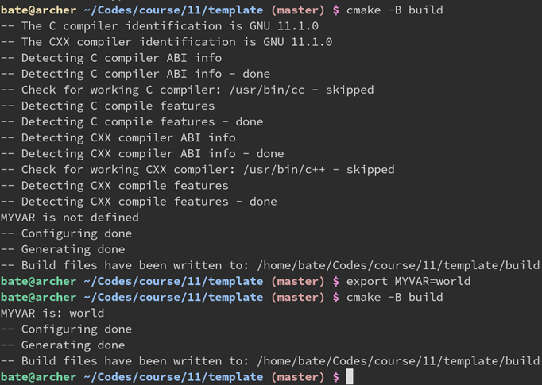

## 十一、其他小建议

### CCache：编译加速缓存

一般用法：把`gcc -c main.cpp -omain`换成`ccache gcc -c main.cpp -o main`即可

在CMake中：

```cmake
find_program(CCAHE_PROGRAM ccache)
if(CCAHE_PROGRAM)
	message(STATUS "Found CCache: ${CCAHE_PROGRAM}")
	set_property(GLOBAL ProPERTY RULE_LANCH_COMPILE ${CCAHE_PROGRAM})
endif()
```

即在每个编译和链接命令前加上ccache

（似乎不支持MSVC）

### 添加run伪目标，用于启动主程序

```cmake
add_executable(main main.cpp)

add_custom_target(run COMMAND $<TARGET_FILE:main>)
```

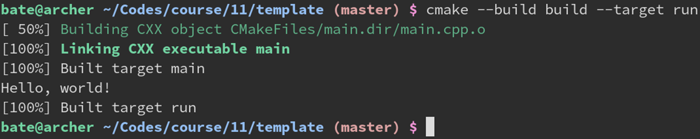

- 创建一个 run 伪目标，其执行 main 的可执行文件。

- 这里用了生成器表达式 `$<TARGET_FILE:main>`，会自动让 run 依赖于 main。
- 如果不放心有没有自动依赖上，手动加一个 add_dependencies(run main) 也是可以的。
- 这样就可以在命令行运行 `cmake --build build --target run` 来启动 main.exe 运行了。
- 而不必根据不同的平台，手动写出 build/main 或是 build\main.exe。
