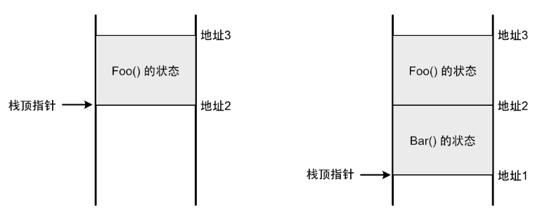
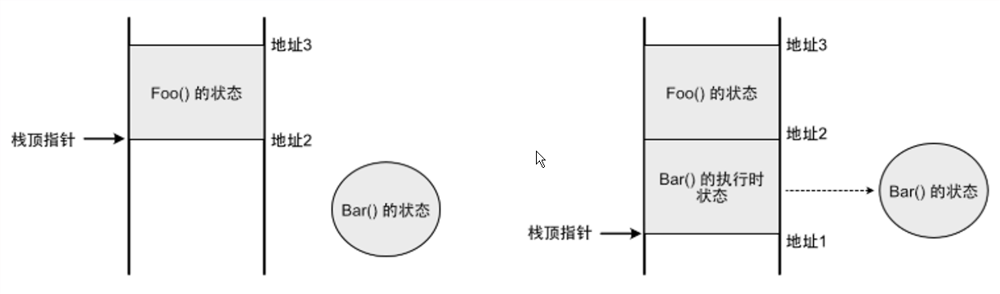

## C++20协程入门

### 什么是协程？

简单来说：**协程是一个可以暂停和恢复的函数**。

如果从传统函数的角度来看，暂停意味着线程会停止执行。那么，协程与普通函数的区别在哪里呢？关键在于：

- **普通函数**是线程紧密相关的，函数的状态依赖于线程栈；
- **协程**是线程无关的，它的状态独立于任何线程，可以在不同的线程间切换。

为了更好地理解这一点，我们可以先回顾一下函数调用的机制。每当调用一个普通函数时，当前线程的栈会保存这个函数的状态（例如函数参数、局部变量等）。这一过程通过栈顶指针的移动来完成。例如，函数 `Foo()` 调用 `Bar()` 的过程如下：



在这个过程中：

- 从 `地址3` 到 `地址2` 的内存空间分配给 `Foo()` 用来保存状态，栈顶指针指向 `地址2`；
- 当调用 `Bar()` 时，栈顶指针移到 `地址1`，此时从 `地址2` 到 `地址1` 的内存空间分配给 `Bar()` 用于保存状态；
- 当 `Bar()` 执行完毕，栈顶指针回到 `地址2`，`Bar()` 的状态被销毁，内存空间被回收。

可以看出，普通函数的状态完全依赖于线程栈，一旦线程结束或切换，函数的状态就不再存在，因此我们说普通函数是线程相关的。

而协程不一样，协程的状态是保存在堆内存中的。假设 `Bar()` 是一个协程，它的调用过程如下：



在这种情况下：

- `Bar()` 的状态会在堆上分配内存，这个状态独立于线程栈；
- 传递给 `Bar()` 的参数会被复制到这个堆内存中，局部变量也会直接在堆内存中创建；
- 当调用 `Bar()` 时，栈顶指针依然向下移动，给 `Bar()` 分配栈空间，并在栈上存储一个指向堆状态的引用。这样，`Bar()` 就像普通函数一样在栈上执行，线程也可以访问到位于堆上的状态，它的状态可以在堆内存中恢复。

如果协程需要暂停，当前执行位置会保存在堆内存中，而栈上的执行状态会被销毁，栈空间被回收。下一次恢复协程时，堆内存中的暂停位置会被读取，协程从中断点继续执行。通过这种机制，实现了一个可暂停和恢复执行的函数，即协程。

总的来说，协程和普通函数一样，在执行时依赖于线程栈；但一旦暂停，协程的状态独立于线程栈，保存在堆内存中。此时，协程与任何线程都没有直接关系，调用它的线程可以继续执行其他任务，协程的恢复也可以由同一线程或完全不同的线程来完成。因此说，协程是**线程无关的**。

### 协程的优点

协程的最大优点之一是可以优化异步代码，使得代码更简洁、可读性更强。举个例子，假设我们有一个名为 `IntReader` 的组件，它的功能是从一个访问速度较慢的设备上读取一个整数值，因此它提供的是异步接口，代码如下：

```cpp
class IntReader {
public:
    void BeginRead() {
        std::thread thread([]() {
            std::srand(static_cast<unsigned int>(std::time(nullptr)));
            int value = std::rand();
            // 使用 value ...
        });
        thread.detach();
    }
};
```

`BeginRead()` 方法开启了一个新的线程来生成一个随机整数，模拟异步操作。为了获取 `IntReader` 的结果，传统做法是使用回调函数，当操作完成时通过回调通知使用者，代码如下：

```cpp
class IntReader {
public:
    void BeginRead(const std::function<void(int)>& callback) {
        std::thread thread([callback]() {
            std::srand(static_cast<unsigned int>(std::time(nullptr)));
            int value = std::rand();
            callback(value);
        });
        thread.detach();
    }
};

void PrintInt() {
    IntReader reader;
    reader.BeginRead([](int result) {
        std::cout << result << std::endl;
    });
}
```

如果我们需要执行多个 `IntReader`，把它们的结果加起来再输出，基于回调的代码会变得非常复杂：

```cpp
void PrintInt() {
    IntReader reader1;
    reader1.BeginRead([](int result1) {
        int total = result1;

        IntReader reader2;
        reader2.BeginRead([total](int result2) {
            total += result2;

            IntReader reader3;
            reader3.BeginRead([total](int result3) {
                total += result3;
                std::cout << total << std::endl;
            });
        });
    });
}

```

代码不仅需要一层套一层，还要在每层回调之间传递结果，这就是俗称的“回调地狱”。而使用协程后，这个问题迎刃而解。我们可以像下面这样使用协程调用 `IntReader`：

```cpp
Task PrintInt() {
    IntReader reader1;
    int total = co_await reader1;

    IntReader reader2;
    total += co_await reader2;

    IntReader reader3;
    total += co_await reader3;

    std::cout << total << std::endl;
}
```

这段代码清晰、简洁，看起来就像是同步调用。每当协程遇到 `co_await` 时，它会暂停，直到 `IntReader` 完成操作，然后从暂停的地方恢复执行。接下来，我们将展示如何实现这一效果。

### 实现一个协程

在 C++ 中，只要一个函数体内使用了 `co_await`、`co_return` 或 `co_yield` 中的任何一个操作符，那么这个函数就会被视为协程。

我们先来关注一下 `co_await` 操作符。

#### `co_await` 和 Awaitable

`co_await` 的作用是让协程暂停，等待某个异步操作完成后再恢复执行。在前面的协程示例中，我们对 `IntReader` 调用了 `co_await`，但实际上这段代码不能正常编译，因为 `IntReader` 是我们自定义的类型，编译器并不知道它什么时候完成操作，也不知道如何获取操作结果。

为了让编译器理解我们的类型，C++定义了一个协议规范，要求自定义类型实现一定的函数，这样就可以在 `co_await` 中使用它。

这个规范被称为 **Awaitable（可等待对象）**，它要求对象实现以下几个关键函数：

- **`await_ready()`**
  返回类型为 `bool`。协程在执行 `co_await` 时，会首先调用 `await_ready()` 来检查“操作是否已经完成”。如果 `await_ready()` 返回 `true`，则表示异步操作已完成，协程不需要暂停，可以直接继续执行。如果返回 `false`，则协程会暂停，等待异步操作完成。
  需要实现 `await_ready()` 的原因是，异步调用的时序通常是不确定的。如果异步操作在执行 `co_await` 之前已经完成，那么就应该跳过暂停步骤，直接继续执行。此时，`await_ready()` 会返回 `true`，协程就会立即恢复执行，避免不必要的暂停。

- **`await_suspend()`**
  该函数接收一个类型为 `std::coroutine_handle<>` 的参数，返回类型可以是 `void` 或 `bool`。

  如果 `await_ready()` 返回 `false`，说明协程需要暂停，那么接下来会调用 `await_suspend()`。该函数的主要作用是接收协程的句柄 (`std::coroutine_handle<>`)，并在异步操作完成时，通过调用这个句柄的 `resume()` 方法来恢复协程的执行。协程句柄类似于函数指针，它代表一个协程实例，我们可以通过句柄来控制该协程的恢复执行。

  需要注意的是，`await_suspend()` 的实现不仅可以启动异步操作，还可以管理协程的恢复机制。它确保在异步操作完成时，协程能够正确地恢复执行。

- **`await_suspend()` **
  `await_suspend()` 的返回类型通常是 `void`，但是也可以是 `bool`。当返回类型是 `bool` 时，返回值控制协程是否真的暂停。具体来说，当 `await_suspend()` 返回 `false` 时，协程将不会暂停，而是继续执行。
  这提供了一个二次控制点，允许在协程暂停之前，基于某些条件决定是否阻止暂停。返回 `false` 会让协程直接继续执行，跳过暂停。

- **`await_resume()`**
  返回类型可以是 `void` 或其他类型，它的返回值就是 `co_await` 操作符的结果。当协程恢复执行时，或者当 `co_await` 不需要暂停时，`await_resume()` 会被调用。当协程恢复执行时，或者当 `co_await` 不需要暂停时，`await_resume()` 会被调用。

  如果协程暂停了，`await_resume()` 会在协程恢复时提供暂停点后的数据，从而允许我们获取异步操作的结果。比如，`await_resume()` 可以返回异步操作的结果，或者返回其他需要传递给协程后的值。

接下来，我们修改 `IntReader` 使其符合 Awaitable 规范。以下是完整的示例代码：

```cpp
#include <coroutine>
#include <cstdlib>
#include <ctime>
#include <iostream>
#include <thread>

void print_thread_id(const std::string& context) {
  std::cout << context << " 当前线程ID: " << std::this_thread::get_id()
            << std::endl;
}

class IntReader {
 public:
  bool await_ready() {
    print_thread_id("await_ready");  // 打印协程调用 await_ready 的线程 ID
    return false;                    // 协程总是需要暂停
  }

  void await_suspend(std::coroutine_handle<> handle) {
    print_thread_id("await_suspend");  // 打印协程暂停时的线程 ID
    // 在协程暂停时启动一个新线程进行异步操作
    std::thread([this, handle]() {
      print_thread_id("异步线程执行");  // 打印新线程的线程 ID
      std::srand(static_cast<unsigned int>(std::time(nullptr)));
      value_ = std::rand();  // 生成一个随机数

      handle.resume();  // 随机数生成完毕后，恢复协程
    }).detach();
  }

  int await_resume() {
    print_thread_id("await_resume");  // 打印协程恢复执行时的线程 ID
    return value_;                    // 返回异步操作的结果
  }

 private:
  int value_{};  // 用于保存随机数
};

class Task {
 public:
  class promise_type {
   public:
    Task get_return_object() { return {}; }
    std::suspend_never initial_suspend() { return {}; }
    std::suspend_never final_suspend() noexcept { return {}; }
    void unhandled_exception() {}
    void return_void() {}
  };
};

Task PrintInt() {
  print_thread_id("PrintInt");  // 打印协程开始执行时的线程 ID

  IntReader reader1;
  int total = co_await reader1;  // 暂停，等待异步操作完成

  IntReader reader2;
  total += co_await reader2;  // 再次暂停，等待第二个异步操作完成

  IntReader reader3;
  total += co_await reader3;  // 再次暂停，等待第三个异步操作完成

  std::cout << "总和: " << total << std::endl;  // 输出总和
}

int main() {
  print_thread_id("主线程开始");  // 打印主线程开始时的线程 ID

  PrintInt();  // 调用协程

  std::string line;
  while (std::cin >> line) {
  }  // 阻止主线程退出
  return 0;
}
```

*我们先忽略返回类型 `Task` ，下文会专门介绍协程的返回类型。*

**关键点解释：**

**`await_ready()`**：该函数总是返回 `false`，意味着协程总是需要暂停，等待异步操作完成。

**`await_suspend()`**：在 `await_suspend()` 中，我们启动了一个子线程来执行异步操作。子线程生成随机数之后，保存在 `value_` 成员变量中，然后调用协程句柄的 `resume()` 函数来恢复协程执行。

**`await_resume()`**：当协程恢复执行时，`await_resume()` 会返回生成的随机数，并且这个值会成为 `co_await` 操作的结果返回。

**执行流程：**

在 `main()` 中，我们调用了 `PrintInt()`，并进入协程。

当协程执行到 `co_await reader1` 时，它会暂停，等待 `IntReader` 的异步操作完成。此时主线程返回 `main()`，继续等待用户输入。

`reader1` 中的子线程生成一个随机数，并通过协程句柄恢复协程执行。

当协程恢复时，执行到第二个 `co_await reader2`，然后暂停，再由 `reader2` 中的子线程恢复协程。

以此类推，第三个 `co_await reader3` 会再次暂停，并由 `reader3` 中的子线程恢复协程，最终输出随机数的总和。

这里的关键点是：哪个线程调用协程句柄的 `resume()` ，就由哪个线程恢复协程执行。可以使用打印线程id、在IDE中设置断点来观察这个程序的执行流程，以便更好地理解。

#### 预定义的Awaitable类型

C++ 标准库中预定义了两个符合 Awaitable 规范的类型：`std::suspend_never` 和 `std::suspend_always`。顾名思义，`std::suspend_never` 表示协程**不暂停**，而 `std::suspend_always` 表示协程**总是暂停**。实际上它们的区别仅在于 `await_ready()` 函数的返回值：

- `std::suspend_never`：`await_ready()` 返回 `true`，表示协程不需要暂停，直接继续执行。
- `std::suspend_always`：`await_ready()` 返回 `false`，表示协程需要暂停，等待异步操作完成后再恢复。

除此之外，这两个类型的 `await_suspend()` 和 `await_resume()` 函数实现是空的。因此，它们仅用于控制协程在某些时机是否暂停，并不涉及实际的异步操作。

这两个类型主要作为工具类，常用于 `promise_type` 中，用来指定协程挂起和恢复的行为。接下来，我们将详细介绍 `promise_type` 的作用和实现。*下文会详细介绍 `promise_type` 。*

#### 协程的返回类型与 `promise_type`

C++ 对协程的返回类型只有一个基本要求：返回类型必须包含一个名为 `promise_type` 的嵌套类型。

与前面介绍的 Awaitable 一样， `promise_type` 也需要遵循 C++ 的规范，定义一系列特定的函数。`promise_type` 是协程的一部分，当协程被调用时，会在堆上为协程的状态分配空间，并同时创建一个对应的 `promise_type` 对象。通过该对象中定义的函数，我们可以与协程进行数据交互并控制协程的行为。

`promise_type` 要实现的第一个函数是 **`get_return_object()`** 它用于创建协程的**返回值**。在协程内部我们不需要显式地创建返回值，编译器会隐式地调用 `get_return_object()` 来创建返回值并返回给调用者。这个过程可能看起来有些奇怪——虽然 `promise_type` 是返回类型的嵌套类型，但编译器并不会直接创建返回值，而是先创建一个 `promise_type` 对象，然后通过该对象创建返回值。


那么，协程的返回值有什么用呢？这取决于协程的设计意图，具体取决于如何希望协程与调用者进行交互。

例如，在上文的示例中，`PrintInt()` 协程只是输出一个整数，并不需要与调用者有任何交互，因此它的返回值可以是一个空类型。 如果我们希望实现一个 `GetInt()` 协程，该协程需要返回一个整数给调用者，并由调用者进行输出，那么我们就需要对协程的返回类型进行一些修改，以便能够传递数据。

#### co_return

接下来，我们将 `PrintInt()` 协程修改为 `GetInt()`，并使用 **`co_return`** 操作符从协程中返回数据，如下所示：

```cpp
Task GetInt() {

    IntReader reader1;
    int total = co_await reader1;

    IntReader reader2;
    total += co_await reader2;

    IntReader reader3;
    total += co_await reader3;

    co_return total;
}
```

`co_return total` 等价于 `promise_type.return_value(total)`，即返回的数据会通过 `return_value()` 函数传递给 `promise_type` 对象， 因此 `promise_type` 必须实现这个函数以接收数据。

此外，还需要确保返回类型 `Task` 能访问到这个数据。为了减少数据传递，我们可以在 `promise_type` 和 `Task` 之间共享同一份数据。下面是修改后的完整示例：

```cpp
#include <coroutine>
#include <iostream>
#include <thread>

class IntReader {
public:
    bool await_ready() {
        return false;  // 始终暂停协程
    }

    void await_suspend(std::coroutine_handle<> handle) {
        // 在协程暂停时启动一个新线程执行异步操作
        std::thread([this, handle]() {
            std::srand(static_cast<unsigned int>(std::time(nullptr)));
            value_ = std::rand();  // 生成随机数

            handle.resume();  // 完成后恢复协程执行
        }).detach();
    }

    int await_resume() {
        return value_;  // 返回异步操作的结果
    }

private:
    int value_{};  // 用于存储随机数
};

class Task {
public:
    class promise_type {
    public:
        promise_type() : value_(std::make_shared<int>()) {}

        Task get_return_object() { 
            return Task{ value_ };  // 返回 Task 对象
        }

        void return_value(int value) {
            *value_ = value;  // 将值存储到共享数据中
        }

        std::suspend_never initial_suspend() { return {}; }
        std::suspend_never final_suspend() noexcept { return {}; }
        void unhandled_exception() {}

    private:
        std::shared_ptr<int> value_;  // 存储协程返回值的智能指针
    };

public:
    Task(const std::shared_ptr<int>& value) : value_(value) {}

    int GetValue() const {
        return *value_;  // 返回协程计算结果
    }

private:
    std::shared_ptr<int> value_;  // 共享的数据
};

Task GetInt() {
    IntReader reader1;
    int total = co_await reader1;

    IntReader reader2;
    total += co_await reader2;

    IntReader reader3;
    total += co_await reader3;

    co_return total;  // 返回总和
}

int main() {
    auto task = GetInt();  // 启动协程

    std::string line;
    while (std::cin >> line) {
        std::cout << task.GetValue() << std::endl;  // 输出协程返回的值
    }
    return 0;
}
```

我们通过 `std::shared_ptr<int>` 在 `promise_type` 和 `Task` 之间共享数据。当 `get_return_object()` 创建 `Task` 时，它会将 `promise_type` 中的智能指针传递给 `Task`，这样它们就能访问到同一个数据。然后，协程内部通过 `return_value()` 函数将结果写入共享数据，而 `Task` 则通过 `GetValue()` 读取并返回该数据。

异步是具有传染性的，由于 `GetInt()` 协程内部使用了异步操作（`co_await`），它本身也是一个异步操作。为了等待协程执行完成，我们将 `task.GetValue()` 放在 `while` 循环中，在每次用户输入时输出当前结果。这是一个简单的示例程序，缺乏异步同步机制，所以通过通过等待用户输入来间接等待协程的执行。

在实际应用中，协程的返回类型通常需要提供更多的同步机制，以支持回调、通知等机制，使得协程的行为与传统的异步操作一致。因此，协程的优点主要体现在它的对内的代码逻辑，而不是对外的使用方式。

协程的返回类型也可以实现 `Awaitable` 规范，这样它就可以作为另一个协程的 `co_await` 对象，从而支持更复杂的协程链式调用。这样一来，调用协程的也必须是协程，这样层层往上传递，直到遇到不能改成协程的函数为止，例如 `main()` 函数。

与普通的 `return` 一样，`co_return` 也可以不带任何参数，在这种情况下，协程会以没有数据的方式返回，相当于调用了 `promise_type.return_void()`，`promise_type` 需要手动定义这个函数以支持不带数据的返回。。如果在协程结束时没有显式调用 `co_return`，编译器会隐式添加一个不带参数的 `co_return` 调用。

#### co_yield

在 C++ 协程中，`co_return` 用于结束协程，就像普通函数中的 `return` 一样。调用 `co_return` 后，协程实例的内存会被释放，协程也不能再继续执行。如果我们希望在协程中多次返回数据而不中止协程执行，可以使用 `co_yield` 操作符。

`co_yield` 的作用是返回数据并暂停协程，等待下一次恢复。具体来说，`co_yield value` 等价于 `co_await promise_type.yield_value(value)`，传递给 `yield_value()` 的参数会被传给 `promise_type` 的 `yield_value()` 函数，而 `yield_value()` 的返回值将传给 `co_await`。

上面我们提到，传给 `co_await` 的参数要符合 Awaitable 规范，所以 `yield_value()` 的返回类型也要满足 `Awaitable` 规范，通常我们使用预定义的 `std::suspend_always` 让协程在每次调用 `co_yield` 时都暂停。

为了演示如何使用 `co_yield`，我们再次修改示例程序，使其在用户输入时，每次从协程中取出一个值并输出，然后继续生成下一个值。以下是修改后的完整示例代码：

```cpp
#include <coroutine>
#include <iostream>
#include <memory>
#include <thread>

class IntReader {
 public:
  bool await_ready() { return false; }

  void await_suspend(std::coroutine_handle<> handle) {
    std::cout << "[await_suspend] 线程 ID: " << std::this_thread::get_id()
              << std::endl;

    std::thread thread([this, handle]() {
      std::cout << "[IntReader 线程] 当前线程 ID: "
                << std::this_thread::get_id() << std::endl;

      static int seed = 0;
      value_ = ++seed;

      std::cout << "[IntReader 线程] 即将恢复协程，线程 ID: "
                << std::this_thread::get_id() << std::endl;
      handle.resume();
    });

    thread.detach();  // 分离线程
  }

  int await_resume() {  // co_await 操作符的返回值, 协程恢复时执行
    std::cout << "[await_resume] 线程 ID: " << std::this_thread::get_id()
              << ", 返回值: " << value_ << std::endl;
    return value_;
  }

 private:
  int value_{};
};

class Task {
 public:
  class promise_type {
   public:
    Task get_return_object() {
      // from_promise() 函数可以通过 promise_type 对象获取与之关联的协程句柄
      return Task{std::coroutine_handle<promise_type>::from_promise(
          *this)};  // 将获取的协程句柄作为参数传递给 Task 构造函数
    }

    std::suspend_always yield_value(int value) {  // co_yield 操作符的返回值
      value_ = value;
      std::cout << "[yield_value] 当前线程 ID: " << std::this_thread::get_id()
                << ", 生成值: " << value_ << std::endl;
      return {};
    }

    void return_void() {}

    std::suspend_never
    initial_suspend() {  // 初始化完成后会调用这个函数，决定协程在创建之后是否立即挂起
      std::cout << "[initial_suspend] 当前线程 ID: "
                << std::this_thread::get_id() << std::endl;
      return {};
    }

    std::suspend_never final_suspend() noexcept {
      std::cout << "[final_suspend] 当前线程 ID: " << std::this_thread::get_id()
                << std::endl;
      return {};
    }

    void unhandled_exception() {
      std::cerr << "[unhandled_exception] 当前线程 ID: "
                << std::this_thread::get_id() << std::endl;
    }

    int GetValue() const { return value_; }

   private:
    int value_{};
  };

 public:
  Task(std::coroutine_handle<promise_type> handle)  // 构造函数，参数为协程句柄
      : coroutine_handle_(handle) {}

  int GetValue() const {
    return coroutine_handle_.promise().GetValue();
  }  // 通过句柄得到协程的 promise 对象，从而得到协程的值

  void Next() {
    std::cout << "[Task::Next] 当前线程 ID: " << std::this_thread::get_id()
              << std::endl;
    coroutine_handle_.resume();
  }

 private:
  std::coroutine_handle<promise_type> coroutine_handle_;
};

Task GetInt() {
  while (true) {
    IntReader reader;
    int value = co_await reader;
    co_yield value;
  }
}

int main() {
  auto task = GetInt();

  std::string line;
  while (std::cin >> line) {
    std::cout << "[main] 收到输入，恢复协程。主线程 ID: "
              << std::this_thread::get_id() << std::endl;
    std::cout << "[main] 当前协程值: " << task.GetValue() << std::endl;
    task.Next();  // 恢复协程
  }
  return 0;
}
```

这个示例修改的比较多，我们逐步分析。首先，`IntReader::await_suspend()` 中的随机数生成被改为递增整数，这样更容易观察到协程的暂停与恢复效果。

接着，`Task` 类增加了一个 `Next()` 方法，用来通过调用协程句柄恢复协程的执行：

```cpp
void Next() {
    coroutine_handle_.resume();
}
```

这意味着 `Task` 需要持有协程句柄，这个句柄通过 `promise_type` 中的 `get_return_object()` 方法传递给 `Task`：

```cpp
Task get_return_object() { 
    return Task{ std::coroutine_handle<promise_type>::from_promise(*this) };

```

`std::coroutine_handle` 的 `from_promise()` 函数可以通过 `promise_type` 对象获取与之关联的协程句柄，反之，协程句柄上也有一个 `promise()` 函数可以获取对应的 `promise_type` 对象，他们是可以互相转换的。所以，在 `Task` 和 `promise_type` 之间就不需要使用 `std::shared_ptr<int>` 来共享数据， `Task` 通过协程句柄就能访问到 `promise_type` 对象，像下面这样直接取数据就可以了：

```cpp
int GetValue() const {
    return coroutine_handle_.promise().GetValue();
}
```

需要注意的是，协程句柄 `std::coroutine_handle` 的模板类型。在前面的例子中，协程句柄的类型是 `std::coroutine_handle<>` ，不带模板参数；而在这个例子中，协程句柄的类型是 `std::coroutine_handle<promise_type>` ，模板参数中填入了 `promise_type` 类型。这个区别类似于指针 `void*` 和 `promise_type*` ，前者是无类型的，后者是强类型的。两种类型的协程句柄本质上是相同的东西，指向同一个协程实例，都可以恢复协程执行。但只有强类型的 `std::coroutine_handle<promise_type>` 才能调用 `from_promise()` 获取到 `promise_type` 对象。

然后，协程 `GetInt()` 被修改为一个无限循环，每次通过 `IntReader` 获取一个整数，并通过 `co_yield` 返回该整数：

```cpp
Task GetInt() {

    while (true) {

        IntReader reader;
        int value = co_await reader;
        co_yield value;
    }
}
```

由于协程具有暂停和恢复的特性，`GetInt()` 可以在无限循环中执行，而不会像普通函数那样让线程在里面死循环。

最后，`promise_type` 中的 `yield_value()` 函数用于处理 `co_yield` 返回的数据。为了确保协程在每次 `co_yield` 后暂停，我们将 `yield_value()` 的返回类型设为 `std::suspend_always`，使协程在每次返回数据后都暂停等待恢复。

### 协程的生命周期

我们一开始提到，C++ 会在堆上为协程分配状态内存，并且必须确保这些内存会在适当的时机被释放，否则会造成内存泄漏。释放协程的内存可以通过自动释放或手动释放两种方式来实现。

#### 自动释放：

当协程正常结束时，如果没有干预，C++ 会自动释放协程的内存。协程结束的标志是调用了 `co_return`，此时协程实例会销毁，释放状态。以下是自动释放的示例：

```cpp
Task GetInt() {

    IntReader reader;
    int value = co_await reader;

    co_return value;
}


Task PrintInt() {

    IntReader reader1;
    int value = co_await reader;

    std::cout << value << std::endl;
}
```

`PrintInt()` 没有出现 `co_return` 语句，编译器会在末尾隐式地加上 `co_return` 。

自动释放的方式有时候并不是我们想要的，参考下面这个例子：

```cpp
#include <coroutine>
#include <iostream>
#include <thread>

class Task {
public:
    class promise_type {
    public:
        Task get_return_object() {
            return Task{ std::coroutine_handle<promise_type>::from_promise(*this) };
        }

        void return_value(int value) {
            value_ = value;
        }

        int GetValue() const {
            return value_;
        }

        std::suspend_never initial_suspend() { return {}; }
        std::suspend_never final_suspend() noexcept { return {}; }
        void unhandled_exception() {}

    private:
        int value_{};  // 存储协程返回的值
    };

public:
    Task(std::coroutine_handle<promise_type> handle) : coroutine_handle_(handle) {}

    int GetValue() const {
        return coroutine_handle_.promise().GetValue();
    }

private:
    std::coroutine_handle<promise_type> coroutine_handle_;  // 协程句柄
};

Task GetInt() {
    co_return 1024;  // 返回 1024
}

int main() {
    auto task = GetInt();

    std::string line;
    while (std::cin >> line) {
        std::cout << task.GetValue() << std::endl;
    }
    return 0;
}
```

在这个例子中，`GetInt()` 协程通过 `co_return` 返回了 1024 给 `promise_type`，`Task` 通过协程句柄获取并访问该值。但是运行程序发现，输出的值并不是 1024，而是随机值或者会触发地址访问错误。

这个现象的原因是，协程在返回1024之后就被自动释放了， `promise_type` 也跟着被一起释放了，此时在 `Task` 内部持有的协程句柄已经变成了野指针，指向一块已经被释放的内存。所以访问这个协程句柄的任何行为都会是未定义行为。

#### 手动释放内存

解决这个问题的方法是，将 `promise_type`中的 `final_suspend()` 返回类型从 `std::suspend_never` 改为 `std::suspend_always` 。

协程在结束的时候，会调用 `final_suspend()` 来决定是否暂停，如果这个函数返回了要暂停，那么协程不会自动释放，此时协程句柄还是有效的，可以安全访问它内部的数据。

```cpp
std::suspend_always final_suspend() noexcept {
    return {};  // 返回暂停标志，防止协程自动释放
}
```

不过，这时候释放协程就变成我们的责任了，必须在适当的时机调用协程句柄上的 `destroy()` 函数来手动释放这个协程。可以在 `Task` 的析构函数中做这个事情：

```cpp
~Task() {
    coroutine_handle_.destroy();  // 手动销毁协程
}
```

只要协程处于暂停状态（即没有被自动销毁），我们就可以调用 `destroy()` 来释放内存。对于像无限循环这样的协程，手动销毁内存是必须的，因为协程可能会在暂停状态下长时间存在。

#### `initial_suspend()` 的应用

与 `final_suspend()` 类似，`initial_suspend()` 用于决定协程开始执行时是否立即暂停。默认情况下，`initial_suspend()` 返回 `std::suspend_never`，即协程一开始就立即执行。

我们可以将这个函数的返回类型改成 `std::suspend_always` ，使协程一开始就进入暂停状态，直到我们显式恢复它。实现协程延迟执行的效果，例如批量管理协程句柄，之后需要的时候统一启动。

```cpp
std::suspend_always initial_suspend() {
    return {};  // 延迟协程执行，直到我们显式恢复
}
```

### 异常处理

协程的异常处理与普通函数有些不同，因为协程本身是在一个异步的上下文中执行的。C++编译器会自动生成一些代码来处理协程中的异常，确保协程在异常发生时能够正确地结束，并执行必要的清理工作。下面是一个伪代码示例，展示了协程的执行过程和异常处理机制：

```cpp
try {

    co_await promise_type.initial_suspend();  // 协程开始时，可能会暂停

    // 协程的主体代码...
}
catch (...) {

    promise_type.unhandled_exception();  // 捕获未处理的异常
}

co_await promise_type.final_suspend();  // 协程结束时，可能会暂停
```

- **`initial_suspend()`**：协程开始执行时调用，决定协程是否暂停。通常返回 `std::suspend_never` 表示不暂停，或者 `std::suspend_always` 表示暂停。

- **异常捕获**：如果协程在执行过程中抛出异常，异常会被 `catch (...)` 捕获，并传递给 `promise_type` 的 `unhandled_exception()` 方法。

- **`final_suspend()`**：协程结束时调用，决定协程是否在结束前暂停。C++标准要求 `final_suspend()` 必须是 `noexcept`，因此在 `final_suspend()` 中不能抛出异常。

举个栗子：

这是一段包含抛出异常的示例代码：

```cpp
#include <coroutine>
#include <iostream>
#include <stdexcept>

class Task {
public:
    class promise_type {
    public:
        Task get_return_object() {
            return Task{ std::coroutine_handle<promise_type>::from_promise(*this) };
        }

        void return_value(int value) {
            value_ = value;
        }

        void unhandled_exception() {
            exception_ = std::current_exception();
        }

        int GetValue() const {
            return value_;
        }

        std::suspend_never initial_suspend() { return {}; }
        std::suspend_always final_suspend() noexcept { return {}; }

    private:
        int value_ = 0;
        std::exception_ptr exception_;
    };

public:
    Task(std::coroutine_handle<promise_type> handle) : handle_(handle) {}

    ~Task() {
        if (handle_) {
            handle_.destroy();
        }
    }

    int GetValue() const {
        return handle_.promise().GetValue();
    }

private:
    std::coroutine_handle<promise_type> handle_;
};

Task ExampleCoroutine() {
    std::cout << "Start of coroutine" << std::endl;

    // 模拟一些操作，可能会抛出异常
    throw std::runtime_error("An error occurred in the coroutine");

    co_return 42;  // 这个代码不会执行
}

int main() {
    try {
        auto task = ExampleCoroutine();
        std::cout << "Coroutine returned: " << task.GetValue() << std::endl;
    }
    catch (const std::exception& ex) {
        std::cout << "Caught exception: " << ex.what() << std::endl;
    }
    return 0;
}
```

这是编译器处理后生成的伪代码：

```cpp
try {
    // 调用 initial_suspend() 来检查是否暂停协程
    co_await promise_type.initial_suspend();

    // 协程的主体代码，可能会抛出异常
    try {
        std::cout << "Start of coroutine" << std::endl;

        // 这里抛出异常
        throw std::runtime_error("An error occurred in the coroutine");

        co_return 42;
    }
    catch (...) {
        // 如果协程体内发生异常，转交给 promise_type 的 unhandled_exception() 进行处理
        promise_type.unhandled_exception();
    }
}
catch (...) {
    // 捕获异常并进行处理
    // 在协程外部捕获的异常，可以选择在主程序中处理
    promise_type.unhandled_exception();
}

co_await promise_type.final_suspend();  // 协程结束时调用 final_suspend，决定是否暂停
```

**解释:**

1. **`try-catch` 块**：编译器会将协程体的执行过程包裹在 `try` 块中，`co_await` 会触发 `initial_suspend()` 和 `final_suspend()` 方法的调用。
2. **抛出异常**：当协程中抛出 `std::runtime_error` 异常时，异常会被传递到外层的 `catch` 语句中。如果该异常未在协程体内部处理，它会被转交给 `promise_type::unhandled_exception()` 方法来进行处理。
3. **`unhandled_exception()`**：当异常未被处理时，`unhandled_exception()` 被调用，可以在这里执行必要的异常清理工作。
4. **`final_suspend()`**：协程结束时调用 `final_suspend()`，这是最后的暂停点，确保协程的状态可以被正确清理。

协程主要的执行代码都被 try - catch 包裹，假如抛出了未处理的异常， `promise_type` 的 `unhandled_exception()` 函数会被调用，我们可以在这个函数里面做对应的异常处理。由于这个函数是在 `catch` 语句中调用的，我们可以在函数内调用 `std::current_exception()` 函数获取异常对象，也可以调用 `throw` 重新抛出异常。

调用了 `unhandled_exception()` 之后，协程就结束了，接下来会继续调用 `final_suspend()` ，与正常结束协程的流程一样。C++标准规定： `final_suspend()` 必须定义成 `noexcept` ，也就是说它不允许抛出任何异常。

### 后记

至此，我们介绍完了C++协程的基础内容，可以感觉到，C++20的协程仍然只提供了一些基础功能，使用起来并不友好。

要想在实际的开发中使用上C++协程，还有比较长的路。我们可以自己动手对它进行封装，或者使用第三方库的，或者期待未来的C++标准带来更高层封装的协程组件。

