## 第0章：从并发到并行

### 停滞的摩尔定律

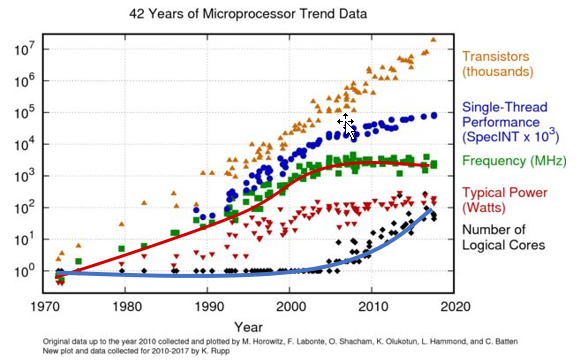

你醒啦？免费午餐结束了！

摩尔定律具体内容我们就不再提，从上图可以看到晶体管的密度的确仍在指数增长，但处理器主频却开始停止增长了，甚至有所下降。

很长时间之前我们就可以达到2GHz（2001年8月），根据2003年的趋势，在2005年初我们就应该研发出10GHz的芯片。

可为何直到今天也生产不出10GHz的芯片？

狭义的摩尔定律没有失效。但晶体管数量的增加，不再用于继续提升**单核频率**，转而用于增加**核心数量**。单核性能不再指数增长！

指望靠单核性能的增长带来程序性能提升的时代一去不复返了，现在要我们动动手为多核优化一下老的程序，才能搭上摩尔定律的顺风车。

### 神话与现实：2 * 3GHz VS 6GHz

既然现在的CUP都提供了多核，那么一个由双核组成的3GHz的CPU实际上提供了6GHz的处理能力，是吗？

显然不是。甚至在两个处理器上同时运行两个线程也不见得可以获得两倍的性能。相似的，大多数多线程的应用不会比双核处理器的两倍快。他们应该比单核处理器运行的快，但是性能毕竟不是线性增长。

为什么无法做到呢？首先，为了保证缓存一致性以及其他握手协议需要运行时间开销。在今天，双核或者四核机器在多线程应用方面，其性能不见得的是单核机器的两倍或者四倍。这一问题一直伴随CPU发展至今。

### 并发和并行

运用多线程的方式和动机，一般分为两种。

**并发：**单核处理器，操作系统通过时间片调度算法，轮换着执行着不同的线程，看起来就好像是同时运行一样，其实每一时刻只有一个线程在运行。目的：异步地处理**多个不同的任务**，避免同步造成的**阻塞**。

**并行：**多核处理器，每个处理器执行一个线程，真正的同时运行。目的：将**一个任务**分派到多个核上，从而**更快**完成任务。

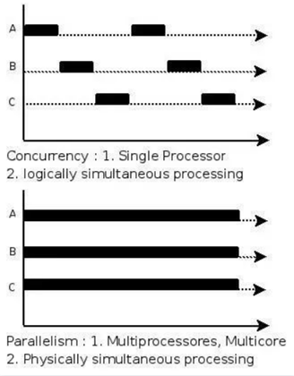

#### 举个栗子：

图形学爱好者：我看中的是**多核**，目的是**加速比**，如果是单核，那多线程对我无用！

某互联网公司：我看中的是**异步**，目的是**无阻塞**，即使是单核，多线程对我也有用。

**并发：**

某互联网公司购置了一台单核处理器的服务器，他正同时处理 4 个 HTTP 请求，如果是单线程的 listen-accept 循环，则在处理完 A 的请求之前，B 的请求就无法处理，造成“无响应”现象。C 的请求进来，则还得继续排队……

每个请求开启一个线程来处理，这样处理 A 用户的同时还可以继续监听 B 用户发来的请求，及时响应，改善用户体验。

**并行：**

某图形学爱好者购置了一台 4 核处理器的电脑，他正在渲染 cornell box 的图像，这个图像在**单核上渲染需要** **4** **分钟**。

他把图像切成 4 份，每个是原来的 1/4 大小，这样每个小块渲染只需要 1 分钟。

然后他把 4 个小块发给 4 个处理器核心，1 分钟后 4 个处理器都渲染完毕得到结果。

最后只需将 4 个小块拼接起来即可得到完整的 cornell box 图像。**总共只花了** **1** **分钟**。

### Intel 开源的并行编程库：TBB

**Threading Building Blocks (TBB)** 是由 Intel 提供的一个开源 C++ 库，旨在简化多线程编程，并提供高效的并行计算框架。

#### 安装TBB

下面只介绍几个简单安装方式，其余可自行查找资料。

Ubuntu:

```
sudo apt-get install libtbb-dev
```

Arch Linux:

```
sudo pacman -S tbb
```

Windows:

```shell
.\vcpkg install tbb:x64-windows
# 或者直接下载编译好的二进制包
```

Mac OS:

```
.\vcpkg install tbb:x64-macos
```

Other:

从源码构建安装

### 测试：模拟交互并下载

```cpp
#include <tbb/task_group.h>

#include <iostream>
#include <string>

void download(std::string file) {
  for (int i = 0; i < 10; i++) {
    std::cout << "Downloading " << file << " (" << i * 10 << "%)..."
              << std::endl;
    std::this_thread::sleep_for(std::chrono::milliseconds(400));
  }
  std::cout << "Download complete: " << file << std::endl;
}

void interact() {
  std::string name;
  std::cin >> name;
  std::cout << "Hi, " << name << std::endl;
}

int main() {
  tbb::task_group tg;
  tg.run([&] { download("hello.zip"); });
  tg.run([&] { interact(); });
  tg.wait();	// 等待所有线程执行完
  return 0;
}
```

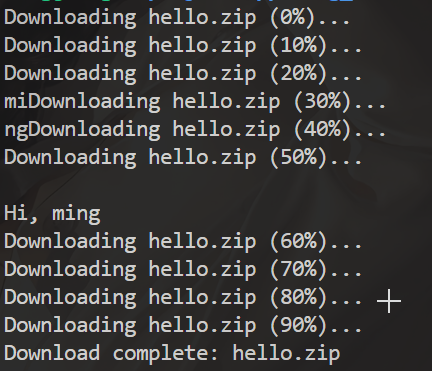

可以看到，我们可以在下载任务执行过程中与interact函数进行交互

用一个**任务组** tbb::task_group 启动多个任务，一个负责下载，一个负责和用户交互。并在主线程中等待该任务组里的任务全部执行完毕。

区别在于，**一个任务不一定对应一个实际线程**，如果任务数量超过CPU最大的线程数，会由 TBB 在用户层负责**调度任务**运行在多个预先分配好的**线程**，而不是由操作系统负责**调度线程**运行在多个物理**核心**。

- TBB眼中的任务和线程，就像操作系统眼中的线程和物理核心一样

### parallel_invoke 执行工具

`parallel_invoke` 是一个并行执行工具，允许你同时将多个函数或者任务并行地执行。

```cpp
#include <tbb/parallel_invoke.h>

#include <iostream>
#include <string>

void download(std::string file) {
  for (int i = 0; i < 10; i++) {
    std::cout << "Downloading " << file << " (" << i * 10 << "%)..."
              << std::endl;
    std::this_thread::sleep_for(std::chrono::milliseconds(400));
  }
  std::cout << "Download complete: " << file << std::endl;
}

void interact() {
  std::string name;
  std::cin >> name;
  std::cout << "Hi, " << name << std::endl;
}

int main() {
  tbb::parallel_invoke([&] { download("hello.zip"); },
                       [&] { interact(); });  // 传入多个lambda表达式
  return 0;
}
```

### 另一个例子

```cpp
#include <tbb/parallel_invoke.h>

#include <iostream>
#include <string>

int main() {
  std::string s = "Hello, world!";
  char ch = 'd';
  tbb::parallel_invoke(
      [&] {
        for (size_t i = 0; i < s.size() / 2; i++) {
          if (s[i] == ch) std::cout << "found!" << std::endl;
        }
      },
      [&] {
        for (size_t i = s.size() / 2; i < s.size(); i++) {
          if (s[i] == ch) std::cout << "found!" << std::endl;
        }
      });
  return 0;
}
```

前后同时查找'b'字符

## 第一章：并行循环

### 时间复杂度（time-efficiency）与工作量复杂度（work-efficiency）

在小学二年级算法课里，我们学过复杂度的概念，意思是算法执行所花费的时间取决于数据量的大小 n，比如 O(n²) 表示花费时间和数据量的平方成正比。

对于并行算法，复杂度的评估则要分为两种：

- 时间复杂度：程序所用的总时间（重点）

- 工作复杂度：程序所用的计算量（次要）

这两个指标都是越低越好。**时间复杂度决定了快慢，工作复杂度决定了耗电量(工作量)**。

通常来说，工作复杂度 = 时间复杂度 * 核心数量

- 1个核心工作一小时，4个核心工作一小时。时间复杂度一样，而后者工作复杂度更高。

- 1个核心工作一小时，4个核心工作1/4小时。工作复杂度一样，而后者时间复杂度更低。

并行的主要目的是**降低时间复杂度**，工作复杂度通常是不变的。甚至有**牺牲工作复杂度换取时间复杂度**的情形。

并行算法的复杂度取决于数据量 n，还取决于线程数量 c，比如 O(n/c)。不过要注意如果线程数量超过了 CPU 核心数量，通常就无法再加速了，这就是为什么要买更多核的电脑。

也有一种说法，认为要用 c 趋向于无穷时的时间复杂度来衡量，比如 O(n/c) 应该变成 O(1)。

### 串行映射（map）

1个线程，独自处理8个元素的映射，花了8秒，用电量：1*8=8度电

```cpp
#include <cmath>
#include <iostream>
#include <vector>

int main() {
  size_t n = 1 << 26;
  std::vector<float> a(n);

  for (size_t i = 0; i < n; i++) {
    a[i] = std::sin(i);
  }

  return 0;
}
```

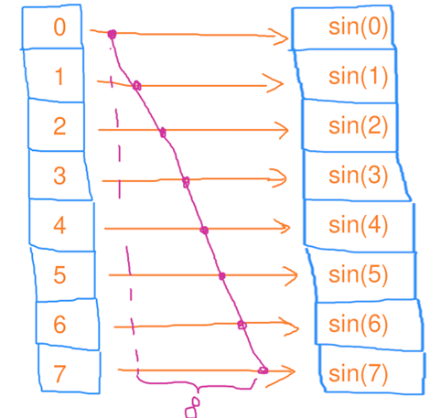

**结论：**串行映射的时间复杂度为 O(n)，工作复杂度为 O(n)，其中 n 是元素个数

### 并行映射

4个线程，每人处理2个元素的映射，花了2秒，用电量：4*2=8度电

```cpp
#include <tbb/task_group.h>

#include <cmath>
#include <iostream>
#include <vector>

int main() {
  size_t n = 1 << 26;
  std::vector<float> a(n);

  size_t maxt = 4;
  tbb::task_group tg;
  for (size_t t = 0; t < maxt; t++) {
    auto beg = t * n / maxt;
    auto end = std::min(n, (t + 1) * n / maxt);
    tg.run([&, beg, end] {
      for (size_t i = beg; i < end; i++) {
        a[i] = std::sin(i);
      }
    });
  }
  tg.wait();

  return 0;
}
```

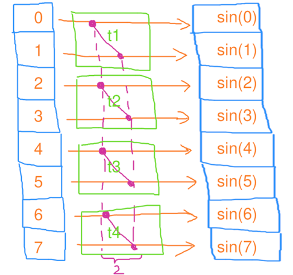

**结论：**并行映射的时间复杂度为 O(n/c)，工作复杂度为 O(n)，其中 c 是线程数量

### parallel_for 封装好的并行循环

```cpp
void parallel_for(const Range &range, const Body &body);
```

```cpp
#include <tbb/parallel_for.h>

#include <cmath>
#include <iostream>
#include <vector>

int main() {
  size_t n = 1 << 26;
  std::vector<float> a(n);

  tbb::parallel_for(tbb::blocked_range<size_t>(0, n),
                    [&](tbb::blocked_range<size_t> r) {
                      for (size_t i = r.begin(); i < r.end(); i++) {
                        a[i] = std::sin(i);
                      }
                    });

  return 0;
}
```

通过tbb::blocked_range获取一个区间，在函子里通过参数传入使用

- `tbb::parallel_for` 会自动将 `tbb::blocked_range<size_t>(0, n)` 传递给 lambda 函数的参数 `r`。在这个 lambda 中，`r` 是一个引用类型，它指向一个表示子区间的 `tbb::blocked_range<size_t>` 对象，TBB 会在并行执行时为每个线程提供不同的子区间。

#### "面向新手"的重载

刚接触TBB可能不习惯这样控制循环范围，因此它也有传统循环控制的重载：

```cpp
void parallel_for(Index first, Index last, const Function &f)
```

```cpp
#include <tbb/parallel_for.h>

#include <cmath>
#include <iostream>
#include <vector>

int main() {
  size_t n = 1 << 26;
  std::vector<float> a(n);

  tbb::parallel_for((size_t)0, (size_t)n,
                    [&](size_t i) { a[i] = std::sin(i); });

  return 0;
}
```

### 基于迭代器区间：parallel_for_each

当然也会有基于迭代器区间的循环：

```cpp
void parallel_for_each(Iterator first, Iterator last, const Body &body)
```

```cpp
#include <tbb/parallel_for_each.h>

#include <cmath>
#include <iostream>
#include <vector>

int main() {
  size_t n = 1 << 26;
  std::vector<float> a(n);

  tbb::parallel_for_each(a.begin(), a.end(), [&](float &f) { f = 32.f; });

  return 0;
}
```

### 二维区间上的for循环：blocked_range2d

有时我们需要处理多维的数据，例如矩阵计算、图像处理等，于是就有了`blocked_range2d`表示二维区域的区间划分。

构造和使用方式与 `tbb::blocked_range` 类似，但扩展到了二维空间，基本定义如下：

```cpp
namespace tbb {

template <typename Index>
class blocked_range2d {
public:
    // 构造函数
    blocked_range2d(Index row_start, Index row_end, Index col_start, Index col_end, Index grain_size = 1);

    // 获取行范围的起始和结束位置
    Index rows() const;
    
    // 获取列范围的起始和结束位置
    Index cols() const;
    
    // 获取行的起始位置
    Index row_begin() const;

    // 获取行的结束位置
    Index row_end() const;

    // 获取列的起始位置
    Index col_begin() const;

    // 获取列的结束位置
    Index col_end() const;
};

}  // namespace tbb
```

```cpp
#include <tbb/blocked_range2d.h>
#include <tbb/parallel_for.h>

#include <cmath>
#include <iostream>
#include <vector>

int main() {
  size_t n = 1 << 13;
  std::vector<float> a(n * n);

  tbb::parallel_for(
      tbb::blocked_range2d<size_t>(0, n, 0, n),
      [&](tbb::blocked_range2d<size_t> r) {
        for (size_t i = r.cols().begin(); i < r.cols().end(); i++) {
          for (size_t j = r.rows().begin(); j < r.rows().end(); j++) {
            a[i * n + j] = std::sin(i) * std::sin(j);
          }
        }
      });

  return 0;
}
```

### 三维区间上的for循环：blocked_range3d

相应的，也会有三维区域的控制

```cpp
#include <tbb/blocked_range3d.h>
#include <tbb/parallel_for.h>

#include <cmath>
#include <iostream>
#include <vector>

int main() {
  size_t n = 1 << 13;
  std::vector<float> a(n * n);

  tbb::parallel_for(
      tbb::blocked_range3d<size_t>(0, n, 0, n, 0, n),
      [&](tbb::blocked_range3d<size_t> r) {
        for (size_t i = r.pages().begin(); i < r.pages().end(); i++) {
          for (size_t j = r.cols().begin(); j < r.cols().end(); j++) {
            for (size_t k = r.rows().begin(); k < r.rows().end(); k++) {
              a[(i * n + j) * n + k] = std::sin(i) * std::sin(j) * std::sin(k);
            }
          }
        }
      });

  return 0;
}
```

### 所有区间类型

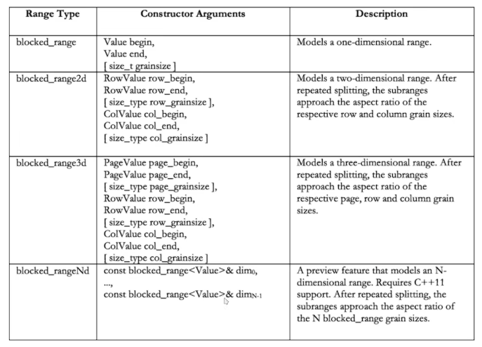

## ## 第二章：缩并与扫描

### 缩并(reduce)

- 缩并(归约)操作通常是指将一组数据通过某种运算（如求和、求最小值、最大值等）合并成一个单一的结果

1个线程，依次处理8个元素的缩并，花了7秒用电量：1 * 7=7度电，总用时：1 * 7=7秒

```cpp
#include <cmath>
#include <iostream>
#include <vector>

int main() {
  size_t n = 1 << 26;
  float res = 0;

  for (size_t i = 0; i < n; i++) {
    res += std::sin(i);
  }

  std::cout << res << std::endl;
  return 0;
}
```

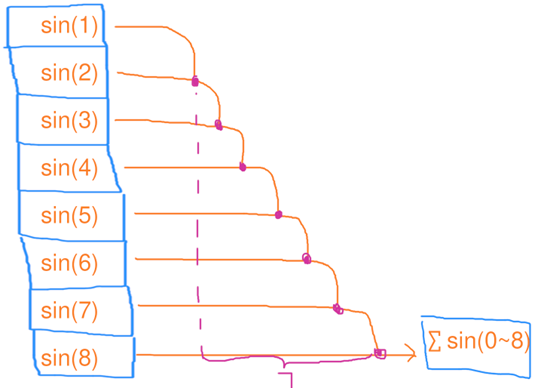

**结论：**串行缩并的时间复杂度为 O(n)，工作复杂度为 O(n)，其中 n 是元素个数

### 并行缩并

第一步、4个线程，每人处理2个元素的缩并，花了1秒

第二步、1个线程，处理4个元素的缩并，花了3秒

用电量：4 * 1+1 * 3=7度电 总用时：1+3=4秒

```cpp
#include <tbb/task_group.h>

#include <cmath>
#include <iostream>
#include <vector>

int main() {
  size_t n = 1 << 26;
  float res = 0;

  size_t maxt = 4;
  tbb::task_group tg;
  std::vector<float> tmp_res(maxt);
  for (size_t t = 0; t < maxt; t++) {  // 并行处理每个线程的加法
    size_t beg = t * n / maxt;         // 计算每个线程的起始位置
    size_t end = std::min(n, (t + 1) * n / maxt);  // 计算每个线程的结束位置
    tg.run([&, t, beg, end] {
      float local_res = 0;
      for (size_t i = beg; i < end; i++) {
        local_res += std::sin(i);
      }
      tmp_res[t] = local_res;
    });
  }
  tg.wait();
  for (size_t t = 0; t < maxt; t++) {  // 单独处理最后的加法
    res += tmp_res[t];
  }

  std::cout << res << std::endl;
  return 0;
}
```

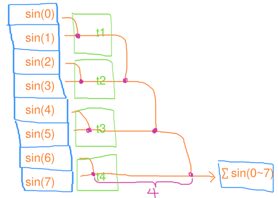

**结论：**并行缩并的时间复杂度为 O(n/c+c)，工作复杂度为 O(n)，其中 n 是元素个数

### 改进的并行缩并（GPU）

刚才那种方式对 c 比较大的情况不友好，最后一个串行的 for 还是会消耗很多时间。

因此可以用递归的模式，每次只使数据缩小一半，这样基本每次都可以看做并行的 for，只需 log2(n) 次并行 for 即可完成缩并。

这种常用于核心数量很多，比如 GPU 上的缩并。

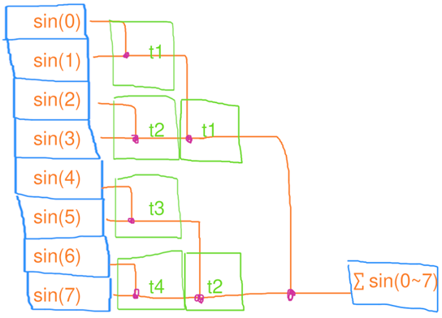

**结论：**改进后的并行缩并的时间复杂度为 O(logn)，工作复杂度为 O(n)。

### parallel_reduce 封装好的并行缩并

基本参数：

```cpp
template <typename Range, typename T, typename Body, typename Reduce>
T parallel_reduce(const Range& range,	// 迭代范围
                  T init,          // 初始值
                  Body&& body,     // 计算函数
                  Reduce&& reduce); // 合并函数
```

**Range**：表示需要并行化的范围，通常是一个区间或者数据结构（例如数组、向量等）。

**初始值**：初始值的类型，它定义了归约操作的初始值类型，也是每个线程计算结果的类型。

**Body**：是一个函数对象、函数指针或者 lambda 表达式，定义了在每个线程中要执行的并行计算操作。它负责对每个线程分配的子区间进行局部计算。

**Reduce**：规约函数，是一个函数对象、函数指针或者 lambda 表达式，定义了如何将多个线程的局部结果合并成一个全局结果。它负责将并行计算中的部分结果合并为一个最终结果。

```cpp
#include <tbb/blocked_range.h>
#include <tbb/parallel_reduce.h>

#include <cmath>
#include <iostream>
#include <vector>

int main() {
  size_t n = 1 << 26;
  float res = tbb::parallel_reduce(
      tbb::blocked_range<size_t>(0, n),  // 迭代范围
      (float)0,                          // 初始值（局部求和起始值）
      [&](tbb::blocked_range<size_t> r,
          float local_res) {  // 计算函数：对每个区间的值求sin和
        for (size_t i = r.begin(); i < r.end(); i++) {
          local_res += std::sin(i);
        }
        return local_res;	// 返回局部求和结果
      },
      // std::plus<int>(); 	// 归约函数：加法合并多个局部求和结果
      [](float x, float y) { return x + y; });  // 归约函数：加法合并多个局部求和结果

  std::cout << res << std::endl;
  return 0;
}
```

### parallel_deterministic_reduce：保证每次运行结果一致

因为TBB是动态分配线程组，并且浮点数是不精确存储，所以会导致每次运行的结果出现波动。

如果想要每次分配的线程组都相同保证结果一致性：

```cpp
#include <tbb/blocked_range.h>
#include <tbb/parallel_reduce.h>

#include <cmath>
#include <iostream>
#include <vector>

int main() {
  size_t n = 1 << 26;
  float res = tbb::parallel_deterministic_reduce(
      tbb::blocked_range<size_t>(0, n), (float)0,
      [&](tbb::blocked_range<size_t> r, float local_res) {
        for (size_t i = r.begin(); i < r.end(); i++) {
          local_res += std::sin(i);
        }
        return local_res;
      },
      [](float x, float y) { return x + y; });

  std::cout << res << std::endl;
  return 0;
}
```

### 并行缩并额外好处：能避免浮点误差

例如求平均值时，我们需要将所有值进行累加，这就会导致串行计算时出现一个很大的数加很小的数字，导致误差，即经典的**浮点数大加小问题**

但是并行计算时，每个分块的计算结果都相对没有那么大的差距，所以可以一直保持精确。

```cpp
#include <tbb/blocked_range.h>
#include <tbb/parallel_reduce.h>

#include <cmath>
#include <iostream>
#include <vector>

int main() {
  size_t n = 1 << 26;
  std::vector<float> a(n);
  for (size_t i = 0; i < n; i++) {
    a[i] = 10.f + std::sin(i);
  }

  float serial_avg = 0;
  for (size_t i = 0; i < n; i++) {
    serial_avg += a[i];
  }
  serial_avg /= n;
  std::cout << serial_avg << std::endl;

  float parallel_avg = tbb::parallel_reduce(
                           tbb::blocked_range<size_t>(0, n), (float)0,
                           [&](tbb::blocked_range<size_t> r, float local_avg) {
                             for (size_t i = r.begin(); i < r.end(); i++) {
                               local_avg += a[i];
                             }
                             return local_avg;
                           },
                           [](float x, float y) { return x + y; }) /
                       n;

  std::cout << parallel_avg << std::endl;
  return 0;
}
// 输出：
// 4
// 10
```


### 扫描（scan）

**扫描操作**（Scan Operation）又称为 **前缀和**（Prefix Sum），是一种在数组或数据流中计算累积结果的并行化算法。扫描操作对数据进行逐步的累加（或其他二元操作），并返回一个与输入数据长度相同的输出数组，其中每个元素是对输入数组**前面所有元素**进行累积操作的结果。

扫描操作的核心思想是，将输入数组的每个元素与它前面的元素通过某种二元操作（如加法、乘法、最大值、最小值等）进行计算，最终得到一个结果数组。

如图所示，扫描和缩并差不多，只不过他会把求和的**中间结果存到数组里去**

1个线程，依次处理8个元素的扫描，花了7秒

用电量：1 * 7 = 7度电，总用时：1 * 7 = 7秒

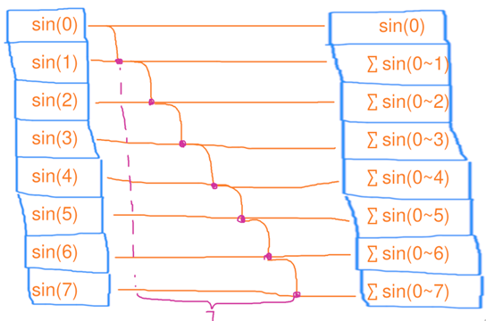

```cpp
#include <cmath>
#include <iostream>
#include <vector>

int main() {
  size_t n = 1 << 26;
  std::vector<float> a(n);
  float res = 0;

  for (size_t i = 0; i < n; i++) {
    res += std::sin(i);
    a[i] = res;
  }

  std::cout << a[n / 2] << std::endl;
  std::cout << res << std::endl;
  return 0;
}
```

**结论：**串行扫描的时间复杂度为 O(n)，工作复杂度为 O(n)。

### 并行扫描 

与之前并行缩并类似的思路：

第一步、4个线程，每人处理2个元素的缩并，花了1秒

第二步、1个线程，独自处理3个元素的缩并，花了3秒

第三步、3个线程，每人处理2个元素的缩并，花了1秒

用电量：4 * 1+1 * 3 + 3 * 1 = 10度电，总用时：1 + 3 + 1 = 5秒

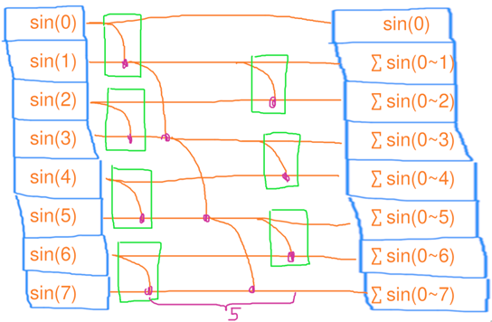

```cpp
#include <tbb/task_group.h>

#include <cmath>
#include <iostream>
#include <vector>

int main() {
  size_t n = 1 << 26;       // 数据量，2^26 = 67108864
  std::vector<float> a(n);  // 存储计算结果
  float res = 0;            // 用于保存最终结果

  size_t maxt = 4;                         // 使用 4 个任务
  tbb::task_group tg1;                     // 第一个任务组
  std::vector<float> tmp_res(maxt, 0.0f);  // 存储每个任务的局部结果

  // 第一个阶段：分配计算任务
  for (size_t t = 0; t < maxt; t++) {
    size_t beg = t * n / maxt;  // 每个任务的开始索引
    size_t end =
        std::min(n, (t + 1) * n / maxt);  // 每个任务的结束索引，避免越界
    tg1.run([&, t, beg, end] {
      float local_res = 0;
      for (size_t i = beg; i < end; i++) {
        local_res += std::sin(i);
      }
      tmp_res[t] = local_res;  // 将每个任务的计算结果存储到 tmp_res[t]
    });
  }
  tg1.wait();  // 等待所有计算任务完成

  // 合并阶段：将所有局部结果加到 res 中
  for (size_t t = 0; t < maxt; t++) {
    res += tmp_res[t];
  }

  // 第二个阶段：更新数组 a
  tbb::task_group tg2;
  for (size_t t = 0; t < maxt; t++) {
    size_t beg = t * n / maxt;  // 每个任务的开始索引
    size_t end = std::min(n, (t + 1) * n / maxt);  // 每个任务的结束索引
    tg2.run([&, t, beg, end] {
      float local_res = tmp_res[t];
      for (size_t i = beg; i < end; i++) {
        local_res += std::sin(i);
        a[i] = local_res;  // 更新数组 a
      }
    });
  }
  tg2.wait();  // 等待所有更新任务完成

  // 输出结果
  std::cout << a[n / 2] << std::endl;  // 输出数组中间位置的值
  std::cout << res << std::endl;       // 输出最终的累加结果

  return 0;
}
```

### 改进的并行扫描（GPU）

第一步、4个线程，每个处理2个元素的扫描，花了1秒

第二步、4个线程，每个处理2个元素的扫描，花了1秒

第三步、4个线程，每个处理2个元素的扫描，花了1秒

用电量：3 * 4 = 12度电 ，总用时：1 * 3 = 3秒

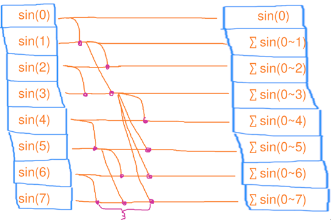

结论：改进后的并行扫描的时间复杂度为 O(logn)，工作复杂度为 O(nlogn)。

可见，并行后虽然降低了时间复杂度，但是以提升工作复杂度为代价！

更多细节，我们会在之后的GPU章节讨论。

### parallel_scan 封装的并行扫描

可以看到我们自己实现并行扫描的复杂度很高，TBB为我们进行了封装：

```cpp
template <typename Range, typename T, typename Body, typename Final>
T parallel_scan(Range& range,	// 范围
                T init,               // 初始值
                Body&& body,          // 执行扫描的操作
                Final&& final_op);    // 用于合并结果的操作（可选）
```

```cpp
#include <tbb/blocked_range.h>
#include <tbb/parallel_scan.h>

#include <cmath>
#include <iostream>
#include <vector>

int main() {
  size_t n = 1 << 26;
  std::vector<float> a(n);
  float res = tbb::parallel_scan(
      tbb::blocked_range<size_t>(0, n),  // 数据范围
      (float)0,                          // 初始值
      [&](tbb::blocked_range<size_t> r, float local_res,
          auto is_final) {  // 执行的扫描操作
        for (size_t i = r.begin(); i < r.end(); i++) {
          local_res += std::sin(i);
          if (is_final) {  // 最终阶段，将结果存入数组
            a[i] = local_res;
          }
        }
        return local_res;
      },
      [](float x, float y) { return x + y; }  // 归约操作
  );

  std::cout << a[n / 2] << std::endl;
  std::cout << res << std::endl;
  return 0;
}
```

## 第三章：性能测试

### 案例： map与reduce的组合

```cpp
#include <tbb/blocked_range.h>
#include <tbb/parallel_for.h>
#include <tbb/parallel_reduce.h>

#include <cmath>
#include <iostream>
#include <vector>

int main() {
  size_t n = 1 << 26;
  std::vector<float> a(n);

  // fill a with sin(i)
  tbb::parallel_for(tbb::blocked_range<size_t>(0, n),
                    [&](tbb::blocked_range<size_t> r) {
                      for (size_t i = r.begin(); i < r.end(); i++) {
                        a[i] = std::sin(i);
                      }
                    });

  // calculate sum of a
  float res = tbb::parallel_reduce(
      tbb::blocked_range<size_t>(0, n), (float)0,
      [&](tbb::blocked_range<size_t> r, float local_res) {
        for (size_t i = r.begin(); i < r.end(); i++) {
          local_res += a[i];
        }
        return local_res;
      },
      [](float x, float y) { return x + y; });

  std::cout << res << std::endl;
  return 0;
}
```

### 测试所花费的时间：tbb::tick_count::now()

我们将它封装为 tictock.h 文件：

```cpp
#pragma once

// #include <chrono>
// #define TICK(x) auto bench_##x = std::chrono::steady_clock::now();
// #define TOCK(x) std::cout << #x ": " <<
// std::chrono::duration_cast<std::chrono::duration<double>>(std::chrono::steady_clock::now()
// - bench_##x).count() << "s" << std::endl;

#include <tbb/tick_count.h>
#define TICK(x) auto bench_##x = tbb::tick_count::now();
#define TOCK(x)                                                          \
  std::cout << #x ": " << (tbb::tick_count::now() - bench_##x).seconds() \
            << "s" << std::endl;
```

接下来使用它对我们的**并行**案例进行测试：

```cpp
#include <tbb/blocked_range.h>
#include <tbb/parallel_for.h>
#include <tbb/parallel_reduce.h>

#include <cmath>
#include <iostream>
#include <vector>

#include "ticktock.h"

int main() {
  size_t n = 1 << 27;
  std::vector<float> a(n);
  std::cout << "并行测试结果：" << std::endl;

    TICK(for);
    // fill a with sin(i)
    tbb::parallel_for(tbb::blocked_range<size_t>(0, n),
                      [&](tbb::blocked_range<size_t> r) {
                        for (size_t i = r.begin(); i < r.end(); i++) {
                          a[i] = std::sin(i);
                        }
                      });
    TOCK(for);

    TICK(reduce);
    // calculate sum of a
    float res = tbb::parallel_reduce(
        tbb::blocked_range<size_t>(0, n), (float)0,
        [&](tbb::blocked_range<size_t> r, float local_res) {
          for (size_t i = r.begin(); i < r.end(); i++) {
            local_res += a[i];
          }
          return local_res;
        },
        [](float x, float y) { return x + y; });
    TOCK(reduce);

    std::cout << res << std::endl;
    return 0;
}
```

接下来对**串行**案例进行测试：

```cpp
#include <cmath>
#include <iostream>
#include <vector>

#include "ticktock.h"

int main() {
  size_t n = 1 << 27;
  std::vector<float> a(n);
  std::cout << "串行测试结果：" << std::endl;

    TICK(for);
    // fill a with sin(i)
    for (size_t i = 0; i < a.size(); i++) {
      a[i] = std::sin(i);
    }
    TOCK(for);

    TICK(reduce);
    // calculate sum of a
    float res = 0;
    for (size_t i = 0; i < a.size(); i++) {
      res += a[i];
    }
    TOCK(reduce);

    std::cout << res << std::endl;
    return 0;
}
```

### 串行与并行的速度比较

我们将运行结果放在这里

串行：

```shell
for: 2.60738s
reduce: 0.167612s
0.705693
```

串行：

```shell
for: 0.435992s
reduce: 0.0161827s
0.705874
```


### 如何评价上面的结果？

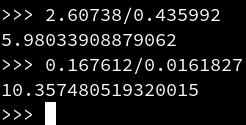

公式：加速比=串行用时 ÷ 并行用时

理想加速比应该是核心的数量。

for 部分加速比为 **5.98 ** 倍。

reduce 部分加速比为 **10.63** 倍。

- 提示：我的运行环境是6个物理核心，12个逻辑核心

似乎这里 reduce 的加速比是逻辑核心数量，而 for 的加速比是物理核心的数量！

剧透：因为本例中 reduce 是内存密集型，for 是计算密集型。

**超线程**对 reduce 这种只用了简单的加法，瓶颈在内存的算法起了作用。

而本例中 for 部分用了 std::sin，需要做大量数学运算，因此瓶颈在 ALU。

这里卖个关子，欲知后事如何，请待下集揭晓！

### 更专业的性能测试框架：Google benchmark

手动计算时间差有点太硬核了，而且只运行一次的结果可能不准确，最好是多次运行取平均值才行。

因此可以利用谷歌提供的这个框架。

只需将你要测试的代码放在他的

```cpp
for (auto _: bm)
```

里面即可。他会自动决定要重复多少次，保证结果是准确的，同时不浪费太多时间。

```cpp
#include <benchmark/benchmark.h>

#include <cmath>
#include <iostream>
#include <vector>

constexpr size_t n = 1 << 27;
std::vector<float> a(n);

void BM_for(benchmark::State &bm) {
  for (auto _ : bm) {
    // fill a with sin(i)
    for (size_t i = 0; i < a.size(); i++) {
      a[i] = std::sin(i);
    }
  }
}
BENCHMARK(BM_for);

void BM_reduce(benchmark::State &bm) {
  for (auto _ : bm) {
    // calculate sum of a
    float res = 0;
    for (size_t i = 0; i < a.size(); i++) {
      res += a[i];
    }
    benchmark::DoNotOptimize(res);
  }
}
BENCHMARK(BM_reduce);

BENCHMARK_MAIN();
```

#### 运行结果

刚才的 BENCHMARK_MAIN 自动生成了一个 main 函数，从而生成一个可执行文件供你运行。运行后会得到测试的结果打印在终端上。

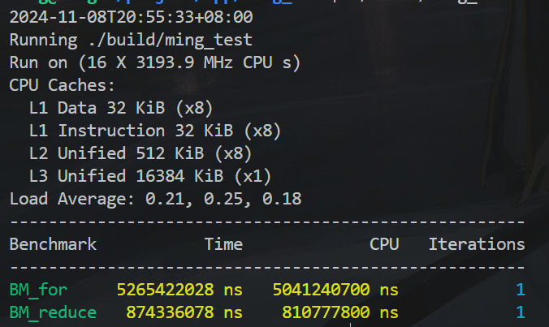

#### 命令行参数

它还接受一些命令行参数来控制测试的输出格式为 csv 等等，你可以调用 --help 查看更多用法。

#### 在CMake中使用： find_package

```cmake
cmake_minimum_required(VERSION 3.10)
project(ming_test)

set(CMAKE_CXX_STANDARD 14)

# 找到 benchmark 库
find_package(benchmark REQUIRED)

add_executable(ming_test src/main.cpp)

# 链接 benchmark 库
target_link_libraries(ming_test benchmark::benchmark)
```

#### 作为项目子模块

拉取 benchmark 到自己的项目

```shell
git clone https://github.com/google/benchmark.git --depth=1
```

烦人的地方在于 ，辣鸡Google非要默认开启tests，导致需要去寻找googletest，妨碍了我们作为子模块使用。

```cmake
set(BENCHMARK_ENABLE_TESTING OFF CACHE BOOL "Turn off the fking test!")
add_subdirectory(benchmark)
target_link_libraries(main PUBLIC benchmark)
```

- 单方面宣布：一切默认开启tests，docs构建目标的cmake项目，有病啊！

## 第四章：任务域与嵌套

### 任务域：tbb::task_arena

- 翻译为竞技场

`task_arena` 的主要功能

1. **控制并行度**：可以通过 `task_arena` 设置任务的并行度，指定可以并行执行的最大线程数。
2. **任务执行域**：任务会在指定的线程池中执行，这让你能够控制任务在哪些线程上运行，而不是使用全局默认线程池。
3. **显式任务管理**：通过 `task_arena`，可以将任务安排到特定的执行域，并精确控制任务的执行，避免过度分配线程或者不必要的线程切换。

```cpp
#include <tbb/parallel_for.h>
#include <tbb/task_arena.h>

#include <cmath>
#include <iostream>
#include <vector>

int main() {
  size_t n = 1 << 26;
  std::vector<float> a(n);

  tbb::task_arena ta;
  ta.execute([&] {
    tbb::parallel_for((size_t)0, (size_t)n,
                      [&](size_t i) { a[i] = std::sin(i); });
  });

  return 0;
}
```

### 指定线程数量

```cpp
#include <tbb/parallel_for.h>
#include <tbb/task_arena.h>

#include <cmath>
#include <iostream>
#include <vector>

int main() {
  size_t n = 1 << 26;
  std::vector<float> a(n);

  tbb::task_arena ta(4);	// 指定使用4个线程
  ta.execute([&] {
    tbb::parallel_for((size_t)0, (size_t)n,
                      [&](size_t i) { a[i] = std::sin(i); });
  });

  return 0;
}
```

### 嵌套 for 循环

当你的外层循环数量非常小，小于物理核心数量时，就可能无法充分利用所有的线程。在这种情况下，启动线程的开销可能会抵消并行计算的收益。

这时就可以考虑再加一层嵌套的for循环，再次拆分任务的粒度，此时TBB仍然可以对内层的任务进行并行化处理。

```cpp
#include <tbb/parallel_for.h>

#include <cmath>
#include <iostream>
#include <vector>

int main() {
  size_t n = 1 << 13;
  std::vector<float> a(n * n);

  tbb::parallel_for((size_t)0, (size_t)n, [&](size_t i) {
    tbb::parallel_for((size_t)0, (size_t)n, [&](size_t j) {
      a[i * n + j] = std::sin(i) * std::sin(j);
    });
  });

  return 0;
}
```

### 嵌套 for 循环：死锁问题

我们试着运行一下下面的代码，看看是否出现了死锁现象。

```cpp
#include <tbb/parallel_for.h>
#include <tbb/task_arena.h>

#include <cmath>
#include <iostream>
#include <mutex>
#include <vector>

int main() {
  size_t n = 1 << 13;
  std::vector<float> a(n * n);
  std::mutex mtx;

  tbb::parallel_for((size_t)0, (size_t)n, [&](size_t i) {
    std::lock_guard lck(mtx);
    tbb::task_arena ta;
    ta.execute([&] {
      tbb::parallel_for((size_t)0, (size_t)n, [&](size_t j) {
        a[i * n + j] = std::sin(i) * std::sin(j);
      });
    });
  });

  return 0;
}
```

对于每次外层循环来说，这一次的循环体执行结束，lock_guard lck就会自动释放销毁，再次进入循环体才会加锁，为什么还是出现了死锁呢？

### 死锁问题的原因

因为 TBB 用了**工作窃取法**来分配任务：当一个线程 t1 做完自己队列里全部的工作时，会从另一个工作中线程 t2 的队列里取出任务，以免 t1 闲置浪费时间。

因此内部 for 循环有可能“窃取”到另一个外部 for 循环的任务，从而导致 mutex 被重复上锁。

- 假设线程 `t1` 在执行外层循环任务时锁住了 `mtx`。如果线程 `t2`（在不同的处理器核心上）已经完成了自己的外层循环任务，它可能会窃取来自 `t1` 的内层任务。内层任务的窃取会导致 `t2` 在执行过程中试图访问和修改外层任务的共享资源（即 `mutex`），从而可能引发 **重复加锁**（re-locking）的问题。线程 `t2` 会因为 `mtx` 锁定被阻塞，而外层任务的线程 `t1` 也无法继续释放锁，最终导致死锁。

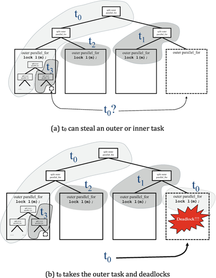

### 解决1：使用标准库的递归锁 std::recursive_mutex

针对上面这种自己给自己上锁导致的死锁，我们就知道应该使用递归锁解决。

```cpp
#include <tbb/parallel_for.h>

#include <cmath>
#include <iostream>
#include <mutex>
#include <vector>

int main() {
  size_t n = 1 << 13;
  std::vector<float> a(n * n);
  std::recursive_mutex mtx;

  tbb::parallel_for((size_t)0, (size_t)n, [&](size_t i) {
    std::lock_guard lck(mtx);
    tbb::parallel_for((size_t)0, (size_t)n, [&](size_t j) {
      a[i * n + j] = std::sin(i) * std::sin(j);
    });
  });

  return 0;
}
```

### 解决2：创建另一个任务域，不同域之间不会窃取工作

```cpp
#include <tbb/parallel_for.h>
#include <tbb/task_arena.h>

#include <cmath>
#include <iostream>
#include <mutex>
#include <vector>

int main() {
  size_t n = 1 << 13;
  std::vector<float> a(n * n);
  std::mutex mtx;

  tbb::parallel_for((size_t)0, (size_t)n, [&](size_t i) {
    std::lock_guard lck(mtx);
    tbb::task_arena ta;
    ta.execute([&] {
      tbb::parallel_for((size_t)0, (size_t)n, [&](size_t j) {
        a[i * n + j] = std::sin(i) * std::sin(j);
      });
    });
  });

  return 0;
}
```

### 解决3：同一个任务域，但是用 isolate 隔离，禁止其内部工作被窃取（推荐）

```cpp
#include <tbb/parallel_for.h>
#include <tbb/task_arena.h>

#include <cmath>
#include <iostream>
#include <mutex>
#include <vector>

int main() {
  size_t n = 1 << 13;
  std::vector<float> a(n * n);
  std::mutex mtx;

  tbb::parallel_for((size_t)0, (size_t)n, [&](size_t i) {
    std::lock_guard lck(mtx);
    tbb::this_task_arena::isolate([&] {
      tbb::parallel_for((size_t)0, (size_t)n, [&](size_t j) {
        a[i * n + j] = std::sin(i) * std::sin(j);
      });
    });
  });

  return 0;
}
```

## 第五章：任务分配

### 并行：如何均匀分配任务到每个线程？

对于并行计算，通常都是 CPU 有几个核心就开几个线程，因为我们只要同时执行就行了嘛。

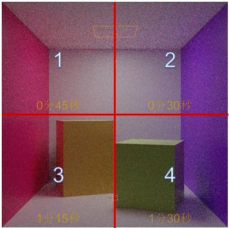

比如 cornell box 这个例子里，我们把图片均匀等分为四块处理。然而发现4号线程所在的块，由于在犄角旮旯里光线反弹的次数多，算得比其他块的慢，而有的块却算得快。但是因为木桶原理，最后花的时间由最慢的那个线程决定，因此变成1分30秒了，多出来的30秒里1号和2号核心在闲置着，因为任务简单已经算完了，只有4号核心一个人在处理额外的光线。

### 解决1：线程数量超过CPU核心数量，让系统调度保证各个核心始终饱和

因此，最好不是按照图像大小均匀等分，而是按照工作量大小均匀等分。然而工作量大小我们没办法提前知道……怎么办？

最简单的办法：只需要让线程数量超过CPU核心数量，这时操作系统会自动启用时间片轮换调度，轮流执行每个线程。

比如这里分配了16个线程，但是只有4个处理器核心。那么就会先执行1,2,3,4号线程，一段时间后自动切换到5,6,7,8线程。当一个线程退出时候，系统就不会再调度到他上去了，从而保证每个核心始终有事可做。

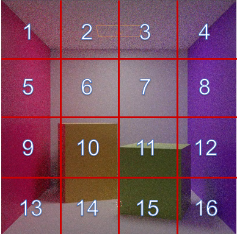

### 解决2：线程数量不变，但是用一个队列分发和认领任务

但是线程数量太多会造成调度的 overhead。

所以另一种解法是：我们仍是分配4个线程，但还是把图像切分为16份，作为一个“任务”推送到全局队列里去。每个线程空闲时会不断地从那个队列里取出数据，即“认领任务”。然后执行，执行完毕后才去认领下一个任务，从而即使每个任务工作量不一也能自动适应。

这种技术又称为线程池（thread pool），避免了线程需要保存上下文的开销。但是需要我们管理一个任务队列，而且要是线程安全的队列。

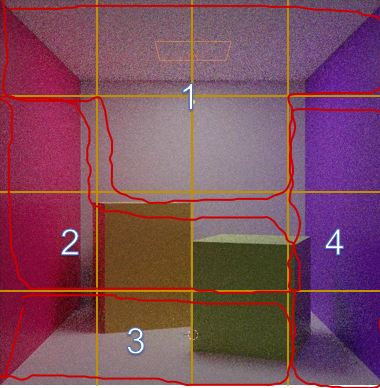

### 解决3：每个线程一个任务队列，做完本职工作后可以认领其他线程的任务

原始的单一任务队列：

上面讲的这种使用一个全局队列会出现这种问题：某个线程已经闲置了，但是工作队列没有推入数据，就导致了空等造成浪费。

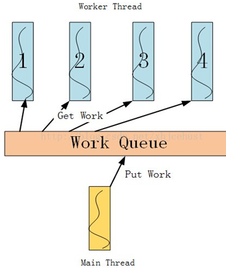

工作窃取法（work-straling）：

为解决上面的问题，就出现了TBB的这种工作窃取方法，对每个线程都有一个队列，如果当前线程的任务队列空了，它就会去窃取其他线程的任务队列

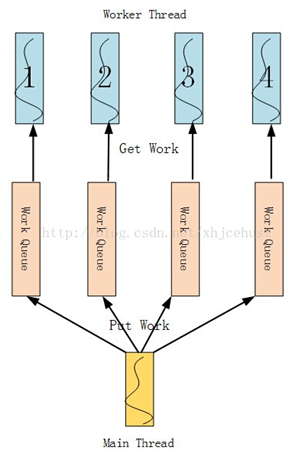

### 解决4：随机分配法（通过哈希函数或线性函数）

然而队列的实现较复杂且需要同步机制，还是有一定的 overhead，因此另一种神奇的解法是：

我们仍是分配4个线程，但还是把图像切分为16份。然后规定每一份按照 xy 轴坐标位置编号，比如 (1,3) 等。

把 (x,y) 那一份，分配给 (x + y * 3) % 4 号线程。这样总体来看每个线程分到的块的位置是随机的，从而由于正太分布**数量越大方差越小**的特点，每个线程分到的总工作量大概率是均匀的。

GPU 上称为网格跨步循环（grid-stride loop）

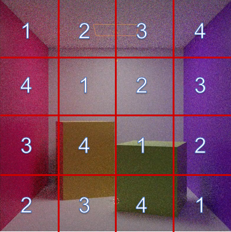

### 分区器

**分区器**（Partitioner）是用于将工作（任务）划分成多个子任务的策略。

TBB 提供了以下几种常用的分区器类型：

#### 2.1 **tbb::auto_partitioner（默认）**

- **描述**：`auto_partitioner` 是 **自动分配任务** 的分区器，它会根据线程的负载情况自动调整任务的分配。该分区器会动态调整任务**粒度**，避免某些线程因为任务量过大而空闲。
- **适用场景**：当任务之间的计算量差异较大时，`auto_partitioner` 会自动调整，以确保工作负载均匀分配。它是 TBB 中默认使用的分区器。
- **优点**：
  - 动态调整任务粒度，适应任务的负载不均匀的情况。
  - 适合任务之间的工作量差异较大的情况。
- **缺点**：
  - 由于需要动态计算负载，可能会引入额外的调度开销。

```cpp
#include <tbb/parallel_for.h>

#include <cmath>
#include <iostream>
#include <thread>
#include <vector>

#include "mtprint.h"
#include "ticktock.h"

int main() {
  size_t n = 32;

  tbb::task_arena ta(4);
  ta.execute([&] {
    tbb::parallel_for(
        tbb::blocked_range<size_t>(0, n),
        [&](tbb::blocked_range<size_t> r) {
          mtprint("thread", tbb::this_task_arena::current_thread_index(),
                  "size", r.size());
          std::this_thread::sleep_for(std::chrono::milliseconds(400));
        },
        tbb::auto_partitioner{});
  });

  return 0;
}
// thread 0 size 1
// thread 2 size 1
// thread 1 size 1
// thread 3 size 1
// thread 1 size 1
// thread 0 size 1
// thread 3 size 1
// thread 2 size 1
// thread 1 size 1
// thread 0 size 1
// thread 3 size 1
// thread 2 size 1
// thread 1 size 1
// thread 0 size 1
// thread 3 size 1
// thread 2 size 1
// thread 1 size 1
// thread 0 size 1
// thread 3 size 1
// thread 2 size 1
// thread 1 size 1
// thread 0 size 1
// thread 3 size 1
// thread 2 size 1
// thread 1 size 1
// thread 0 size 1
// thread 3 size 1
// thread 2 size 1
// thread 1 size 1
// thread 0 size 1
// thread 3 size 1
// thread 2 size 1
```

#### 2.2 **tbb::static_partitioner**

- **描述**：`static_partitioner` 是 **静态分配任务** 的分区器，它会将任务均匀地分配给各个线程，任务分配在开始时就已经完成，之后不会再变化。
- **适用场景**：适用于任务粒度均匀、负载平衡良好的场景。例如，执行简单的数学运算，每个任务的执行时间差不多。
- **优点**：
  - 没有额外的调度开销，因为任务的划分是静态的，线程一开始就知道自己要处理哪些任务。
  - 适合负载均匀的任务。
- **缺点**：
  - 不适合任务执行时间差异大(**不均匀**)的场景，因为任务划分在执行时无法动态调整。
  - 即会出现最终消耗时间由耗时最长的线程决定

指定区间的粒度之后，会静态计算启动的线程数量

```cpp
#include <tbb/parallel_for.h>

#include <cmath>
#include <iostream>
#include <thread>
#include <vector>

#include "mtprint.h"
#include "ticktock.h"

int main() {
  size_t n = 32;

  tbb::task_arena ta(4);
  ta.execute([&] {
    tbb::parallel_for(
        tbb::blocked_range<size_t>(0, n, 16),  // 不指定则粒度默认为1, 指定粒度为16
        [&](tbb::blocked_range<size_t> r) {
          mtprint("thread", tbb::this_task_arena::current_thread_index(),
                  "size", r.size());
          std::this_thread::sleep_for(std::chrono::milliseconds(400));
        },
        tbb::static_partitioner{});
  });

  return 0;
}
// 不指定粒度：
// thread 0 size 8
// thread 2 size 8
// thread 1 size 8
// thread 3 size 8
// 指定粒度为16：
// thread 0 size 16
// thread 1 size 16
```

#### 2.3 **tbb::dynamic_partitioner**

- **描述**：`dynamic_partitioner` 会将任务动态地分配给线程，它会根据线程的空闲情况将剩余的任务分配给空闲的线程。任务在执行过程中可以根据工作负载的情况调整任务的划分。
- **适用场景**：适用于任务之间执行时间差异较大的情况，例如，某些任务可能非常快，而其他任务可能很慢。`dynamic_partitioner` 会把慢任务分配给更多的线程，而把快任务分配给少数线程，从而平衡负载。
- **优点**：
  - 能够动态调整任务划分，适应不同的任务执行时间，保持线程之间的负载均衡。
- **缺点**：
  - 需要动态调度，可能会带来一些额外的开销。

#### 2.4 **tbb::simple_partitioner**

- **描述**：`simple_partitioner` 是一种简单的分区器，它按照给定的区间将任务划分成固定的块，并将每个块分配给一个线程。该分区器不进行任务的动态调整，只是简单地根据任务数量等分。
- **适用场景**：适用于任务量较少、任务执行时间均匀的情况，不需要动态调度的场景。
- **优点**：
  - 简单直接，适合简单任务的并行化。
  - **用于循环体不均匀的情况效果很好**
- **缺点**：
  - 无法处理负载不均的情况，可能导致某些线程任务量过多，影响性能。

也可以根据指定区间的粒度控制启动线程的数量和每个线程的任务：

```cpp
#include <tbb/parallel_for.h>

#include <cmath>
#include <iostream>
#include <thread>
#include <vector>

#include "mtprint.h"
#include "ticktock.h"

int main() {
  size_t n = 32;

    TICK(for);
    tbb::task_arena ta(4);
    ta.execute([&] {
      tbb::parallel_for(
          tbb::blocked_range<size_t>(0, n, 4),  // 指定粒度为4
          [&](tbb::blocked_range<size_t> r) {
            for (size_t i = r.begin(); i < r.end(); i++) {
              mtprint("thread", tbb::this_task_arena::current_thread_index(),
                      "size", r.size(), "begin", r.begin());
              std::this_thread::sleep_for(std::chrono::milliseconds(i * 10));
            }
          },
          tbb::simple_partitioner{});
    });
    TOCK(for);

    return 0;
}

// 不指定粒度：（生成4个线程，32个任务(粒度默认为1)，每个任务包含1个元素）
// thread 0 size 1 begin 0
// thread 0 size 1 begin 1
// thread 1 size 1 begin 16
// thread 2 size 1 begin 8
// thread 3 size 1 begin 12
// .......
// for: 1.34521s
// 指定粒度为4：（生成4个线程，8个任务(粒度为4)，每个任务包含4个元素）
// thread 0 size 4 begin 0
// thread 0 size 4 begin 0
// thread 1 size 4 begin 16
// thread 3 size 4 begin 12
// thread 2 size 4 begin 8
// .......
// for: 1.56342s
```

#### **tbb::affinity_partitioner**

- **描述**：`affinity_partitioner` 是一种特殊的分区器，用于优化任务与线程的亲和性。它将任务分配到特定的 CPU 核心上执行，旨在减少线程间的上下文切换和缓存失效，进而提高程序的并行效率。`affinity_partitioner` 会根据任务的亲和性尽量确保任务在相同的核心上运行，从而优化缓存使用。
- **适用场景**：适用于任务密集型的计算场景，特别是当任务执行时会频繁访问大量局部数据（如矩阵运算、图像处理等），在这些情况下，保持任务在同一个 CPU 核心上执行可以显著提升缓存的局部性，减少缓存未命中的情况。
- **优点**：
  - **优化 CPU 缓存使用**：通过确保任务在相同的核心上运行，可以更好地利用 CPU 缓存，避免频繁的缓存失效。
  - **减少上下文切换开销**：任务不需要在不同的 CPU 核心之间迁移，降低了上下文切换的成本。
  - **提高并行效率**：对于计算密集型任务，合理地分配任务到特定的 CPU 核心可以提高并行效率，特别是在多核 CPU 环境中。
- **缺点**：
  - **负载不均的风险**：如果某些核心的任务量较多，而其他核心的任务量较少，可能会导致负载不均衡，从而影响性能。
  - **适用范围有限**：适合 CPU 密集型任务，对于 I/O 密集型任务或任务之间有较多依赖的场景不适用。
  - **增加了调度复杂性**：如果任务之间的执行顺序有较多依赖或需要频繁的跨核通信，使用 `affinity_partitioner` 可能不利于性能优化。

记录历史，下次根据经验自动负载均衡，从运行结果可以看到耗费时间是越来越短的

```cpp
#include <tbb/parallel_for.h>

#include <cmath>
#include <iostream>
#include <thread>
#include <vector>

#include "mtprint.h"
#include "ticktock.h"

int main() {
  size_t n = 32;

  tbb::task_arena ta(4);
  ta.execute([&] {
    tbb::affinity_partitioner
        affinity;  // 定义affinity_partitioner对象，用于记录线程的亲和性
    for (int t = 0; t < 10; t++) {
            TICK(for);
            tbb::parallel_for(
                tbb::blocked_range<size_t>(0, n),
                [&](tbb::blocked_range<size_t> r) {
                  for (size_t i = r.begin(); i < r.end(); i++) {
                    for (volatile int j = 0; j < i * 1000; j++);
                  }
                },
                affinity);  // 在这里传入
            TOCK(for);
    }
  });

  return 0;
}
// for: 0.000570198s
// for: 0.000401836s
// for: 0.000300423s
// for: 0.000303649s
// for: 0.000303248s
// for: 0.000306716s
// for: 0.000332905s
// for: 0.000348345s
// for: 0.000300213s
// for: 0.00029885s
```

### 为什么需要手动选择分区器？

**案例：**

分别切换不同分区器、不同粒度进行测试：

```cpp
#include <tbb/parallel_for.h>

#include <cmath>
#include <iostream>
#include <thread>
#include <vector>

#include "mtprint.h"
#include "ticktock.h"

int main() {
  size_t n = 1 << 26;
  std::vector<float> a(n);

    TICK(for);
    tbb::task_arena ta(4);
    ta.execute([&] {
      tbb::parallel_for(
          tbb::blocked_range<size_t>(0, n),
          [&](tbb::blocked_range<size_t> r) {
            for (size_t i = r.begin(); i < r.end(); i++) {
              a[i] = std::sin(i);
            }
          },
          // tbb::simple_partitioner{});  // 默认粒度为1  手动指定粒度为n/8
          tbb::static_partitioner{});  // 粒度自动计算为 n/4
      //   tbb::auto_partitioner{});  // 自动选择粒度
    });
    TOCK(for);

    return 0;
}
// simple_partitioner 默认粒度为1, 效果不好
// for: 4.1108s
// static_partitioner 粒度自动计算为 n/4
// for: 0.275968s
// simple_partitioner 手动指定粒度为 n/8
// for: 0.740011s
// auto_partitioner 自动选择粒度
// for: 0.288501s
```

我们会发现，折腾半天又是调整粒度又是选择分配器的，最终却反倒不如自动选择的结果。（多调整参数进行调试，也是可以很接近最优结果的）

那是不是意味着`simple_partitioner` 这种就过于鸡肋了呢？

当然不是，我们看下面的案例：

**矩阵转置：**

使用默认的 `auto_partitioner`

```cpp
#include <tbb/blocked_range2d.h>
#include <tbb/parallel_for.h>

#include <cmath>
#include <iostream>
#include <thread>
#include <vector>

#include "mtprint.h"
#include "ticktock.h"

int main() {
  size_t n = 1 << 14;
  std::vector<float> a(n * n);
  std::vector<float> b(n * n);

  TICK(transpose);
  tbb::parallel_for(
      tbb::blocked_range2d<size_t>(0, n, 0, n),
      [&](tbb::blocked_range2d<size_t> r) {
        for (size_t i = r.cols().begin(); i < r.cols().end(); i++) {
          for (size_t j = r.rows().begin(); j < r.rows().end(); j++) {
            b[i * n + j] = a[j * n + i];
          }
        }
      });
  TOCK(transpose);

  return 0;
}
// transpose: 0.698496s
```

使用`simple_partitioner`，制定合适的grain大小：

```cpp
#include <tbb/blocked_range2d.h>
#include <tbb/parallel_for.h>

#include <cmath>
#include <iostream>
#include <thread>
#include <vector>

#include "mtprint.h"
#include "ticktock.h"

int main() {
  size_t n = 1 << 14;
  std::vector<float> a(n * n);
  std::vector<float> b(n * n);

  TICK(transpose);
  size_t grain = 16;
  tbb::parallel_for(
      tbb::blocked_range2d<size_t>(0, n, grain, 0, n, grain),
      [&](tbb::blocked_range2d<size_t> r) {
        for (size_t i = r.cols().begin(); i < r.cols().end(); i++) {
          for (size_t j = r.rows().begin(); j < r.rows().end(); j++) {
            b[i * n + j] = a[j * n + i];
          }
        }
      },
      tbb::simple_partitioner{});
  TOCK(transpose);

  return 0;
}
// transpose: 0.211069s
```

- 使用合适的 grain 大小，simple_partitioner 比 auto_partitioner 快 3.31 倍

**原因：**

tbb::simple_partitioner 能够按照给定的粒度大小（grain）将矩阵进行分块。块内部小区域按照常规的两层循环访问以便矢量化，块外部大区域则以类似 **Z** **字型**的曲线遍历，这样能保证每次访问的数据在地址上比较靠近，并且都是最近访问过的，从而已经在缓存里可以直接读写，避免了从主内存读写的超高延迟。

下一篇我们会进一步深入探讨访存优化，详细剖析这个案例。

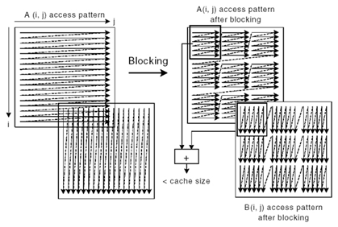

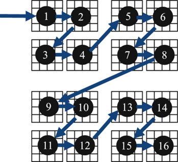

## 第六章：并发容器

### std::vector 扩容时会移动元素

std::vector 内部存储了一个指针，指向一段**容量** **capacity** 大于等于其 size 的内存。

众所周知，push_back 会导致 size 加 1，但当他看到容量 capacity 等于当前 size 时，意识到无法再追加新数据。这时他会重新 malloc 一段更大的连续内存，使得 capacity 变成 size 的**两倍**，并且把旧的数据**移动**过去，然后继续追加数据。

这就导致**前半段的元素的地址被改变**，从而导致之前保存的**指针和迭代器失效**。

```cpp
#include <cmath>
#include <iostream>
#include <vector>

int main() {
  size_t n = 1 << 10;
  std::vector<float> a;
  std::vector<float *> pa(n);

  for (size_t i = 0; i < n; i++) {
    a.push_back(std::sin(i));
    pa[i] = &a.back();
  }

  for (size_t i = 0; i < n; i++) {
    std::cout << (&a[i] == pa[i]) << ' ';
  }
  std::cout << std::endl;

  return 0;
}
// 0 0 0 0 0 0 0 0 0 0 0 0 0 0 0 0 0 0 0 0 0 0 0 0 0 0 0 0 0 0 0 0 0 0 0 0 0 0 0
// 0 0 0 0 0 0 0 0 0 0 0 0 0 0 0 0 0 0 0 0 0 0 0 0 0 0 0 0 0 0 0 0 0 0 0 0 0 0 0
// 0 0 0 0 0 0 0 0 0 0 0 0 0 0 0 0 0 0 0 0 0 0 0 0 0 0 0 0 0 0 0 0 0 0 0 0 0 0 0
// 0 0 0 0 0 0 0 0 0 0 0 0 0 0 0 0 0 0 0 0 0 0 0 0 0 0 0 0 0 0 0 0 0 0 0 0 0 0 0
// 0 0 0 0 0 0 0 0 0 0 0 0 0 0 0 0 0 0 0 0 0 0 0 0 0 0 0 0 0 0 0 0 0 0 0 0 0 0 0
// 0 0 0 0 0 0 0 0 0 0 0 0 0 0 0 0 0 0 0 0 0 0 0 0 0 0 0 0 0 0 0 0 0 0 0 0 0 0 0
// 0 0 0 0 0 0 0 0 0 0 0 0 0 0 0 0 0 0 0 0 0 0 0 0 0 0 0 0 0 0 0 0 0 0 0 0 0 0 0
// 0 0 0 0 0 0 0 0 0 0 0 0 0 0 0 0 0 0 0 0 0 0 0 0 0 0 0 0 0 0 0 0 0 0 0 0 0 0 0
// 0 0 0 0 0 0 0 0 0 0 0 0 0 0 0 0 0 0 0 0 0 0 0 0 0 0 0 0 0 0 0 0 0 0 0 0 0 0 0
// 0 0 0 0 0 0 0 0 0 0 0 0 0 0 0 0 0 0 0 0 0 0 0 0 0 0 0 0 0 0 0 0 0 0 0 0 0 0 0
// 0 0 0 0 0 0 0 0 0 0 0 0 0 0 0 0 0 0 0 0 0 0 0 0 0 0 0 0 0 0 0 0 0 0 0 0 0 0 0
// 0 0 0 0 0 0 0 0 0 0 0 0 0 0 0 0 0 0 0 0 0 0 0 0 0 0 0 0 0 0 0 0 0 0 0 0 0 0 0
// 0 0 0 0 0 0 0 0 0 0 0 0 0 0 0 0 0 0 0 0 0 0 0 0 0 0 0 0 0 0 0 0 0 0 0 0 0 0 0
// 0 0 0 0 0 1 1 1 1 1 1 1 1 1 1 1 1 1 1 1 1 1 1 1 1 1 1 1 1 1 1 1 1 1 1 1 1 1 1
// 1 1 1 1 1 1 1 1 1 1 1 1 1 1 1 1 1 1 1 1 1 1 1 1 1 1 1 1 1 1 1 1 1 1 1 1 1 1 1
// 1 1 1 1 1 1 1 1 1 1 1 1 1 1 1 1 1 1 1 1 1 1 1 1 1 1 1 1 1 1 1 1 1 1 1 1 1 1 1
// 1 1 1 1 1 1 1 1 1 1 1 1 1 1 1 1 1 1 1 1 1 1 1 1 1 1 1 1 1 1 1 1 1 1 1 1 1 1 1
// 1 1 1 1 1 1 1 1 1 1 1 1 1 1 1 1 1 1 1 1 1 1 1 1 1 1 1 1 1 1 1 1 1 1 1 1 1 1 1
// 1 1 1 1 1 1 1 1 1 1 1 1 1 1 1 1 1 1 1 1 1 1 1 1 1 1 1 1 1 1 1 1 1 1 1 1 1 1 1
// 1 1 1 1 1 1 1 1 1 1 1 1 1 1 1 1 1 1 1 1 1 1 1 1 1 1 1 1 1 1 1 1 1 1 1 1 1 1 1
// 1 1 1 1 1 1 1 1 1 1 1 1 1 1 1 1 1 1 1 1 1 1 1 1 1 1 1 1 1 1 1 1 1 1 1 1 1 1 1
// 1 1 1 1 1 1 1 1 1 1 1 1 1 1 1 1 1 1 1 1 1 1 1 1 1 1 1 1 1 1 1 1 1 1 1 1 1 1 1
// 1 1 1 1 1 1 1 1 1 1 1 1 1 1 1 1 1 1 1 1 1 1 1 1 1 1 1 1 1 1 1 1 1 1 1 1 1 1 1
// 1 1 1 1 1 1 1 1 1 1 1 1 1 1 1 1 1 1 1 1 1 1 1 1 1 1 1 1 1 1 1 1 1 1 1 1 1 1 1
// 1 1 1 1 1 1 1 1 1 1 1 1 1 1 1 1 1 1 1 1 1 1 1 1 1 1 1 1 1 1 1 1 1 1 1 1 1 1 1
// 1 1 1 1 1 1 1 1 1 1 1 1 1 1 1 1 1 1 1 1 1 1 1 1 1 1 1 1 1 1 1 1 1 1 1 1 1 1 1
// 1 1 1 1 1 1 1 1 1 1
```


### reserve 预留足够的 capacity

如果预先知道 size 最后会是 n，则可以调用 reserve(n) **预分配**一段大小为 n 的内存，从而 capacity 一开始就等于 n。这样 push_back 就不需要动态扩容，从而避免了元素被移动造成指针和迭代器失效。

```cpp
#include <cmath>
#include <iostream>
#include <vector>

int main() {
  size_t n = 1 << 10;
  std::vector<float> a;
  std::vector<float *> pa(n);

  a.reserve(n);
  for (size_t i = 0; i < n; i++) {
    a.push_back(std::sin(i));
    pa[i] = &a.back();
  }

  for (size_t i = 0; i < n; i++) {
    std::cout << (&a[i] == pa[i]) << ' ';
  }
  std::cout << std::endl;

  return 0;
}
// 1 1 1 1 1 1 1 1 1 1 1 1 1 1 1 1 1 1 1 1 1 1 1 1 1 1 1 1 1 1 1 1 1 1 1 1 1 1 1
// 1 1 1 1 1 1 1 1 1 1 1 1 1 1 1 1 1 1 1 1 1 1 1 1 1 1 1 1 1 1 1 1 1 1 1 1 1 1 1
// 1 1 1 1 1 1 1 1 1 1 1 1 1 1 1 1 1 1 1 1 1 1 1 1 1 1 1 1 1 1 1 1 1 1 1 1 1 1 1
// 1 1 1 1 1 1 1 1 1 1 1 1 1 1 1 1 1 1 1 1 1 1 1 1 1 1 1 1 1 1 1 1 1 1 1 1 1 1 1
// 1 1 1 1 1 1 1 1 1 1 1 1 1 1 1 1 1 1 1 1 1 1 1 1 1 1 1 1 1 1 1 1 1 1 1 1 1 1 1
// 1 1 1 1 1 1 1 1 1 1 1 1 1 1 1 1 1 1 1 1 1 1 1 1 1 1 1 1 1 1 1 1 1 1 1 1 1 1 1
// 1 1 1 1 1 1 1 1 1 1 1 1 1 1 1 1 1 1 1 1 1 1 1 1 1 1 1 1 1 1 1 1 1 1 1 1 1 1 1
// 1 1 1 1 1 1 1 1 1 1 1 1 1 1 1 1 1 1 1 1 1 1 1 1 1 1 1 1 1 1 1 1 1 1 1 1 1 1 1
// 1 1 1 1 1 1 1 1 1 1 1 1 1 1 1 1 1 1 1 1 1 1 1 1 1 1 1 1 1 1 1 1 1 1 1 1 1 1 1
// 1 1 1 1 1 1 1 1 1 1 1 1 1 1 1 1 1 1 1 1 1 1 1 1 1 1 1 1 1 1 1 1 1 1 1 1 1 1 1
// 1 1 1 1 1 1 1 1 1 1 1 1 1 1 1 1 1 1 1 1 1 1 1 1 1 1 1 1 1 1 1 1 1 1 1 1 1 1 1
// 1 1 1 1 1 1 1 1 1 1 1 1 1 1 1 1 1 1 1 1 1 1 1 1 1 1 1 1 1 1 1 1 1 1 1 1 1 1 1
// 1 1 1 1 1 1 1 1 1 1 1 1 1 1 1 1 1 1 1 1 1 1 1 1 1 1 1 1 1 1 1 1 1 1 1 1 1 1 1
// 1 1 1 1 1 1 1 1 1 1 1 1 1 1 1 1 1 1 1 1 1 1 1 1 1 1 1 1 1 1 1 1 1 1 1 1 1 1 1
// 1 1 1 1 1 1 1 1 1 1 1 1 1 1 1 1 1 1 1 1 1 1 1 1 1 1 1 1 1 1 1 1 1 1 1 1 1 1 1
// 1 1 1 1 1 1 1 1 1 1 1 1 1 1 1 1 1 1 1 1 1 1 1 1 1 1 1 1 1 1 1 1 1 1 1 1 1 1 1
// 1 1 1 1 1 1 1 1 1 1 1 1 1 1 1 1 1 1 1 1 1 1 1 1 1 1 1 1 1 1 1 1 1 1 1 1 1 1 1
// 1 1 1 1 1 1 1 1 1 1 1 1 1 1 1 1 1 1 1 1 1 1 1 1 1 1 1 1 1 1 1 1 1 1 1 1 1 1 1
// 1 1 1 1 1 1 1 1 1 1 1 1 1 1 1 1 1 1 1 1 1 1 1 1 1 1 1 1 1 1 1 1 1 1 1 1 1 1 1
// 1 1 1 1 1 1 1 1 1 1 1 1 1 1 1 1 1 1 1 1 1 1 1 1 1 1 1 1 1 1 1 1 1 1 1 1 1 1 1
// 1 1 1 1 1 1 1 1 1 1 1 1 1 1 1 1 1 1 1 1 1 1 1 1 1 1 1 1 1 1 1 1 1 1 1 1 1 1 1
// 1 1 1 1 1 1 1 1 1 1 1 1 1 1 1 1 1 1 1 1 1 1 1 1 1 1 1 1 1 1 1 1 1 1 1 1 1 1 1
// 1 1 1 1 1 1 1 1 1 1 1 1 1 1 1 1 1 1 1 1 1 1 1 1 1 1 1 1 1 1 1 1 1 1 1 1 1 1 1
// 1 1 1 1 1 1 1 1 1 1 1 1 1 1 1 1 1 1 1 1 1 1 1 1 1 1 1 1 1 1 1 1 1 1 1 1 1 1 1
// 1 1 1 1 1 1 1 1 1 1 1 1 1 1 1 1 1 1 1 1 1 1 1 1 1 1 1 1 1 1 1 1 1 1 1 1 1 1 1
// 1 1 1 1 1 1 1 1 1 1 1 1 1 1 1 1 1 1 1 1 1 1 1 1 1 1 1 1 1 1 1 1 1 1 1 1 1 1 1
// 1 1 1 1 1 1 1 1 1 1
```

### 不连续的 tbb::concurrent_vector

std::vector 造成指针失效的根本原因在于他必须保证内存是**连续的**，从而不得不在扩容时移动元素。

因此可以用 tbb::concurrent_vector，他不保证元素在内存中是连续的。换来的优点是 push_back 进去的元素，扩容时不需要移动位置，从而**指针和迭代器不会失效**。

同时他的 push_back 会额外返回一个迭代器（iterator），指向刚刚插入的对象。

```cpp
#include <tbb/concurrent_vector.h>

#include <cmath>
#include <iostream>
#include <vector>

int main() {
  size_t n = 1 << 10;
  tbb::concurrent_vector<float> a;
  std::vector<float *> pa(n);

  for (size_t i = 0; i < n; i++) {
    auto it = a.push_back(std::sin(i));
    pa[i] = &*it;
  }

  for (size_t i = 0; i < n; i++) {
    std::cout << (&a[i] == pa[i]) << ' ';
  }
  std::cout << std::endl;

  return 0;
}
// 1 1 1 1 1 1 1 1 1 1 1 1 1 1 1 1 1 1 1 1 1 1 1 1 1 1 1 1 1 1 1 1 1 1 1 1 1 1 1
// 1 1 1 1 1 1 1 1 1 1 1 1 1 1 1 1 1 1 1 1 1 1 1 1 1 1 1 1 1 1 1 1 1 1 1 1 1 1 1
// 1 1 1 1 1 1 1 1 1 1 1 1 1 1 1 1 1 1 1 1 1 1 1 1 1 1 1 1 1 1 1 1 1 1 1 1 1 1 1
// 1 1 1 1 1 1 1 1 1 1 1 1 1 1 1 1 1 1 1 1 1 1 1 1 1 1 1 1 1 1 1 1 1 1 1 1 1 1 1
// 1 1 1 1 1 1 1 1 1 1 1 1 1 1 1 1 1 1 1 1 1 1 1 1 1 1 1 1 1 1 1 1 1 1 1 1 1 1 1
// 1 1 1 1 1 1 1 1 1 1 1 1 1 1 1 1 1 1 1 1 1 1 1 1 1 1 1 1 1 1 1 1 1 1 1 1 1 1 1
// 1 1 1 1 1 1 1 1 1 1 1 1 1 1 1 1 1 1 1 1 1 1 1 1 1 1 1 1 1 1 1 1 1 1 1 1 1 1 1
// 1 1 1 1 1 1 1 1 1 1 1 1 1 1 1 1 1 1 1 1 1 1 1 1 1 1 1 1 1 1 1 1 1 1 1 1 1 1 1
// 1 1 1 1 1 1 1 1 1 1 1 1 1 1 1 1 1 1 1 1 1 1 1 1 1 1 1 1 1 1 1 1 1 1 1 1 1 1 1
// 1 1 1 1 1 1 1 1 1 1 1 1 1 1 1 1 1 1 1 1 1 1 1 1 1 1 1 1 1 1 1 1 1 1 1 1 1 1 1
// 1 1 1 1 1 1 1 1 1 1 1 1 1 1 1 1 1 1 1 1 1 1 1 1 1 1 1 1 1 1 1 1 1 1 1 1 1 1 1
// 1 1 1 1 1 1 1 1 1 1 1 1 1 1 1 1 1 1 1 1 1 1 1 1 1 1 1 1 1 1 1 1 1 1 1 1 1 1 1
// 1 1 1 1 1 1 1 1 1 1 1 1 1 1 1 1 1 1 1 1 1 1 1 1 1 1 1 1 1 1 1 1 1 1 1 1 1 1 1
// 1 1 1 1 1 1 1 1 1 1 1 1 1 1 1 1 1 1 1 1 1 1 1 1 1 1 1 1 1 1 1 1 1 1 1 1 1 1 1
// 1 1 1 1 1 1 1 1 1 1 1 1 1 1 1 1 1 1 1 1 1 1 1 1 1 1 1 1 1 1 1 1 1 1 1 1 1 1 1
// 1 1 1 1 1 1 1 1 1 1 1 1 1 1 1 1 1 1 1 1 1 1 1 1 1 1 1 1 1 1 1 1 1 1 1 1 1 1 1
// 1 1 1 1 1 1 1 1 1 1 1 1 1 1 1 1 1 1 1 1 1 1 1 1 1 1 1 1 1 1 1 1 1 1 1 1 1 1 1
// 1 1 1 1 1 1 1 1 1 1 1 1 1 1 1 1 1 1 1 1 1 1 1 1 1 1 1 1 1 1 1 1 1 1 1 1 1 1 1
// 1 1 1 1 1 1 1 1 1 1 1 1 1 1 1 1 1 1 1 1 1 1 1 1 1 1 1 1 1 1 1 1 1 1 1 1 1 1 1
// 1 1 1 1 1 1 1 1 1 1 1 1 1 1 1 1 1 1 1 1 1 1 1 1 1 1 1 1 1 1 1 1 1 1 1 1 1 1 1
// 1 1 1 1 1 1 1 1 1 1 1 1 1 1 1 1 1 1 1 1 1 1 1 1 1 1 1 1 1 1 1 1 1 1 1 1 1 1 1
// 1 1 1 1 1 1 1 1 1 1 1 1 1 1 1 1 1 1 1 1 1 1 1 1 1 1 1 1 1 1 1 1 1 1 1 1 1 1 1
// 1 1 1 1 1 1 1 1 1 1 1 1 1 1 1 1 1 1 1 1 1 1 1 1 1 1 1 1 1 1 1 1 1 1 1 1 1 1 1
// 1 1 1 1 1 1 1 1 1 1 1 1 1 1 1 1 1 1 1 1 1 1 1 1 1 1 1 1 1 1 1 1 1 1 1 1 1 1 1
// 1 1 1 1 1 1 1 1 1 1 1 1 1 1 1 1 1 1 1 1 1 1 1 1 1 1 1 1 1 1 1 1 1 1 1 1 1 1 1
// 1 1 1 1 1 1 1 1 1 1 1 1 1 1 1 1 1 1 1 1 1 1 1 1 1 1 1 1 1 1 1 1 1 1 1 1 1 1 1
// 1 1 1 1 1 1 1 1 1 1
```

### grow_by 一次性扩容一定大小

push_back 一次只能推入一个元素。

而 grow_by(n) 则可以一次扩充 n 个元素。他同样是返回一个迭代器（iterator），之后可以通过迭代器的 **++** **运算符**依次访问连续的 n 个元素，***** **运算符**访问当前指向的元素。

```cpp
#include <tbb/concurrent_vector.h>

#include <cmath>
#include <iostream>

int main() {
  size_t n = 1 << 10;
  tbb::concurrent_vector<float> a;

  for (size_t i = 0; i < n; i++) {
    auto it = a.grow_by(2);
    *it++ = std::cos(i);
    *it++ = std::sin(i);
  }

  std::cout << a.size() << std::endl;

  return 0;
}
// 2048
```

### 可安全地被多线程并发访问

除了内存不连续、指针和迭代器不失效的特点，tbb::concurrent_vector 还是一个**多线程安全**的容器，能够被多个线程同时并发地 grow_by 或 push_back 而不出错。

而 std::vector 只有只读的 .size() 和 [] 运算符是安全的，且不能和写入的 push_back 等一起用，否则需要用读写锁保护。

```cpp
#include <tbb/concurrent_vector.h>
#include <tbb/parallel_for.h>

#include <cmath>
#include <iostream>

int main() {
  size_t n = 1 << 10;
  tbb::concurrent_vector<float> a;

  tbb::parallel_for((size_t)0, (size_t)n, [&](size_t i) {
    auto it = a.grow_by(2);
    *it++ = std::cos(i);
    *it++ = std::sin(i);
  });

  std::cout << a.size() << std::endl;

  return 0;
}
```

### 不建议通过索引随机访问

因为 tbb::concurrent_vector **内存不连续**的特点，通过索引访问，比通过迭代器访问的效率低一些。

因此不推荐像 a[i] 这样通过索引随机访问其中的元素，*(it + i) 这样需要迭代器跨步访问的也不推荐。

```cpp
#include <tbb/concurrent_vector.h>
#include <tbb/parallel_for.h>

#include <cmath>
#include <iostream>

int main() {
  size_t n = 1 << 10;
  tbb::concurrent_vector<float> a(n);

  for (size_t i = 0; i < a.size(); i++) {
    a[i] += 1.0f;
  }

  std::cout << a[1] << std::endl;

  return 0;
}

```

### 推荐通过迭代器顺序访问

最好的方式是用 begin() 和 end() 的迭代器区间，按顺序访问。

```cpp
#include <tbb/concurrent_vector.h>
#include <tbb/parallel_for.h>

#include <cmath>
#include <iostream>

int main() {
  size_t n = 1 << 10;
  tbb::concurrent_vector<float> a(n);

  for (auto it = a.begin(); it != a.end(); ++it) {
    *it += 1.0f;
  }

  std::cout << a[1] << std::endl;

  return 0;
}

```

### parallel_for 也支持迭代器

冷知识：tbb::blocked_range 的参数不一定是 size_t，也可以是迭代器表示的区间。

这样 lambda 体内 r 的 begin 和 end 也会返回 tbb::concurrent_vector 的迭代器类型。

第一个 tbb::blocked_range 尖括号里的类型可以省略是因为 C++17 的 CTAD 特性。第二个则是用了 decltype 自动推导，也可以 (auto r)，这里写具体类型仅为演示目的。

```cpp
#include <tbb/concurrent_vector.h>
#include <tbb/parallel_for.h>

#include <cmath>
#include <iostream>

int main() {
  size_t n = 1 << 10;
  tbb::concurrent_vector<float> a(n);

  tbb::parallel_for(tbb::blocked_range(a.begin(), a.end()),
                    [&](tbb::blocked_range<decltype(a.begin())> r) {
                      for (auto it = r.begin(); it != r.end(); ++it) {
                        *it += 1.0f;
                      }
                    });

  std::cout << a[1] << std::endl;

  return 0;
}
```

### TBB 中其他并发容器

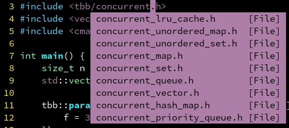

## 第七章：并行筛选

### 筛选（filter）

利用 vector 的 push_back 动态追加数据

筛选出所有大于 0 的 sin(i) 值

```cpp
#include <cmath>
#include <iostream>
#include <vector>

#include "ticktock.h"

int main() {
  size_t n = 1 << 27;
  std::vector<float> a;

  TICK(filter);
  for (size_t i = 0; i < n; i++) {
    float val = std::sin(i);
    if (val > 0) {
      a.push_back(val);
    }
  }
  TOCK(filter);

  return 0;
}
// filter: 2.9021s
```

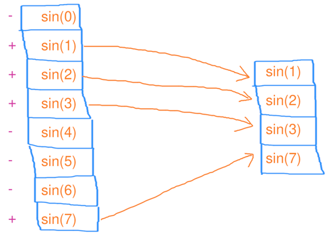

### 并行筛选1

利用多线程安全的 concurrent_vector 动态追加数据

基本没有加速，猜想 concurrent_vector 内部可能用了简单粗暴的互斥量，导致接近串行执行，只保证了安全，并不保证高效

加速比：**1.32** 倍

```cpp
#include <tbb/concurrent_vector.h>
#include <tbb/parallel_for.h>

#include <cmath>
#include <iostream>

#include "ticktock.h"

int main() {
  size_t n = 1 << 27;
  tbb::concurrent_vector<float> a;

  TICK(filter);
  tbb::parallel_for(tbb::blocked_range<size_t>(0, n),
                    [&](tbb::blocked_range<size_t> r) {
                      for (size_t i = r.begin(); i < r.end(); i++) {
                        float val = std::sin(i);
                        if (val > 0) {
                          a.push_back(val);
                        }
                      }
                    });
  TOCK(filter);

  return 0;
}
// filter: 2.19936s
```

### 并行筛选2

先推到线程局部（thread-local）的 vector

最后一次性推入到 concurrent_vector

可以避免频繁在 concurrent_vector 上产生锁竞争

加速比：**5.55** 倍

```cpp
#include <tbb/concurrent_vector.h>
#include <tbb/parallel_for.h>

#include <cmath>
#include <iostream>

#include "ticktock.h"

int main() {
  size_t n = 1 << 27;
  tbb::concurrent_vector<float> a;

  TICK(filter);
  tbb::parallel_for(tbb::blocked_range<size_t>(0, n),
                    [&](tbb::blocked_range<size_t> r) {
                      std::vector<float> local_a;
                      for (size_t i = r.begin(); i < r.end(); i++) {
                        float val = std::sin(i);
                        if (val > 0) {
                          local_a.push_back(val);
                        }
                      }
                      auto it = a.grow_by(local_a.size());
                      for (size_t i = 0; i < local_a.size(); i++) {
                        *it++ = local_a[i];
                      }
                    });
  TOCK(filter);

  return 0;
}
// filter: 0.522576s
```

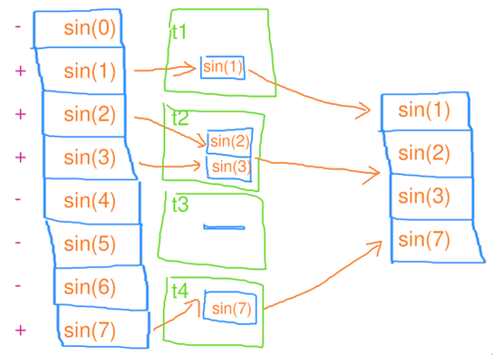

### 并行筛选3

线程局部的 vector 调用 reserve 预先分配一定内存

避免 push_back 反复扩容时的分段式增长

同时利用标准库的 std::copy 模板简化了代码

加速比：**5.94** 倍

```cpp
#include <tbb/concurrent_vector.h>
#include <tbb/parallel_for.h>

#include <cmath>
#include <iostream>

#include "ticktock.h"

int main() {
  size_t n = 1 << 27;
  tbb::concurrent_vector<float> a;

  TICK(filter);
  tbb::parallel_for(tbb::blocked_range<size_t>(0, n),
                    [&](tbb::blocked_range<size_t> r) {
                      std::vector<float> local_a;
                      local_a.reserve(r.size());
                      for (size_t i = r.begin(); i < r.end(); i++) {
                        float val = std::sin(i);
                        if (val > 0) {
                          local_a.push_back(val);
                        }
                      }
                      auto it = a.grow_by(local_a.size());
                      std::copy(local_a.begin(), local_a.end(), it);
                    });
  TOCK(filter);

  return 0;
}
// filter: 0.488392s
```

### 并行筛选4

如果需要筛选后的数据是连续的，即 a 是个 std::vector，这时就需要用 mutex 锁定，避免数据竞争。

加速比：**4.92** 倍

```cpp
#include <tbb/parallel_for.h>

#include <cmath>
#include <iostream>
#include <mutex>
#include <vector>

#include "ticktock.h"

int main() {
  size_t n = 1 << 27;
  std::vector<float> a;
  std::mutex mtx;

  TICK(filter);
  tbb::parallel_for(
      tbb::blocked_range<size_t>(0, n), [&](tbb::blocked_range<size_t> r) {
        std::vector<float> local_a;
        local_a.reserve(r.size());
        for (size_t i = r.begin(); i < r.end(); i++) {
          float val = std::sin(i);
          if (val > 0) {
            local_a.push_back(val);
          }
        }
        std::lock_guard lck(mtx);
        std::copy(local_a.begin(), local_a.end(), std::back_inserter(a));
      });
  TOCK(filter);

  return 0;
}
// filter: 0.589399s
```

### 并行筛选5（推荐方案）

先对 a 预留一定的内存，避免频繁扩容影响性能。

加速比：**5.98** 倍

```cpp
#include <tbb/parallel_for.h>

#include <cmath>
#include <iostream>
#include <mutex>
#include <vector>

#include "ticktock.h"

int main() {
  size_t n = 1 << 27;
  std::vector<float> a;
  std::mutex mtx;

  TICK(filter);
  a.reserve(n * 2 / 3);
  tbb::parallel_for(
      tbb::blocked_range<size_t>(0, n), [&](tbb::blocked_range<size_t> r) {
        std::vector<float> local_a;
        local_a.reserve(r.size());
        for (size_t i = r.begin(); i < r.end(); i++) {
          float val = std::sin(i);
          if (val > 0) {
            local_a.push_back(val);
          }
        }
        std::lock_guard lck(mtx);
        std::copy(local_a.begin(), local_a.end(), std::back_inserter(a));
      });
  TOCK(filter);

  return 0;
}
// filter: 0.484633s
```

### 并行筛选6

使用 tbb::spin_mutex 替代 std::mutex。spin_mutex（基于硬件原子指令）会让 CPU 陷入循环等待，而不像 mutex（操作系统提供调度）会让线程进入休眠状态的等待。

若**上锁的区域较小**，可以用轻量级的 spin_mutex。若上锁的区域很大，则循环等待只会浪费 CPU 时间。这里锁的区域是 std::copy，比较大，所以 spin_mutex 效果不如 mutex 好。

加速比：**5.92** 倍

```cpp
#include <tbb/parallel_for.h>
#include <tbb/spin_mutex.h>

#include <cmath>
#include <iostream>
#include <mutex>
#include <vector>

#include "ticktock.h"

int main() {
  size_t n = 1 << 27;
  std::vector<float> a;
  tbb::spin_mutex mtx;

  TICK(filter);
  a.reserve(n * 2 / 3);
  tbb::parallel_for(
      tbb::blocked_range<size_t>(0, n), [&](tbb::blocked_range<size_t> r) {
        std::vector<float> local_a;
        local_a.reserve(r.size());
        for (size_t i = r.begin(); i < r.end(); i++) {
          float val = std::sin(i);
          if (val > 0) {
            local_a.push_back(val);
          }
        }
        std::lock_guard lck(mtx);
        std::copy(local_a.begin(), local_a.end(), std::back_inserter(a));
      });
  TOCK(filter);

  return 0;
}
// filter: 0.489839s
```

### 并行筛选7

彻底避免了互斥量，完全通过预先准备好的大小，配合 atomic 递增索引批量写入。

同时用小彭老师的 pod 模板类，使得 vector 的 resize **不会零初始化其中的值**。

加速比：**6.26** 倍

```cpp
#pragma once

#include <new>
#include <utility>

template <class T>
struct pod {
 private:
  T m_t;

 public:
  pod() {}

  pod(pod &&p) : m_t(std::move(p.m_t)) {}

  pod(pod const &p) : m_t(p.m_t) {}

  pod &operator=(pod &&p) {
    m_t = std::move(p.m_t);
    return *this;
  }

  pod &operator=(pod const &p) {
    m_t = p.m_t;
    return *this;
  }

  pod(T &&t) : m_t(std::move(t)) {}

  pod(T const &t) : m_t(t) {}

  pod &operator=(T &&t) {
    m_t = std::move(t);
    return *this;
  }

  pod &operator=(T const &t) {
    m_t = t;
    return *this;
  }

  operator T const &() const { return m_t; }

  operator T &() { return m_t; }

  T const &get() const { return m_t; }

  T &get() { return m_t; }

  template <class... Ts>
  pod &emplace(Ts &&...ts) {
    ::new (&m_t) T(std::forward<Ts>(ts)...);
    return *this;
  }

  void destroy() { m_t.~T(); }
};
```

```cpp
#include <tbb/parallel_for.h>

#include <atomic>
#include <cmath>
#include <iostream>
#include <vector>

#include "pod.h"
#include "ticktock.h"

int main() {
  size_t n = 1 << 27;
  std::vector<pod<float>> a;
  std::atomic<size_t> a_size = 0;

  TICK(filter);
  a.resize(n);
  tbb::parallel_for(tbb::blocked_range<size_t>(0, n),
                    [&](tbb::blocked_range<size_t> r) {
                      std::vector<pod<float>> local_a(r.size());
                      size_t lasize = 0;
                      for (size_t i = r.begin(); i < r.end(); i++) {
                        float val = std::sin(i);
                        if (val > 0) {
                          local_a[lasize++] = val;
                        }
                      }
                      size_t base = a_size.fetch_add(lasize);
                      for (size_t i = 0; i < lasize; i++) {
                        a[base + i] = local_a[i];
                      }
                    });
  a.resize(a_size);
  TOCK(filter);

  return 0;
}
// filter: 0.4638s
```

### 并行筛选8（不推荐）

而是用 std::vector 作为 parallel_reduce 的元素类型，通过合并得出最终结果，也是可以的。很直观，可惜加速效果不好。

加速比：**2.04** 倍

```cpp
#include <tbb/blocked_range.h>
#include <tbb/parallel_reduce.h>

#include <cmath>
#include <iostream>

#include "ticktock.h"

int main() {
  size_t n = 1 << 27;

  TICK(filter);
  tbb::parallel_reduce(
      tbb::blocked_range<size_t>(0, n), std::vector<float>{},
      [&](tbb::blocked_range<size_t> r, std::vector<float> local_a) {
        local_a.reserve(local_a.size() + r.size());
        for (size_t i = r.begin(); i < r.end(); i++) {
          float val = std::sin(i);
          if (val > 0) {
            local_a.push_back(val);
          }
        }
        return local_a;
      },
      [](std::vector<float> a, std::vector<float> const &b) {
        std::copy(b.begin(), b.end(), std::back_inserter(a));
        return a;
      });
  TOCK(filter);

  return 0;
}
// filter: 1.41979s
```

### 并行筛选9（用于GPU）

线程粒度很细，核心数量很多的 GPU，往往没办法用 concurrent_vector 和 thread-local vector。或是你需要保证**筛选前后顺序不变**。这时要把筛选分为三步：

- 一、算出每个元素需要往 vector 推送数据的数量（本例中只有 0 和 1 两种可能）
- 二、对刚刚算出的数据进行并行扫描（scan），得出每个 i 要写入的索引。
- 三、再次对每个元素并行 for 循环，根据刚刚生成写入的索引，依次写入数据。

加速比：**4.50** 倍（考虑到这里 ind 只有 0 和 1，应该大有优化空间）

```cpp
#include <tbb/parallel_for.h>
#include <tbb/parallel_scan.h>

#include <cmath>
#include <iostream>

#include "pod.h"
#include "ticktock.h"

int main() {
  size_t n = 1 << 27;

  TICK(filter);

  TICK(init);
  std::vector<pod<float>> a(n);
  tbb::parallel_for(tbb::blocked_range<size_t>(0, n),
                    [&](tbb::blocked_range<size_t> r) {
                      for (size_t i = r.begin(); i < r.end(); i++) {
                        a[i] = std::sin(i);
                      }
                    });
  TOCK(init);

  TICK(scan);
  std::vector<pod<size_t>> ind(n + 1);
  ind[0] = 0;
  tbb::parallel_scan(
      tbb::blocked_range<size_t>(0, n), (size_t)0,
      [&](tbb::blocked_range<size_t> r, size_t sum, auto is_final) {
        for (auto i = r.begin(); i < r.end(); i++) {
          sum += a[i] > 0 ? 1 : 0;
          if (is_final) ind[i + 1] = sum;
        }
        return sum;
      },
      [](size_t x, size_t y) { return x + y; });
  TOCK(scan);

  TICK(fill);
  std::vector<pod<float>> b(ind.back());
  tbb::parallel_for(tbb::blocked_range<size_t>(0, n),
                    [&](tbb::blocked_range<size_t> r) {
                      for (size_t i = r.begin(); i < r.end(); i++) {
                        if (a[i] > 0) b[ind[i]] = a[i];
                      }
                    });
  TOCK(fill);

  TOCK(filter);

  return 0;
}
// filter: 0.645337s
```

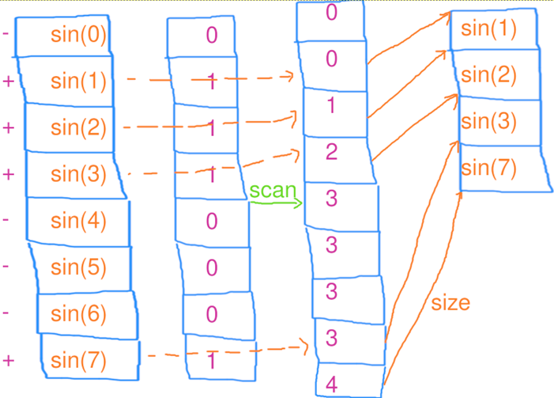

## 第八章：分治与排序

### 斐波那契数列第n项

常规递归方法：

```cpp
#include <cmath>
#include <cstdlib>
#include <iostream>

#include "ticktock.h"

int fib(int n) {
  if (n < 2) return n;
  int first = fib(n - 1);
  int second = fib(n - 2);
  return first + second;
}

int main() {
  TICK(fib);
  std::cout << fib(39) << std::endl;
  TOCK(fib);
  return 0;
}
// 267914296
// fib: 0.454915s
```

### 斐波那契数列第n项：并行

有的同学看到上面的这部分是独立求值的：

```cpp
  int first = fib(n - 1);
  int second = fib(n - 2);
```

就会想到，是不是可以用`task_group`把这里同时执行呢

```cpp
#include <tbb/task_group.h>

#include <cmath>
#include <cstdlib>
#include <iostream>

#include "ticktock.h"

int fib(int n) {
  if (n < 2) return n;
  int first, second;
  tbb::task_group tg;
  tg.run([&] { first = fib(n - 1); });
  tg.run([&] { second = fib(n - 2); });
  tg.wait();
  return first + second;
}

int main() {
  TICK(fib);
  std::cout << fib(39) << std::endl;
  TOCK(fib);
  return 0;
}
// 63245986
// fib: 3.67793s
```

可以看到这里反而变慢了！

这是因为这个例子中，任务创建、任务调度和同步的开销可能大于并行化带来的收益，特别是当递归层次非常深时。

斐波那契数列的递归调用有很多非常小的子任务，导致并行粒度过细。在这种情况下，调度的开销就可能超出并行计算的收益。并行化的优势通常在于更大的任务和更少的调度开销，但在递归深度很大、任务非常细小时，并行化可能会因为任务管理的额外开销反而导致性能下降。

并且如果任务数量很多，而系统的 CPU 核心并不够用，那么线程会频繁进行上下文切换，导致性能下降。此外，调度器需要在多个线程间共享数据，这可能引起竞争，进一步加剧性能损失。

`tbb::task_group` 在执行多个任务时需要调用 `tg.wait()` 来确保所有任务完成。这个过程涉及额外的同步开销，特别是对于递归类型的任务，管理任务的生命周期会增加开销。

### tbb::parallel_invoke：tbb::task_group 的封装

- 更高效的调度和同步机制；

- 更少的任务创建和上下文切换；

- 更适合小规模并行任务（如 `fib(n-1)` 和 `fib(n-2)` 这类并行任务）。

```cpp
#include <tbb/parallel_invoke.h>

#include <cmath>
#include <cstdlib>
#include <iostream>

#include "ticktock.h"

int fib(int n) {
  if (n < 2) return n;
  int first, second;
  tbb::parallel_invoke([&] { first = fib(n - 1); },
                       [&] { second = fib(n - 2); });
  return first + second;
}

int main() {
  TICK(fib);
  std::cout << fib(39) << std::endl;
  TOCK(fib);
  return 0;
}
// 63245986
// fib: 2.64342s
```

进行封装后的并行稍微快了一些，但还是不如串行的速度。

### 任务划分得够细时，转为串行，缓解调度负担（scheduling overhead）

因为当任务足够细时，TBB调度管理线程的负担已经大于了并行计算节省的时间

这种技术被称为**cut-off 技术**（也称为 **cutoff threshold** 或 **granularity threshold**）

- 是一种常用的优化方法，特别是在递归算法中。它的目的是在任务递归划分到一定粒度之后，停止进一步的分解，而直接执行计算。这可以防止在任务的创建和调度过程中产生过多的小任务，从而减少系统开销，提高性能。

```cpp
#include <tbb/parallel_invoke.h>

#include <cmath>
#include <cstdlib>
#include <iostream>

#include "ticktock.h"

int serial_fib(int n) {
  if (n < 2) return n;
  int first = serial_fib(n - 1);
  int second = serial_fib(n - 2);
  return first + second;
}

int fib(int n) {
  if (n < 29) return serial_fib(n);
  int first, second;
  tbb::parallel_invoke([&] { first = fib(n - 1); },
                       [&] { second = fib(n - 2); });
  return first + second;
}

int main() {
  TICK(fib);
  std::cout << fib(39) << std::endl;
  TOCK(fib);
  return 0;
}
```

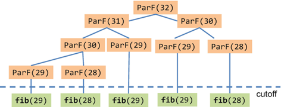

### 标准库提供的排序

```cpp
#include <algorithm>
#include <cmath>
#include <cstdlib>
#include <iostream>
#include <vector>

#include "ticktock.h"

int main() {
  size_t n = 1 << 24;
  std::vector<int> arr(n);
  std::generate(arr.begin(), arr.end(), std::rand);
  TICK(std_sort);
  std::sort(arr.begin(), arr.end(), std::less<int>{});
  TOCK(std_sort);
  return 0;
}
// std_sort: 1.03273s
```

### 快速排序

自己实现一个快速排序，可以看到它是一个递归函数。（递归都可以对它进行并行）

```cpp
#include <algorithm>
#include <cmath>
#include <cstdlib>
#include <iostream>
#include <vector>

#include "ticktock.h"

template <class T>
void quick_sort(T *data, size_t size) {
  if (size < 1) return;
  size_t mid = std::hash<size_t>{}(size);
  mid ^= std::hash<void *>{}(static_cast<void *>(data));
  mid %= size;
  std::swap(data[0], data[mid]);
  T pivot = data[0];
  size_t left = 0, right = size - 1;
  while (left < right) {
    while (left < right && !(data[right] < pivot)) right--;
    if (left < right) data[left++] = data[right];
    while (left < right && data[left] < pivot) left++;
    if (left < right) data[right--] = data[left];
  }
  data[left] = pivot;
  quick_sort(data, left);
  quick_sort(data + left + 1, size - left - 1);
}

int main() {
  size_t n = 1 << 24;
  std::vector<int> arr(n);
  std::generate(arr.begin(), arr.end(), std::rand);
  TICK(quick_sort);
  quick_sort(arr.data(), arr.size());
  TOCK(quick_sort);
  return 0;
}
```

std::hash 用于从输入生成随机数，输入不变则结果不变。

随机枢轴的位置防止数据已经有序造成最坏的 O(n²)。

### 并行快速排序

可以观察到，上面的quick_sort在最后递归调用了两次自己，并且他们使用的数据并没有交集。

```cpp
quick_sort(data, left);
quick_sort(data + left + 1, size - left - 1);
```

我们马上可以想到使用`parallel_invoke`分别在两个线程上启动它们

（和刚刚手写的快速排序）加速比：**2.05** 倍

```cpp
#include <tbb/parallel_invoke.h>

#include <algorithm>
#include <cmath>
#include <cstdlib>
#include <iostream>
#include <vector>

#include "ticktock.h"

template <class T>
void quick_sort(T *data, size_t size) {
  if (size < 1) return;
  size_t mid = std::hash<size_t>{}(size);
  mid ^= std::hash<void *>{}(static_cast<void *>(data));
  mid %= size;
  std::swap(data[0], data[mid]);
  T pivot = data[0];
  size_t left = 0, right = size - 1;
  while (left < right) {
    while (left < right && !(data[right] < pivot)) right--;
    if (left < right) data[left++] = data[right];
    while (left < right && data[left] < pivot) left++;
    if (left < right) data[right--] = data[left];
  }
  data[left] = pivot;
  tbb::parallel_invoke([&] { quick_sort(data, left); },
                       [&] { quick_sort(data + left + 1, size - left - 1); });
}

int main() {
  size_t n = 1 << 24;
  std::vector<int> arr(n);
  std::generate(arr.begin(), arr.end(), std::rand);
  TICK(parallel_sort);
  quick_sort(arr.data(), arr.size());
  TOCK(parallel_sort);
  return 0;
}
// parallel_sort: 0.643069s
```

### 改进：数据足够小时，开始用标准库串行的排序

根据前边的经验，当任务足够小时，我们就直接使用标准库中串行版本的sort

（和标准库串行的 std::sort）加速比：**4.59** 倍

```cpp
#include <tbb/parallel_invoke.h>

#include <algorithm>
#include <cmath>
#include <cstdlib>
#include <iostream>
#include <vector>

#include "ticktock.h"

template <class T>
void quick_sort(T *data, size_t size) {
  if (size < 1) return;
  if (size < (1 << 16)) {
    std::sort(data, data + size, std::less<T>{});
    return;
  }
  size_t mid = std::hash<size_t>{}(size);
  mid ^= std::hash<void *>{}(static_cast<void *>(data));
  mid %= size;
  std::swap(data[0], data[mid]);
  T pivot = data[0];
  size_t left = 0, right = size - 1;
  while (left < right) {
    while (left < right && !(data[right] < pivot)) right--;
    if (left < right) data[left++] = data[right];
    while (left < right && data[left] < pivot) left++;
    if (left < right) data[right--] = data[left];
  }
  data[left] = pivot;
  tbb::parallel_invoke([&] { quick_sort(data, left); },
                       [&] { quick_sort(data + left + 1, size - left - 1); });
}

int main() {
  size_t n = 1 << 24;
  std::vector<int> arr(n);
  std::generate(arr.begin(), arr.end(), std::rand);
  TICK(better_parallel_sort);
  quick_sort(arr.data(), arr.size());
  TOCK(better_parallel_sort);
  return 0;
}
// better_parallel_sort: 0.22504s
```

### 封装好的：tbb::parallel_sort

（和标准库串行的 std::sort）加速比：**4.80** 倍

```cpp
#include <tbb/parallel_sort.h>

#include <algorithm>
#include <cmath>
#include <cstdlib>
#include <iostream>
#include <vector>

#include "ticktock.h"

int main() {
  size_t n = 1 << 24;
  std::vector<int> arr(n);
  std::generate(arr.begin(), arr.end(), std::rand);
  TICK(tbb_parallel_sort);
  tbb::parallel_sort(arr.begin(), arr.end(), std::less<int>{});
  TOCK(tbb_parallel_sort);
  return 0;
}
```

### 重新认识改进的并行缩并

其实之前提到“改进后的并行缩并”，也是一种分治法的思想：大问题一分为二变成小问题，分派到各个CPU核心上，问题足够小时直接串行求解。

它也可以通过 parallel_invoke 分治来实现：

```cpp
#include <tbb/parallel_invoke.h>

#include <algorithm>
#include <cmath>
#include <cstdlib>
#include <iostream>
#include <numeric>
#include <vector>

#include "ticktock.h"

template <class T>
T quick_reduce(T *data, size_t size) {
  if (size < (1 << 16)) {
    return std::reduce(data, data + size);	// 这里也是用了cut-off技术
  }
  T sum1, sum2;
  size_t mid = size / 2;
  tbb::parallel_invoke([&] { sum1 = quick_reduce(data, mid); },
                       [&] { sum2 = quick_reduce(data + mid, size - mid); });
  return sum1 + sum2;
}

int main() {
  size_t n = 1 << 25;
  std::vector<int> arr(n);
  std::generate(arr.begin(), arr.end(), std::rand);
  TICK(quick_reduce);
  int sum = quick_reduce(arr.data(), arr.size());
  TOCK(quick_reduce);
  printf("%d\n", sum);
  return 0;
}
```

## 第九章：流水线并行

### 案例：批量处理数据

Data可以理解为一个图像，每一个step可以理解为对它的每一步操作，例如调亮、邻域加权求和、求平方根等等

```cpp
#include <cmath>
#include <cstdlib>
#include <iostream>
#include <vector>

#include "ticktock.h"

struct Data {
  std::vector<float> arr;

  Data() {
    arr.resize(std::rand() % 100 * 500 + 10000);
    for (int i = 0; i < arr.size(); i++) {
      arr[i] = std::rand() * (1.f / (float)RAND_MAX);
    }
  }

  void step1() {
    for (int i = 0; i < arr.size(); i++) {
      arr[i] += 3.14f;
    }
  }

  void step2() {
    std::vector<float> tmp(arr.size());
    for (int i = 1; i < arr.size() - 1; i++) {
      tmp[i] = arr[i - 1] + arr[i] + arr[i + 1];
    }
    std::swap(tmp, arr);
  }

  void step3() {
    for (int i = 0; i < arr.size(); i++) {
      arr[i] = std::sqrt(std::abs(arr[i]));
    }
  }

  void step4() {
    std::vector<float> tmp(arr.size());
    for (int i = 1; i < arr.size() - 1; i++) {
      tmp[i] = arr[i - 1] - 2 * arr[i] + arr[i + 1];
    }
    std::swap(tmp, arr);
  }
};

int main() {
  size_t n = 1 << 12;

  std::vector<Data> dats(n);

  TICK(process);
  for (auto &dat : dats) {
    dat.step1();
    dat.step2();
    dat.step3();
    dat.step4();
  }
  TOCK(process);

  return 0;
}
// process: 0.341328s
```

对每个图像都需要进行这样的操作，你可能就会想到，这里的 for (auto &dat: dats) 是可以并行的，试试看用 tbb::parallel_for_each 替代？

### 简单粗暴并行 for

```cpp
int main() {
  size_t n = 1 << 11;

  std::vector<Data> dats(n);

  TICK(process);
  tbb::parallel_for_each(dats.begin(), dats.end(), [&](Data &dat) {
    dat.step1();
    dat.step2();
    dat.step3();
    dat.step4();
  });
  TOCK(process);

  return 0;
}
// process: 0.107793s
```

加速比：**3.16** 倍

很不理想，为什么？

很简单，循环体太大，每跑一遍指令缓存和数据缓存都会重新失效一遍。且每个核心都在读写不同地方的数据，不能很好的利用三级缓存，导致内存成为瓶颈。

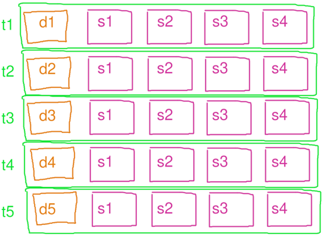

### 拆分为三个 for

既然是因为循环体太大，那你可能就会想到我们把循环体拆小点不就好了?

把上面的四个步骤分别加入一个并行组：

```cpp
int main() {
  size_t n = 1 << 11;

  std::vector<Data> dats(n);

  TICK(process);
  tbb::parallel_for_each(dats.begin(), dats.end(),
                         [&](Data &dat) { dat.step1(); });
  tbb::parallel_for_each(dats.begin(), dats.end(),
                         [&](Data &dat) { dat.step2(); });
  tbb::parallel_for_each(dats.begin(), dats.end(),
                         [&](Data &dat) { dat.step3(); });
  tbb::parallel_for_each(dats.begin(), dats.end(),
                         [&](Data &dat) { dat.step4(); });
  TOCK(process);

  return 0;
}
// process: 0.0983123s
```

加速比：**3.47** 倍

解决了指令缓存失效问题，但是三次独立的for循环每次结束都需要同步，一定程度上妨碍了CPU发挥性能；而且每个step后依然写回了数组，数据缓存没法充分利用。

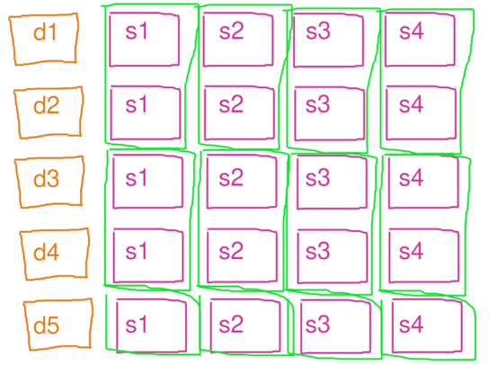

### 另辟蹊径：流水线并行

Itel在TBB中内置了一个流水线并行：

```cpp
int main() {
  size_t n = 1 << 11;

  std::vector<Data> dats(n);

  TICK(process);
  auto it = dats.begin();
  tbb::parallel_pipeline(
      8,
      tbb::make_filter<void, Data *>(tbb::filter_mode::serial_in_order,
                                     [&](tbb::flow_control &fc) -> Data * {
                                       if (it == dats.end()) {
                                         fc.stop();
                                         return nullptr;
                                       }
                                       return &*it++;
                                     }),
      tbb::make_filter<Data *, Data *>(tbb::filter_mode::parallel,
                                       [&](Data *dat) -> Data * {
                                         dat->step1();
                                         return dat;
                                       }),
      tbb::make_filter<Data *, Data *>(tbb::filter_mode::parallel,
                                       [&](Data *dat) -> Data * {
                                         dat->step2();
                                         return dat;
                                       }),
      tbb::make_filter<Data *, Data *>(tbb::filter_mode::parallel,
                                       [&](Data *dat) -> Data * {
                                         dat->step3();
                                         return dat;
                                       }),
      tbb::make_filter<Data *, void>(tbb::filter_mode::parallel,
                                     [&](Data *dat) -> void { dat->step4(); }));
  TOCK(process);

  return 0;
}
// process: 0.0507116s
```

加速比：**6.73** 倍

反直觉的并行方式，但是加速效果却很理想，为什么？

流水线模式下每个线程都只做自己的那个步骤（filter），从而对指令缓存更友好。且一个核心处理完的数据很快会被另一个核心用上，对三级缓存比较友好，也节省内存。

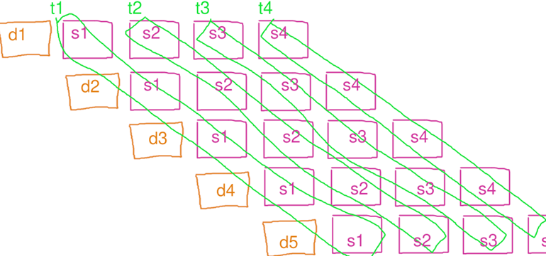

且 TBB 的流水线，其实比教科书上描述的传统流水线并行更加优化：

它在 t1 线程算完 d1 的 s1 时，会继续让 t1 负责算 d1 的 s2，这样 d1 的数据就是在二级缓存里，比调度到让 t2 算需要进入三级缓存更高效。而当 t2 的队列比较空时，又会让 t1 继续算 d2 的 s2，这样可以避免 t2 闲置浪费时间。总之就是会自动负载均衡非常智能，完全无需操心内部细节。

### 流水线并行：filter 参数

```cpp

int main() {
  size_t n = 1 << 11;

  std::vector<Data> dats(n);
  std::vector<float> result;

  TICK(process);
  auto it = dats.begin();
  tbb::parallel_pipeline(
      8,
      tbb::make_filter<void, Data *>(tbb::filter_mode::serial_in_order,
                                     [&](tbb::flow_control &fc) -> Data * {
                                       if (it == dats.end()) {
                                         fc.stop();
                                         return nullptr;
                                       }
                                       return &*it++;
                                     }),
      tbb::make_filter<Data *, Data *>(tbb::filter_mode::parallel,
                                       [&](Data *dat) -> Data * {
                                         dat->step1();
                                         return dat;
                                       }),
      tbb::make_filter<Data *, Data *>(tbb::filter_mode::parallel,
                                       [&](Data *dat) -> Data * {
                                         dat->step2();
                                         return dat;
                                       }),
      tbb::make_filter<Data *, Data *>(tbb::filter_mode::parallel,
                                       [&](Data *dat) -> Data * {
                                         dat->step3();
                                         return dat;
                                       }),
      tbb::make_filter<Data *, float>(tbb::filter_mode::parallel,
                                      [&](Data *dat) -> float {
                                        float sum = std::reduce(
                                            dat->arr.begin(), dat->arr.end());
                                        return sum;
                                      }),
      tbb::make_filter<float, void>(
          tbb::filter_mode::serial_out_of_order,
          [&](float sum) -> void { result.push_back(sum); }));
  TOCK(process);

  return 0;
}
```

- serial_in_order 表示当前步骤只允许串行执行，且执行的顺序必须一致。

- serial_out_of_order 表示只允许串行执行，但是顺序可以打乱。

- parallel 表示可以并行执行当前步骤，且顺序可以打乱。

每一个步骤（filter）的输入和返回类型都可以不一样。

要求：流水线上一步的返回类型，必须和下一步的输入类型一致。且第一步的没有输入，最后一步没有返回，所以都为 void。

TBB 支持嵌套的并行，因此流水线内部也可以调用 tbb::parallel_for 进一步并行。

### 流水线的利弊

流水线式的并行，因为每个线程执行的指令之间往往没有关系，主要适用于各个核心可以独立工作的 CPU，GPU 上则有 stream 作为替代。

流水线额外的好处是可以指定一部分 filter 为串行的（如果他们没办法并行调用的话）而其他 filter 可以和他同时并行运行。这可以应对一些不方便并行，或者执行前后的数据有依赖，但是可以拆分成多个步骤（filter）的复杂业务。

还有好处是他无需先把数据全读到一个内存数组里，可以**流式**处理数据（on-fly），节省内存。

不过需要注意流水线每个步骤（filter）里的工作量最好足够大，否则无法掩盖调度overhead。

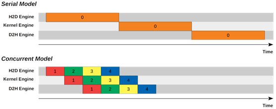

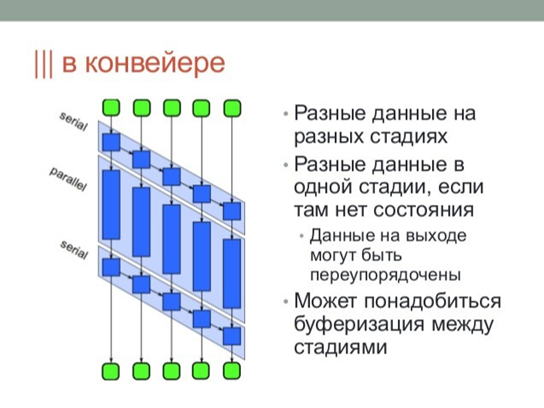

### 总结：各种并行模式

- 任务并行
- 数据并行
- 流水线并行

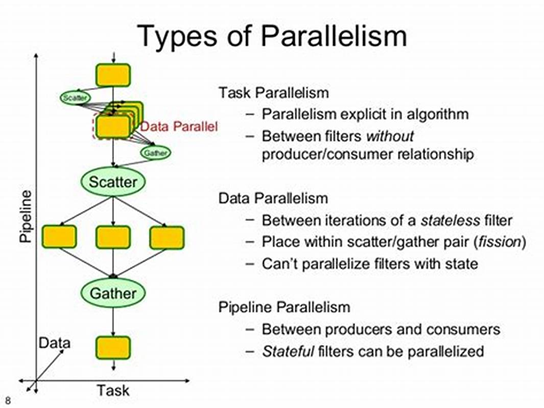

从串行到并行，从来就没有什么万能膏药。

CPU上的并行尚且如此，何况GPU。

熟悉原理、反复实验，才能优化出好程序。

- 本文仅入门，深入可以看 Pro TBB 这本书。

优化重点在于程序的瓶颈部分，不用在小细节上浪费精力。如果有个 O(n²) 的循环体，则只看他，并无视一旁的 O(n) 循环体。