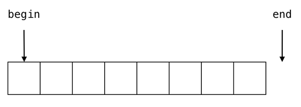

## vector容器

### 构造

#### 显式构造

##### 指定一个参数 `explicit vector(size_t n)`

```cpp
#include <vector>
using namespace std;

int main(){
    vector<int> a;
    return 0;
```

vector 的功能是长度可变的数组，他里面的数据存储在堆上。

- 使用`sizeof(vector)`会得到vector的大小是24，即三个指针的大小

- 第一个指针指向堆上内存的起始地址
- 第二个指针标志着有效元素结束位置
- 第三个指针指向分配给`vector`的总容量位置，表示`vector`可以存储多少元素而不需要重新分配内存

vector 是一个模板类，第一个模板参数是数组里元素的类型。

例如，声明一个元素是 int 类型的动态数组 a：`vector<int> a;`

```cpp
#include <vector>
#include <iostream>
using namespace std;

int main(){
    vector<int> a(4);// 可以为运行时变量，不一定为常量
    cout << a.size() << endl;
    return 0;
}

// 输出：4
```

vector 可以在构造时指定初始长度。

例如，要创建一个长度为 4 的 int 型数组：`vector<int> a(4);`

之后可以通过 a.size() 获得数组的长度。比如上面的代码会得到 4。

**另外：**

- vector 的这个显式构造函数，默认会把所有元素都初始化为 0（不必手动去 memset）。

- •如果是其他自定义类，则会调用元素的默认构造函数（例如：数字类型会初始化为 0，string 会初始化为空字符串，指针类型会初始化为 nullptr）
```cpp
  #include <vector>
  #include <iostream>
  #include "printer.h"//自定义打印，详见本节小技巧
  using namespace std;
  
  int main(){
      vector<int> a(4);// 可以为运行时变量，不一定为常量
      cout << a.size() << endl;
      return 0;
  }
  
  //输出
  //{0,0,0,0}
```

##### 指定两个参数 `explicit vector(size_t n, int const &val)`

这个显式构造函数还可以指定第二个参数，这样就可以用 0 以外的值初始化整个数组了。

```cpp
#include <vector>
#include <iostream>
#include "printer.h"
using namespace std;

int main() {
    vector<int> a(4, 233);
    cout << a << endl;
    return 0;
}
//输出：
//{233,233,233,233}
```

比如要创建 4 个 233 组成的数组就可以写：

`vector<int> a(4, 233);`

等价于

`vector<int> a = {233, 233, 233, 233};`

#### 初始化列表构造

`vector(initializer_list<int> list);`

除了先指定大小再一个个构造之外，还可以直接利用初始化列表（C++11 新特性）在构造时就初始化其中元素的值。

```cpp
#include <vector>
#include <iostream>
using namespace std;

int main() {
    vector<int> a = {6, 1, 7, 4};
    cout << "a[0] = " << a[0] << endl;
    cout << "a[1] = " << a[1] << endl;
    cout << "a[2] = " << a[2] << endl;
    cout << "a[3] = " << a[3] << endl;
    return 0;
}
```

例如创建具有 6, 1, 7, 4 四个元素的 vector：

`vector<int> a = {6, 1, 7, 4};`

和刚刚先创建再赋值的方法相比更直观。

```cpp
#include <vector>
#include <iostream>
using namespace std;

int main() {
    vector<int> a{6, 1, 7, 4};
    cout << "a[0] = " << a[0] << endl;
    cout << "a[1] = " << a[1] << endl;
    cout << "a[2] = " << a[2] << endl;
    cout << "a[3] = " << a[3] << endl;
    return 0;
}
```

初始化表达式的**等号**可以写也可以不写：

`vector<int> a = {6, 1, 7, 4};`

`vector<int> a{6, 1, 7, 4};`

都是等价的。

**注意，**这意味着如果用花括号的 `{4} `初始化：

`vector<int> a{4};`

会得到长度为 1 只有一个元素 4 的数组。

如果需要长度为 4，元素全部为 0 的数组，必须用圆括号` ()` 而不是花括号 `{}`，这样才能保证调用他的显式`（explicit）`构造函数：

`vector<int> a(4);`

会得到长度为 4 元素全为 0 的数组。

```cpp
#include <vector>
#include <iostream>
using namespace std;

int main() {
    vector<int> a{4};
    cout << "a[0] = " << a[0] << endl;
    cout << "a.size() = " << a.size() << endl;
    return 0;
}
//输出
// a[0] = 4
// a.size() = 1
```

这在对于**只能用花括号初始化**的类成员来说，就有很大问题：

```cpp
#include <vector>
#include <iostream>
using namespace std;

struct C {
    vector<int> a{4};
};

int main() {
    C c;
    cout << "c.a[0] = " << c.a[0] << endl;
    cout << "c.a.size() = " << c.a.size() << endl;
    return 0;
}
```

`vector<int> a{4};`

会得到长度为 1 只有一个元素 4 的数组。

但还是可以用这种写法强制调用显式构造函数：

```cpp
#include <vector>
#include <iostream>
using namespace std;

struct C {
    vector<int> a = vector<int>(4);
};

int main() {
    C c;
    cout << "c.a[0] = " << c.a[0] << endl;
    cout << "c.a.size() = " << c.a.size() << endl;
    return 0;
}
```

`vector<int> a = vector<int>(4);`

会得到长度为 4 元素全为 0 的数组。

#### 小技巧

添加一个运算符重载用于打印 vector 类型

```cpp
//	printer.h
#pragma once

#include <iostream>
#include <vector>

namespace std {

template <class T>
ostream &operator<<(ostream &os, vector<T> const &v) {
    os << '{';
    auto it = v.begin();
    if (it != v.end()) {
        os << *it;
        for (++it; it != v.end(); ++it) {
            os << ',' << *it;
        }
    }
    os << '}';
    return os;
}
}
```

### operator[]

`int &operator[](size_t i) noexcept;`

`int const &operator[](size_t i) const noexcept;`

```cpp
#include <vector>
#include <iostream>
using namespace std;

int main() {
    vector<int> a(4);
    cout << "a[0] = " << a[0] << endl;
    cout << "a[1] = " << a[1] << endl;
    cout << "a[2] = " << a[2] << endl;
    cout << "a[3] = " << a[3] << endl;
    return 0;
}

//输出：
//a[0] = 0
//a[1] = 0
//a[2] = 0
//a[3] = 0
```

要访问 vector 里的元素，只需用 [] 运算符：

- 例如 a[0] 访问第 0 个元素（人类的第一个）

- 例如 a[1] 访问第 1 个元素（人类的第二个）

**值得注意**的是，`[]` 运算符在索引超出数组大小时并不会直接报错，这是为了性能的考虑。

```cpp
#include <vector>
#include <iostream>
using namespace std;

int main() {
    vector<int> a(4);
    cout << "a[0] = " << a[0] << endl;
    cout << "a[1] = " << a[1] << endl;
    cout << "a[2] = " << a[2] << endl;
    cout << "a[3] = " << a[3] << endl;
    cout << "a[1000] = " << a[1000] << endl;// 越界访问
    return 0;
}

//输出：
//a[0] = 0
//a[1] = 0
//a[2] = 0
//a[3] = 0
//a[100] = 0	//越界访问
```


如果你不小心用` []`访问了越界的索引，可能会覆盖掉别的变量导致程序行为异常，或是访问到操作系统未映射的区域导致奔溃。

### `at()`函数

`int &at(size_t i);`

`int const &at(size_t i) const;`

```cpp
#include <vector>
#include <iostream>
using namespace std;

int main() {
    vector<int> a(4);
    cout << "a.at(0) = " << a.at(0) << endl;
    cout << "a.at(1) = " << a.at(1) << endl;
    cout << "a.at(2) = " << a.at(2) << endl;
    cout << "a.at(3) = " << a.at(3) << endl;
    cout << "a.at(1000) = " << a.at(1000) << endl;
    return 0;
}

//输出：
//a.at(0) = 0
// a.at(1) = 0
// a.at(2) = 0
// a.at(3) = 0
// terminate called after throwing an instance of 'std::out_of_range'
//   what():  vector::_M_range_check: __n (which is 1000) >= this->size() (which is 4)
```

为了防止不小心越界，可以用 `a.at(i)` 替代 `a[i]`，``at` 函数会检测索引 i 是否越界，如果他发现索引` i >= a.size() `则会抛出异常 `std::out_of_range` 让程序提前终止（或者被 `try-catch `捕获），配合任意一款调试器，就可以很快速地定位到出错点。

不过 `at` 需要额外检测下标是否越界，虽然更安全方便调试，但和 `[]` 相比有一定性能损失。

- 上面只演示了读取操作，当然可以使用`[]`和`at`进行写入操作

### `resize()`函数

`void resize(size_t n);`

除了可以在构造函数中指定数组的大小，还可以之后再通过 resize 函数设置大小。

```cpp
#include <vector>
#include <iostream>
#include "printer.h"
using namespace std;

int main() {
    vector<int> a;
    cout << a << endl;
    a.resize(4);
    cout << a << endl;
    return 0;
}

//输出：
//{}
//{0,0,0,0}
```

这在无法一开始就指定大小的情况下非常方便。

当然，resize 也有一个接受第二参数的重载，他会用这个参数的值填充所有新建的元素。

`void resize(size_t n, int const &val);`

```cpp
#include <vector>
#include <iostream>
#include "printer.h"
using namespace std;

int main() {
    vector<int> a;
    cout << a << endl;
    a.resize(4, 233);
    cout << a << endl;
    return 0;
}

//输出：
//{}
//{233,233,233,233}
```

调用 resize(n) 的时候，如果数组里面不足 n 个元素，假设是 m 个，则他**只会用** **0** **填充新增的** **n - m** **个元素**，前 m 个元素会保持不变。

`vector<int> a = {1, 2};`

`a.resize(4);`

等价于：

`vector<int> a = {1, 2, 0, 0};`

```cpp
#include <vector>
#include <iostream>
#include "printer.h"
using namespace std;

int main() {
    vector<int> a = {1, 2};
    cout << a << endl;
    a.resize(4);
    cout << a << endl;
    return 0;
}
//输出：
//{1,2}
//{1,2,0,0}
```

调用 `resize(n)` 的时候，如果数组已有超过 n 个元素，假设是 m 个，则他**会删除多出来的** **m - n** **个元素**，前 n 个元素会保持不变。

`vector<int> a = {1, 2, 3, 4, 5, 6};`

`a.resize(4);`

等价于：

`vector<int> a = {1, 2, 3, 4};`

```cpp
#include <vector>
#include <iostream>
#include "printer.h"
using namespace std;

int main() {
    vector<int> a = {1, 2, 3, 4, 5, 6};
    cout << a << endl;
    a.resize(4);
    cout << a << endl;
    return 0;
}
//输出
//{1, 2, 3, 4, 5, 6}
//{1, 2, 3, 4}
```

调用第二个重载 resize(n, val) 的时候，如果数组里面不足 n 个元素，假设是 m 个，则他**只会用第二个参数** **val** **填充新增的** **n - m** **个元素**，前 m 个元素会保持不变。

`vector<int> a = {1, 2};`

`a.resize(4, 233);`

等价于：

`vector<int> a = {1, 2, 233, 233};`

```cpp
#include <vector>
#include <iostream>
#include "printer.h"
using namespace std;

int main() {
    vector<int> a = {1, 2};
    cout << a << endl;
    a.resize(4, 233);
    cout << a << endl;
    return 0;
}
//输出
//{1,2}
//{1,2,233,233}
```

调用第二个重载 resize(n, val) 的时候，如果数组已有超过 n 个元素，假设是 m 个，则第二参数 val 会被**无视**，**删除多出来的** **m - n** **个元素**，前 n 个元素会保持不变。

`vector<int> a = {1, 2, 3, 4, 5, 6};`

`a.resize(4, 233);`

等价于：

`vector<int> a = {1, 2, 3, 4};`

```cpp
#include <vector>
#include <iostream>
#include "printer.h"
using namespace std;

int main() {
    vector<int> a = {1, 2, 3, 4, 5, 6};
    cout << a << endl;
    a.resize(4, 233);
    cout << a << endl;
    return 0;
}

//输出
//{1,2,3,4,5}
//{1,2,3,4}
```

### `clear()`函数

`void clear() noexcept`

vector 的 clear 函数可以**清空该数组**，也就相当于把长度设为零，变成空数组。例如：

`a.clear();`

等价于：

`a.resize(0);  或  a = {};`

通常用于后面需要重新 push_back，因此可以 clear 来把数组设为空。

```cpp
#include <vector>
#include <iostream>
#include "printer.h"
using namespace std;

int main() {
    vector<int> a = {1, 2, 3, 4, 5};
    cout << a << endl;
    a.clear();
    cout << a << endl;
    return 0;
}
```

**clear配合resize**

resize 会保留原数组的前面部分不变，只在后面填充上 0。(具有一定软弱性)

如果需要把原数组前面的部分也填充上 0，可以**先** **clear** **再** **resize**，这是一个常见的组合。

```cpp
#include <vector>
#include <iostream>
#include "printer.h"
using namespace std;

int main() {
    vector<int> a = {1, 2};
    cout << a << endl;
    a.clear();
    a.resize(4);
    cout << a << endl;
    return 0;
}
//输出
//{1,2}
//{0,0,0,0}
```

### `push_back()`函数

`void push_back(int const &val);`

`void push_back(int &&val); // C++11 新增`

```cpp
#include <vector>
#include <iostream>
#include "printer.h"
using namespace std;

int main() {
    vector<int> a = {1, 2};
    cout << a << endl;
    a.push_back(3);
    cout << a << endl;
    return 0;
}
//输出
//{1,2}
//{1,2,3}
```

可以**在数组的末尾追加**一个数。例如：

`vector<int> a = {1, 2};`

`a.push_back(3);`

等价于：

`vector<int> a = {1, 2, 3};`

### `pop_back()`函数

`void pop_back() noexcept`

```cpp
#include <vector>
#include <iostream>
#include "printer.h"
using namespace std;

int main() {
    vector<int> a = {1, 2, 3};
    cout << a << endl;
    a.pop_back();
    cout << a << endl;
    return 0;
}
//输出
//{1,2,3}
//{1,2}
```

pop_back 函数则是和 push_back 唱反调，他是**在数组的末尾删除**一个数。例如：

`vector<int> a = {1, 2, 3};`

`a.pop_back();`

等价于：

`vector<int> a = {1, 2};`

### `back()`函数

`int &back() noexcept;`

`int const &back() const noexcept`

```cpp
#include <vector>
#include <iostream>
#include "printer.h"
using namespace std;

int main() {
    vector<int> a = {1, 2, 3};
    cout << a << endl;
    int val = a.back();
    a.pop_back();
    cout << "back = " << val << endl;
    cout << a << endl;
    return 0;
}

//输出
//{1,2,3}
//back = 3
//{1,2}
```

要注意的是 `pop_back` 函数的返回类型是 `void`，也就是没有返回值，如果需要获取删除的值，可以在 `pop_back()` 之前先通过 `back()` **获取末尾元素的值**，实现 pop 效果。

`a.back();`

等价于：

`a[a.size() - 1]`

### `front()`函数

`int &front() noexcept;`

`int const &front() const noexcept;`

```cpp
#include <vector>
#include <iostream>
#include "printer.h"
using namespace std;

int main() {
    vector<int> a = {1, 2, 3};
    cout << "a[0] = " << a[0] << endl;
    cout << "a[a.size() - 1] = " << a[a.size() - 1] << endl;
    cout << "a.front() = " << a.front() << endl;
    cout << "a.back() = " << a.back() << endl;
    return 0;
}
//输出
// a[0] = 1
// a[a.size() - 1] = 3
// a.front() = 1
// a.back() = 3
```

和 `back()` 相对的还有一个 `front()`。

`back()` 返回**末尾元素**的引用 `a[a.size() - 1]`。

而 `front()` 返回**首个元素**的引用 `a[0]`。

`a.front();`

等价于：

`a[0]`

### `data()`获取首地址指针

`int *data() noexcept;`

`int const *data() const noexcept;`

```cpp
#include <vector>
#include <iostream>
#include <cstring>
#include "printer.h"
using namespace std;

int main() {
    vector<int> a = {1, 2, 3, 4, 5};
    int *p = a.data();
    //int n = a.size();
    //memset(p, -1, sizeof(int) * n);
    //cout << a << endl;
    cout << p[0] << endl;
    cout << p[1] << endl;
    cout << p[2] << endl;
    return 0;
}
//输出
//1
//2
//3
```

data() 会返回指向数组中**首个元素的指针**，也就是等价于 &a[0]。由于 vector 是连续存储的数组，因此只要得到了首地址，下一个元素的地址只需指针 +1 即可。

因为指针的 p[i] 相当于 *(p + i)，因此可以把 data() 返回的首地址指针当一个数组来访问。

```cpp
#include <vector>
#include <iostream>
#include <cstring>
#include "printer.h"
using namespace std;

int main() {
    vector<int> a = {1, 2, 3, 4, 5};
    int *p = a.data();
    int n = a.size();
    memset(p, -1, sizeof(int) * n);
    cout << a << endl;
    return 0;
}
//输出
//{-1,-1,-1,-1,-1}
```

data() 返回的**首地址指针**，通常配合 size() 返回的**数组长度**一起使用（连续的动态数组只需要知道首地址和数组长度即可完全确定）。

用他来获取一个 C 语言原始指针 int *，很方便用于调用 C 语言的函数和 API 等，同时还能享受到 vector 容器 RAII 的安全性。

### RAII思想避免内存泄露

RAII: 资源获取即初始化，使用局部对象来管理资源的技术称为资源获取即初始化。利用栈对象自动销毁的特点来实现，**通过构造函数获取资源，通过析构函数释放资源**。

如果用 new/delete 或者 malloc/free 就很容易出现忘记释放内存的情况，造成内存泄露。

```cpp
char *pixels = new char[camera->m_nx * camera->m_ny * 3];	//使用new
CHECK_GL(glReadPixels(0, 0, camera->m_nx,camera->m_ny, GL_RGB,GL_UNSIGNED_BYTE, pixels));
delete pixels;	//容易忘记释放
```

而 vector 会在离开作用域时，自动调用解构函数，释放内存，就不必手动释放了，更安全。

```cpp
std::vector<char> pixels(camera->m_nx * camera->m_ny * 3);	//使用vector
CHECK_GL(glReadPixels(0, 0, camera->m_nx,camera->m_ny, GL_RGB,GL_UNSIGNED_BYTE, pixels.data()));	//通过.data配合c语言操作
//vector离开作用域时，自动释放，.data获取的指针也会失效
```

### 生命周期管理

C++ 中最神奇的运算符 `}`

 `}` 标志着一个语句块的结束，在这里，他会调用所有身处其中的对象的解构函数。比如这里的 `vector`，他的解构函数会释放动态数组的内存（即自动 delete）。

`vector` 会在退出作用域时释放内存，这时候所有指向其中元素的指针，包括 `data()` 都会失效。因此如果你是在语句块内获取的 `data()` 指针，语句块外就无法访问了。

可见 `data()` 指针是对 `vector` 的一种引用，实际对象生命周期仍由 `vector` 类本身管理。

```cpp
#include <vector>
#include <iostream>
#include <cstring>
#include "printer.h"
using namespace std;

int main() {
    int *p;
    {
        vector<int> a = {1, 2, 3, 4, 5};
        p = a.data();
        cout << p[0] << endl;
        cout << p[0] << endl;
    }//离开作用域
    cout << p[0] << endl;
    return 0;
}
//输出
//1
//1
//-1431446021	无效数
```

#### 延续生命周期

```cpp
#include <vector>
#include <iostream>
#include <cstring>
#include "printer.h"
using namespace std;

// vector<int> holder;//全局变量，main退出释放

int main() {
    int *p;
    vector<int> holder;	//与p生命周期相同
    {
        vector<int> a = {1, 2, 3, 4, 5};
        p = a.data();
        cout << p[0] << endl;
        cout << p[0] << endl;
        holder = std::move(a);
    }//离开作用域
    cout << p[0] << endl;
    return 0;
}
//输出
//1
//1
//1
```


如果需要在一个语句块外仍然保持 data() 对数组的弱引用有效，可以把语句块内的 vector 对象移动到外面的一个 vector 对象上。vector 在移动时指针不会失效，例如：

`a = move(b)`

则会把 b 变成空数组，a 指向原来 b 所包含的元素数组，且地址不变。

之后即使不直接使用外面的那个临时对象 a，也可以继续通过 data() 指针来访问数据。

也可以移动到一个全局变量的 vector 对象。这样数组就会一直等到 main 退出了才释放。

- C++ 规定全局变量都会在进入 main 函数**之前**构造，main 函数返回之后解构

### `resize()`和内存管理

#### resize到更大尺寸会导致data失效

```cpp
#include <vector>
#include <iostream>
#include <cstring>
#include "printer.h"
using namespace std;

int main() {
    vector<int> a = {1, 2, 3, 4, 5};
    int *p = a.data();
    cout << p[0] << endl;
    cout << p[0] << endl;
    a.resize(1024);
    cout << p[0] << endl;
    return 0;
}
//输出
//输出
//1
//1
//-1431446021
```

当 resize 的目标长度**大于**原有的容量时，就需要**重新分配一段更大的连续内存**，并把**原数组长度的部分移动过去**，多出来的部分则用 0 来填充。这就导致元素的地址会有所改变，从而过去 data 返回的指针以及所有的迭代器对象，都会失效。

#### resize到更小尺寸不会导致data失效

```cpp
int main() {
    vector<int> a = {1, 2, 3, 4, 5};
    int *p = a.data();
    cout << p[0] << endl;
    cout << p[0] << endl;
    a.resize(2);
    cout << p[0] << endl;
    a.resize(5);
    cout << p[0] << endl;
    return 0;
}
//输出
//1
//1
//1
```

当 resize 的目标长度**小于**原有的容量时，不需要重新分配一段连续的内存也不会造成元素的移动（这个设计是为了性能考虑），所以指向元素的指针不会失效。他只是会把数组的长度标记为新长度，后面**空闲出来那一段内存不会释放掉**，继续留在那里，直到 vector 对象被解构。

**重新resize到原来也不会导致data失效**

- 调用了 a.resize(2) 之后，数组的**容量**仍然是 5，因此重新扩容到 5 是不需要重新分配内存的，也就不会移动元素导致指针失效。

#### `capacity()`函数查询实际的最大容量

`size_t capacity() const noexcept;`

```cpp
int main() {
    vector<int> a = {1, 2, 3, 4, 5};
    cout << a.data() << ' ' << a.size() << '/' << a.capacity() << endl;
    a.resize(2);
    cout << a.data() << ' ' << a.size() << '/' << a.capacity() << endl;
    a.resize(5);
    cout << a.data() << ' ' << a.size() << '/' << a.capacity() << endl;
    a.resize(7);
    cout << a.data() << ' ' << a.size() << '/' << a.capacity() << endl;
    return 0;
}
//输出：
// 0x1f287924f80 5/5
// 0x1f287924f80 2/5
// 0x1f287924f80 5/5
// 0x1f287929410 7/10
```

可以用 capacity() 函数查询已经分配内存的大小，即**最大容量**。

而 size() 返回的其实是已经存储了数据的**数组长度**。

可以发现当 resize 指定的新**长度**一个超过原来的最大**容量**时时，就会重新分配一段更大**容量**的内存来存储数组，只有这时才会移动元素的位置（data 指针失效）。

#### `resize()`的优化策略

注意这里 resize(7) 之后容量实际上扩充到了 10 而不是刚好 7，为什么？

因为标准库的设计者非常聪明，他料想到了你 resize(7) 以后可能还会来个 resize(8) 甚至 resize(9) 之类的。为了减少重复分配的次数，他有一个策略：当 resize 后的新尺寸变化较小时，则**自动扩容至原尺寸的两倍**。

这里我们的原大小是 5，所以 resize(7) 会扩充**容量**到 10，但是**尺寸**为 7。

- 尺寸总是小于等于容量。

- 尺寸范围内都是已初始化的内存(零)。

- 寸到容量之间的范围是未初始化的。

```cpp
int main() {
    vector<int> a = {1, 2, 3, 4, 5};
    cout << a.data() << ' ' << a.size() << '/' << a.capacity() << endl;
    a.resize(2);
    cout << a.data() << ' ' << a.size() << '/' << a.capacity() << endl;
    a.resize(5);
    cout << a.data() << ' ' << a.size() << '/' << a.capacity() << endl;
    a.resize(12);
    cout << a.data() << ' ' << a.size() << '/' << a.capacity() << endl;
    return 0;
}
//输出：
// 0x1f287924f80 5/5
// 0x1f287924f80 2/5
// 0x1f287924f80 5/5
// 0x1f287929410 12/12
```

不过如果 `resize` 后的尺寸还超过了原先尺寸的两倍，就没有这个效果了。

也就是说 `resize(n)` 的逻辑是扩容至 `max(n, capacity * 2)`。

#### `reserve()`预留一定容量，避免之后重复分配

```cpp
int main() {
    vector<int> a = {1, 2, 3, 4, 5};
    cout << a.data() << ' ' << a.size() << '/' << a.capacity() << endl;
    a.reserve(12);	//预留12
    cout << a.data() << ' ' << a.size() << '/' << a.capacity() << endl;
    a.resize(2);
    cout << a.data() << ' ' << a.size() << '/' << a.capacity() << endl;
    a.resize(5);
    cout << a.data() << ' ' << a.size() << '/' << a.capacity() << endl;
    a.resize(12);
    cout << a.data() << ' ' << a.size() << '/' << a.capacity() << endl;
    return 0;
}
//输出
// 0x1a8d4b9eb90 5/5
// 0x1a8d4b97440 5/12
// 0x1a8d4b97440 2/12
// 0x1a8d4b97440 5/12
// 0x1a8d4b97440 12/12
```

内存分配是需要一定时间的。如果我们程序员能预料到数组最终的大小，可以用 `reserve` 函数**预留**一定的容量，这样之后就不会出现容量不足而需要动态扩容影响性能了。

例如这里我们一开始预留了 12 格容量，这样从 5 到 12 的时候就不必重新分配。此外，还要注意 `reserve` 时也会移动元素。

#### `shrink_t0_fit()`释放多余的容量

刚刚说过，当 `resize` 到一个更小的大小上时，多余的容量不会释放，而是继续保留。如担心内存告急可以用 `shrink_to_fit` 释放掉多余的容量，只保留刚好为 size() 大小的容量。

```cpp
int main() {
    vector<int> a = {1, 2, 3, 4, 5};
    cout << a.data() << ' ' << a.size() << '/' << a.capacity() << endl;
    a.resize(12);
    cout << a.data() << ' ' << a.size() << '/' << a.capacity() << endl;
    a.resize(4);
    cout << a.data() << ' ' << a.size() << '/' << a.capacity() << endl;
    a.shrink_to_fit();
    cout << a.data() << ' ' << a.size() << '/' << a.capacity() << endl;
    return 0;
}
//输出：
// 0x1de1be5e750 5/5
// 0x1de1be573c0 12/12
// 0x1de1be573c0 4/12
// 0x1de1be5e750 4/4
```

`shrink_to_fit` 会重新分配一段更小内存，他同样是会把元素移动到新内存中的，因此迭代器和指针也会失效。

### 一个小工具：mallochook

```cpp
// https://github.com/sjp38/mallochook/blob/master/mallochook.c

#ifdef __unix__

#include <dlfcn.h>
#include <stdio.h>

void *malloc(size_t size)
{
    typedef void *(*malloc_t)(size_t size);
    static malloc_t malloc_fn = (malloc_t)dlsym(RTLD_NEXT, "malloc");
    void *p = malloc_fn(size);
    fprintf(stderr, "\033[32mmalloc(%zu) = %p\033[0m\n", size, p);
    return p;
}

void free(void *ptr)
{
    typedef void (*free_t)(void *ptr);
    static free_t free_fn = (free_t)dlsym(RTLD_NEXT, "free");
    fprintf(stderr, "\033[31mfree(%p)\033[0m\n", ptr);
    free_fn(ptr);
}

#endif

```

为了追踪所有的内存分配与释放，我们试着重写一下 malloc 和 free 函数。

这样当 vector 容器分配或是释放内存的时候，我们就能轻松看到。

不过这个只能 Linux 系统可以用哦

### `puch_back()`的问题

```cpp
#include <vector>
#include <iostream>
#include <cstring>
#include "printer.h"
#include "mallochook.h"
using namespace std;

int main() {
    vector<int> a;
    for (int i = 0; i < 100; i++)
        a.push_back(i);
    cout << a << endl;
    return 0;
}
//输出：
// malloc(72704) = 0xaaab167f12a0
// malloc(4) = 0xaaab16802eb0
// malloc(8) = 0xaaab16802ed0
// free(0xaaab16802eb0)
// malloc(16) = 0xaaab16802eb0
// free(0xaaab16802ed0)
// malloc(32) = 0xaaab16802ef0
// free(0xaaab16802eb0)
// malloc(64) = 0xaaab16802f20
// free(0xaaab16802ef0)
// malloc(128) = 0xaaab16802f70
// free(0xaaab16802f20)
// malloc(256) = 0xaaab16803000
// free(0xaaab16802f70)
// malloc(512) = 0xaaab16803110
// free(0xaaab16803000)
// malloc(1024) = 0xaaab16803320
// {0,1,2,3,4,5,6,7,8,9,10,11,12,13,14,15,16,17,18,19,20,21,22,23,24,25,26,27,28,29,30,31,32,33,34,35,36,37,38,39,40,41,42,43,44,45,46,47,48,49,50,51,52,53,54,55,56,57,58,59,60,61,62,63,64,65,66,67,68,69,70,71,72,73,74,75,76,77,78,79,80,81,82,83,84,85,86,87,88,89,90,91,92,93,94,95,96,97,98,99}
// free(0xaaab16803110)
```

由于不知道你究竟会推入多少个元素，vector 的初始容量是零，而 push_back 和 resize 一样，每次遇到容量不足时，都会扩容两倍，例如上面的输出。

这也体现了**实际容量**`(capacity)`和数组大小`(size)`分离的好处，如果死板地让分配的内存容量始终等于当前数组大小（很多同学都号称自己实现过 `vector`，都是这种写法），那么如果要用 push_back 推入 n 个元素，就需要重新分配内存 n 次，移动元素 n(n+1)/2 次。

而像标准库这样允许数组大小和实际容量不同，这样 push_back 在容量不足的时候就可以一次性扩容两倍，只需重新分配 logn 次，移动元素 2n-1 次。

#### 解决：`reserve()`

因此，如果你早就知道要推入元素的数量，可以调用 reserve 函数先预留那么多的**容量**，等待接下来的推入。

```cpp
#include <vector>
#include <iostream>
#include <cstring>
#include "printer.h"
#include "mallochook.h"
using namespace std;

int main() {
    vector<int> a;
    a.reserve(100); // 预留空间
    for (int i = 0; i < 100; i++)
        a.push_back(i);
    cout << a << endl;
    return 0;
}
//输出：
// malloc(72704) = 0xaaaaf6e992a0
// malloc(400) = 0xaaaaf6eaaeb0
// malloc(1024) = 0xaaaaf6eab050
// {0,1,2,3,4,5,6,7,8,9,10,11,12,13,14,15,16,17,18,19,20,21,22,23,24,25,26,27,28,29,30,31,32,33,34,35,36,37,38,39,40,41,42,43,44,45,46,47,48,49,50,51,52,53,54,55,56,57,58,59,60,61,62,63,64,65,66,67,68,69,70,71,72,73,74,75,76,77,78,79,80,81,82,83,84,85,86,87,88,89,90,91,92,93,94,95,96,97,98,99}
// free(0xaaaaf6eaaeb0)
```

这样之后 push_back 时，就不会一次次地扩容两倍慢慢成长到 128，避免重新分配内存和移动元素，更高效。

比如这里我们可以提前知道循环会执行 100 次，因此 reserve(100) 就可以了。

可以看到只有一次 malloc(400)，之后那次 malloc(1024) 是 cout 造成的，不必在意。

### `clear()`的问题

刚刚说过，`clear` 相当于 `resize(0)`，所以他也不会实际释放掉内存，**容量(capacity)**还是摆在那里，clear 仅仅只是把**数组大小(size)**标记为 0 而已。

```cpp
#include <vector>
#include <iostream>
#include <cstring>
#include "printer.h"
#include "mallochook.h"
using namespace std;

int main() {
    vector<int> a = {1, 2, 3, 4};
    cout << "before clear, capacity=" << a.capacity() << endl;
    a.clear();
    cout << "after clear, capacity=" << a.capacity() << endl;
    return 0;
}
// 输出：
// malloc(72704) = 0xaaaae7f4d2a0
// malloc(16) = 0xaaaae7f5eeb0
// malloc(1024) = 0xaaaae7f5eed0
// before clear, capacity=4
// after clear, capacity=4
// free(0xaaaae7f5eeb0)
```

这可能导致在低端平台上内存告急，这是因为尽管你已经 clear 掉 vector 了而实际容量还在并没有释放。

#### 解决：`shrink_to_fit()`

要真正释放掉内存，可以在 clear 之后再调用 shrink_to_fit，这样才会让容量也变成 0（这时 vector 的 data 会返回 nullptr）

```cpp
#include <vector>
#include <iostream>
#include <cstring>
#include "printer.h"
#include "mallochook.h"
using namespace std;

int main() {
    vector<int> a = {1, 2, 3, 4};
    cout << "before clear, capacity=" << a.capacity() << endl;
    a.clear();
    a.shrink_to_fit();
    cout << "after clear, capacity=" << a.capacity() << endl;
    return 0;
}
//输出：
// malloc(72704) = 0xaaab077092a0
// malloc(16) = 0xaaab0771aeb0
// malloc(1024) = 0xaaab0771aed0
// before clear, capacity=4
// free(0xaaab0771aeb0)
// after clear, capacity=0
```

当然，vector 对象解构时也会彻底释放内存，这个不用操心。clear 配合 shrink_to_fit 只是提前释放而已。

## 迭代器入门

### 迭代器的引入

#### 迭代器结构的出现

```cpp
void print(vector<char> const &a) {
    for (int i = 0; i < a.size(); i++) {
        cout << a[i] << endl;
    }
}

int main() {
    vector<char> a = {'h', 'j', 'k', 'l'};
    print(a);
    return 0;
}
```

我们都知道，可以使用一个函数来封装打印操作，但是这样的缺点是它智能打印`vector`类型，没法打印`string`类型，要想支持`string`只能再实现另一个`print`函数

```cpp
#include <vector>
#include <string>
#include <iostream>
using namespace std;

void print(char const *a, size_t n) {
    for (int i = 0; i < n; i++) {
        cout << a[i] << endl;
    }
}

int main() {
    vector<char> a = {'h', 'j', 'k', 'l'};
    print(a.data(), a.size());
    string b = {'h', 'j', 'k', 'l'};
    print(b.data(), b.size());
    return 0;
}
```

注意到 `vector` 和 `string` 的底层都是连续的稠密数组，他们都有 `data()` 和 `size()` 函数。

因此可改用**首地址指针**和**数组长度**做参数：

`print(char const *a, size_t n);`

这样 `print` 在无需知道容器具体类型的情况下，只用最简单的接口（首地址指针）就完成了遍历和打印的操作。

使用**指针**和**长度**做接口的好处是，可以通过给指针加减运算，选择其中一部分连续的元素来打印，而不一定全部打印出来。

```cpp
#include <vector>
#include <string>
#include <iostream>
using namespace std;

void print(char const *a, size_t n) {
    for (int i = 0; i < n; i++) {
        cout << a[i] << endl;
    }
}

int main() {
    vector<char> a = {'h', 'j', 'k', 'l'};
    print(a.data(), a.size() - 1);
    return 0;
}

```

比如这里我们选择打印**前三个元素**（去掉了最后一个元素，但不必用 `pop_back` 修改数组，只要传参数的时候修改一下**长度** 部分即可）。

```cpp
#include <vector>
#include <string>
#include <iostream>
using namespace std;

void print(char const *a, size_t n) {
    for (int i = 0; i < n; i++) {
        cout << a[i] << endl;
    }
}

int main() {
    vector<char> a = {'h', 'j', 'k', 'l'};
    print(a.data() + 1, a.size() - 1);
    return 0;
}
```

选择打印**后三个元素**（去掉了第一个元素，但不必用 `erase` 修改数组，只要传参数的时候同时修改**指针**和**长度**

```cpp
#include <vector>
#include <string>
#include <iostream>
using namespace std;

void print(char const *begptr, char const *endptr) {
    for (char const *ptr = begptr; ptr != endptr; ptr++) {
        char value = *ptr;
        cout << value << endl;
    }
}

int main() {
    vector<char> a = {'h', 'j', 'k', 'l'};
    char const *begptr = a.data();
    char const *endptr = a.data() + a.size();
    print(begptr, endptr);
    return 0;
}
```

接着我们发现，**首地址指针**和**数组长度**看起来不太对称。

`print(char const *begptr, size_t size);`

不妨改用**首地址指针**和**尾地址指针**如何？

`print(char const *begptr, size_t endptr);`

注意看，我们在 print 里也不是用**数组下标**去迭代，而是用**指针**作为迭代变量了。

#### 首指针 + 尾指针

改用**首地址指针**和**尾地址指针**以后，要特别注意一点：**尾地址指针**实际上是指向末尾元素再往后后一个元素的指针！

```cpp
#include <vector>
#include <string>
#include <iostream>
using namespace std;

void print(char const *begptr, char const *endptr) {
    for (char const *ptr = begptr; ptr != endptr; ptr++) {
        char value = *ptr;
        cout << value << endl;
    }
}

int main() {
    vector<char> a = {'h', 'j', 'k', 'l'};
    char const *begptr = a.data();
    char const *endptr = a.data() + a.size();
    cout << "*begptr = " << *begptr << endl;
    cout << "*endptr = " << *endptr << endl;
    cout << "*(endptr - 1) = " << *(endptr-1) << endl;
    print(begptr, endptr);
    return 0;
}
// 输出：
// *begptr = h
// *endptr = ?	随机值
// *(endptr - 1) = l
// h
// j
// k
// l
```

也就是说**尾地址指针**所指向的地方是无效的内存 `a + a.size()`，**尾地址指针减1**才是真正的末尾元素指针 `a + a.size() - 1`。

为什么要这样设计？因为如果用 a + `a.size() - 1` 也就是 `&a.back()` 作为尾地址指针，将无法表示**数组长度为** **0** 的情况。

而让**尾地址指针**往后移动一格的设计，使得数组长度为 0 就是 `begptr == endptr` 的情况，非常容易判断。

更方便的是你可以通过指针的减法运算： endptr - begptr 来算出数组的长度！

```cpp
#include <vector>
#include <string>
#include <iostream>
using namespace std;

void print(char const *begptr, char const *endptr) {
    for (char const *ptr = begptr; ptr != endptr; ptr++) {
        char value = *ptr;
        cout << value << endl;
    }
}

int main() {
    vector<char> a = {'h', 'j', 'k', 'l'};
    char const *begptr = a.data();
    char const *endptr = a.data() + a.size();
    size_t size = endptr - begptr;
    cout << "begptr - endptr = " << size << endl;
    print(begptr, endptr);
    return 0;
}
// 输出
// begptr - endptr = 4
// h
// j
// k
// l
```

for 循环里也很容易写，判断是否继续循环的条件为 `ptr != endptr` 就行了。

#### 模板实现

最后，我们可以让**首指针**和**尾指针**声明为模板参数，这样不论指针是什么类型，都可以使用 print 这个模板函数来打印。

```cpp
#include <vector>
#include <string>
#include <iostream>
using namespace std;

template <class Ptr>
void print(Ptr begptr, Ptr endptr) {
    for (Ptr ptr = begptr; ptr != endptr; ptr++) {
        auto value = *ptr;
        cout << value << endl;
    }
}

int main() {
    vector<char> a = {'h', 'j', 'k', 'l'};
    char const *abegptr = a.data();
    char const *aendptr = a.data() + a.size();
    print(abegptr, aendptr);
    vector<int> b = {1, 2, 3, 4};
    int const *bbegptr = b.data();
    int const *bendptr = b.data() + b.size();
    print(bbegptr, bendptr);
    return 0;
}
// 输出：
// h
// j
// k
// l
// 1
// 2
// 3
// 4
```

#### 不连续内存的容器

**首指针**和**尾指针**的组合的确能胜任 vector 这种连续数组，但是对于 list 这种不连续的内存的容器就没辙了。

```cpp
#include <iostream>
#include <vector>
#include <list>
using namespace std;

template <class Ptr>
void print(Ptr begptr, Ptr endptr) {
    for (Ptr ptr = begptr; ptr != endptr; ptr++) {
        auto value = *ptr;
        cout << value << endl;
    }
}

int main() {
    list<char> a = {'h', 'j', 'k', 'l'};
    char const *begptr = a.data();	//No member named 'data'
    char const *endptr = a.data + a.size();	// No member named 'data'
    print(begptr, endptr);
    return 0;
}
```

没错，list 没有 data() 这个成员函数，因为他根本就不连续。

#### 首迭代器 + 尾迭代器

然而 list 却提供了 begin() 和 end() 函数，他们会返回两个 list<char>::iterator 对象。

```cpp
#include <iostream>
#include <vector>
#include <list>
using namespace std;

template <class Ptr>
void print(Ptr begptr, Ptr endptr) {
    for (Ptr ptr = begptr; ptr != endptr; ptr++) {
        auto value = *ptr;
        cout << value << endl;
    }
}

int main() {
    list<char> a = {'h', 'j', 'k', 'l'};
    list<char>::iterator begptr = a.begin();
    list<char>::iterator endptr = a.end();
    print(begptr, endptr);
    return 0;
}
// 输出：
// h
// j
// k
// l
```

这个 `list<char>::iterator` 是一个特殊定义过的类型，其具有 `!=` 和 `++` 以及 `*` 这些`**`**运算符的重载**。所以用起来就像普通的指针一样。而这些运算符重载，却会**把`++`对应到链表的`curr=curr->next`上**。

这样一个用起来就像普通的指针，但内部却通过运算符重载适配不同容器的特殊类，就是**迭代器(iterator)**，迭代器是 STL 中**容器**和**算法**之间的桥梁。

如果让我们来写 list 容器和他的迭代器，他的内部具体实现可能是这样的。

```cpp
#include <cstddef>

template <class T>
struct List {
    struct Node {
        T value;
        Node *next;
    };

    struct Iterator {
        Node *curr;

        Iterator &operator++() {
            curr = curr->next;
            return *this;
        }

        T &operator*() const {
            return curr->value;
        }

        bool operator!=(Iterator const &that) const {
            return curr != that.curr;
        }
    };

    Node *head;

    Iterator begin() { return {head}; }
    Iterator end() { return {nullptr}; }
};

template <class T>
struct Vector {
    struct Node {
        T value;
        Node *next;
    };

    struct Iterator {
        Node *curr;

        Iterator &operator++() {
            curr = curr->next;
            return *this;
        }

        Iterator operator++(int) {
            Iterator tmp = *this;
            this->operator++();
            return tmp;
        }

        T &operator*() const {
            return curr->value;
        }

        bool operator!=(Iterator const &that) const {
            return curr != that.curr;
        }
    };

    Node *head;
    size_t size;

    Iterator begin() { return {head}; }
    Iterator end() { return {head + size}; }
};

void iterate_over_list(List<int> const &list) {
    for (auto curr = list.head; curr != nullptr; curr = curr->next) {
    }
}
```

迭代器的这些运算符，都是约定俗成的，其根本目的在于模仿指针的行为，方便来自 C 语言的程序员快速上手掌握 C++ 标准库。

虽然你也可以用直观的函数名 `advance()` 代替 `++`，用 deref() 代替 `*`，equal_to() 代替 `==`。但是模仿指针行为的这些运算符，已然成为了 C++ 事实上的标准，而且也非常简洁明了。

因此所有的用户和库，都会按照这套运算符标准来实现和使用迭代器，建立起了沟通的桥梁，节省了各自创立一套规范的成本。

#### 迭代器中`++`的前置和后置

迭代器的自增运算符分为 `++p` 和 p++ 两种写法。他们都会产生 `p = p + 1` 的效果，但是有一个细微的区别，就是他们**被作为表达式时的返回值**。

- **前置自增 `++p`**：此运算符会先将迭代器`p`自增，然后返回自增后的迭代器本身。由于返回的是左值引用，因此可以继续进行自增操作，例如`++++p`。

- **后置自增 `p++`**：此运算符会先返回自增前的迭代器值，然后再执行自增。返回值是一个右值，不能被修改。

正因如此，后置自增需要先保存旧的迭代器，然后自增自己，再返回旧迭代器，可能**会比较低效**。

在 C++ 中我们推荐尽可能地多用前置自增 ++p。

- 在运算符重载上，沙雕的C++ 标准委员会规定，`operator++(int)` 这个重载是后置自增 `p++`，不带任何参数的`operator++()` 这个重载是前置自增，之所以这样是因为同名函数只能通过参数列表类型来区分，这个 int 类型参数没有任何实际意义，只是为了区分不同的重载……**编译器会在p++的时候自动改成调用p.operator++(0)**，这个0只是为了区分重载

- ```cpp
  Iterator &operator++(){
      curr = curr->next;
      return *this;
  }
  Iterator operator++(int){
      Iterator tmp = *this;
      this->operator++();
      return tmp;
  }
  ```

## vector容器中的迭代器

#### `begin()`和`end()`函数

`begin()` 可以获取指向第一个元素所在位置的**迭代器**。

`end()` 可以获取指向最后一个元素下一个位置的**迭代器**。

迭代器的作用类似于一个位置标记符。

虽然对于 `vector` 来说只需要下标（index）就能标记位置了，例如 Python 中也是通过 0 表示第一个元素，-1 表示最后一个元素：`a[0] a[1] a[-1]`

而 C++ 的特色就是采用了迭代器（iterator）来标记位置，他实际上是一个指针，这样的好处是：不需要指定原来的容器本身，就能知道指定的位置。

一对迭代器 `begin` 和 `end` 就标记了一个区间（range）。区间可以是一个容器的全部，例如 `{a.begin(), a.end()}` 区间；也可以是一个容器的部分，例如 `{a.begin() + 1, a.end() - 1}` 相当于去头去尾后的列表，相当于 Python 中的 `a[1:-1]`。

```cpp
#include <vector>
#include <iostream>
#include "printer.h"
using namespace std;

int main() {
    vector<int> a = {1, 2, 3, 4, 5, 6};

    vector<int>::iterator b = a.begin();
    vector<int>::iterator e = a.end();

    cout << "a = " << a << endl;
    cout << "*b = " << *b << endl;
    cout << "*(b + 1) = " << *(b + 1) << endl;
    cout << "*(b + 2) = " << *(b + 2) << endl;
    cout << "*(e - 2) = " << *(e - 2) << endl;
    cout << "*(e - 1) = " << *(e - 1) << endl;
    cout << "*e = " << *e << endl;	//直接访问end是一个无效地址

    return 0;
}
// 输出：
// a = {1,2,3,4,5,6}
// *b = 1
// *(b + 1) = 2
// *(b + 2) = 3
// *(e - 2) = 5
// *(e - 1) = 6
// *e = -450617339	随机数
```

`begin` 可以获取指向**第一个元素所在位置**的迭代器。可以通过 `*a.begin()` 来访问第一个元素。

迭代器支持加法运算，例如 `*(a.begin() + 1)` 就是访问数组的第二个元素了，和 a[1] 等价。

`end` 可以获取指向**最后一个元素下一个位置**的迭代器。也就是说 `end` 指向的位置是不可用的！如需访问最后一个元素必须用 `*(a.end() - 1)` 才行。




```cpp
#include <vector>
#include <iostream>
#include "printer.h"
using namespace std;

int main() {
    vector<int> a = {1, 2, 3, 4, 5, 6};

    vector<int>::iterator b = a.begin();
    vector<int>::iterator e = a.end();

    cout << "a = " << a << endl;
    cout << "b[0] = " << b[0] << endl;
    cout << "b[1] = " << b[1] << endl;
    cout << "b[2] = " << b[2] << endl;
    cout << "e[-2] = " << e[-2] << endl;
    cout << "e[-1] = " << e[-1] << endl;
    cout << "e[0] = " << e[0] << endl;

    return 0;
}
// 输出：
// a = {1,2,3,4,5,6}
// b[0] = 1
// b[1] = 2
// b[2] = 3
// e[-2] = 5
// e[-1] = 6
// e[0] = -1739380936

```

**冷知识**，迭代器实际上还可以用 `[]` 运算符访问。

例如这里的 `b[i]` 就和 `*(b + i)` 等价。

不过只有 vector 这种连续的可随机访问容器的迭代器有 `+` 和 `[]` 运算符，对于 list 则只有 `*` 和 +`+` 和 `--` 运算符可以用，这是迭代器的两个分类，详见下一章。

自此，迭代器对象和容器本身的主要区别就在于：

迭代器不掌握生命周期，从而迭代器的拷贝是平凡的**浅拷贝**，方便传参。但也带来了缺点，因为迭代器是一个对原容器的弱引用，如果原容器解构或发生内存重分配，迭代器就会失效。

#### `insert()`函数

##### 头部插入

```cpp
#include <vector>
#include <iostream>
#include "printer.h"
using namespace std;

int main() {
    vector<int> a = {1, 2, 3, 4, 5, 6};

    cout << "a = " << a << endl;
    a.insert(a.begin(), 233);
    cout << "a = " << a << endl;

    return 0;
}
//输出：
//a = {1,2,3,4,5,6}
//b = {233,1,2,3,4,5,6}
```

我们知道 `push_back` 可以往尾部插入数据，那么如何往**头部**插入数据呢？用`insert`函数，他的第一个参数是要插入的位置（用迭代器表示），第二个参数则是要插入的值。

注意这个函数的复杂度是 O(n)，n 是从**插入位置`pos`** 到**数组末尾`end`** 的距离。没错，他会插入位置后方的元素整体向后移动一格，是比较低效的，因此为了高效，我们尽量只往尾部插入元素。如果需要高效的头部插入，可以考虑用 `deque` 容器，他有高效的 `push_front` 函数替代。

`insert` 在容量不足时，同样会造成重新分配以求扩容，会移动其中所有元素，这时所有之前保存的迭代器都会失效。

##### 特定位置插入

`iterator insert(const_iterator pos, int const &val);`

`iterator insert(const_iterator pos, int &&val); // C++11`

```cpp
#include <vector>
#include <iostream>
#include "printer.h"
using namespace std;

int main() {
    vector<int> a = {1, 2, 3, 4, 5, 6};

    cout << "a = " << a << endl;
    a.insert(a.begin() + 3, 233);
    cout << "a = " << a << endl;

    return 0;
}
// 输出：
//  = {1,2,3,4,5,6}
// a = {1,2,3,233,4,5,6}
```

如果要插入到一个特定位置，可以用迭代器的加法来获取某一位置的迭代器。

例如 `a.begin() + 3` 就会指向第三个元素，那么用这个作为 `insert` 的参数就会把 `233` 这个值插到第三个元素的位置之前。

```cpp
//插入位置是倒数第二个
#include <vector>
#include <iostream>
#include "printer.h"
using namespace std;

int main() {
    vector<int> a = {1, 2, 3, 4, 5, 6};

    cout << "a = " << a << endl;
    a.insert(a.end(), 233);
    cout << "a = " << a << endl;

    return 0;
}
//输出：
//a = {1,2,3,4,5,6}
//a = {1,2,3,4,233,5,6}
```

`a.begin()` 可以插入到开头位置。

`a.begin() + 1` 可以插入到第二个元素位置。

`a.end()` 可以插入到最末尾（append）。

`a.end() - 1` 则是插入到倒数第一个元素前。

`end()` 迭代器的减法和是 Python 中负数作为下标的情况很像的，不过 C++ 更加明确是从 end 开始往前数的。

##### 重复插入多个相同的值

`iterator insert(const_iterator pos, size_t n, int const &val);`

```cpp
#include <vector>
#include <iostream>
#include "printer.h"
using namespace std;

int main() {
    vector<int> a = {1, 2, 3, 4, 5, 6};

    cout << "a = " << a << endl;
    a.insert(a.begin(), 4, 233);
    cout << "a = " << a << endl;

    return 0;
}
//输出：
//a = {1,2,3,4,5,6}
//a = {233,233,233,233,1,2,3,4,,5,6}
```

insert 还有一个特殊的功能，就是他可以插入一个元素很多遍！只需多指定一个参数来表示插入多少遍，语法如下：

`a.insert(插入位置, 重复多少次, 插入的值);`

- 你可能会担心，刚刚不是说在头部 insert 是 O(n) 复杂度嘛？那如果再重复 n 次岂不是 O(n²) 复杂度了？
- 当然不会，`insert` 的这个重载会一次性批量让 `pos` 之后的元素移动 n 格，不存在反复移动 1 格的情况，最坏复杂度仍然是 O(n)。如果你自己写个 for 循环反复调 `insert` 那的确是会 O(n²) 了，这就是为什么 `insert` 提供这个高效的重载专门负责重复插入的操作。

##### 直接插入一个初始化列表

`iterator insert(const_iterator pos, initializer_list<int> lst);`

```cpp
#include <vector>
#include <iostream>
#include "printer.h"
using namespace std;

int main() {
    vector<int> a = {1, 2, 3, 4, 5, 6};

    cout << "a = " << a << endl;
    a.insert(a.begin(), {233, 666, 985, 211});
    cout << "a = " << a << endl;

    return 0;
}
//输出
//a = {1,2,3,4,5,6}
//a = {233,666,985,211,1,2,3,4,5,6}
```

insert 还可以直接插入一个 `{}` 的列表！

这个花括号 `{}` 形成的列表就是传说中的**初始化列表(initializer-list)**，是 C++11 新增的功能，例如这里这个列表的类型是 `std::initializer_list<int>`。

`a.insert(插入位置, {插入值1, 插入值2, ...});`

这个的最坏复杂度同样是 O(n) 的，并且因为其内部预先知道了要插入列表的长度，会一次性完成扩容，比重复调用 push_back 重复扩容要高效很多。

##### 直接插入另一个vector

`iterator insert(const_iterator pos, initializer_list<int> lst);`

能否传入一个vector作为参数呢？

```cpp
#include <vector>
#include <iostream>
#include "printer.h"
using namespace std;

int main() {
    vector<int> a = {1, 2, 3, 4, 5, 6};
    vector<int> b = {233, 666, 985, 211};

    cout << "a = " << a << endl;
    cout << "b = " << b << endl;
    a.insert(a.begin(), b); //直接传入vector对象
    cout << "a = " << a << endl;

    return 0;
}
// 输出：
// test.cpp: In function ‘int main()’:
// test.cpp:12:13: error: no matching function for call to ‘std::vector<int>::insert(std::vector<int>::iterator, std::vector<int>&)’
//    12 |     a.insert(a.begin(), b); //直接传入vector对象
```

不可以，因为`vector`和`initializer_list`不是同一个类型。

那要如何插入另一个数组，或者说把a和b两个数组进行合并？

**通过迭代器**

`template <class It> // 这里 It 可以是其他容器的迭代器类型`

`iterator insert(const_iterator pos, It beg, It end);`

```cpp
#include <vector>
#include <iostream>
#include "printer.h"
using namespace std;

int main() {
    vector<int> a = {1, 2, 3, 4, 5, 6};
    vector<int> b = {233, 666, 985, 211};

    cout << "a = " << a << endl;
    cout << "b = " << b << endl;
    a.insert(a.begin(), b.begin(), b.end());    //传入区间
    cout << "a = " << a << endl;

    return 0;
}
//输出：
//a = 1 2 3 4 5 6
//b = 233 666 985 211
//a = 233 666 985 211 1 2 3 4 5 6
```

记得 C++ 的迭代器思想是，**容器**和**算法**之间的交互不是通过容器对象本身，而是他的迭代器，因此 `insert` 设计时就决心不支持直接接受 `vector` 作参数，而是接受他的两个迭代器组成的区间！好处有：

1. 可以批量插入从来自另一个不同类型的容器，例如 list<int>，只要元素类型相等，且符合迭代器规范。

2. 我可以自由选择对方容器的一个子区间（通过迭代器加减法）内的元素来插入，而不是死板的只能全部插入。

刚才 `a.insert(a.begin(), b.begin(), b.end())` 会把 b 插入在原先 a 元素之前，相当于Python的 a = b + a。

可以改用 `a.insert(a.end(), b.begin(), b.end())` 把 b 插入到 a 元素之后，相当于Python的 `a += b`，这样性能更好（只要容量足够就无需移动 a 的全部元素）。

当然也可以 `a.insert(a.begin() + 3, b.begin(), b.end())` 这样只插入到指定位置中间，Python似乎没有这个操作。

##### 数据源可是是不同类型

```cpp
#include <vector>
#include <list>
#include <iostream>
#include "printer.h"
using namespace std;

int main() {
    vector<int> a = {1, 2, 3, 4, 5, 6};
    list<int> b = {233, 666, 985, 211};

    cout << "a = " << a << endl;
    a.insert(a.end(), b.begin(), b.end());
    cout << "a = " << a << endl;

    return 0;
}
//输出：
//a = {1,2,3,4,5,6}
//a = {1,2,3,4,5,6,233,666,985,211}
```

对方容器也可以是**不同类型**的，最底线的要求是只要他的迭代器有 `++` 和 `*` 运算符即可。

例如上面的 `list<int>::iterator` 就符合需求。

**甚至可以是一个c语言风格的数组**

c++11新增两个函数：

`template <class T> auto begin(T &&t);`

`template <class T> auto end(T &&t);`

```cpp
#include <vector>
#include <list>
#include <iostream>
#include "printer.h"
using namespace std;

int main() {
    int b[] = {233, 666, 985, 211};
    vector<int> a = {1, 2, 3, 4, 5, 6};

    cout << "a = " << a << endl;
    a.insert(a.end(), std::begin(b), std::end(b));
    cout << "a = " << a << endl;

    return 0;
}
// 输出：
// a = {1,2,3,4,5,6}
// a = {1,2,3,4,5,6,233,666,985,211}
```

因为 C 语言类型没有办法加成员函数 begin 和 end，可以用 `std::begin` 和 std::end 这两个全局函数代替，当然如果用了 `using namespace std` 时也可以不写 std:: 前缀。

这两个函数会对于具有 `begin` 和 `end` 成员函数的容器会直接调用，对于 C 语言数组则被特化为返回 `b` 和 `b + sizeof(b)/sizeof(b[0])`。

#### 构造函数也接受迭代器

`template <class It>  // 这里 It 可以是其他容器的迭代器类型`

`explicit vector(It beg, It end);`

```cpp
#include <vector>
#include <list>
#include <iostream>
#include "printer.h"
using namespace std;

int main() {
    int b[] = {233, 666, 985, 211};
    vector<int> a(std::begin(b), std::end(b));

    cout << "a = " << a << endl;

    return 0;
}
//输出：
//a = {233,666,985.211}
```

vector 容器的构造函数也接受一对迭代器做参数，来初始化其中的元素。同样可以是不同容器的迭代器对象，只要具有 `++` 和 `*` 就行了。

#### `assign()`函数

重新分配vector中的值

`template <class It> // 这里 It 可以是其他容器的迭代器类型`

`void assign(It beg, It end);`

```cpp
#include <vector>
#include <list>
#include <iostream>
#include "printer.h"
using namespace std;

int main() {
    vector<int> a = {1, 2, 3, 4, 5, 6};

    cout << "a = " << a << endl;
    int b[] = {233, 666, 985, 211};
    a.assign(std::begin(b),std::end(b));
    cout << "a = " << a << endl;

    return 0;
}
//输出：
//a = {1,2,3,4,5,6}
//a = {233,666,985,211}
```

除了构造函数外，`assign` 这个成员函数也能在后期把元素覆盖进去。和 `insert` 不同的是，他会把旧有的数组完全覆盖掉，变成一个新的数组。（清空原来的值，放入新值，注意此时不会重新分配内存）

`a.assign(beg, end)` 基本和 `a = vector<int>(beg, end)` 等价，唯一的区别是后者会重新分配内存，而前者会保留原来的容量不会释放掉。

`assign` 还有一个`重载`，可以把 `vector` 批量填满一个特定的值，重复的次数（长度）也是参数里指定。

`void assign(size_t n, int const &val);`

```cpp
#include <vector>
#include <list>
#include <iostream>
#include "printer.h"
using namespace std;

int main() {
    vector<int> a = {1, 2, 3, 4, 5, 6};

    cout << "a = " << a << endl;
    a.assign(4, 233);
    cout << "a = " << a << endl;

    return 0;
}
//输出：
//a = {1, 2, 3, 4, 5, 6}
//a = {233, 233, 233, 233}
```

`a.assign(n, val)` 基本和 `a = vector<int>(n, val)` 等价，唯一的区别是后者会重新分配内存，而前者会保留原来的容量。

assign 还可以直接接受一个初始化列表作为参数。

```cpp
#include <vector>
#include <list>
#include <iostream>
#include "printer.h"
using namespace std;

int main() {
    vector<int> a = {1, 2, 3, 4, 5, 6};

    cout << "a = " << a << endl;
    a.assign({233, 666, 985, 211});
    cout << "a = " << a << endl;
    a = {996, 007};
    cout << "a = " << a << endl;
    cout << "a.capacity() = " << a.capacity() << endl;
    a = vector<int>{996, 007};
    cout << "a.capacity() = " << a.capacity() << endl;

    return 0;
}
//输出
// a = {1,2,3,4,5,6}
// a = {233,666,985,211}
// a = {996,7}
// a.capacity() = 6
// a.capacity() = 2

```

`a.assign({x, y, ...})` 和 `a = {x, y, ...}` 完全等价，都会保留原来的容量。而和 `a = vector<int>{x, y, ...}` 就不等价，这个会重新分配内存。

#### `erase()`函数

##### 指定位置

erase 函数可以删除指定位置的一个元素（通过迭代器指定）。

`iterator erase(const_iterator pos);`

```cpp
#include <vector>
#include <iostream>
#include "printer.h"
using namespace std;

int main() {
    vector<int> a = {1, 2, 3, 4, 5, 6};

    cout << "a = " << a << endl;
    a.erase(a.begin() + 3);
    cout << "a = " << a << endl;
    a.erase(a.end() - 1);
    cout << "a = " << a << endl;

    return 0;
}
// 输出：
// a = {1,2,3,4,5,6}
// a = {1,2,3,5,6}
// a = {1,2,3,5}
```

`a.erase(a.begin())` 就是删除第一个元素（相当于 pop_front）。

`a.erase(a.end() - 1)` 就是删除最后一个元素（相当于 pop_back）。

`a.erase(a.begin() + 2)` 就是删除第三个元素。

a.erase(a.end() - 2) 就是删除倒数第二个元素。

erase 的复杂度最坏情况是删除第一个元素 O(n)。如果删的是最后一个元素则复杂度为 O(1)。

这是因为 erase 会移动 pos 之后的那些元素。

##### 指定区间

erase 也可以指定两个迭代器作为参数，表示把这个区间内的对象都删除。

iterator erase(const_iterator beg, const_iterator end);

```cpp
#include <vector>
#include <iostream>
#include "printer.h"
using namespace std;

int main() {
    vector<int> a = {1, 2, 3, 4, 5, 6};

    cout << "a = " << a << endl;
    a.erase(a.begin() + 1, a.begin() + 3);
    cout << "a = " << a << endl;

    return 0;
}
// 输出：
// a = {1,2,3,4,5,6}
// a = {1,4,5,6}
```

比如这里 `a.erase(a.begin() + 1, a.begin() + 3)` 就删除了 a 的第二个和第三个元素，相当于Python的 `del a[1:3]`，注意 C++ 的 insert 和 erase 都是就地操作的。

例如：`a.erase(a.begin() + n, a.end())` 就和 `a.resize(n)` 等价，前提是**`n小于a.size()`**。

批量删除的最坏复杂度依然是 O(n) 的，不用担心。

不过这里两个作为 erase 参数的迭代器**必须是自己这个对象的迭代器**，不能是其他容器的，这点和 insert 不一样。

他返回删除后`最后一个元素之后`那个位置的迭代器。
