*该篇内容基于小彭老师访存优化课程，添加了自己的理解和备注*

## 第0章：前言

### 将会用到的工具代码：

1. `ticktock.h`封装TBB计时工具

```cpp
#pragma once

// #include <chrono>
// #define TICK(x) auto bench_##x = std::chrono::steady_clock::now();
// #define TOCK(x) std::cout << #x ": " <<
// std::chrono::duration_cast<std::chrono::duration<double>>(std::chrono::steady_clock::now()
// - bench_##x).count() << "s" << std::endl;

#include <tbb/tick_count.h>
#define TICK(x) auto bench_##x = tbb::tick_count::now();
#define TOCK(x)                                                          \
  std::cout << #x ": " << (tbb::tick_count::now() - bench_##x).seconds() \
            << "s" << std::endl;
```

2. Google性能测试工具benchmark模板

- 关于benchmark工具的使用请自行学习
- （把要测试的部分放到指定的`for (auto _ : bm)`循环就可以了）

```cpp
#include <benchmark/benchmark.h>
#include <omp.h>
#include <x86intrin.h>

#include <array>
#include <cmath>
#include <cstdlib>
#include <cstring>
#include <iostream>
#include <vector>

void BM_fill(benchmark::State &bm) {
  for (auto _ : bm) {
      // 需要测试的内容放在这里
  }
}
BENCHMARK(BM_fill);

BENCHMARK_MAIN();
```

3. pod 模板类，使得 vector 的 resize 不会零初始化其中的值

```cpp
#pragma once

#include <new>
#include <utility>

/**
 * @file pod.h
 * @brief 提供一个简单的模板结构体 `pod`，用于封装一个类型 `T` 的对象，并避免像 `std::vector::resize` 等操作时的零初始化。
 * 
 * `pod` 类的目的是避免 `std::vector` 等容器在调用 `resize` 时，默认对扩展的元素进行零初始化。它通过封装类型 `T` 的对象，提供了控制初始化行为的能力。具体来说，`pod` 可以在没有初始化的情况下分配空间，或者只在需要时才初始化对象。
 * 
 * 该类具有多个构造函数和赋值操作符，支持直接构造、拷贝、移动赋值等。它还提供了 `emplace` 方法，使得可以在 `m_t` 成员变量上原位构造一个新对象，避免额外的内存分配。
 * 
 * 该类通常用于需要避免不必要初始化的场景，例如与 `std::vector` 配合使用时，减少对不必要元素的初始化开销。
 * 
 * ### 示例用法：
 * 
 * @code
 * // 创建一个 pod 来存储一个整数
 * pod<int> p1(42);  // 使用构造函数直接传入值
 * 
 * // 使用 emplace 方法在 pod 中构造新的对象
 * p1.emplace(100);
 * 
 * // 用 pod 类型的元素进行容器操作
 * std::vector<pod<int>> vec;
 * vec.resize(10);  // 调用 resize 时不会零初始化新元素
 * @endcode
 * 
 * @tparam T 存储的对象类型。
 */
template <class T>
struct pod {
 private:
  T m_t;  ///< 存储类型 T 的对象

 public:
  /**
   * @brief 默认构造函数。
   * 默认不初始化 `m_t`，允许在容器中分配空间，但不进行对象的初始化。
   */
  pod() {}

  /**
   * @brief 移动构造函数。
   * @param p 被移动的 `pod` 对象。
   */
  pod(pod &&p) : m_t(std::move(p.m_t)) {}

  /**
   * @brief 拷贝构造函数。
   * @param p 被拷贝的 `pod` 对象。
   */
  pod(pod const &p) : m_t(p.m_t) {}

  /**
   * @brief 移动赋值操作符。
   * @param p 被移动的 `pod` 对象。
   * @return 返回当前对象的引用。
   */
  pod &operator=(pod &&p) {
    m_t = std::move(p.m_t);
    return *this;
  }

  /**
   * @brief 拷贝赋值操作符。
   * @param p 被拷贝的 `pod` 对象。
   * @return 返回当前对象的引用。
   */
  pod &operator=(pod const &p) {
    m_t = p.m_t;
    return *this;
  }

  /**
   * @brief 使用右值构造函数来初始化 `m_t`。
   * @param t 被传递的右值对象。
   */
  pod(T &&t) : m_t(std::move(t)) {}

  /**
   * @brief 使用左值构造函数来初始化 `m_t`。
   * @param t 被传递的常量左值对象。
   */
  pod(T const &t) : m_t(t) {}

  /**
   * @brief 移动赋值操作符（使用右值）。
   * @param t 被赋值的右值对象。
   * @return 返回当前对象的引用。
   */
  pod &operator=(T &&t) {
    m_t = std::move(t);
    return *this;
  }

  /**
   * @brief 拷贝赋值操作符（使用左值）。
   * @param t 被赋值的常量左值对象。
   * @return 返回当前对象的引用。
   */
  pod &operator=(T const &t) {
    m_t = t;
    return *this;
  }

  /**
   * @brief 将 `pod` 对象转换为 `T const &` 类型的引用，用于读取 `m_t`。
   * @return `m_t` 的常量引用。
   */
  operator T const &() const { return m_t; }

  /**
   * @brief 将 `pod` 对象转换为 `T &` 类型的引用，用于修改 `m_t`。
   * @return `m_t` 的非常量引用。
   */
  operator T &() { return m_t; }

  /**
   * @brief 返回 `m_t` 的常量引用。
   * @return `m_t` 的常量引用。
   */
  T const &get() const { return m_t; }

  /**
   * @brief 返回 `m_t` 的非常量引用。
   * @return `m_t` 的非常量引用。
   */
  T &get() { return m_t; }

  /**
   * @brief 在 `m_t` 的位置上原址构造一个新对象。
   * 
   * 该方法使用原址构造（placement new）在已有内存中构造对象，避免内存重新分配。适用于需要通过构造函数初始化类型 `T` 的场景。
   * 
   * @tparam Ts 构造对象 `T` 所需的参数类型。
   * @param ts 构造对象所需的参数。
   * @return 当前 `pod` 对象的引用。
   */
  template <class... Ts>
  pod &emplace(Ts &&...ts) {
    ::new (&m_t) T(std::forward<Ts>(ts)...);
    return *this;
  }

  /**
   * @brief 销毁 `m_t` 对象。
   * 明确调用对象的析构函数，用于手动销毁 `m_t`，释放资源。
   */
  void destroy() { m_t.~T(); }
};
```

### 案例：

运行下面的代码：

- 针对你的运行环境不同，可能需要测试其他值才能观察到现象

```cpp
#include <iostream>
#include <vector>

#include "ticktock.h"

// 已知测试环境CPU三缓大小：
// 1. L1: 512 KB
// 2. L2: 4 MB
// 3. L3: 16 MB

constexpr size_t n = 1 << 22;  // 4,194,304
// constexpr size_t n = 1 << 21;  // 2,097,152

int main() {
  //   std::vector<int> arr(n);  //  4,194,304 * 4 = 16,777,216 bytes = 16 MB
  std::vector<int> arr(n);  //  2,097,152 * 4 = 8,388,608 bytes = 8 MB

  TICK(write_0);
  for (size_t i = 0; i < n; i++) {
    arr[i] = 0;
  }
  TOCK(write_0);

  TICK(write_1);
  for (size_t i = 0; i < n; i++) {
    arr[i] = 1;
  }
  TOCK(write_1);

  return 0;
}
// 当 n = 1 << 21 时，即数组大小为8M
// write_0: 0.000229685s
// write_1: 0.0001359s
// 当 n = 1 << 22 时，即数组大小为16M
// write_0: 0.00151982s
// write_1: 0.0015725s
```

我们会发现，在当前运行环境下，当数组大小小于CPU缓存时，写入0与写入1的速度有着一倍差距；但是数组大小大于(或者接近)缓存时，两者写入时间又区别不大。

本篇我们就来探讨这个现象

## 第1章：内存带宽

### cpu-bound 与 memory-bound

```cpp
#include <benchmark/benchmark.h>
#include <omp.h>
#include <x86intrin.h>

#include <array>
#include <cmath>
#include <cstdlib>
#include <cstring>
#include <iostream>
#include <vector>

constexpr size_t n = 1 << 26;

std::vector<float> a(n);  // 256MB

void BM_fill(benchmark::State &bm) {
  for (auto _ : bm) {
    for (size_t i = 0; i < n; i++) {
      a[i] = 1;
    }
  }
}
BENCHMARK(BM_fill);

void BM_parallel_fill(benchmark::State &bm) {
  for (auto _ : bm) {
#pragma omp parallel for
    for (size_t i = 0; i < n; i++) {
      a[i] = 1;
    }
  }
}
BENCHMARK(BM_parallel_fill);

void BM_sine(benchmark::State &bm) {
  for (auto _ : bm) {
    for (size_t i = 0; i < n; i++) {
      a[i] = std::sin(i);
    }
  }
}
BENCHMARK(BM_sine);

void BM_parallel_sine(benchmark::State &bm) {
  for (auto _ : bm) {
#pragma omp parallel for
    for (size_t i = 0; i < n; i++) {
      a[i] = std::sin(i);
    }
  }
}
BENCHMARK(BM_parallel_sine);

BENCHMARK_MAIN();
// Run on (16 X 3193.9 MHz CPU s)
// CPU Caches:
//   L1 Data 32 KiB (x8)
//   L1 Instruction 32 KiB (x8)
//   L2 Unified 512 KiB (x8)
//   L3 Unified 16384 KiB (x1)
// Load Average: 0.25, 0.11, 0.13
// -----------------------------------------------------------
// Benchmark                 Time             CPU   Iterations
// -----------------------------------------------------------
// BM_fill            26997231 ns     27012361 ns           28
// BM_parallel_fill   33839449 ns     31802557 ns           21
// BM_sine           615169858 ns    610988700 ns            1
// BM_parallel_sine   72915742 ns     72249000 ns            9
```

通常来说，并行**只能加速计算的部分，不能加速内存读写的部分**。

因此，对 fill 这种没有任何计算量，纯粹只有访存的循环体，并行没有加速效果。称为内存瓶颈（**memory-bound**）。

而 sine 这种内部需要泰勒展开来计算，每次迭代计算量很大的循环体，并行才有较好的加速效果。称为计算瓶颈（**cpu-bound**）。

并行能减轻计算瓶颈，但不减轻内存瓶颈，故后者是优化的重点。

### 浮点加法的计算量

- 冷知识：并行地给浮点数组每个元素做一次加法反而更慢。
- 修改上面

```cpp
#include <benchmark/benchmark.h>
#include <omp.h>
#include <x86intrin.h>

#include <array>
#include <cmath>
#include <cstdlib>
#include <cstring>
#include <iostream>
#include <vector>

constexpr size_t n = 1 << 28;

std::vector<float> a(n);  // 1GB

void BM_serial_add(benchmark::State &bm) {
  for (auto _ : bm) {
    for (size_t i = 0; i < n; i++) {
      a[i] = a[i] + 1;  // 做一次加法
    }
    benchmark::DoNotOptimize(a);
  }
}
BENCHMARK(BM_serial_add);

void BM_parallel_add(benchmark::State &bm) {
  for (auto _ : bm) {
#pragma omp parallel for
    for (size_t i = 0; i < n; i++) {
      a[i] = a[i] + 1;
    }
    benchmark::DoNotOptimize(a);
  }
}
BENCHMARK(BM_parallel_add);

BENCHMARK_MAIN();

// Run on (16 X 3193.9 MHz CPU s)
// CPU Caches:
//   L1 Data 32 KiB (x8)
//   L1 Instruction 32 KiB (x8)
//   L2 Unified 512 KiB (x8)
//   L3 Unified 16384 KiB (x1)
// Load Average: 0.41, 0.27, 0.19
// ----------------------------------------------------------
// Benchmark                Time             CPU   Iterations
// ----------------------------------------------------------
// BM_serial_add    103121222 ns    103357950 ns            6
// BM_parallel_add  135994976 ns    128356780 ns            5
// 可以看到并行后速度反而变慢了
```

可以看到并行后速度反而变慢了

因为一次**浮点加法的计算量**和**访存的超高延迟**相比实在太少了。

计算太简单，数据量又大，并行只带来了多线程调度的额外开销。

**经验公式**：1次浮点读写 ≈ 8次浮点加法

如果矢量化成功（SSE）：1次浮点读写 ≈ 32次浮点加法

如果CPU有4核且矢量化成功：1次浮点读写 ≈ 128次浮点加法

### 常见操作所花费的时间

| 操作                                                       | CPU周期（大约） |
| ---------------------------------------------------------- | --------------- |
| Add, Sub, And, Or                                          | < 1             |
| Memory write                                               | ≈ 1             |
| “right” branch of “if”                                     | ≈ 1             |
| Mul                                                        | 3 - 6           |
| L1 read                                                    | 4               |
| L2 read                                                    | 10 - 12         |
| “wrong” branch of “if”                                     | 10 - 20         |
| L3 read                                                    | 30 - 50         |
| Div                                                        | 20 - 100        |
| Function call                                              | 25 - 250        |
| Addition polymorphic function call                         | 20 - 30         |
| Mutex lock/unlock                                          | 50+             |
| Main RAM read                                              | 100 - 150       |
| NUMA: different socket L3 read                             | 100 - 200       |
| NUMA: different socket RAM read                            | 200 - 300       |
| Allocation deallocation pair                               | 200+            |
| User to kernel switch and back                             | 300 - 500       |
| Exception throw + caught                                   | 1000 - 2000     |
| Context switch (direct cost)                               | 2000            |
| Context switch (total costs, including cache invalidation) | 10K - 1M        |
| Disk read                                                  | 400K+           |

表中加法（add）和乘法（mul）均指整数运算。浮点数的加法和乘法速度基本相同。

L1/L2/L3缓存读取和主内存读取的时间指读取一个缓存行（64字节）所需的CPU周期数。

根据计算：125/64*4 ≈ 8，即从主内存读取一次float大约耗费8个周期，与我们上边提到的经验公式一致。

“right”和“wrong”分别表示分支预测成功和失败的情况。

### 多少计算量才算多？

```cpp
#include <benchmark/benchmark.h>
#include <omp.h>
#include <x86intrin.h>

#include <array>
#include <cmath>
#include <cstdlib>
#include <cstring>
#include <iostream>
#include <vector>

constexpr size_t n = 1 << 28;

std::vector<float> a(n);  // 1GB

static float func(float x) {  // "复杂"操作
  return x * (x * x + x * 3.14f - 1 / (x + 1)) + 42 / (2.718f - x);
}

void BM_serial_func(benchmark::State &bm) {
  for (auto _ : bm) {
    for (size_t i = 0; i < n; i++) {
      a[i] = func(a[i]);
    }
    benchmark::DoNotOptimize(a);
  }
}
BENCHMARK(BM_serial_func);

void BM_parallel_func(benchmark::State &bm) {
  for (auto _ : bm) {
#pragma omp parallel for
    for (size_t i = 0; i < n; i++) {
      a[i] = func(a[i]);
    }
    benchmark::DoNotOptimize(a);
  }
}
BENCHMARK(BM_parallel_func);

BENCHMARK_MAIN();

// Run on (16 X 3193.9 MHz CPU s)
// CPU Caches:
//   L1 Data 32 KiB (x8)
//   L1 Instruction 32 KiB (x8)
//   L2 Unified 512 KiB (x8)
//   L3 Unified 16384 KiB (x1)
// Load Average: 0.43, 0.27, 0.21
// -----------------------------------------------------------
// Benchmark                 Time             CPU   Iterations
// -----------------------------------------------------------
// BM_serial_func    132394863 ns    132682500 ns            5
// BM_parallel_func  134298129 ns    130566660 ns            5
```

我们看上边的 func，够复杂了吧？也只是勉勉强强追上一点内存的延迟了，但在8个物理核心上并行加速后，还是变成mem-bound了。

加速比：1.01 倍（甚至在误差范围）

应该达到 8 倍（物理核心数量）才算理想加速比。

### 加速曲线

针对下面三个函数分别测试：

- 提示：现代CPU性能都较高，你的测试结果可能和我不一样
- 将系统设置为能效模式，限制CPU频率更容易复现结果

```cpp
static float funcA(float x) { return sqrtf(x) * x; }
// 结果：
// -----------------------------------------------------
// Benchmark           Time             CPU   Iterations
// -----------------------------------------------------
// BM_1funcA   194743833 ns    193835200 ns            3
// BM_2funcA   113125381 ns    112592880 ns            5
// BM_4funcA   116859709 ns    116299117 ns            6
// BM_6funcA   120721508 ns    122300050 ns            6
// BM_8funcA   123996675 ns    129229960 ns            5
// BM_10funcA  127119616 ns    126971280 ns            5
```

```cpp
static float funcB(float x) {
  return x * (x * sqrtf(x) * (x + 1) + x * 3.14f - 1 / (x + sqrtf(x - 2) + 1)) +
         42 / (2.718f - x * sqrtf(x));
}
// 结果：
// -----------------------------------------------------
// Benchmark           Time             CPU   Iterations
// -----------------------------------------------------
// BM_1funcB   307582524 ns    309317350 ns            2
// BM_2funcB   188145954 ns    189201750 ns            4
// BM_4funcB   125144853 ns    120782540 ns            5
// BM_6funcB   119793281 ns    119005133 ns            6
// BM_8funcB   124249707 ns    123379860 ns            5
// BM_10funcB  128716393 ns    127765700 ns            5
```

```cpp
static float funcC(float x) {
  return sinf(x) + cosf((x + 1) * x) * sqrtf(x * (x + 1));
}
// 结果：
// -----------------------------------------------------
// Benchmark           Time             CPU   Iterations
// -----------------------------------------------------
// BM_1funcC   654889860 ns    632818600 ns            1
// BM_2funcC   351732048 ns    340303400 ns            2
// BM_4funcC   211555014 ns    206473700 ns            3
// BM_6funcC   147365289 ns    136987250 ns            4
// BM_8funcC   131771080 ns    131791160 ns            5
// BM_10funcC  134307071 ns    134312940 ns            5
```

主框架：

```cpp
#include <benchmark/benchmark.h>
#include <omp.h>
#include <x86intrin.h>

#include <array>
#include <cmath>
#include <cstdlib>
#include <cstring>
#include <iostream>
#include <vector>

constexpr size_t n = 1 << 28;

std::vector<float> a(n);  // 1GB

static float funcC(float x) {
  return sinf(x) + cosf((x + 1) * x) * sqrtf(x * (x + 1));
}

void BM_1funcC(benchmark::State &bm) {
  for (auto _ : bm) {
    omp_set_num_threads(1);
#pragma omp parallel for
    for (size_t i = 0; i < n; i++) {
      a[i] = funcC(a[i]);
    }
    benchmark::DoNotOptimize(a);
  }
}
BENCHMARK(BM_1funcC);

void BM_2funcC(benchmark::State &bm) {
  for (auto _ : bm) {
    omp_set_num_threads(2);
#pragma omp parallel for
    for (size_t i = 0; i < n; i++) {
      a[i] = funcC(a[i]);
    }
    benchmark::DoNotOptimize(a);
  }
}
BENCHMARK(BM_2funcC);

void BM_4funcC(benchmark::State &bm) {
  for (auto _ : bm) {
    omp_set_num_threads(4);
#pragma omp parallel for
    for (size_t i = 0; i < n; i++) {
      a[i] = funcC(a[i]);
    }
    benchmark::DoNotOptimize(a);
  }
}
BENCHMARK(BM_4funcC);

void BM_6funcC(benchmark::State &bm) {
  for (auto _ : bm) {
    omp_set_num_threads(6);
#pragma omp parallel for
    for (size_t i = 0; i < n; i++) {
      a[i] = funcC(a[i]);
    }
    benchmark::DoNotOptimize(a);
  }
}
BENCHMARK(BM_6funcC);

void BM_8funcC(benchmark::State &bm) {
  for (auto _ : bm) {
    omp_set_num_threads(8);
#pragma omp parallel for
    for (size_t i = 0; i < n; i++) {
      a[i] = funcC(a[i]);
    }
    benchmark::DoNotOptimize(a);
  }
}
BENCHMARK(BM_8funcC);

void BM_10funcC(benchmark::State &bm) {
  for (auto _ : bm) {
    omp_set_num_threads(10);
#pragma omp parallel for
    for (size_t i = 0; i < n; i++) {
      a[i] = funcC(a[i]);
    }
    benchmark::DoNotOptimize(a);
  }
}
BENCHMARK(BM_10funcC);

BENCHMARK_MAIN();
```

经过测试可以看到：

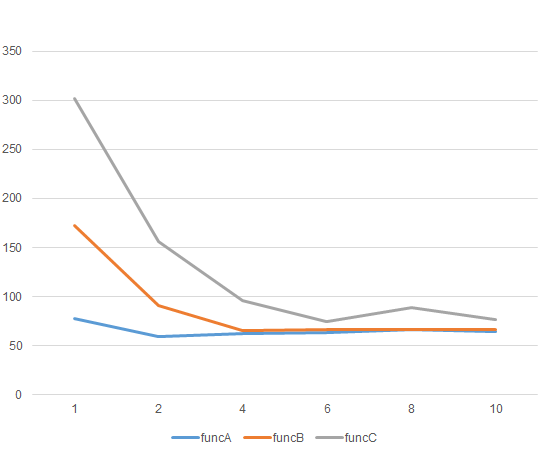

- funcA用了2核就饱和。

- funcB用了4核才饱和。

- funcC用了6核才饱和。

结论：要想利用全部CPU核心，避免mem-bound，需要func里有足够的计算量。

当**核心数量越多**，CPU计算能力越强，相对之下来不及从内存读写数据，从而**越容易mem-bound**。

### 内存信息查看工具：`dmidecode`

Linux系统查看内存信息：

```shell
sudo dmidecode -t memory
```

Windows查看内存信息：

```shell
Get-WmiObject Win32_PhysicalMemory
```

- 我此时在WSL2中进行测试，无法使用 dmidecode 因此我只能在Windows中使用Powershell进行测试
- Linux中的输出结果会与下面的不同，请自行测试

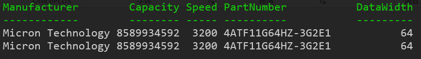

可以看到我的电脑上插了两根内存，频率为3200MHz，数据宽度是64位（8字节）

理论极限带宽 = 频率 * 位宽 * 数量(其实是通道数)

```shell
3200 * 8 * 2 = 51200 MB/s = 51.2 GB/s
```

- 频率相同的情况下，可以考虑插两块8GB的内存，比插一块16GB的内存更快
- 系统会自动在两者之间均匀分配内存，保证读写均匀分配到两个内存上，实现内存的并行读写，这和磁盘 RAID 有一定相似之处。

### 验证 `parallel_add` 是否充分利用了带宽

```cpp
#include <benchmark/benchmark.h>
#include <omp.h>
#include <x86intrin.h>

#include <array>
#include <cmath>
#include <cstdlib>
#include <cstring>
#include <iostream>
#include <vector>

constexpr size_t n = 1 << 28;  // 1GB 数据量

std::vector<float> a(n);

void BM_parallel_add(benchmark::State &bm) {
  for (auto _ : bm) {
#pragma omp parallel for
    for (size_t i = 0; i < n; i++) {
      a[i] = a[i] + 1;
    }
    benchmark::DoNotOptimize(a);
  }
}
BENCHMARK(BM_parallel_add);

BENCHMARK_MAIN();

// ----------------------------------------------------------
// Benchmark               Time               CPU      Iterations
// ----------------------------------------------------------
// BM_parallel_add  142888789 ns   141372940 ns             5
```

在这个例子中，我们使用了 1GB 的数据量（即 1024MB）。每次操作不仅需要读取数组 `a`，还要将计算结果写回，实际上传输了 2GB 的数据（即 2048MB）。

总耗时为 0.142888 秒，因此带宽为：

```cpp
带宽 = 2048MB / 0.142888s ≈ 14332 MB/s
```

然而，这个带宽显著低于理论最大带宽，原因可能涉及多种因素。

- 正常也不会出现这么大的差距，我在 WSL 环境下运行，可能会存在性能上的额外开销。

## 第二章：缓存与局域性

### 不同数据量对带宽的影响

进一步分析带宽的表现，我们尝试不同大小的数据量来测试带宽变化。

```cpp
#include <benchmark/benchmark.h>
#include <omp.h>
#include <x86intrin.h>

#include <array>
#include <cmath>
#include <cstdlib>
#include <cstring>
#include <iostream>
#include <vector>


constexpr size_t n = 1 << 28;

std::vector<float> a(n);

void BM_fill1GB(benchmark::State &bm) {
  for (auto _ : bm) {
    for (size_t i = 0; i < (1 << 28); i++) {
      a[i] = 1;
    }
  }
}
BENCHMARK(BM_fill1GB);

void BM_fill128MB(benchmark::State &bm) {
  for (auto _ : bm) {
    for (size_t i = 0; i < (1 << 25); i++) {
      a[i] = 1;
    }
  }
}
BENCHMARK(BM_fill128MB);

void BM_fill16MB(benchmark::State &bm) {
  for (auto _ : bm) {
    for (size_t i = 0; i < (1 << 22); i++) {
      a[i] = 1;
    }
  }
}
BENCHMARK(BM_fill16MB);

void BM_fill1MB(benchmark::State &bm) {
  for (auto _ : bm) {
    for (size_t i = 0; i < (1 << 18); i++) {
      a[i] = 1;
    }
  }
}
BENCHMARK(BM_fill1MB);

void BM_fill128KB(benchmark::State &bm) {
  for (auto _ : bm) {
    for (size_t i = 0; i < (1 << 15); i++) {
      a[i] = 1;
    }
  }
}
BENCHMARK(BM_fill128KB);

void BM_fill16KB(benchmark::State &bm) {
  for (auto _ : bm) {
    for (size_t i = 0; i < (1 << 12); i++) {
      a[i] = 1;
    }
  }
}
BENCHMARK(BM_fill16KB);

BENCHMARK_MAIN();

// Run on (16 X 3193.9 MHz CPU s)
// CPU Caches:
//   L1 Data 32 KiB (x8)
//   L1 Instruction 32 KiB (x8)
//   L2 Unified 512 KiB (x8)
//   L3 Unified 16384 KiB (x1)
// Load Average: 0.41, 0.19, 0.07
// -------------------------------------------------------
// Benchmark             Time             CPU   Iterations
// -------------------------------------------------------
// BM_fill1GB    113769230 ns    105016183 ns            6
// BM_fill128MB   13218453 ns     12201537 ns           60
// BM_fill16MB     1127547 ns      1040806 ns          609
// BM_fill1MB        14913 ns        13766 ns        52167
// BM_fill128KB       1636 ns         1510 ns       443754
// BM_fill16KB         165 ns          152 ns      4600303
```

**结果分析：**

可以看到，当数据量较小时，实际带宽反而超出了理论带宽。这是因为较小的数据集能够完全缓存到 CPU 的高速缓存中，避免了从内存访问的瓶颈。

当数据量增加时，带宽逐渐趋近于理论带宽，特别是数据量大到无法完全装入 L1 和 L2 缓存时，性能受限于内存带宽。

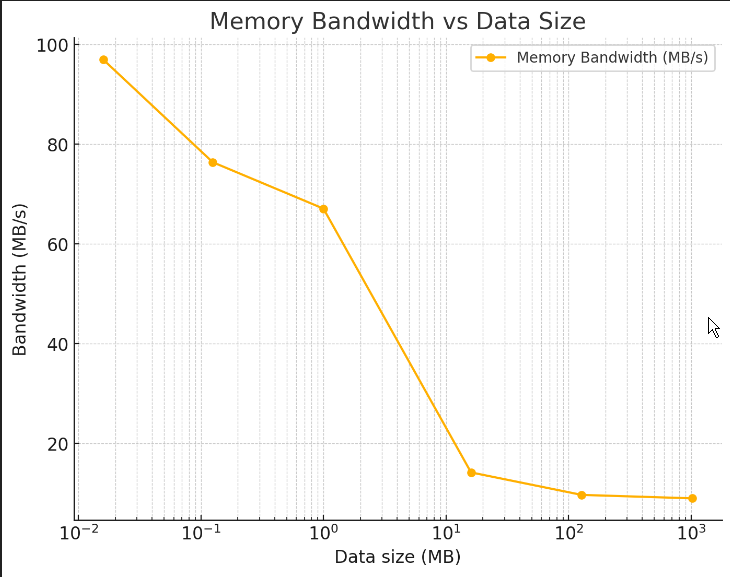

### CPU内部的高速缓存

CPU 厂商早已认识到内存延迟较高的问题，因此在 CPU 内部引入了多个级别的缓存，以减少访问内存时的延迟。缓存通常分为三级：

1. **L1 缓存**：速度最快，容量较小，通常为 32KB（每个核心独立）。
2. **L2 缓存**：较 L1 缓存大，约为 512KB（每个核心独立）。
3. **L3 缓存**：最大，通常为 8MB 到 16MB，所有核心共享。

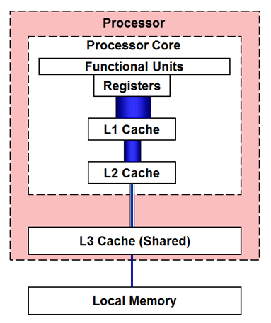

### CPU 缓存的工作原理

当 CPU 请求数据时，它首先检查 L1 缓存。如果数据不在 L1 缓存中，它会检查 L2 缓存，然后是 L3 缓存，最后从主内存加载。如果数据已经缓存，则直接从缓存中读取，显著减少访问延迟。

### 缓存的分级结构

注意，从下图我们可以看到，L1和L2缓存是每个核心都有一个，L3才是多个核心共用。

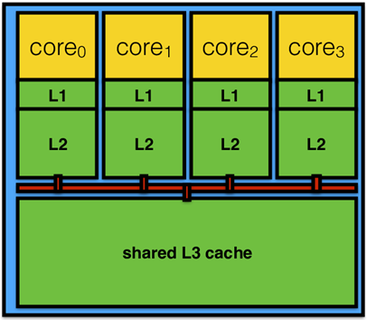

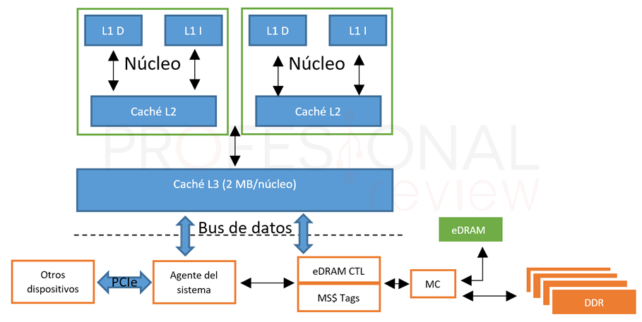

### 查看高速缓存大小：lscpu

可以看到我们 x86 电脑的缓存结构分为三级：

一级缓存分为**数据缓存**和**指令缓存**，其中数据缓存有 32 KB，8 个物理核心每个都有一个，总共 256 KB。而指令缓存的大小刚好和数据缓存一样也是 256 KB。

二级缓存有 512 KB，8 个物理核心每个都有一个，总共 4 MB。

三级缓存由各个物理核心共享，总共 16 MB。

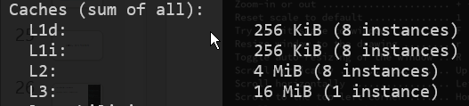

### 通过图形界面查看拓扑结构：lstopo

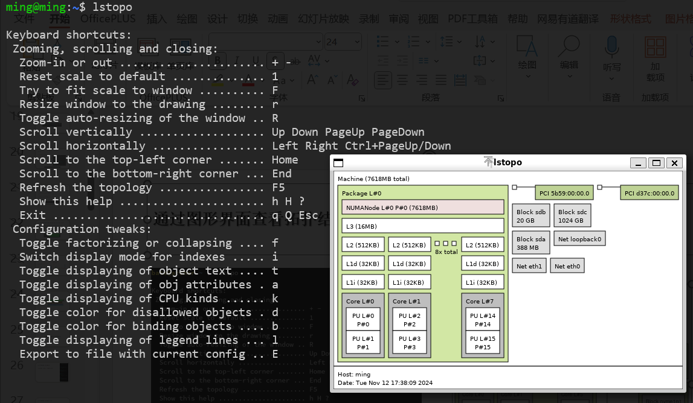

### 如何分析带宽测试结果

可以看到刚刚两个出现转折的点，也是在二级缓存和三级缓存的大小附近。


根据上面的图表，可以观察到在特定数据量下（如 128KB 到 16MB 区间），性能出现了转折点。这正是由于 CPU 缓存大小的影响：

- 当数据小到可以完全装入 **L2 缓存** 时，带宽接近 L2 缓存的带宽限制。
- 当数据量较大时，无法完全存入缓存，带宽受限于 **L3 缓存** 或主内存带宽。

结论：要避免mem-bound，数据量尽量足够小，如果能装的进缓存就高效了。

### 缓存的工作机制：读取操作

缓存中的数据结构如下：

```cpp
struct CacheEntry {
   bool valid;
   uint64_t address;
   char data[64];
};
CacheEntry cache[512];
```

当 CPU 请求读取一个地址时，缓存会检查是否存在与该地址匹配的条目。如果找到匹配项，则直接从缓存返回数据；如果没有找到，则向主内存发起读取请求，获取该地址的数据并创建一个新的缓存条目。

在 x86 架构中，每个缓存条目存储 64 字节数据，这也称为一个 **缓存行**（cacheline）。

例如，当 CPU 访问地址 0x0048~0x0050（即 4 字节）时，实际上会将从地址 0x0040 到 0x0080 范围内的 64 字节数据读取到缓存中。

这就是为什么我们喜欢把数据结构的起始地址和大小对齐到 64 字节，这样可以避免浪费缓存行的存储空间。

### 缓存的工作机制：写操作

当 CPU 向某个地址写入数据时，缓存会查找是否已有匹配的条目。如果找到，则直接修改缓存中的数据；如果没有找到，则会创建一个新的缓存条目来存储写入的数据，并将其标记为“脏”数据（dirty）。这意味着数据已经修改，但尚未写回主内存。

当读和写创建的新条目过多，缓存快要塞不下时，他会把最不常用的那个条目移除，这个现象称为**失效（invalid）**。如果那个条目是被标记为脏的，则说明是当时打算写入的数据，那就需要向主内存发送写入请求，等他写入成功，才能安全移除这个条目。

在多级缓存的情况下，如果一级缓存的条目被失效，它可能会被推送到二级缓存中。

### 连续访问与跨步访问

如果访问数组时，按一定的间距跨步访问，则效率如何？

```cpp
#include <benchmark/benchmark.h>  // 性能测试库 https://github.com/google/benchmark

#include <iostream>
#include <vector>

constexpr size_t n = 1 << 28;
std::vector<float> a(n);  // 1GB

void BM_skip1(benchmark::State &bm) {
  for (auto _ : bm) {
#pragma omp parallel for
    for (size_t i = 0; i < n; i += 1) {
      a[i] = 1;
    }
    benchmark::DoNotOptimize(a);
  }
}
BENCHMARK(BM_skip1);

void BM_skip2(benchmark::State &bm) {
  for (auto _ : bm) {
#pragma omp parallel for
    for (size_t i = 0; i < n; i += 2) {
      a[i] = 1;
    }
    benchmark::DoNotOptimize(a);
  }
}
BENCHMARK(BM_skip2);

void BM_skip4(benchmark::State &bm) {
  for (auto _ : bm) {
#pragma omp parallel for
    for (size_t i = 0; i < n; i += 4) {
      a[i] = 1;
    }
    benchmark::DoNotOptimize(a);
  }
}
BENCHMARK(BM_skip4);

void BM_skip8(benchmark::State &bm) {
  for (auto _ : bm) {
#pragma omp parallel for
    for (size_t i = 0; i < n; i += 8) {
      a[i] = 1;
    }
    benchmark::DoNotOptimize(a);
  }
}
BENCHMARK(BM_skip8);

void BM_skip16(benchmark::State &bm) {
  for (auto _ : bm) {
#pragma omp parallel for
    for (size_t i = 0; i < n; i += 16) {
      a[i] = 1;
    }
    benchmark::DoNotOptimize(a);
  }
}
BENCHMARK(BM_skip16);
// -----------------------------------------------------
// 从这以上的跨度在64字节以内，即一个缓存行(64字节)的大小，性能几乎没有变化
// -----------------------------------------------------

void BM_skip32(benchmark::State &bm) {  // 跨度达到128字节，两个缓存行的大小
  for (auto _ : bm) {
#pragma omp parallel for
    for (size_t i = 0; i < n; i += 32) {
      a[i] = 1;
    }
    benchmark::DoNotOptimize(a);
  }
}
BENCHMARK(BM_skip32);

void BM_skip64(benchmark::State &bm) {
  for (auto _ : bm) {
#pragma omp parallel for
    for (size_t i = 0; i < n; i += 64) {
      a[i] = 1;
    }
    benchmark::DoNotOptimize(a);
  }
}
BENCHMARK(BM_skip64);

// 从这开始考虑循环体中计算量的影响？
void BM_skip128(benchmark::State &bm) {
  for (auto _ : bm) {
#pragma omp parallel for
    for (size_t i = 0; i < n; i += 128) {
      a[i] = 1;
    }
    benchmark::DoNotOptimize(a);
  }
}
BENCHMARK(BM_skip128);

BENCHMARK_MAIN();

// -----------------------------------------------------
// Benchmark           Time             CPU   Iterations
// -----------------------------------------------------
// BM_skip1    149451119 ns    123965700 ns            5
// BM_skip2    146743331 ns    130556633 ns            6
// BM_skip4    139365011 ns    126241033 ns            6
// BM_skip8    138020192 ns    126339540 ns            5
// BM_skip16   140764814 ns    129937940 ns            5
// BM_skip32    70899946 ns     61722455 ns           11
// BM_skip64    40123197 ns     36640963 ns           19
// BM_skip128   38682167 ns     35637974 ns           19
```

在跨步从 1 到 16 时，访问效率差别不大，但从 32 开始，跨步增大才可以效率变快，而且变化呈现出以 2 的倍数递增的趋势。为什么会出现这种情况？

在跨步从 1 到 16 时，性能差异较小，这是因为访问的跨度都小于 64 字节（即一个缓存行的大小）。每次访问会加载整个缓存行，因此即使跨步增大，仍然需要读取相同的数据区域。

因为CPU和内存之间隔着缓存，而缓存和内存之间传输数据的最小单位是**缓存行（64字节）**。16 个 `float` 类型数据正好等于 64 字节，所以小于64字节的跨步访问，实际上这个数组的所有区域都被加载了一遍，因此并没有起到减少内存访问次数的效果。

只有超过64字节的跨步，中间的那个缓存行才不会被读取，实际上才减少了内存访问次数，因此变快了。

- 至于从128步幅(512字节)之后的效果，就需要考虑多级缓存的原因

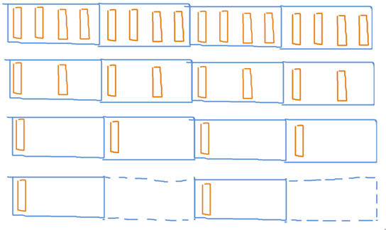

### 缓存行决定数据的粒度

结论：访问内存的用时，和访问的字节数量无关，和访问的每个字节所在的缓存行数量有关。

可见，能否很好的利用缓存，和程序访问内存的**空间局域性**有关。

所以我们设计数据结构时，应该把数据存储的尽可能紧凑，不要松散排列。最好每个缓存行里要么有数据，要么没数据，避免读取缓存行时浪费一部分空间。

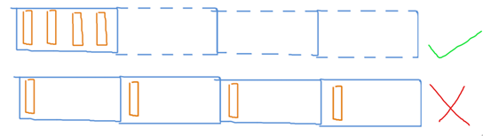

### 结构体布局分析

1. **结构体的基础布局**

定义一个结构体 `MyClass`：

```cpp
struct MyClass{
    float x;
    float y;
    float z;
};

MyClass mc;
```

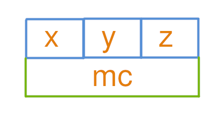

2. **AOS（Array of Struct）模式**

在 AOS 模式下，每个对象的属性存储在一起：

```cpp
struct MyClass{
    float x;
    float y;
    float z;
};

MyClass mc[4];
```

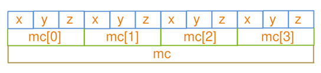

或者使用vector：

```cpp
struct MyClass{
    float x;
    float y;
    float z;
};

std::vector<MyClass> mc(4);
```

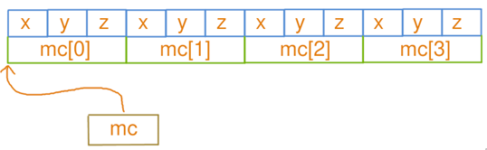

3. **SOA（Struct of Array）模式**

在 SOA 模式下，各属性分开存储在独立的数组中：

```cpp
struct MyClass{
    float x[4];
    float y[4];
    float z[4];
};

MyClass mc;
```

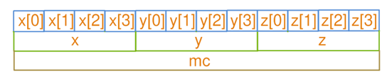

### AOS 与 SOA 的内存布局差异

- AOS（Array of Struct）单个对象的属性紧挨着存:

```
xyzxyzxyzxyz
```

- SOA（Struct of Array）属性分离存储在多个数组:

```
xxxxyyyyzzzz
```

AOS 必须对齐到 2 的幂才高效，SOA 就不需要。

AOS 符合直觉，不一定要存储在数组这种线性结构，而 SOA 可能无法保证多个数组大小一致。

SOA 不符合直觉，但通常是更高效的！

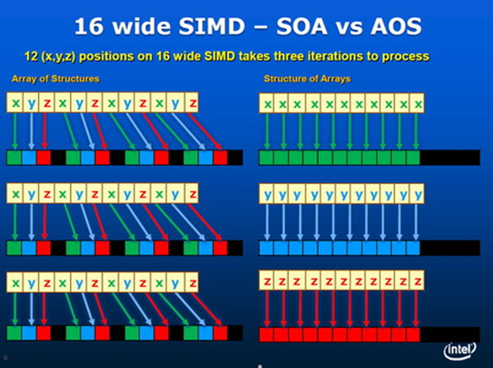

### AOS 和 SOA 的性能对比

在以下代码中进行 AOS 与 SOA 访问的性能基准测试：

```cpp
constexpr size_t n = 1 << 26;  // 512MB

void BM_aos(benchmark::State &bm) {
  struct MyClass {
    float x;
    float y;
    float z;
  };

  std::vector<MyClass> mc(n);

  for (auto _ : bm) {
#pragma omp parallel for
    for (size_t i = 0; i < n; i++) {
      mc[i].x = mc[i].x + mc[i].y;
    }
    benchmark::DoNotOptimize(mc);
  }
}
BENCHMARK(BM_aos);

void BM_soa(benchmark::State &bm) {
  std::vector<float> mc_x(n);
  std::vector<float> mc_y(n);
  std::vector<float> mc_z(n);

  for (auto _ : bm) {
#pragma omp parallel for
    for (size_t i = 0; i < n; i++) {
      mc_x[i] = mc_x[i] + mc_y[i];
    }
    benchmark::DoNotOptimize(mc_x);
    benchmark::DoNotOptimize(mc_y);
    benchmark::DoNotOptimize(mc_z);
  }
}
BENCHMARK(BM_soa);
// ------------------------------------------------------
// Benchmark            Time             CPU   Iterations
// ------------------------------------------------------
// BM_aos        99661522 ns     99652483 ns            6
// BM_soa        38090806 ns     37725700 ns           18
```

因为缓存行大小是64字节，它是从内存读写的最小单位。

而这里的AOS，它的MyClass有三个float，大小仅为12字节。

所以当修改MyClass的x属性时，必须读取整个MyClass，仅仅修改其中的x属性，然后写回。这就浪费了：y的写、z的写、z的读。实际用上的只有：x的读，y的读，x的写。浪费了50%带宽。

而SOA把三个属性分开存，每个属性作为独立的数组，稠密存储。这样当用不到z的时候，z数组就完全不会被读取，不会占用内存带宽，从而带宽利用率是100%，因此比AOS快了3倍。

### AOSOA：结合 AOS 与 SOA 优势

可以采用 AOS 外层结构，内部 SOA 的方式组织数据，即 AOSOA。这种布局在高层次上是 AOS，但每个元素内部分为 SOA。

```cpp
void BM_aosoa(benchmark::State &bm) {
  struct MyClass {
    float x[1024];
    float y[1024];
    float z[1024];
  };

  std::vector<MyClass> mc(n / 1024);

  for (auto _ : bm) {
#pragma omp parallel for
    for (size_t i = 0; i < n / 1024; i++) {
#pragma omp simd
      for (size_t j = 0; j < 1024; j++) {
        mc[i].x[j] = mc[i].x[j] + mc[i].y[j];
      }
    }
    benchmark::DoNotOptimize(mc);
  }
}
BENCHMARK(BM_aosoa);
// BM_aosoa      40478390 ns     39411800 ns           17
```

缺点是必须保证数量是 1024 的整数倍，而且因为要两次指标索引，随机访问复杂度较高。

这里的 1024 并非随意选取，而是要让每个属性 SOA 数组的大小为一个页（4KB）才能最高效，原因稍后会说明。

#### 注意，内部SOA的尺寸不宜太小

如果内部SOA太小，内部循环只有16次连续的读取，16次结束后就会跳跃一段，然后继续连续的读取。这会导致CPU预取机制失效，无法预测下一次要读哪里，等发现跳跃时已经来不及了，从而计算的延迟无法隐藏。

```cpp
void BM_aosoa_16(benchmark::State &bm) {
  struct MyClass {
    float x[16];
    float y[16];
    float z[16];
  };

  std::vector<MyClass> mc(n / 16);

  for (auto _ : bm) {
#pragma omp parallel for
    for (size_t i = 0; i < n / 16; i++) {
#pragma omp simd
      for (size_t j = 0; j < 16; j++) {
        mc[i].x[j] = mc[i].x[j] + mc[i].y[j];
      }
    }
    benchmark::DoNotOptimize(mc);
  }
}
BENCHMARK(BM_aosoa_16);
// ------------------------------------------------------
// Benchmark            Time             CPU   Iterations
// ------------------------------------------------------
// BM_aosoa_16   70791120 ns     70485190 ns           10
```

#### 如果每个属性都要访问到，那还是AOS比较好（AOSOA也不赖）

这是因为使用SOA会让CPU不得不同时维护很多条预取赛道（mc_x, mc_y, mc_z），当赛道多了以后每一条赛道的长度就变短了，从而能够周转的余地时间比较少，不利于延迟隐藏。

而如果把这三条赛道合并成一条（mc），这样同样的经费（缓存容量）能铺出的赛道（预取）就更长，从而CPU有更长的周转时间来隐藏他内部计算的延迟。所以本案例中AOS比SOA好。

```cpp
#include <benchmark/benchmark.h>
#include <omp.h>
#include <x86intrin.h>

#include <array>
#include <cmath>
#include <cstdlib>
#include <cstring>
#include <iostream>
#include <vector>

constexpr size_t n = 1 << 26;  // 512MB

void BM_aos(benchmark::State &bm) {
  struct MyClass {
    float x;
    float y;
    float z;
  };

  std::vector<MyClass> mc(n);

  for (auto _ : bm) {
#pragma omp parallel for
    for (size_t i = 0; i < n; i++) {
      mc[i].x += 1;
      mc[i].y += 1;
      mc[i].z += 1;
    }
    benchmark::DoNotOptimize(mc);
  }
}
BENCHMARK(BM_aos);

void BM_soa(benchmark::State &bm) {
  std::vector<float> mc_x(n);
  std::vector<float> mc_y(n);
  std::vector<float> mc_z(n);

  for (auto _ : bm) {
#pragma omp parallel for
    for (size_t i = 0; i < n; i++) {
      mc_x[i] += 1;
      mc_y[i] += 1;
      mc_z[i] += 1;
    }
    benchmark::DoNotOptimize(mc_x);
    benchmark::DoNotOptimize(mc_y);
    benchmark::DoNotOptimize(mc_z);
  }
}
BENCHMARK(BM_soa);

void BM_aosoa(benchmark::State &bm) {
  struct MyClass {
    float x[1024];
    float y[1024];
    float z[1024];
  };

  std::vector<MyClass> mc(n / 1024);

  for (auto _ : bm) {
#pragma omp parallel for
    for (size_t i = 0; i < n / 1024; i++) {
#pragma omp simd
      for (size_t j = 0; j < 1024; j++) {
        mc[i].x[j] += 1;
        mc[i].y[j] += 1;
        mc[i].z[j] += 1;
      }
    }
    benchmark::DoNotOptimize(mc);
  }
}
BENCHMARK(BM_aosoa);

BENCHMARK_MAIN();
// -----------------------------------------------------
// Benchmark           Time             CPU   Iterations
// -----------------------------------------------------
// BM_aos      106377677 ns     94455843 ns            7
// BM_soa      103557430 ns     99791333 ns            6
// BM_aosoa     99699631 ns     99136086 ns            7
```

### 结论：AOS、SOA、AOSOA 哪家强

```cpp
// fully SOA, **不适合**，仅适合小规模 SIMD
struct ParticleList {
  std::vector<float> pos_x;
  std::vector<float> pos_y;
  std::vector<float> pos_z;
  std::vector<float> vel_x;
  std::vector<float> vel_y;
  std::vector<float> vel_z;
};

// 部分 SOA，部分 AOS，**适合**，日常使用
struct ParticleList {
  std::vector<glm::vec3> pos;
  std::vector<glm::vec3> vel;
};

// AOSOA，**适合**，适合 HPC 专家
struct ParticleBlock {
  float pos_x[1024];
  float pos_y[1024];
  float pos_z[1024];
  float vel_x[1024];
  float vel_y[1024];
  float vel_z[1024];
};
using ParticleList = std::vector<ParticleBlock>;

// fully AOS, **不适合**，适合初学者
struct Particle {
  glm::vec3 pos;
  glm::vec3 vel;
};
using ParticleList = std::vector<Particle>;

```

若多个属性（如 `pos.x`, `pos.y`, `pos.z`）总是一起使用，可能都是同时读取同时修改的，AOS 可以减少预取压力。

当属性中有些并不总是一起访问或写入时，例如 `pos` 和 `vel`，通常 `pos+=vel` 的操作中 `pos` 是读写，而 `vel` 仅为只读，此时 SOA 更适合，因为能减少内存带宽的占用。

“将 `pos` 的 x、y、z 分量使用 AOS 存储”这个结论是单从内存访问效率来看的，但需要SIMD矢量化（例如 hw04 的情况），SOA或AOSOA可能更合适。

不过，对于非连续存储结构，如带有索引开销的稀疏哈希网格，SOA 可能并不适用。

AOSOA ：在高层保留 AOS 的统一索引，同时在底层享受 SOA 带来的矢量化和缓存行预取优势，只是随机访问的复杂度更高。。。

## 第三章：预取与直写

### 顺序访问与随机访问

随机访问的效率比顺序访问低的多。

```cpp

```

其中一个原因当然是：随机访问只会访问到其中一个float，而这导致他附近的64字节都被读取到缓存了，但实际只用到了其中4字节，之后又没用到剩下的60字节，导致浪费了94%的带宽。

虽说连续、顺序访问是最理想的，然而在使用哈希表等数据结构中，不可避免的会通过哈希函数得到随机的地址来访问，且Value类型可能小于64字节，浪费部分带宽。怎么办？

### 解决：按64字节分块地随机访问

解决方法就是，把数据按64字节大小分块。随机访问时，只随机块的位置，而块的内部仍然按顺序访问。

```

```

可以看到64字节分块的效果拔群，但还是比顺序访问慢一些，为什么？明明没有浪费带宽了？

### 缓存行预取技术：吃着一碗饭的同时，先喊妈妈烧下一碗饭

其实，当程序顺序访问 a[0], a[1] 时，CPU会智能地预测到你接下来可能会读取 a[2]，于是会**提前给缓存发送一个读取指令**，让他读取 a[2]、a[3]。缓存在后台默默读取数据的同时，CPU自己在继续处理 a[0] 的数据。这样等 a[0], a[1] 处理完以后，缓存也刚好读取完 a[2] 了，从而CPU不用等待，就可以直接开始处理 a[2]，避免等待数据的时候CPU空转浪费时间。

这种策略称之为预取（prefetch），由硬件自动识别你程序的访存规律，决定要预取的地址。一般来说只有线性的地址访问规律（包括顺序、逆序；连续、跨步）能被识别出来，而**如果你的访存是随机的，那就没办法预测**。遇到这种突如其来的访存时，CPU不得不空转等待数据的抵达才能继续工作，浪费了时间。

### 解决：按更大的分块（4096字节）随机访问

还可以把分块的大小调的更大一些，比如 4KB 那么大，即64个缓存行，而不是一个。

```cpp

```

这样一次随机访问之后会伴随着64次顺序访问，能被CPU检测到，从而启动缓存行预取，避免了等待数据抵达前空转浪费时间。

### 页对齐的重要性

为什么要 4KB？原来现在操作系统管理内存是用分页（page），程序的内存是一页一页贴在地址空间中的，有些地方可能不可访问，或者还没有分配，则把这个页设为不可用状态，访问他就会出错，进入内核模式。

因此硬件出于安全，预取不能跨越页边界，否则可能会触发不必要的 page fault。所以我们选用页的大小，因为本来就不能跨页顺序预取，所以被我们切断掉也无所谓。

另外，我们可以用 `_mm_alloc` 申请起始地址**对齐到页边界**的一段内存，真正做到每个块内部不出现跨页现象。

### 手动预取：`_mm_prefetch`

对于不得不随机访问很小一块的情况，还可以通过 _mm_prefetch 指令手动预取一个缓存行。

```cpp

```

这里第一个参数是要预取的地址（最好对齐到缓存行），第二个参数 `_MM_HINT_T0` 代表预取数据到一级缓存，`_MM_HINT_T1` 代表只取到二级缓存，`_MM_HINT_T2` 代表三级缓存；`_MM_HINT_NTA` 则是预取到非临时缓冲结构中，可以最小化对缓存的污染，但是必须很快被用上。

### 重新理解 mem-bound：延迟隐藏

之前提到，1次浮点读写必须伴随着32次浮点加法的运算量，否则和只有0次加法的耗时没有任何区别，即内存带宽成唯一瓶颈的mem-bound。可是按我们理解，“1次读写+0次加法”应该会比“1次读写+8次加法”快一点点吧，因为8次加法尽管比1次读写快很多，但是毕竟还是有时间的啊，为什么会几乎没有任何区别？

这都是得益于CPU的预取机制，他能够在等待a[i+1]的内存数据抵达时，默默地做着a[i]的计算，从而只要计算的延迟小于内存的延迟，延迟就被隐藏起来了，而不必等内存抵达了再算。这就是为什么有些运算量不足32次的程序还是会无法达到mem-bound，手动预取以后才能达到，就是因为硬件预取预测失败，导致不得不等内存抵达了才能算，导致延迟隐藏失败。隐藏成功：
