## 一、ASCII码

### 计算机如何表达字符

众所周知，计算机只能处理二进制整数，字符要怎么办呢？

于是就有了 ASCII 码表，它规定，每个英文字符（包括大小写字母、数字、特殊符号）都对应着一个整数。在计算机里只要存储这个的整数，就能代表这个字符了。

例如 32 代表空格，48 代表 ‘0’，65 代表 ‘A’，97 代表 ‘a’……

32~126 这些整数就用于是表示这些**可显示字符(printable character)**的。

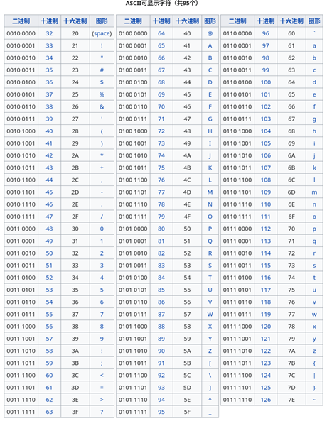

除了可显示字符(printable character)外，ASCII 还规定了一类特殊的**控制字符(control character)**：

- 0 表示空字符（‘\0’）

- 9 表示 Tab 制表符（‘\t’）

- 10 表示换行（‘\n’）
- 13 表示回车（‘\r’）
- 27 表示 ESC 键（‘\x1b’）
- 127 表示 DEL 键（‘\x7f’）等

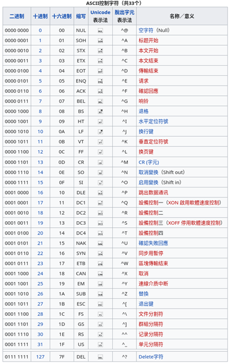

0~31 和 127 这些整数，就构成了 ASCII 码中控制字符的部分。

### 关于控制字符的冷知识

在 Linux 命令行中启动 cat。

试试按 Ctrl+R，Ctrl+E，Ctrl+C 等一系列组合键，看到出现了什么？

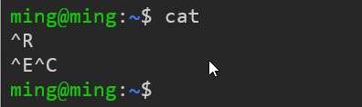

可以看到显示的字符变成了 ^R ^E ^C 等……

这是 Unix 类系统显示控制字符的一种方式。

众所周知，我们常用 Ctrl+C 来发送中断信号（SIGINT）强制终止程序，这时常常会看到一个 ^C 的字样，就是这样出现的。这里我们的 cat 程序收到 ^C 以后，就直接终止退出了。

除此之外，因为 ^D 是“传输终止符”，还可以在控制台输入 Ctrl+D 来关闭标准输入流，终止正在读取他的程序。

常用 Ctrl+D 来快速关闭一个 shell（和输入 exit 命令的效果一样）。

以及按 Ctrl+I 的效果其实和 Tab 键一样，按 Ctrl+J 的效果和 Enter 键一样，按 Ctrl+H 的效果和退格键一样。

这是因为 ASCII 表中规定 ^I 就是 ‘\t’，^J 就是 ‘\n’，^H 就是 ‘\b’，所以以前原始的计算机键盘上其实还没有 Enter 键，大家都是按 Ctrl+J 来换行的……

不过，如果直接在控制台输入 ‘^’ 和 ‘C’ 两个字符并没有 Ctrl+C 的效果哦！因为 ‘^C’ 是 Ctrl+C 输入之后一次性显示出来的，并不是真的说 Ctrl 就是 ‘^’ 这个字符。

## 二、C语言字符串

### C 语言中的字符类型 char

```c
char c = ‘a’;
assert(c == 97);
c = c + 1;
assert(c == ‘b’);
```

C语言中规定字符类型为 char 类型，是个 8 位整数。

这是因为 ASCII 码只有 0~127 这些整数，而 8 位整数的表示范围是 2^8 也就是 0~255，足以表示所有 ASCII 字符了（多余的部分实际上被用于表示中文）。

char 和整数无异，例如 ‘a’ 实际上会被编译器翻译成他对应的 ASCII 码：97。写 ‘a’ 和写 (char)97 是完全一样的，方便阅读的语法糖而已。

### “char即整数”思想

```cpp
#include <cstdio>

int main()
{
    char a = 'a';
    for (int i = 0; i < 26; i++)
    {
        printf("%c", a + i);
    }
    printf("\n");
    return 0;
}
// 输出：
// abcdefghijklmnopqrstuvwxyz
```

```cpp
#include <cstdio>
#include <cctype>

int main()
{
    char c = 'c';
    printf("原字符：%c\n", c);
    c -= 'a';
    c += 'A';
    printf("转大写：%c\n", c);
    return 0;
}
// 输出：
// 原字符：c
// 转大写：C
```

### c语言帮手函数

```cpp
#include <cstdio>
#include <cctype>

int main()
{
    char c = 'c';
    printf("原字符：%c\n", c);
    c = toupper(c);	//帮手函数
    printf("转大写：%c\n", c);
    return 0;
}
// 输出：
// 原字符：c
// 转大写：C
```

### 帮手函数大全

- isupper(c) 判断是否为大写字母（‘A’ <= c && c <= ‘Z’）。
- islower(c) 判断是否为小写字母（‘a’ <= c && c <= ‘z’）。
- isalpha(c) 判断是否为字母（包括大写和小写）。
- isdigit(c) 判断是否为数字（‘0’ <= c && c <= ‘9’）。
- isalnum(c) 判断是否为字母或数字（包括字母和数字）。
- isxdigit(c) 判断是否为十六进制数字（0~9 或 a-f 或 A-F）。
- isspace(c) 判断是否为等价于空格的字符（‘ ’ 或 ‘\t’ 或 ‘\n’ 或 ‘\v’ 或 ‘\r’）。
- iscntrl(c) 判断是否为控制字符（0 <= c && c <= 31 或 c == 127）。
- toupper(c) 把小写字母转换为大写字母，如果不是则原封不动返回。
- tolower(c) 把大写字母转换为小写字母，如果不是则原封不动返回。

### 关于cahr类型的一个冷知识

C 语言其实只规定了 **unsigned char 是无符号 8 位整数**，**signed char 是有符号 8 位整数**，而 **char 类型只需是 8 位整数即可，可以是有符号也可以是无符号**，任凭编译器决定（C 标准委员会传统异能，khronos 直呼内行）。

以 GCC 为例，他规定 char 在 x86 架构是有符号的 (char = signed char)，而在 arm 架构上则认为是无符号的 (char = unsigned char)，因为他认为“arm 的指令集处理无符号8位整数更高效”，所以擅自把 char 魔改成无符号的……

```cpp
#include <cstdio>
#include <type_traits>

int main()
{
    if (std::is_signed<char>::value)
    {
        printf("你的 char 是有符号的，我猜你是 x86 架构\n");
    }
    else
    {
        printf("你的 char 是无符号的，我猜你是 arm 架构\n");	//有arm架构电脑的话可以尝试一下
    }
    return 0;
}
// 输出：
// 你的 char 是有符号的，我猜你是 x86 架构
```

顺便一提，C++ 标准保证 char，signed char，unsigned char 是三个完全不同的类型，std::is_same_v 分别判断他们总会得到 false，无论 x86 还是 arm。

但是奇葩的 C 语言却规定 short，int，long，long long 必须是有符号的 (int = signed int)，反而却没有规定他们的位宽（没错，int 可以是 32 位，也可以是 16 位的，标准规定只需满足 char <= short <= int <= long <= long long 即可）。

### C语言中的字符串

**字符串(string)**就是由**字符(character)**组成的数组。

C 语言中，字符串用双引号 `“ ”` 包裹，字符用单引号 `‘ ’` 包裹。

```c
char c = ‘h’;
char s[] = “hello”;
```

正如 ‘h’ 是个语法糖，等价于 h 的 ASCII 码——整数 104。

“hello” 也是个语法糖，他等价于数组 {‘h’, ‘e’, ‘l’, ‘l’, ‘o’, 0}。

```cpp
#include <cstdio>

int main()
{
    char c = 'h';
    char s[] = {'h', 'e', 'l', 'l', 'o', 0};
    printf("字符：%c\n", c);
    printf("字符串：%s\n", s);
}
// 字符：h
// 字符串：hello
```

hello 每个字符都连续地排列在这个数组中，那么末尾的 0 是怎么回事？

原来 C 语言的字符串因为只保留数组的**首地址指针**（指向第一个字符的指针），在以 `char *` 类型传递给其他函数时，其数组的长度无法知晓。为了确切知道数组在什么地方结束，**规定用 ASCII 码中的“空字符”也就是 0 来表示数组的结尾**。这样只需要一个首地址指针就能表示一个动态长度的数组，高，实在是高。

### "0结尾字符串"应用举例

利用 C 语言字符串“以0结尾”这个特点，我们可以在一个本来非0的字符处写入0，来提前结束字符串。例如在第 n 个字符写入0，就会只保留前 n 个字符作为一个子字符串，删除后半部分。

```cpp
#include <cstdio>

int main()
{
    char s[] = "hello";
    printf("魔改前：%s\n", s);
    s[3] = 0;
    printf("魔改后：%s\n", s);
}
// 魔改前：hello
// 魔改后：hel
```

C 语言所谓的字符串类型 char * 实际上就是个首地址指针，如果让首地址指针向前移动 n 位，那就实现删除前 n 个字符的效果，而不用实际修改数组本身（更高效）。

```cpp
#include <cstdio>

int main()
{
    char s[] = "hello";
    printf("魔改前：%s\n", s);
    char *p = s + 3;
    printf("魔改后：%s\n", p);
}
// 魔改前：hello
// 魔改后：lo
```

### C语言转义符

```cpp
#include <cstdio>
int main(){
    char s[] = "hello\nworld";
    printf("字符串：%s\n", s);
    char c = '\n';	//可以切换为\t \b \r \\ \0等查看效果
    printf("字符: [%c]\n", c);
}
//输出：
//字符串：hello
//world
//字符：[
//]		\n换行作用
```

常见的转义符：

- ‘\n’ 换行符：另起一行（光标移到下一行行首）
- ‘\r’ 回车符：光标移到行首（覆盖原来的字符）
- ‘\t’ 缩进符：光标横坐标对齐到 8 的整数倍
- ‘\b’ 退格符：光标左移，删除上个字符
- ‘\\’ 反斜杠：表示这个是真的 \，不是转义符
- ‘\”’ 双引号：在字符串常量中使用，防止歧义
- ‘\’’ 单引号：在字符常量中使用，防止歧义
- ‘\0’ 空字符：标记字符串结尾，等价于 0

**注意：’\0’ 和整数 0 等价，但和 ‘0’ 不等价。‘0’ 相当于他的 ASCII 码 48。而 ‘\0’ 就是整数 0。**

### `%` 和 `\` 的异同

`%` 没什么好神秘的，他就是一个普通的字符。仅仅只是 printf 和 scanf 这些特定的函数会对 `%` 特殊处理而已。

而 `\` 比较厉害，他是编译器内部专门为他“开了个后门”。

编译器检测到字符串中出现 \ 就会把下一个字符特殊处理。而 `%`，编译器并不会特殊处理 `%`，是 printf 函数内部在运行时处理了 `%` 的下一个字符。

`%` 就像你和同学随手“拉钩”定下的约定，这是 printf 约定俗成的。`\` 就像正式合同，有法律效力的，这是 C 语言编译器规定好的。

```cpp
#include <cstdio>

int main()
{
    char s[] = {'%', 'd', '\n', 0};
    printf(s, 42);
}
// 输出：
// 42
```

## 三、C++字符串类

### std::string应运而生

C语言字符串操作繁琐，封装的 std::string 应运而生：

string 可以从 **const char *** 隐式构造：

```cpp
string s = “hello”;
```

string 具有 +、+=、== 等直观的运算符重载：

```cpp
string(“hello”) + string(“world”) == string(“helloworld”)
```

string 符合 vector 的接口，例如 begin/end/size/resize……

string 有一系列成员函数，例如 find/replace/substr……

string 可以通过 s.c_str() 重新转换回古板的 const char *。

string 在离开作用域时自动释放内存 (RAII)，不用手动 free

### C++字符串和C字符串的不同

C 语言字符串是单独一个 **char *ptr**，自动以 ‘\0’ 结尾。

C++ 字符串是 string 类，其成员有两个：`char *ptr`; `size_t len`;

- 第二个成员用来确定结尾的位置，不需要 ‘\0’ 结尾。

因此 string 类从 C 字符串构造时，可以额外指定一个长度：

- `string(“hello”, 3)` 会得到 “hel”
- ↑ len为 3，ptr指向 ’h’，只保留前三个字符
- `string(“hello”, 12)` 会得到 “hello\0[数据删除]”
- ↑ len为 12，ptr指向 ’h’，超出了 6 个字符，**内存读越界（出错）**
- `string(“hello\0world!”, 12)` 会得到 “hello\0world!”
- ↑ len为 12，ptr指向 ’h’，字符串内可以包含 ‘\0’，cout 能正常打印完整字符串

### iostream应运而生

printf 指定类型繁琐，泛型的 iostream 应运而生。

printf 必须告诉他是字符串（%s）还是整数（%d）还是字符（%c），必须和右边的参数一致，初学者容易搞错。

```cpp
#include <cstdio>
#include <cstdlib>
#include <cstring>

int main()
{
    char s1[] = "hello";
    char s2[] = "world";
    char *s3 = (char *)malloc(strlen(s1) + strlen(s2) + 1);
    strcpy(s3, s1);
    strcat(s3, s2);
    printf("%s\n", s3);
    free(s3);
}
// helloworld
```

而且即使搞错了也能正常编译通过（一些高级的编译器会给出警告），但是运行结果不对，或者还有可能崩溃。

```cpp
#include <cstdio>
int main(){
    printf("%s\n", 42);
}
// 报错：
// Segmentation fault (core dumped)
```

得益于 C++ 的重载技术，cout 不用你手动指定类型，他会自动识别参数的类型，帮你调用相应的格式化函数。

```cpp
#include <cstdio>
#include <string>

using namespace std;

int main() {
    string s1 = "hello";
    string s2 = "world";
    string s3 = s1 + s2;	// 重载 +
    cout << s3 << endl;
}
// helloworld
```

### `c_str`和`data`的区别

***具体区别取决于编译器实现：***

s.c_str() 保证返回的是以 0 结尾的字符串首地址指针，总长度为 s.size() + 1。

s.data() 只保证返回长度为 s.size() 的连续内存的首地址指针，**不保证** 0 结尾。

把 C++ 的 string 作为参数传入像 printf 这种 C 语言函数时，需要用 s.c_str()。

如果只是在 C++ 函数之间传参数，直接用 string 或 string const & 即可。

不建议在c++中还转换成c语言的字符串再操作

```cpp
void legacy_c(const char *name);	// 这个函数是古老的 C 语言遗产
void modern_cpp(std::string name);	// 这个函数是现代 C++，便民！
void performance_geek(std::string const &name);	// 有点追求性能的极客
void performance_nerd(std::string_view name);	// 超级追求性能的极客
```

const char * 可以隐式转换为 string（为了方便）

string **不可以**隐式转换为 const char *（安全起见）

如果确实需要从 string 转换为 const char *，请调用 .c_str() 这个成员函数。

### 字符串的连接（`+` 运算符）

C 语言规定，双引号包裹的字符串是 const char * 类型的，他们没有 + 运算符。

C++ 为了向前兼容，没办法改变 C 语言的这项规定，只能退而求其次，他另外定义了一个 string 类，重载了 + 运算符，并告诉同学们：以后尽量用我这个封装好的类，不要直接用 C 语言的 const char *。

因此如果需要把两个字符串加在一起，就必须至少有一方是 string 才行。

可以用 string(“hello”) 这种形式包裹住每个字符串常量，这样就方便用 + 了。

```cpp
#include <cstdio>
#include <string>
#include <iostream>

using namespace std;

int main()
{
    string s3 = string("hello") + string("world");
    cout << s3 << endl;
}
// helloworld
```

初学者建议每个字符串都用 string(“...”) 这种形式写，C 语言字符串不安全。

```cpp
“hello” + “world”	// 错误
string(“hello”) + “world”	// 正确
“hello” + string(“world”)	// 正确
string(“hello”) + string(“world”)	// 正确（推荐）
```

### 自定义字面量后缀	C++14的新特性

不少同学就觉得这样好麻烦，其他语言都是直接 “hello” 就是字符串类型，C++ 还得套一层壳 string(“hello”) 才能变成安全封装的类型，才能用他的成员函数。

因此，C++14 引入了一项缓解“键盘压力”的新特性：

```cpp
#include <cstdio>
#include <iostream>
#include <string>

using namespace std;

string operator""_s(const char* s, size_t len) { return string(s, len); }

int main() {
  string s3 = "hello"_s + "world"_s;
  cout << s3 << endl;
}
// helloworld
```

写 `“hello”_s` 就相当于写 `operator“”_s(“hello”, 5)`，就相当于 `string(“hello”, 5)` 了。

为什么还需要指定长度 5？其实不指定也可以，就是 “hello\0world” 会退化成 “hello”，因为 cpp 字符串没要求一定是 ‘\0’ 结尾，字符串里是可以包含 ‘\0’ 的。

如果你 `using namespace std;` 其实标准库已经自动帮你定义好了 `“”s` 后缀。

这里 “hello”s 就等价于原本繁琐的 string(“hello”) 了。

```cpp
#include <cstdio>
#include <iostream>
#include <string>

using namespace std;

int main() {
  string s3 = string("hello") + string("world");
  cout << s3 << endl;
}
// helloworld
```

如果你觉得 using namespace std; 太危险了不想用他。

可以只用 `using namespace std::literials;`

这个特殊的命名空间里包含了所有的 `operator“”` 函数。

```cpp
using namespace std::literals;
```

- chrono 和 complex 也定义了一些 literials

## 四、字符串 <---->数字

java 经典操作：字符串 + 数字 = 字符串

在 java 中，你可以直接把字符串和数字相加，例如：

`“you have ” + 42 + “ yuan”` 会得到 “you have 42 yuan”。

他实际上是先把 42 变成 “42”，再把三个字符串相加的，也就是说 java 编译器会偷偷把他转换成：“you have ” + 42.toString() + “ yuan”。

但是我们说过 cpp 是不喜欢在编译器里开洞的，他的字符串类型 std::string 是在标准库里定义的，并不是在编译器内部定义的（cpp之父：语言本身要和标准库具体实现解耦）如果你嫌弃标准库不好用，也可以定义一个自己的字符串类型 mylib::String 重载个 + 运算符，和标准库的 std::string 其实是同等地位的。

虽然也可以给 std::string 定义很多个不同的 + 重载，每个针对不同的数字类型（int、float、double）排列组合，但是这样没有可扩展性，而且影响编译速度。

所以 cpp 说，你必须手动把 42 先转换为字符串，然后再和已有的字符串相加：

`“you have ” + std::to_string(42) + “ yuan”`

### std::to_string 数字转字符串

std::to_string 是标准库定义的全局函数，他具有9个重载：

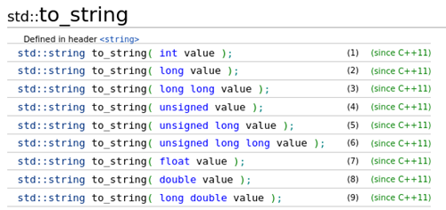

为什么把 to_string 作为全局函数，而不是 string 类的构造函数？

- 因为 cpp 之父喜欢解耦，他不想让数字转字符串这个特定的需求，和字符串本身的实现有太多耦合。

```cpp
#include <string>
#include <iostream>

using namespace std;

int main(){
    int n = 42;
    auto s = to_string(n) + "yuan"s;
    cout << s << endl;
}
// 42 yuan
```

### std::to_wstring 数字转宽字符串

同理还有 to_wstring，用于把数字转换为 wstring 类型字符串。

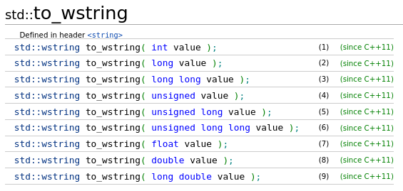


### std::sto* 字符串转数字

std::stoi/stof/stod 是标准库定义的一系列全局函数：

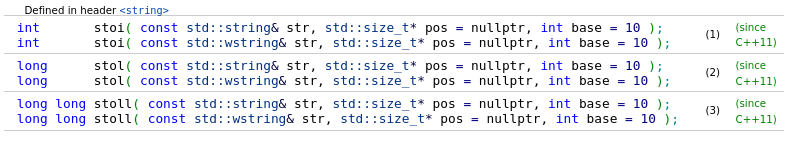

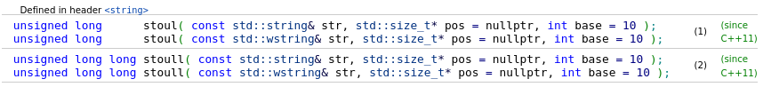

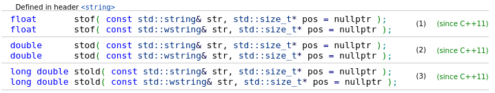

应用举例：

```cpp
#include <iostream>
#include <string>

using namespace std;

int main() {
  auto s = "42"s;	//字符串是数字
  int n = stoi(s);
  cout << n << endl;
}
// 42
```

```cpp
#include <iostream>
#include <string>

using namespace std;

int main() {
  auto s = "42 yuan"s;	// 字符串中数字后面还有其他字符
  int n = stoi(s);
  cout << n << endl;
}
// 42	成功解析
```

```cpp
#include <iostream>
#include <string>

using namespace std;

int main() {
  auto s = "    42 yuan"s;	//数字前面还有一些空格
  int n = stoi(s);
  cout << n << endl;
}
// 42	成功解析
```

```cpp
#include <iostream>
#include <string>

using namespace std;

int main() {
  auto s = "the 42 yuan"s;	//数字前面有其他字符，则不能解析
  int n = stoi(s);
  cout << n << endl;
}
// 报错：
// terminate called after throwing an instance of 'std::invalid_argument'
//  what():  stoi
```

### stoi 的第二参数：&pos

stoi 可以处理数字后面有多余字符的情况，例如 stoi(“42yuan”) 和 stoi(“42”) 等价，都会返回 42。后面的 “yuan” 会被 stoi 略去。

那如何才能知道哪些字符被 stoi 略去了呢？或者说，**数字部分从哪里结束**？

这就要用到 stoi 的第二参数，他是一个 size_t 的指针，默认为 nullptr。

```cpp
int stoi(const std::string& str, std::size_t pos = nullptr, int base = 10);
```

若该指针不为 nullptr，则会往他指向的变量写入一个整数，表示**数字部分结束的那个字符所在的位置**，很绕口？来看个例子就懂了。

例如 stoi(“42yuan”, &pos) 会返回 42，并把 pos 设为 2。因为 ‘y’ 是数字部分结束的地方，而 ‘y’ 是第三个字符，但是计算机数数从 0 开始，所以计算机说这是第 2 个字符，没毛病。

- 为什么要指针？因为 stoi 的返回值已经是 int 了，要额外的返回值只能这样。

```cpp
#include <iostream>
#include <string>

using namespace std;

int main() {
  string s = "42yuan"s;
  size_t pos;
  int n = stoi(s, &pos);
  cout << "原始字符串: " << s << endl;
  cout << "数字部分从第" << pos << "个字符结束" << endl;
  cout << "数字是" << n << endl;
  cout << "剩余的部分是" << s.substr(pos) << endl;
}
// 原始字符串: 42yuan
// 数字部分从第2个字符结束
// 数字是42
// 剩余的部分是yuan
```

### stoi 抛出异常的情况

如果字符串的开头不是数字，则 stoi 会抛出 `std::invalid_argument` 异常，可以用 catch 捕获。

```cpp
#include <iostream>
#include <string>

using namespace std;

int main() {
  auto s = "happy 10th birthday"s;	//数字前面有其他字符，则不能解析
  cout << "字符串：" << s << endl;
  int n = stoi(s);
  cout << "数字是：" << s << endl;
}
// 字符串：happy 10th birthday
// terminate called after throwing an instance of 'std::invalid_argument'
//  what():  stoi
```

但是开头可以有空格，例如 stoi(“ 42yuan”) 可以正常得到 42，但 stoi(“my42yuan”) 就会出错。

开头也可以是正负号（‘+’ 或 ‘-’），会被当成数字的一部分，例如 stoi(“-42”) 会得到 -42。

### stoi 的第三参数：base

有时候我们的字符串里是十六进制的数字，如何解析呢？例如 “7cfe”。

这就要用到 stoi 的第三个参数 base 了，他默认为 10，代表十进制。

```cpp
int stoi(const std::string& str, std::size_t pos = nullptr, int base = 10);
```

如果需要解析十六进制的数字就把 base 设为 16，八进制就让 base 为 8。

因为指定第三参数前需要先指定第二参数，如果不用第二参数，写个 nullptr 就行了，例如 `stoi(“7cfe”, nullptr, 16)` 会得到 31198（0x7cfe 的十进制）。

注意：stoi 默认是十进制的，如果写 `stoi(“7cfe”)` 会得到 7，因为他只认识 ‘7’ 是数字，把 “cfe” 看做额外字符忽略掉了（因为 c 不是十进制意义下的数字）。

十六进制的字母无视大小写，例如 stoi(“7CFE”, nullptr, 16) 的也会得到 31198。

```cpp
#include <iostream>
#include <string>

using namespace std;

int main() {
  string s = "4399cc"s;
  cout << "原始字符串" << s << endl;
  cout << "作为十六进制" << stoi(s, nullptr, 16) << endl;  // 0x4399cc
  cout << "作为十进制" << stoi(s, nullptr, 10) << endl;    // 4399
  cout << "作为八进制" << stoi(s, nullptr, 8) << endl;     // 043
}
// 原始字符串4399cc
// 作为十六进制4430284
// 作为十进制4399
// 作为八进制35
```

### 冷知识：stod支持科学计数法

```cpp
#include <functional>
#include <iostream>
#include <string>

using namespace std;

int main() {
  string s = "+03.14e-03"s;
  cout << "字符串: " << s << endl;
  float f = stof(s);
  cout << "浮点数: " << f << endl;
}
// 字符串: +03.14e-03
// 浮点数: 0.00314
```

### to_string 能不能指定十六进制？

很遗憾，to_string 是个缓解“键盘压力”的帮手函数，功能根本不全。

用 + 来拼接字符串也只是初学者的做法，他们并不是专业的字符串格式化工具。

想要完整的功能（**指定多少进制，左右对齐等**），可以用专业的做法：

1. 古代 C 语言的 sprintf

2. 古代 C++ 的 stringstream

3. C++20 新增的 std::format

4. 第三方库提供的 fmt::format（https://github.com/fmtlib/fmt）

5. 参考B站小彭老师在 zeno 里手撸的两个函数（能支持任意 STL 容器的打印）：
   1. https://github.com/zenustech/zeno/blob/master/zeno/include/zeno/utils/to_string.h
   2. https://github.com/zenustech/zeno/blob/master/zeno/include/zeno/utils/format.h

## 五、字符串流

### cout 支持十六进制

```cpp
#include <iomanip>
#include <iostream>
#include <string>

using namespace std;

int main() { cout << "十六进制：" << hex << 42 << endl; }
// 十六进制：2a
```

### 使用stringstream 取代 to_string

官方推荐用 stringstream 取代 to_string

cout 这么方便，能不能让他不要直接输出到控制台，而是把结果存到一个字符串呢？这正是字符串流 stringstream 的作用。

```cpp
#include <iomanip>
#include <iostream>
#include <sstream>
#include <string>

using namespace std;

int main() {
  stringstream ss;
  ss << "十六进制：" << hex << 42;
  string s = ss.str();	//重新获取
  cout << s << endl;
}
// 十六进制：2a
```

和 cout 完全一样，同样的 << 和 hex 选项。但是他的输出会保存到一个字符串里。

调用成员函数 .str() 就能取出这个字符串了。之后这个字符串就可以用作其他用途，比如printf 打印，或者用于查询数据库，都没问题。

这里比较无聊，最后还是直接输出到了 cout。

### stringstream 也可以取代 stoi

刚刚展示了 stringstream 模仿 cout 的方法。

stringstream 也可以模仿 cin，用 >> 即可。

```cpp
#include <iomanip>
#include <iostream>
#include <sstream>
#include <string>

using namespace std;

int main() {
  string s = "42yuan"s;
  stringstream ss(s);
  int num;
  ss >> num;
  string unit;
  ss >> unit;
  cout << "数字：" << num << endl;
  cout << "单位：" << unit << endl;
}
// 数字：42
// 单位：yuan
```

总结：

`<<` 可以模仿 cout，取代 to_string。

`>>`可以模仿 cin，取代 stoi/stof/stod。

最重要的是他支持各种控制选项（如 hex）， 功能性比 to_string 和 stoi 更强大。

要导入他，只需 `#include <sstream>` 即可。

## 六、字符串常用操作

### at 获取指定位置的字符

s.at(i) 和 s[i] 都可以获取字符串中的第 i 个字符。

区别在于 at 如果遇到 i 越界的情况，也就是检测到 `i ≥ s.size()` 时，会抛出 `std::out_of_range` 异常终止程序。使用 gdb 等调试器就可以在出这个异常的时候暂停，帮你调试错误。也可以从外部函数 catch 住这个异常（以后再讲）。

而 `[]` 则不会抛出异常，他只是简单地给字符串的首地址指针和 i 做个加法运算，得到新的指针并解引用。如果你给的 i 超过了字符串大小 i ≥ s.size()，那程序的行为是未定义的，因为这个地方可能有其他的对象，程序可能会奔溃，也可能行为异常。如果是互联网程序，还可能会被黑客利用，窃取或篡改服务器上的数据。

- 那为什么还要 `[]`？**性能！**at 做越界检测需要额外的开销，`[]` 不需要。
- 所以 `[]` 更高效，at 更安全。遇到诡异 bug 时，试试把 `[]` 都改成 at。

```cpp
#include <string>
#include <iostream>

using namespace std;

int main() {
    string s = "helloworld"s;
    cout << "第0个字符:  " << s[0] << endl;
    cout << "第3个字符:  " << s[3] << endl;
    cout << "第16个字符: " << s[16] << endl;
    cout << "第0个字符:  " << s.at(0) << endl;
    cout << "第3个字符:  " << s.at(3) << endl;
    cout << "第16个字符: " << s.at(16) << endl;
}
// 第0个字符:  h
// 第3个字符:  l
// 第16个字符: ??
// 第0个字符:  h
// 第3个字符:  l
// terminate called after throwing an instance of 'std::out_of_range'
//   what():  basic_string::at: __n (which is 16) >= this->size() (which is 10)
```

### 获取字符串长度的两种写法。。。

s.length() 和 s.size() 等价。

其中 size 是和 vector 一样的名字，方便程序员理解。

但是为什么标准委员会还要发明一个一模一样的 length？	“孔乙己直呼内行”

```cpp
#include <iostream>
#include <string>
#include <string_view>

using namespace std;

int main() {
  string s = "hello";
  cout << s.size() << endl;
  cout << s.length() << endl;
}
// 5
// 5
```

### substr 切下一段子字符串

```cpp
// 函数原型为：
string substr(size_t pos = 0, size_t len = -1) const;
```

substr(pos, len) 会截取从第 pos 个字符开始，长度为 len 的子字符串，原字符串不会改变。

如果原字符串剩余部分长度不足 len，则返回长度小于 len 的子字符串而不会出错。

如果 pos 超出了原字符串的范围，则抛出 std::out_of_range 异常（和 at 同款的哦）。

可以指定 len 为 -1（即 string::npos），此时会截取从 pos 开始直到原字符串末尾的子字符串。

不指定第二参数 len 时，默认的 len 就是 -1（见下方第三个例子）。

例如：

```cpp
"hello".substr(1, 3) = “ell”
"hello".substr(1, 99) = “ello”
"hello".substr(1) = “ello”
"hello".substr(0, 3) = “hel”
"hello".substr(99, 3) = 抛出 std::out_of_range 异常
```

```cpp
#include <iostream>
#include <string>

using namespace std;

int main() {
  string s = "helloworld"s;
  cout << "从第2个字符开始长为5的子字符串:    " << s.substr(2, 4) << endl;
  cout << "从第2个字符开始长为99的子字符串:   " << s.substr(2, 99) << endl;
  cout << "从第2个字符开始直到末尾的子字符串: " << s.substr(2) << endl;
  cout << "从头开始长为5的子字符串:           " << s.substr(0, 4) << endl;
  cout << "从第100个字符开始长为5的子字符串:  " << s.substr(100, 5) << endl;
}
// 从第2个字符开始长为5的子字符串:    llow
// 从第2个字符开始长为99的子字符串:   lloworld
// 从第2个字符开始直到末尾的子字符串: lloworld
// 从头开始长为5的子字符串:           hell
// terminate called after throwing an instance of 'std::out_of_range'
//   what():  basic_string::substr: __pos (which is 100) > this->size() (which
//   is 10)
```

### find 寻找子字符串

#### 单个字符

```cpp
// find 拥有众多重载，我们一个个来看。
size_t find(char c, size_t pos = 0) const noexcept;
size_t find(string_view svt, size_t pos = 0) const noexcept;
size_t find(string const &str, size_t pos = 0) const noexcept;
size_t find(const char *s, size_t pos = 0) const;
size_t find(const char *s, size_t pos, size_t count) const;
```

- 为什么最后两个重载没有标记 noexcept？历史原因，实际上 find 函数都是不会抛出异常的，他找不到只会返回 -1。

```cpp
#include <iostream>
#include <string>

using namespace std;

int main() {
  string s = "helloworld"s;
  cout << "寻找h的结果：" << s.find('h') << endl;
  cout << "寻找e的结果：" << s.find('e') << endl;
  cout << "寻找l的结果：" << s.find('l') << endl;
  cout << "寻找o的结果：" << s.find('o') << endl;
  cout << "寻找H的结果：" << s.find('H') << endl;
  cout << "(size_t) -1：" << (size_t)-1 << endl;
}
// 寻找h的结果：0
// 寻找e的结果：1
// 寻找l的结果：2
// 寻找o的结果：4
// 寻找H的结果：18446744073709551615
// (size_t) -1：18446744073709551615
```

find(‘c’) 会在字符串中查找字符 ‘c’，如果找到，返回这个字符第一次出现所在的位置。如果找不到，返回 -1。

- 注意：如果原字符串中 ‘c’ 出现了多次，则只会返回第一个出现的位置。例如 “icatchthecat”.find(‘c’) 会返回 1，因为他找到的是第二个字符 ‘c’，而计算机数数从 0 开始，所以他认为是第 1 个没毛病。

find(‘c’, pos) 会在字符串中查找字符 ‘c’，不同的是他会从第 pos 个字符开始，例如 “icatchthecat”.find(‘c’, 3) 会返回 4，因为是从第 3 个字符 ‘t’ 开始查找（人类看来是第四个），所以第一个 ‘c’ 被略过。

如果 pos 所在的位置刚好就是 ‘c’，那么会返回 pos，例如 “icatchthecat”.find(‘c’, 4) 会返回 4。

#### (size_t)-1 更专业的写法

其实 string 类里定义了一个静态常量 npos，其值为 (size_t)-1。

```cpp
#include <iostream>
#include <string>

using namespace std;

int main() {
  string s = "helloworld"s;
  cout << boolalpha;
  cout << "h: " << (s.find('h') != string::npos) << endl;
  cout << "z: " << (s.find('z') != string::npos) << endl;
}
// h: true
// z: false
```

我们使用时，可以用 std::string::npos 代替看起来很不专业的 -1。

因此，要查询一个字符串是否包含某一字符，可以写：

```cpp
s.find(c) != string::npos
s.find(c) != s.npos
s.find(c) != (size_t)-1
s.find(c) != -1
```

都是等价的

#### 子字符串

同理也有 `find("str", pos)` 是从第 pos 个字符开始查找子字符串 “str”，例如

`"hellohello".find("lo", 4)` 会得到 8，因为 pos 为 4，前四个字符被排除掉了，这样其实等价于 `"ohello".find("lo") + 4`。

此外还有 `find("str", pos, len)` 和`find("str".substr(0, len), pos)` 等价，用于要查询的字符串已经确定长度，或者要查询的字符串是个切片（string_view）的情况。若不指定这个长度 len，则默认是 C 语言的 0 结尾字符串，find 还要去求 len = strlen(“str”)，相对低效。

```cpp
#include <iostream>
#include <string>

using namespace std;

int main() {
  string s = "helloworld"s;
  cout << boolalpha;
  cout << "lo: " << s.find("lo") << endl;
  cout << "wo: " << s.find("wo") << endl;
  cout << "ma: " << s.find("ma") << endl;
}
// lo: 3
// wo: 5
// ma: 18446744073709551615
```

#### find应用案例：计算子字符串出现了多少次

```cpp
#include <iostream>
#include <string>

using namespace std;

size_t count(string const &str, string const &sub) {
  size_t n = 0, pos = 0;
  while (true) {
    pos = str.find(sub, pos);
    if (pos == str.npos) break;
    ++n;
    pos += sub.size();
  }
  return n;
}

int main() { cout << count("helloworld,bellreally"s, "ll"s) << endl; }
// 3
```

#### 反向查找 rfind

find 是从字符串头部开始查找，返回第一次出现的地方。

而 rfind 则是从尾部开始查找，返回最后一次出现的地方。

例如 `“helloworld”.rfind(‘l’)` 会返回 8，因为 rfind 是优先从尾部开始查找的。

rfind 和 find 的最坏复杂度都为 O(n)，最好复杂度都为 O(1)。

#### find_first_of 寻找集合内任意字符

```cpp
size_t find_first_of(string const &s, size_t pos = 0) const noexcept;
size_t find_first_of(const char *s, size_t pos = 0) const noexcept;
size_t find_first_of(const char *s, size_t pos, size_t n) const noexcept;
```

`"str".find_first_of("chset", pos)` 会从第 pos 个字符开始，在 “str” 中找到第一个出现的 ‘c’ 或 ‘h’ 或 ‘s’ 或 ‘e’ 或 ‘t’ 字符，并返回他所在的位置。如果都找不到，则会返回 -1（string::npos）。

没错，这个 “chset” 是个字符的**集合**，顺序无所谓，重复没有用。

如果不指定 pos，默认为 0，从头开始查找。

其实 `s.find_first_of(“chset”)` 等价于 `min(s.find(‘c’), s.find(‘h’), s.find(‘s’), s.find(‘e’), s.find(‘t’))`。

```cpp
#include <iostream>
#include <string>

using namespace std;

int main() {
  string s = "helloworld"s;
  int n = s.find_first_of("onl");
  cout << n << endl;
}
// 2
```

#### 应用案例：按空格分割字符串

刚刚说 ASCII 的时候提到过 isspace 这个函数，他会把 ‘ ’、‘\t’、‘\v’、‘\f’、‘\n’、‘\r’ 识别为空格（因为他们显示出来的确都是空的），我姑且称之为空格类字符（whitespace）。

如何找到第一个出现的空格类字符？如果要找第一个出现的空格，可以用 s.find(‘ ’)，如果要找到第一个出现的空格类字符？空格类字符是一个集合 {‘ ’, ‘\t’, ‘\v’, ‘\f’, ‘\n’, ‘\r’}，可以作为一个字符串来传给 find_first_of，例如：s.find_first_of(“ \t\v\f\n\r”)。

```cpp
#include <iostream>
#include <string>
#include <vector>

using namespace std;

vector<string> split(string s) {
  vector<string> ret;
  size_t pos = 0;
  while (true) {
    size_t newpos = s.find_first_of(" \t\v\f\n\r", pos);
    if (newpos == s.npos) {
      ret.push_back(s.substr(pos, newpos));
      break;
    }
    ret.push_back(s.substr(pos, newpos - pos));
    pos = newpos + 1;
  }
  return ret;
}

int main() {
  string s = "hello world\tpyb teacher\ngood job"s;
  vector<string> v = split(s);
  for (auto const &vi : v) {
    cout << vi << endl;
  }
  cout << sizeof(string) << endl;
}
// hello
// world
// pyb
// teacher
// good
// job
// 32
```

#### find_first_not_of 寻找不在集合内的字符

```cpp
#include <iostream>
#include <string>
#include <vector>

using namespace std;

int main() {
  string s = "hello world, pyb teacher? good job!"s;
  int n = s.find_first_not_of(" abcdefghijklmnopqrstuvwxyz");
  cout << n << endl;
}
// 11
```

#### 举一反三：find_last_of、find_last_not_of

- find 的反向版本是 rfind。

- find_first_of 的反向版本是 find_last_of。

- find_first_not_of 的反向版本是 find_last_not_of。

### replace 替换一段子字符串

`replace(pos, len, “str”)` 会把从 pos 开始的 len 个字符替换为 “str”。

- 例如 “helloworld”.replace(4, 2, “pful”) 会得到 “helpfulworld”。

如果 len 过大，超出了字符串的长度，则会自动截断，相当于从 pos 开始到末尾都被替换。

- 例如 “helloworld”.replace(4, 100, “pful”) 会得到 “helpful”。

如果 pos 过大，超出了字符串的长度，则抛出 out_of_range 异常。

- 例如 “helloworld”.replace(400, 2, “pful”) 会得到异常（和 at 同款）

**启发性提示：**因为 -1 转换为 size_t 后是个很大的数（因为补码的规则，他实际上变成 0xffffffffffffffff），所以可以给 len 指定 -1（或者 string::npos）来迫使 replace 从 4 开始一直到字符串末尾都替换掉，例如`“helloworld”.replace(4, -1, “pful”)` 会得到 “helpful”。

```cpp
#include <iostream>
#include <string>

using namespace std;

int main() {
  string s = "make pyb happy"s;
  s.replace(5, 3, "zhxx");  // 变成 make zhxx happy
  cout << s << endl;
}
// make zhxx happy
```

刚刚的例子 **“helloworld”.replace(4, 2, “pful”)** 会得到 “**helpfulworld**”。

- 性能小贴士：string 的本质和 vector 一样，是内存中连续的数组。注意这里原来 [4, 4+2) 这里的子字符串为 “lo”，替换成 “pful”。而因为 “pful” 比 “lo” 宽了 2 格，所以为了预留出这 2 格额外的空间，就得把后面的 “world” 在内存中整体平移了 2 格（和 vector 的 insert 一样）。这意味着 replace 最坏是 **O(n)** 复杂度的。
- 然而如果原来的子字符串和新的子字符串一样长度，例如 `“helloworld”.replace(4, 2, “pf”)` 会得到 “helpfworld” 则后面的 “world” 不需要被平移，是最好的 **O(1)** 复杂度……好吧，其实是 **O(len)** 复杂度，len 就是这里子字符串的长度 2。

此外，要注意 replace 会**就地修改原字符串**，返回的是指向原对象的引用，并不是一份新的拷贝！这是标准库的设计者为了性能考虑。

#### 边界情况总结

```cpp
s.substr(pos, len = -1)
```

如果 pos > s.size()，则抛出 out_of_range 异常。

如果 pos + len ≥ s.size()，则截断超出的部分，只返回小于 len 的子字符串。

如果不指定 len 则默认为 -1，这时会一直从 pos 开始到字符串结尾。

```cpp
s.find(str, pos = 0)
```

如果找不到子字符串 str 则返回 -1（也就是 string::npos）。

如果 pos ≥ s.size()，则总是返回 -1。

```cpp
s.replace(pos, len, str)
```

如果 pos ≥ s.size() 则抛出 out_of_range 异常。

如果 pos + len > s.size() 则会扩容字符串 s.resize(pos + len)。

### append追加一段字符串

```cpp
string s = “hello”;
s += “world”;
```

最后 s 会得到 “helloworld”。

这里的 += 也可以换做 append 函数，基本一样，没什么好说的。

例如 s.append(“world”) 和 s += “world” 等价。

区别在于 append 还可以指定第二个参数，限定字符串长度，用于要追加的字符串已经确定长度，或者是个切片的情况（string_view）。

例如 `s.append(“world”, 3)` 和 `s += string(“world”, 3)` 和 `s += “wor”` 等价。

性能如何？append 的扩容方式和 vector 的 push_back 一样，每次超过 capacity 就预留两倍空间，所以重复调用 append 的复杂度其实是 **amortized O(n)** 的。

```cpp
#include <iostream>
#include <string>

using namespace std;

int main() {
  string s;

  s = "hello, "s;
  s.append("world"s);  // "hello, world"
  cout << s << endl;

  s = "hello, "s;
  s.append("world");  // "hello, world"
  cout << s << endl;

  s = "hello, "s;
  s.append("world"s, 3);  // "hello, ld"
  cout << s << endl;

  s = "hello, "s;
  s.append("world", 3);  // "hello, wor"
  cout << s << endl;
}
// hello, world
// hello, world
// hello, ld
// hello, wor
```

函数原型：

```cpp
string &append(string const &str);	// str 是 C++ 字符串类 string 的对象
string &append(const char *s);	 // s 是长度为 strlen(s) 的 0 结尾字符串
string &append(string const &str, size_t len);	// 只保留后 str.size() - len 个字符
string &append(const char *s, size_t len);	// 只保留前 len 个字符
```

前面两个是最常用的版本，和 += 也是等价的。后面两个带 len 的版本很奇怪，他们居然是反过来的：

- 对于 str 是 string 类型时，会变成保留后半部分。

- 对于 str 是 const char * 类型时，会保留前半部分。

为什么是这样？我们也无从得知，可能是历史原因。猜想是因为 `const char *` 指针可以自身进行 += 操作来去除开头的任意部分，所以要让 len 控制尾部的部分；而 string 类型可以自身进行 resize 操作来去除尾部的任意部分，所以用 len 控制开头的部分。

为了一点点破性能，弄这么多重载，不过这些都已经无所谓了，因为 C++17 中有更为直观的 string_view，要切片只需 substr，例如：

`s.append(“world”, 3)` 改成 `s += string_view(“world”).substr(0, 3)`

`s.append(“world”s, 3)` 改成 `s += string_view(“world”).substr(3)`

又高效，又直观易懂，且 substr 附带了自动检查越界的能力，安全。

`string_view(“world”)` 也可以简写作 `“world”sv`，我们稍后再详细谈谈。

### insert 插入一段字符串

`s.insert(pos, str)` 会把子字符串 pos 插入到原字符串中第 pos 个字符和第 pos+1 个字符之间。

```cpp
#include <iostream>
#include <string>

using namespace std;

int main() {
  auto s = "HELLO"s;
  s.insert(2, "world");
  cout << s << endl;
}
// HEworldLLO
```

函数原型：

```cpp
string &insert(size_t pos, string const &str);	// str 是 C++ 字符串类 string 的对象
string &insert(size_t pos, const char *s);	// s 是长度为 strlen(s) 的 0 结尾字符串
string &insert(size_t pos, string const &str, size_t len);	// 只保留后 str.size() - len 个字符
string &insert(size_t pos, const char *s, size_t len);	// 只保留前 len 个字符
```

后两个版本和 append 的情况一样诡异……通常我们只用前两个就行。

又是一个就地修改字符串，返回指向自身引用的函数……

当然，更直观的做法，还是 substr 配合 + 运算符（左）。

```cpp
#include <iostream>
#include <string>

using namespace std;

int main() {
  auto s = "HELLO"s;
  s = s.substr(0, 2) + "world"s + s.substr(2);
  cout << s << endl;
}
// HEworldLLO
```

同理，可以先转换为 string_view 再 substr，高效切片，没有性能损失（右）。

```cpp
#include <iostream>
#include <string>
#include <string_view>

using namespace std;

int main() {
  auto s = "HELLO"s;
  string_view sv = s;
  string news;
  news += sv.substr(0, 2);
  news += "world"sv;
  news += sv.substr(2);
  cout << news << endl;
}
// HEworldLLO
```

### 字符串的比较

#### 关于运算符 ==、!=、>、<、>=、<=

我们 set 那一章说过了，字符串的大于小于运算符，是按字典序比较的。

他会按**字典序**比较两个字符串。所谓字典序就是优先比较两者第一个字符（按 ASCII 码比较），如果相等则继续比较第二个字符，不相等则直接以这个比较的结果返回，第二个比完比第三个……如果比到末尾全都相等，分两种情况：

其中一个字符串比较短，则认为长的字符串大于短的字符串。

两个字符串长度也一样，则认为两者相等。

例如：

- “azazel” = “azazel”     因为完全一样啊        比较了 6 次
- “azazel” > “az”         因为长度 6 > 2        比较了 3 次
- “azazel” < “linux”       因为第一个字符 ‘a’ < ‘l’  比较了 1 次
- “azazel” > “application”  因为第二个字符 ‘z’ > ‘p’  比较了 2 次

#### 通用的比较函数 compare

不管是 >、< 还是 ==，都只能一次比较出一个 bool 结果。

其实 C 语言的 strcmp(a, b) 不仅可以判断相等，也可以用于字典序比较，返回 -1 代表 a < b，返回 1 代表 a > b，返回 0 代表 a == b。

这就是为什么 strcmp 最常用的写法是 !strcmp(a, b) 判断两者相等。

因此 string 也有一个成员函数 compare，他也是返回 -1、1、0 表示大小关系。此外，C++20 中引入了 `<=>` 这个万能比较运算符，意在取代 compare 成为标准，不过这个更加强类型一点。

总之，a == b 和 !a.compare(b) 等价。

#### C++20新增：starts_with 和 ends_with

`s.starts_with(str)` 等价于 `s.substr(0, str.size()) == str`

`s.ends_with(str)` 等价于 s.substr(str.size()) == str

他们不会抛出异常，只会返回 true 或 false，表示 s 是否以 str 开头。例如：

`“hello”.starts_with(“he”)` 会得到 true。

`“hello”.ends_with(“lo”)` 会得到 true。

其实也有单个字符：“hello”.starts_with(‘h’) 的用法，他等价于 “hello”.size() != 0 && “hello”[0] == ‘h’。

### 其他函数

- at, [], data, size, resize, empty, clear

- capacity, reserve, shrink_to_fit

- insert, erase, assign, push_back, pop_back, front, back

- begin, end, rbegin, rend, swap, move

string 在这些函数上都和 `vector<char>` 一样，vector 那一章讲的几乎全部知识也适用于 string。

## 七、字符串胖指针

### 0结尾字符串的缺点

众所周知，要描述一个动态长度的数组（此处为字符串），需要**首地址指针**和**数组长度**两个参数

这样好麻烦，明明是一个字符串，却要传两个参数进去！能不能简化？

C 语言认为：假定字符串中的字符不可能出现 ‘\0’，那么可以用 ‘\0’ 作为结尾的标记符，这就是当年最流行的 0 结尾字符串（null-terminated string）方案。

这就出现了很多

1. **字符串本身不能含有‘\0’**

- 例如：{‘h’, ‘e’, ‘l’, ‘l’, ‘o’, ‘\0’, ‘c’, ‘p’, ‘p’} 则只有前五个字符是有效的。

- 因此 printf(“hello\0cpp”); 只会打印 “hello” 而没有 ‘\0’ 后面的字符，因为 printf 只收到了一个首地址指针，他只好把出现 ‘\0’ 的位置当做字符的结尾。

- 对于字符串来说好像无所谓（谁说话会带个 ‘\0’ 啊），但是对于其他类型的数据，比如科学家用一个浮点数组，一不小心算出个 0.0 就自动结束了，不合理。

2. ‘\0’ 本身也是一个字符，**需要占据额外的空间**，因此长度为 n 的字符串实际上需要 n + 1 的内存空间，末尾多出来的那一格空间存放 ‘\0’ 标志结束。

3. **计算长度需要耗费时间**，你必须从起始地址开始，一个个向后查找，直到找到 ‘\0’，才能确定字符串在哪里结束，确定他的长度。换言之，strlen 函数的复杂度为 O(n)，如果需要频繁的查询长度，势必会非常低效。

4. 若需要**在尾部切片就得修改字符串本身**（写入一个 ‘\0’），影响其他弱引用。

### 胖指针大法横空出世

刚刚说了，要描述一个动态长度的数组（此处为字符串），需要**首地址指针**和**数组长度**两个参数。

```cpp
void cihou_array(char *ptr, size_t len);
```

可以把这描述同一个东西的两个参数，打包进一个结构体（struct）里，这样就可以作为一个参数了！虽然本质上是一样的，但是代码变得更易读了。

```cpp
struct FatPtr {
  char *ptr;
  size_t len;
 };

void cihou_array(FatPtr fptr);
```

这就是 rust 炫耀已久的数组胖指针。C++20 中的 span 也是这个思想。

他提倡**把** **ptr和len这两个逻辑上相关的参数绑在一起**，避免程序员犯错。

其实胖指针的思想既不是 rust 原创的，也不是 C++20 以后才出现的。

为了表示动态长度的数组，C++ 中的 vector 和 string 其实都是胖指针。

string 和 vector 内部都有三个成员变量：ptr, len, capacity。

前两个 [ptr, len] 其实就是表示实际有效范围（存储了字符的）的胖指针。

而 [ptr, capacity] 就是表示实际已分配内存（操作系统认为的）的胖指针。

```cpp
struct vector {
 char *ptr;
 size_t len;
 size_t capacity;
};
```

在 GCC 的实现中，被换成了三个指针 [ptr, ptr + len, ptr + capacity] 来表示。

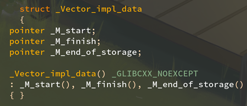

但本质上是一样的，你去看 rust，他们的 vec 也是这三个成员，没什么创新的， rust 的贡献，无非是把这个概念定义为专有名词“胖指针”，仅此而已。

C++ 的 string 克服了 C 语言 0 结尾字符串的缺点：

- 字符串本身可以含有 ‘\0’ 了，这下任何字符都众生平等。

- 末尾没有 ‘\0’ 额外浪费的空间（除非调用 c_str 时）。

- 长度已经存储在 string 的成员里，size() 是 O(1) 的。

- 在尾部切片可以用 resize() 修改长度，无需写入字符串本身。

string_view 和 span 无非是个弱引用版本，额外增加了在头部切片的能力而已。

```cpp
#include <iostream>
#include <string>

using namespace std;

int main() {
  cout << string("hello\0cpp") << endl;
  cout << string("hello\0cpp", 9) << endl;
}
// hello
// hellocpp
```

### 强引用胖指针：string

刚刚说的 string 容器，是掌握着字符串生命周期（lifespan）的胖指针。

这种掌管了所指向对象生命周期的指针称为强引用（strong reference）。

这个强引用的强，体现在哪里？

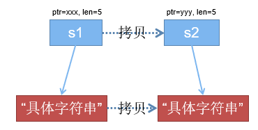

当 string 容器被拷贝时，其指向的字符串也会被拷贝（深拷贝）。

当 string 容器被销毁时，其指向的字符串也会被销毁（内存释放）。

### 弱引用胖指针：string_VIEW

如果把一个强引用的 string 到处拷贝来拷贝去，则其指向的字符串也会被多次拷贝，比较低效。人们常用 string const & 来避免不必要拷贝，但仍比较麻烦。

因此 C++17 引入了弱引用胖指针 **string_view**，这种弱引用（weak reference）不影响原对象的生命周期，原对象的销毁仍然由强引用控制。

这个弱引用的弱，体现在哪里？

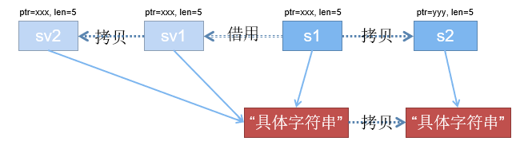

当 string_view 被拷贝时，其指向的字符串仍然是同一个（浅拷贝）。

当 string_view 被销毁时，其指向的字符串仍存在（弱引用不影响生命周期）。

举例解释：

```cpp
#include <iostream>
#include <string>
#include <string_view>

using namespace std;

int main() {
  string s1 = "hello";
  string s2 = s1;         // 深拷贝
  string_view sv1 = s1;   // 弱引用
  string_view sv2 = sv1;  // 浅拷贝
  cout << "s1=" << s1 << endl;
  cout << "s2=" << s2 << endl;
  cout << "sv1=" << sv1 << endl;
  cout << "sv2=" << sv2 << endl;
  s1[0] = 'B';
  cout << "修改s1后" << endl;
  cout << "s1=" << s1 << endl;
  cout << "s2=" << s2 << endl;
  cout << "sv1=" << sv1 << endl;
  cout << "sv2=" << sv2 << endl;
}
// s1=hello
// s2=hello
// sv1=hello
// sv2=hello
// 修改s1后
// s1=Bello
// s2=hello
// sv1=Bello
// sv2=Bello
```

s2 是对 s1 的深拷贝（调用了 string 的拷贝构造函数）所以 s1 被修改时，s2 仍保持旧的值 “hello” 不变。

sv1 和 sv2 都是指向 s1 的弱引用，所以 s1 被改写时，sv1 和 sv2 看到的字符串也改写了。

### 强弱引用的安全守则

强引用和弱引用都可以用来访问对象。

**每个存活的对象，强引用有且只有一个。**

**但弱引用可以同时存在多个，也可以没有**。

**强引用销毁时，所有弱引用都会失效**。如果强引用销毁以后，仍存在其他指向该对象的弱引用，访问他会导致程序奔溃（野指针）。

**弱引用失效举例：**

```cpp
#include <iostream>
#include <string>
#include <string_view>

using namespace std;

int main() {
  string s1 = "hello";
  string_view sv1 = s1;
  s1[0] = 'M';
  cout << sv1 << endl;  // 不会失效
  s1 = "helloworld";
  cout << sv1 << endl;  // 失效!
}
// Mello
// hello	成功打印是因为小字符串优化，存储在栈内，我们后边会详细解释
```

被引用的 string 本体修改的时候，原先生成的 string_view 会失效（因为 ptr 和 len 改变了）。

因此建议创建 string_view 以后，不要改写原字符串。

### 常见容器及其相应的弱引用：

| **强引用**    | **弱引用**   |
| ------------- | ------------ |
| string        | string_view  |
| wstring       | wstring_view |
| vector<T>     | span<T>      |
| unique_ptr<T> | T  *         |
| shared_ptr<T> | weak_ptr<T>  |

### string_view的应用

#### 字符串用substr切片

熟悉 Python 的同学对切片(slice)操作肯定不陌生，例如：

`“hello”[1:1+3] 会得到 “ell”。`

刚刚说到，在 C++ 中，可以用 substr 函数进行切片，例如：

`string(“hello”).substr(1, 3) 会得到 “ell”。` 

这样其实不是最高效的（性能强迫症狂喜），因为 string.substr 并不是就地修改字符串，他是返回一个全新的 string 对象，然后把原字符串里的 1 到 3 这部分子字符串拷贝到这个新的 string 对象里去。

这期间涉及了字符串的拷贝，还需要分配额外的内存，有点小浪费。

如果切下来的子字符串长度是 n，则复杂度为 **O(n)**。

#### string_view 高效地切片

C++17 的设计者们就想：其实我没必要把整个子字符串都拷贝出来，我们只需要保证原来的字符串存在于内存中，让 substr 只是返回切片后的胖指针 [ptr, len]，不就让新字符串和原字符串共享一片内存，实现了零拷贝零分配嘛！

于是就有了接口和 string 很相似，但是只保留胖指针，而不掌管他所指向内存生命周期的 string_view 类。

因为不论子字符串多大，真正改变的只有两个变量，所以 string_view 的 substr 函数复杂度为 **O(1)**。

### remove_prefix、remove_suffix

`sv.remove_prefix(n) 等价于 sv = sv.substr(n)`

`sv.remove_suffix(n) 等价于 sv = sv.substr(0, n)`

没错，他们都是就地修改的。不过这个就地修改的是 string_view 对象本身，而不是修改他指向的字符串，原 string 还是不会变的。

不同之处在于，`substr(pos, len)` 遇到 `pos > sv.size()` 的情况会抛出 out_of_range 异常。而 `remove_prefix/suffix` 就不会，如果他的 `n > sv.size()`，则属于未定义行为，可能崩溃。

总结：remove_prefix/suffix 更高效，substr 更安全。

这和 `[]` 更高效，`at` 更安全是一个道理。

### 很多 string 的成员函数也支持 string_view

string 的成员函数 append、replace、find、rfind、find_first_of、+ 和 += 运算符等，其实也支持 string_view 作参数。

```cpp
string &append(string_view sv);
size_t find(string_view sv, size_t pos) const noexcept;
```

为什么我看官方文档上没写？标准库头文件里也没看到？

其实是有的，只不过官方为了让 `<string>` 头文件不依赖于 `<string_view>` 头文件，把他们写成了模板，并利用类似 SFINAE 的机制给模板参数类型的设了一些限制（相当于把 string_view 定义为一个 concept），所以虽然 `<string>` 中看不到 string_view 的出现，却能把 string_view 作为参数（ StringViewLike）。

### string_view 和 string 的共同点

- at、[]、substr、data、begin、end

- find、rfind、find_first_of、find_last_of

- find_first_not_of、find_last_not_of

- front、back、starts_with、ends_with

- compare、==、!=、<、>、<=、>=

这些函数和 string 的都是一样的，并且其中 substr 使用string_view更高效（不需要分配一个新 string 对象）。string_view 有的都是这些**只读的**函数；没有的都是 replace、append、insert 这一类**需要修改自身**的函数。

### 字符串类型转换规则一览

| 源类型         | 转换方式 | 时间复杂度 | 目标类型       |
| -------------- | -------- | ---------- | -------------- |
| `const char *` | 隐式     | O(n)       | `string_view`  |
| `string`       | 隐式     | O(1)       | `string_view`  |
| `const char *` | 隐式     | O(n)       | `string`       |
| `string_view`  | 显式     | O(n)       | `string`       |
| `string`       | c_str    | O(1)       | `const char *` |

### 示例

**隐式转换**:

```cpp
string s = "hello";
```

**显式转换**:

```cpp
auto s = string("hello");
```

**c_str 转换**:

```cpp
const char *cs = s.c_str();
```

## 八、标准库 string 源码解析

### string 的本质是 basic_string

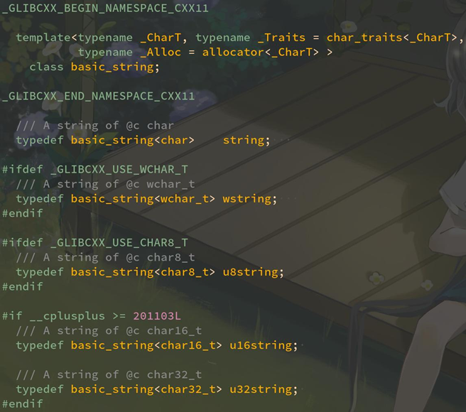

在调试的时候经常会看到 string 被 c++filt 解析为 `basic_string<char, char_traits<char>, allocator<char>>`。

因为 std::string 其实就是他的类型别名（typedef）。

其中 char_traits 定义了字符串具体各种函数的实现，例如 length 默认为 strlen，如果这里指定其他的 traits，就可以替换其实现，改变 string 内部的工作方式。allocator 也是同理，之后我们会专门讲 allocator 与内存分配。

后面两个参数是默认的，写 `basic_string<char>` 就行了。

同理，string_view 其实也是 `basic_string_view<char, char_traits<char>>` 的类型别名。

先看 GCC 标准库内部变量的命名规范，观察可以发现：

- _M_xyz 表示成员变量/函数。

- _S_xyz 表示静态成员变量/函数。

- __xyz 表示函数参数。

- _Tp_xyz 表示模板类型参数。

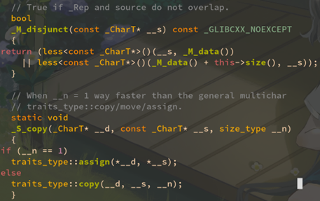


### string 的空基类优化

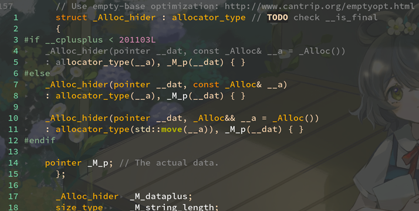

首先映入眼帘的是 _Alloc_hider 这个奇怪的类，包装了一下首地址指针 _M_p。为什么要套这一层壳？这其实是为了防止 allocator 对象浪费空间的优化手段。俗称空基类优化，问题来了，为什么需要空基类优化？

如果不优化的话，是会把 allocator 直接作为成员变量放在 basic_string 里的，但是因为 C++ 规定任何对象都要有大小，即使这个类没有任何成员变量，也要有至少 1 字节的大小（为了防止 allocator 的数组指针傻傻分不清）。

- 空基类优化（Empty Base Class Optimization, EBCO）是 C++ 中一种优化技术，用于在继承关系中减少空基类的内存开销。具体来说，当一个类作为基类而不包含任何数据成员（即是空类）时，编译器可以选择不为该空基类分配额外的内存，从而节省空间。
- 在 C++ 中，如果一个类（如 `Base`）是空的，它的大小通常为 1 字节，这是为了确保每个对象都有唯一的地址。但是，若一个类（如 `Derived`）继承自这个空基类，编译器可能会进行优化，使得 `Derived` 的大小不受 `Base` 的影响，从而只占用 `Derived` 自身的数据成员所需的内存。

但一般来说 allocator 都是空的，没有成员变量，而由于需要和前后夹杂着的首地址指针 _M_p 对齐的原因，需要占据额外空间，最终会耗费 8 字节的大小！而这 8 字节实际上没有任何数据，只是为了伺候古代 C++ 这个“空类也必须有 1 字节大小”的煞笔设定……

那么继续往下看，basic_string 里定义了一个 `_Alloc_hider` 类型的变量 `_M_dataplus`，刚刚说了他里面实际派用场的是 `_M_p`，所以下面的 `_M_data()` 函数直接访问 `_M_dataplus._M_p` 了。

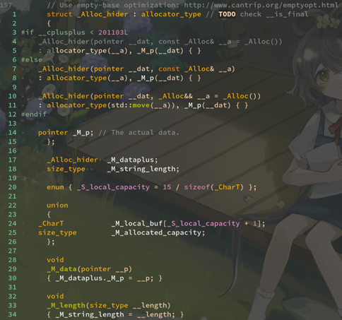

为了弥补这个缺点，C++ 标准委员会提出了**空基类优化**：

如果一个类（`_Alloc_hider`）的基类是空类（allocator），则这个基类不占据任何空间，如果这个派生类（`_Alloc_hider`）如果定义了大小为 n 字节的成员变量（_M_p），则这个派生类（`_Alloc_hider`）的大小也是 n，**不会**变成 n + 1。

所以这就是为什么 GCC 标准库把成员变量 _M_p 挪到了一个 _Alloc_hider 里，而让 _Alloc_hider 又继承 allocator。就是为了在 allocator 为**空类**的时候（**无状态分配器**），能让 allocator 不必占据额外的空间。

问题：既然 allocator 往往都是个空类（`std::allocator<T>` 默认就是空类，只有几个成员函数负责调用 operator new 和 operator delete），为什么还要把 allocator 对象存到 string 对象里，最后还要搞什么空基类优化防止他浪费空间，多此一举？

因为最近开始流行“**有状态分配器**”。

### 有无空基类优化的对比

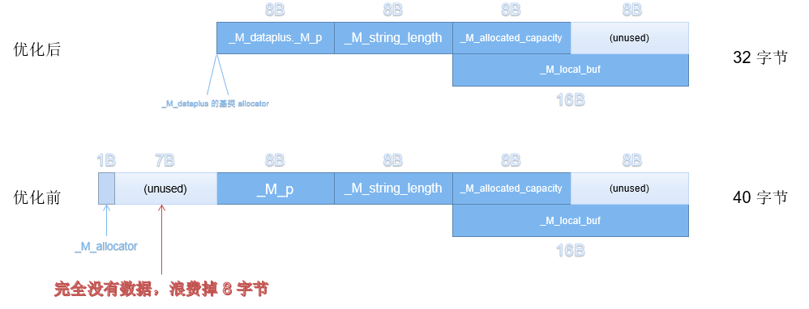

- 如图 ，`allocator_type`是一个空基类，只占据一个字节，如果不进行空基类优化，直接将`allocator_type`作为成员变量，需要补齐7个字节（一共浪费8个字节）
- 源码中的操作，让`_Alloc_hider`包裹`pointer _M_p`，并继承`allocator_type`
- 此时编译器就可以进行空基类优化，`allocator_type`，大小变为0，成功隐藏掉这部分空间
- 后面的_M_local_buf是一个union联合体，共用了低八位内存，是后面小字符串优化的内容

空基类优化动手实验：

```cpp
#include <iostream>
#include <string>
#include <string_view>
#include <vector>

using namespace std;

struct Empty {};

struct NonEmpty {
  char c;
};

struct DerivedEmpty : Empty {
  int i;
};

struct DerivedNonEmpty : NonEmpty {
  int i;
};

int main() {
  cout << sizeof(Empty) << endl;         // 1 = 1(empty)
  cout << sizeof(NonEmpty) << endl;      // 1 = 1(char c)
  cout << sizeof(DerivedEmpty) << endl;  // 4 = 0(empty) + 4(int i)
  cout << sizeof(DerivedNonEmpty)
       << endl;  // 8 = 1(char c) + 3(padding) + 4(int i)
}
// 1
// 1
// 4
// 8
```

### string 的小字符串优化

继续往下看。看到下面有一个 `_M_local_buf` 的字符数组，和 size_t 的 `_M_allocated_capacity` 的成员变量。其中 `_M_local_buf` 大小是 16，常量 `_S_local_capacity` 为 15 / sizeof(char) 也就是 15。

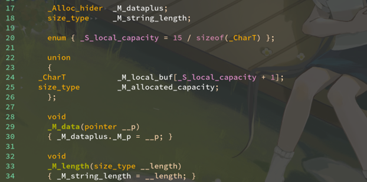

这个意思是，当字符串长度**小于 16 字节**时，将存储在 _M_local_buf 里，而不是像 vector 一样把数据存在堆上（通过 new 分配的）。

- 请回到观察string的内存示意图，最后的内存共用部分
- 当字符串小于15时，使用`_M_local_buf`这个栈内存，大于十五时就使用`_M_allocated_capacity`确定分配的容量。

这称之为小字符串优化，小字符串的上限是 15 字节，而不是 16 字节，为什么？看到这里的 `_S_local_capacity + 1` 了没，他是为了给 ‘\0’ 留个空位，为的是让 c_str 总能正常得到 0 结尾字符串。所以因为要支持 c_str，string 其实比 vector 多一个负担：需要额外一个字节的空间来存放 ‘\0’。

**string 的 capacity 函数也经过了特殊处理**

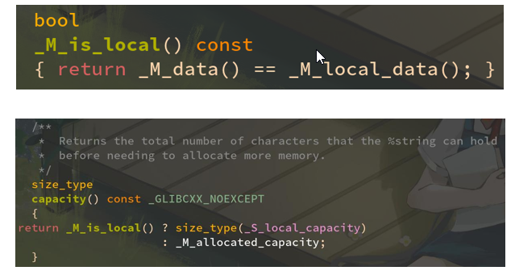

### string 内存分布示意图

- 这里的内存分布只讨论GCC实现

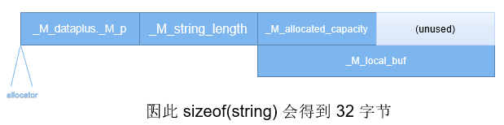

C++ 的 string 采用了 [ptr, len, capacity] 构型。其中最后的 capacity 当字符串长度小于 15 时，还和局部小字符串缓存共享了空间。

_M_local_buf 是物理让字符串比较小的时候能存储在栈上，如果超过 15 字节再去堆上分配空间。这样能节省 new/delete 的一点性能开销。

例如 “helloworld” 这个字符串只有 10 字节，他实际上是存储在栈上的，这时 _M_p 会被设置为指向 _M_local_buf 的首地址。

不过对于大字符串，这多出来的 8 字节 (unused)是完全浪费掉的，但也不亏，就当是为了对齐到32 字节而故意留的 padding 了。


### vector 内存分布示意图

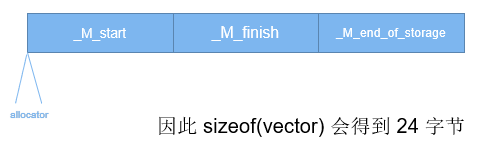

C++ 的 vector 采用了 [ptr, ptr + len, ptr + capacity] 构型。

vector 没有采用小字符串优化…这是因为 string 面对的都是 char，wchar_t 这种比较小的类型，且用户常用的字符串往往比较短很容易放进 15 字节的局部栈空间里；

然而vector 面对的往往是比较大的数据结构，有时还有智能指针，std::thread 这种具有非平凡构造/析构函数的类型。对vector 来说保障 RAII 的安全更重要，所以没有冒险优化。

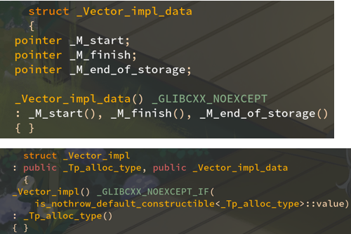

### string 的 append 实现

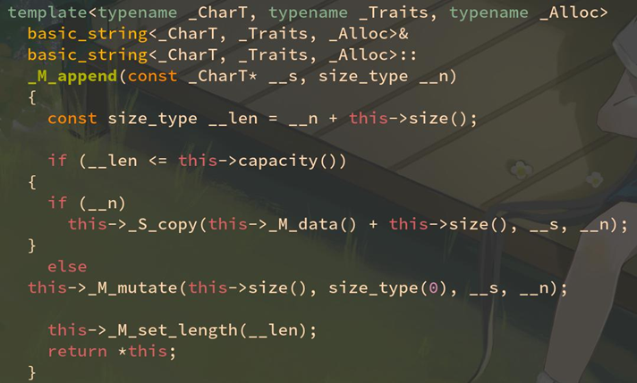

append 和 resize 都会去调用 _M_append 这个内部函数。

他会检测 append 以后是否超过容量，决定是否要扩容数组。

在 compare 等函数涉及到 0 结尾字符串的版本，都会调用 char_traits 中的方法，方便用户通过模板扩展（性能上或功能上）。例如：

```cpp
basic_string<char, my_simd_char_traits>
```
