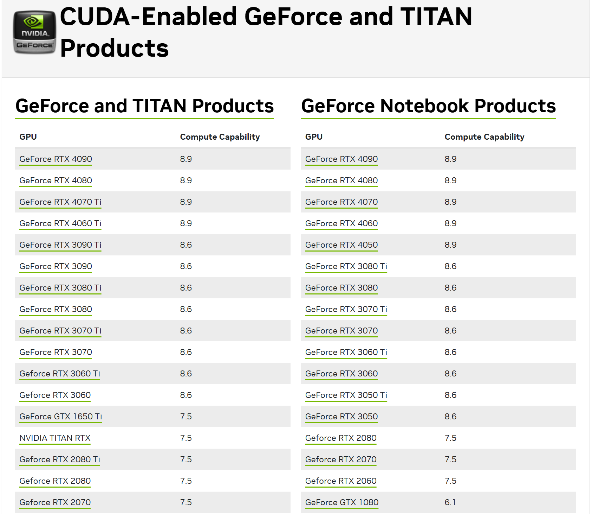

# CUDA开始的GPU编程

前置条件：

- 熟悉C/C++编程、熟悉STL、函数模板等
- Nvidia GTX900及以上显卡、CUDA 11及以上
- CMake 3.18及以上

*由于文本编辑器不持支CUDA代码块，文中CUDA代码将使用cpp代码块进行高亮显示，请注意区分。*

在开始之前，我想提醒读者，这篇博客将以工程应用的思路为主，不会深入探讨CUDA的底层原理。我们关注实际的使用案例和实践技巧。未来，我会逐步更新更为详尽的内容，敬请期待！

## 第0章：Hello, world from GPU!

### CMake中启用CUDA支持

```cmake
# CMakeLists.txt
cmake_minimum_required(VERSION 3.10)

set(CMAKE_CXX_STANDARD 17)
set(CMAKE_BUILD_TYPE Release)

project(hellocuda LANGUAGES CXX CUDA)	# 添加CUDA支持

add_executable(main main.cu)	# 添加.cu源文件
```

最新版的 CMake（3.18 以上），只需在 LANGUAGES 后面加上 CUDA 即可启用。

然后在 add_executable 里直接加你的 .cu 文件，和 .cpp 一样。

### CUDA编译器兼容C++17

```cpp
// main.cu	这是一个.cu文件

#include <cstdio>
int main(){
    printf("Hello, world!\n");
    return 0;
}
```

CUDA 的语法，基本完全兼容 C++。包括 C++17 新特性，都可以用。甚至可以把任何一个 C++ 项目的文件后缀名全部改成 .cu，都能编译出来。

这是 CUDA 的一大好处，CUDA 和 C++ 的关系就像 C++ 和 C 的关系一样，大部分都兼容，因此能很方便地重用 C++ 现有的任何代码库，引用 C++ 头文件等。

host 代码和 device 代码写在同一个文件内，这是 OpenCL 做不到的。

### 编写一段在GPU上运行的代码

定义核函数 kernel，前面加上 `__global__` 修饰符，即可让它在 GPU 上执行。

- **核函数是我们后面主要接触的一段代码，就是设备上执行的程序段**

```cpp
#include <cstdio>

__global__ void kernel() {
    printf("Hello, world!\n");
}

int main() {
    kernel<<<1, 1>>>();
    return 0;
}
//运行一下试试呢
```

不过调用 kernel 时，不能直接 kernel()，而是要用 `kernel<<<1, 1>>>()` 这样的三重尖括号语法。为什么？这里面的两个 1 有什么用？稍后会说明。

运行以后，就会在 GPU 上执行 printf 了。（较旧的CUDA版本不支持直接打印）

这里的 kernel 函数在 GPU 上执行，称为核函数，用 `__global__` 修饰的就是核函数。

### 运行没反应？同步一下！

如果直接编译运行刚刚那段代码，是不会打印出 Hello, world! 的。

这是因为 GPU 和 CPU 之间的通信，为了高效，是**异步**的。也就是 CPU 调用 `kernel<<<1, 1>>>()` 后，并不会立即在 GPU 上执行完毕，再返回。实际上只是把 kernel 这个任务推送到 GPU 的执行队列上，然后立即返回，并不会等待执行完毕。

因此可以调用 `cudaDeviceSynchronize()`，让 CPU 陷入等待，等 GPU 完成队列的所有任务后再返回。从而能够在 main 退出前等到 kernel 在 GPU 上执行完。

```cpp
#include <cstdio>

__global__ void kernel() {
    printf("Hello, world!\n");
}

int main() {
    kernel<<<1, 1>>>();
    cudaDeviceSynchronize();
    return 0;
}
//输出：
//Hello, world!
```

### 定义在GPU上的设备函数

`__global__` 用于定义核函数，它在 **GPU 上执行**，从 CPU 端通过三重尖括号语法调用，可以有参数，不可以有返回值。

而 `__device__` 则用于定义设备函数，它**在 GPU 上执行**，但是**从 GPU 上调用**的，而且**不需要三重尖括号**，和普通函数用起来一样，可以有参数，有返回值。

```cpp
#include <cstdio>
#include <cuda_runtime.h>

__device__ void say_hello() {	//内联修饰符
    printf("Hello, world!\n");
}

__global__ void kernel() {
    say_hello();
}

int main() {
    kernel<<<1, 1>>>();
    cudaDeviceSynchronize();
    return 0;
}
//输出：
//Hello, world!
```

即：host 可以调用 global；global 可以调用 device；device 可以调用 device。

### 声明为内联函数

CUDA提供`__inline`关键字提示内联

```cpp
#include <cstdio>
#include <cuda_runtime.h>

__device__ __inline__ void say_hello() {
    printf("Hello, world!\n");
}

__global__ void kernel() {
    say_hello();
}

int main() {
    kernel<<<1, 1>>>();
    cudaDeviceSynchronize();
    return 0;
}
```

注意，**没有下划线的`inline`** 在现代 C++ 中的效果是声明一个函数为 weak 符号，和性能优化意义上的内联无关。

- `inline` 在现代 C++ 中的主要作用是**允许函数在多个编译单元中定义而不产生链接错误**，而不再主要用于提示编译器进行函数的内联优化

- `inline` 函数在编译过程中，编译器会将该函数的符号标记为“弱符号”（weak symbol）。这意味着，如果同一个 `inline` 函数在多个编译单元中被定义，链接器会将这些定义视为等价的，并只保留一个定义，而不是报重复定义错误。这在多文件编译中避免了链接错误。
- 在现代 C++ 中，编译器的优化技术已经足够智能，能够自动决定是否将某个函数内联。

优化意义上的内联指把函数体直接放到调用者那里去。

因此 CUDA 编译器提供了一个“私货”关键字：`__inline__` 来声明一个函数为内联。不论是 CPU 函数还是 GPU 函数都可以使用，只要你用的 CUDA 编译器。GCC 编译器相应的私货则是 `__attribute__((“inline”))`。

注意，声明为 `__inline__` **不一定**就保证内联了，如果函数太大编译器可能会放弃内联化。因此 CUDA 还提供 `__forceinline__` 这个关键字来强制一个函数为内联。GCC 也有相应的 `__attribute__((“always_inline”))`。

此外，还有 `__noinline__` 来禁止内联优化。

### 定义在 cpu 上的主机函数

`__device__` 将函数定义在 GPU 上，而 `__host__` 则相反，将函数定义在 CPU 上。

```cpp
#include <cstdio>
#include <cuda_runtime.h>

__device__ void say_hello() {
    printf("Hello, world from GPU!\n");
}

__host__ void say_hello_host() {
    printf("Hello, world from CPU!\n");
}

__global__ void kernel() {
    say_hello();
}

int main() {
    kernel<<<1, 1>>>();
    cudaDeviceSynchronize();
    say_hello_host();
    return 0;
}
//输出：
//Hello, world from GPU!
//Hello, world from CPU!
```

CUDA 完全兼容 C++，因此任何函数如果没有指明修饰符，则默认就是 `__host__`，即 CPU 上的函数。

### 同时定义在 CPU 和 GPU 上

这两个修饰符并不冲突，通过 `__host__ __device__` 这样的双重修饰符，可以把函数同时定义在 CPU 和 GPU 上，这样 CPU 和 GPU 都可以调用。

```cpp
#include <cstdio>
#include <cuda_runtime.h>

__device__ void say_hello() {
    printf("Hello, world from GPU!\n");
}

void say_hello_host() {
    printf("Hello, world from CPU!\n");
}

__global__ void kernel() {
    say_hello();
}

int main() {
    kernel<<<1, 1>>>();
    cudaDeviceSynchronize();
    say_hello_host();
    return 0;
}
//输出：
//Hello, world from GPU!
//Hello, world from CPU!
```

此时，编译后会生成两个版本，CPU 会直接调用`__host__`版本， GPU 调用`__device__`版本

### 给`constexpr`加点料

CUDA提供了一个实验性选项`--expt-relaxed-constexpr`

在CMake中配置使用：

```cmake
cmake_minimum_required(VERSION 3.10)

set(CMAKE_CXX_STANDARD 17)
set(CMAKE_BUILD_TYPE Release)

project(hellocuda LANGUAGES CXX CUDA)

add_executable(main main.cu)
target_compile_options(main PUBLIC $<$<COMPILE_LANGUAGE:CUDA>:--expt-relaxed-constexpr>)

```

- 这里使用了一个生成表达式语法，只对当前编译的语言是CUDA是起效

- constexpr 函数在**编译期**执行

```cpp
#include <cstdio>
#include <cuda_runtime.h>

// constexpr 函数在编译期执行
// 这个函数没有使用 __host__ 和 __device__ 修饰符，但是被两端成功调用
constexpr const char *cuthead(const char *p)
{
    return p + 1;
}

__global__ void kernel()
{
    printf(cuthead("Gello, world!\n"));
}

int main()
{
    kernel<<<1, 1>>>();
    cudaDeviceSynchronize();
    printf(cuthead("Cello, world!\n"));
    return 0;
}
// 输出：
// ello, world!
// ello, world!
```

上面的`cuthead()`函数没有使用 `__host__` 和 `__device__` 修饰符，但是被两端成功调用。

这样相当于把 constexpr 函数自动变成 `__host__ __device__`修饰，从而两端都可以调用。

因为 constexpr 通常都是一些可以内联的函数，数学计算表达式之类的，一个个加上修饰太累了，所以产生了这个需求。

不过必须指定 `--expt-relaxed-constexpr` 这个选项才能用这个特性，我们可以用 CMake 的生成器表达式来实现只对 .cu 文件开启此选项（不然给到 gcc 就出错了）。

当然，constexpr 里没办法调用 printf，也不能用 `__syncthreads` 之类的 GPU 特有的函数，因此也不能完全替代 `__host__` 和 `__device__`。

### 多段编译

通过`#ifdef`指令针对CPU和GPU生成不同的代码

```cpp
#include <cstdio>
#include <cuda_runtime.h>

__host__ __device__ void say_hello() {
#ifdef __CUDA_ARCH__
    printf("Hello, world from GPU!\n");
#else
    printf("Hello, world from CPU!\n");
#endif
}

__global__ void kernel() {
    say_hello();
}

int main() {
    kernel<<<1, 1>>>();
    cudaDeviceSynchronize();
    say_hello();
    return 0;
}
```

CUDA 编译器具有多段编译的特点。

一段代码，会**先送到 CPU 上的编译器**（通常是系统自带的编译器比如 gcc 和 msvc）生成 CPU 部分的指令码。然后**再送到 GPU 编译器**生成 GPU 指令码。最后再链接成同一个文件，看起来好像只编译了一次一样，实际上你的代码会被预处理很多次。

在 GPU 编译模式下会定义 `__CUDA_ARCH__` 这个宏，利用 `#ifdef` 判断该宏是否定义，就可以判断当前是否处于 GPU 模式，从而实现一个函数针对 GPU 和 CPU 生成两份源码级不同的代码。

**`__CUDA_ARCH__`是个版本号**

```cpp
#include <cstdio>
#include <cuda_runtime.h>

__host__ __device__ void say_hello()
{
#ifdef __CUDA_ARCH__
    printf("Hello, world from GPU architecture %d!\n", __CUDA_ARCH__);
#else
    printf("Hello, world from CPU!\n");
#endif
}

__global__ void kernel()
{
    say_hello();
}

int main()
{
    kernel<<<1, 1>>>();
    cudaDeviceSynchronize();
    say_hello();
    return 0;
}
// 输出：
// Hello, world from GPU architecture 520 !
// Hello, world from CPU !
```

其实 `__CUDA_ARCH__` 是一个整数，表示当前编译所针对的 GPU 的架构版本号是多少。这里是 520 表示版本号是 5.2.0，最后一位始终是 0 不用管，我们通常简称它的版本号为 52 就行了。

这个版本号是编译时指定的版本，不是运行时检测到的版本。编译器默认就是最老的 52，能兼容所有 GTX900 以上显卡。

### 通过CMake设置架构版本号

可以用 CMAKE_CUDA_ARCHITECTURES 这个变量，设置要针对哪个架构生成 GPU 指令码。

我的的显卡是 RTX4050，它的版本号是 89，因此最适合它用的指令码版本是 89。

如果不指定，编译器默认的版本号是 52，它是针对 GTX900 系列显卡的。

不过英伟达的架构版本都是向前兼容的，即版本号为 89 的 RTX4050 也可以运行版本号为 52 的指令码，虽然不够优化，但是至少能用。也就是要求：**编译期指定的版本 ≤ 运行时显卡的版本**。

```cmake
cmake_minimum_required(VERSION 3.18)

# 指定CUDA标准版本
set(CMAKE_CUDA_STANDARD 17)
# 设置CUDA架构版本
set(CMAKE_CUDA_ARCHITECTURES 86)

project(cuda_test LANGUAGES CXX CUDA)
```

- 可以在Nvidia官网查看自己的GPU架构，我的RTX4050是8.9
- [官网链接](https://developer.nvidia.com/cuda-gpus#collapseOne)



**坑点！版本号不能太新了**

*由于我的显卡是目前最新架构，无法复现这个错误，请自行测试*

假设你的显卡是RTX3000系列，这里设置了 RTX4000 系列的架构版本号 89，在 RTX3000系上就运行不出结果。

```cmake
cmake_minimum_required(VERSION 3.18)

# 指定CUDA标准版本
set(CMAKE_CUDA_STANDARD 17)
# 设置CUDA架构版本
set(CMAKE_CUDA_ARCHITECTURES 89)

project(cuda_test LANGUAGES CXX CUDA)
```

```cpp
#include <cstdio>
#include <cuda_runtime.h>

__host__ __device__ void say_hello()
{
#ifdef __CUDA_ARCH__
    printf("Hello, world from GPU architecture %d!\n", __CUDA_ARCH__);
#else
    printf("Hello, world from CPU!\n");
#endif
}

__global__ void kernel()
{
    say_hello();
}

int main()
{
    kernel<<<1, 1>>>();
    cudaDeviceSynchronize();
    say_hello();
    return 0;
}
// 输出：
// Hello, world from CPU !
```

最坑的是不会报错！也不输出任何东西！就像没有那个 kernel 函数一样！所以一定要注意调对版本号，否则**只有 CPU 上的代码被执行了**。

#### 指定多个版本号

可以指定多个版本号，之间用分号分割。

```cmake
set(CMAKE_CUDA_ARCHITECTURES 52;70;75;86;89)
```

运行时可以自动选择最适合当前显卡的版本号，通常用于打包发布的时候。

不过这样会导致 GPU 编译器重复编译很多遍，每次针对不同的架构，所以编译会变得非常慢，生成的可执行文件也会变大。

通常在自己的电脑上用时，只要根据自己显卡的指定一个版本号即可。

如果 CMakeLists.txt 里没有指定，也可以从命令行参数指定：

```shell
cmake -B build -DCMAKE_CUDA_ARCHITECTURES="52;70;75;86;89"
```

```shell
# 我的运行输出：
ming@MING:~/project/cuda/cuda_test$ ./build/mytest 
Hello, world from GPU architecture 890!
Hello, world from CPU!
```
