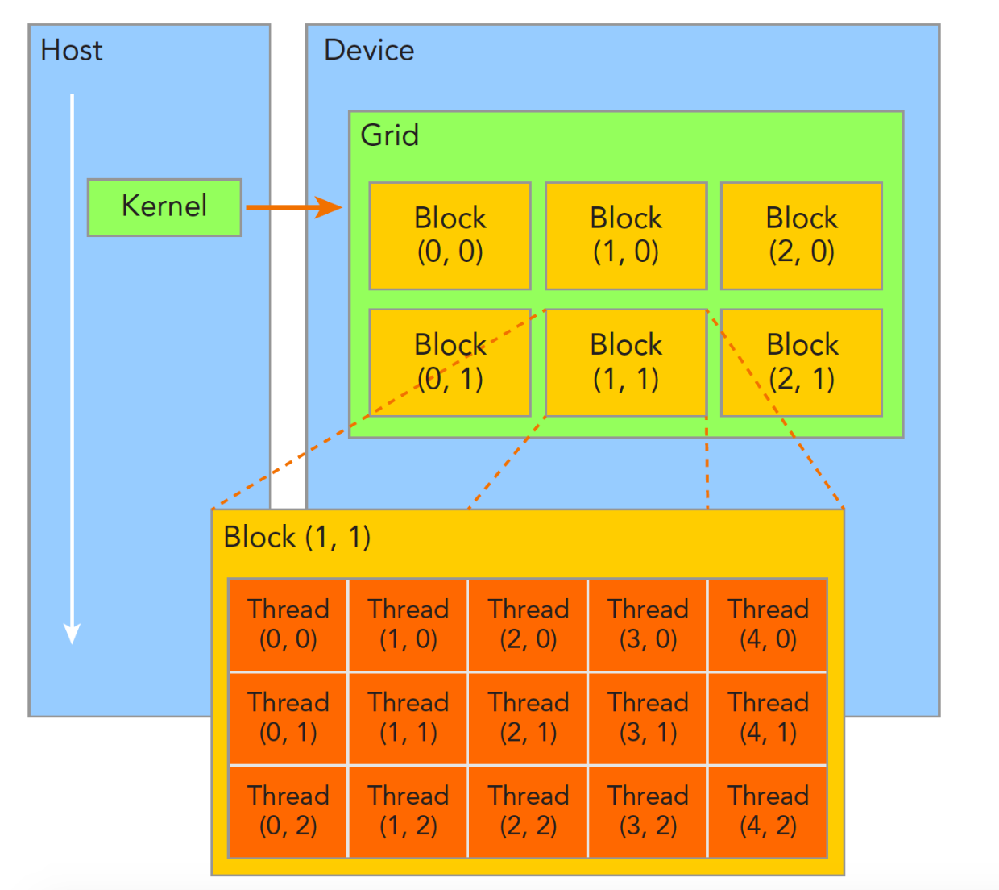
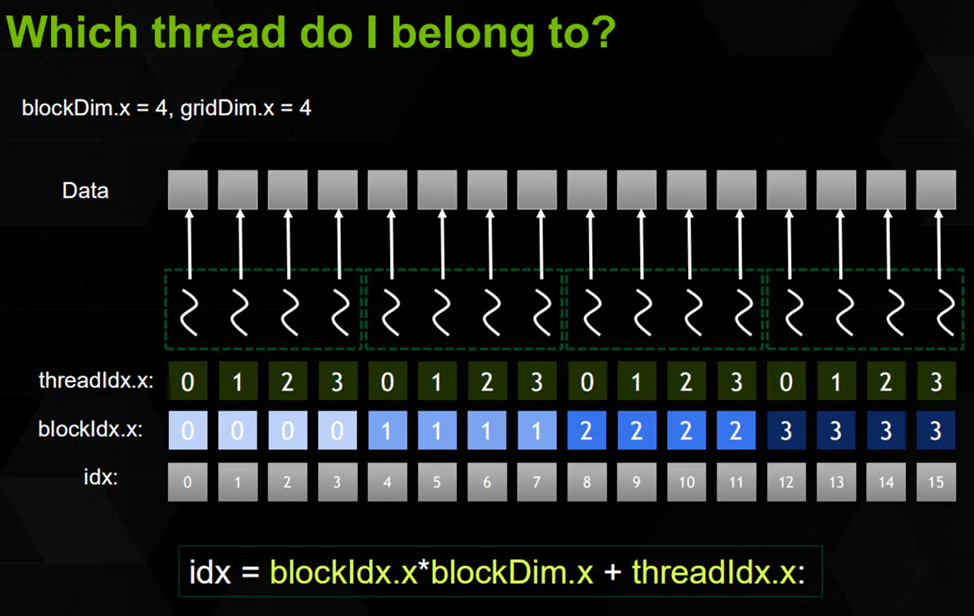
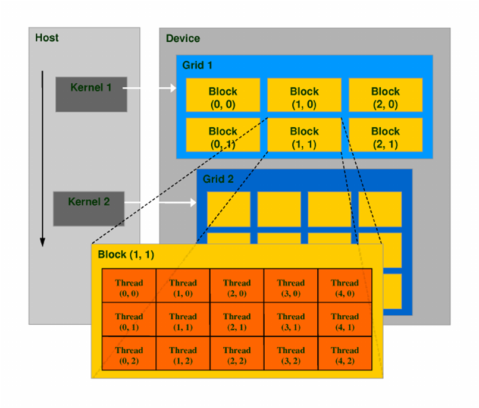

## 第一章：线程与板块

### 三重尖括号里的数字

刚刚说了 CUDA 的核函数调用时需要用 kernel<<<1, 1>>>() 这种奇怪的语法，这里面的数字代表什么意思呢？

不妨把 <<<1, 1>>> 改成 <<<1, 3>>> 试试看。你会看到 Hello, world! 打印了三遍！

```cpp
#include <cstdio>
#include <cuda_runtime.h>

__global__ void kernel(){
    printf("Hello, world\n");
}

int main(){
    kernel<<<1, 3>>>();
    cudaDeviceSynchronize();
    return 0;
}
// Hello, world! 
// Hello, world! 
// Hello, world! 
```

原来，三重尖括号里的第二个参数决定着启动 kernel 时所用 GPU 的**线程**数量。

GPU 是为并行而生的，可以开启很大数量的线程，用于处理大吞吐量的数据。

### 获取线程编号

```cpp
#include <cuda_runtime.h>

#include <cstdio>

__global__ void kernel() { printf("Thread %d\n", threadIdx.x); }

int main() {
  kernel<<<1, 3>>>();
  cudaDeviceSynchronize();
  return 0;
}
// Thread 0
// Thread 1
// Thread 2
```

可以通过 `threadIdx.x` 获取当前线程的编号，我们打印一下试试看。

这是 CUDA 中的特殊变量之一，只有在**核函数**里才可以访问。

可以看到线程编号从0开始计数，打印出了0，1，2。这也是我们指定了线程数量为 3 的缘故。

- 等等，为什么后面有个 .x？稍后再说明。

### 获取线程数量

还可以用 blockDim.x 获取当前线程数量，也就是我们在尖括号里指定的 3。

```cpp
#include <cuda_runtime.h>

#include <cstdio>

__global__ void kernel() {
  printf("Thread %d of %d\n", threadIdx.x, blockDim.x);
}

int main() {
  kernel<<<1, 3>>>();
  cudaDeviceSynchronize();
  return 0;
}
// Thread 0 of 3
// Thread 1 of 3
// Thread 2 of 3
```

### 线程之上：板块

接下来我们修改`"<<< >>>"`中的另一个参数

```cpp
#include <cuda_runtime.h>

#include <cstdio>

__global__ void kernel() {
  printf("Thread %d of %d\n", threadIdx.x, blockDim.x);
}

int main() {
  kernel<<<2, 3>>>();
  cudaDeviceSynchronize();
  return 0;
}
// Thread 0 of 3
// Thread 1 of 3
// Thread 2 of 3
// Thread 0 of 3
// Thread 1 of 3
// Thread 2 of 3
```

我们发现启动了六个线程，而且被分为两组。

CUDA 中还有一个比线程更大的概念，那就是**板块（block）**，一个板块可以有多个线程组成。这就是为什么刚刚获取线程数量的变量用的是 blockDim，实际上 blockDim 的含义是每个板块有多少个线程。

要指定板块的数量，只需调节三重尖括号里第一个参数即可。我们这里调成 2。总之：

```
<<<板块数量，每个板块中的线程数量>>>
```

可以看到这里我们启动了两个板块，各有3个线程，都打印了一样的数据。

### 获取板块编号和数量

- 板块的编号可以用 blockIdx.x 获取。

- 板块的总数可以用 gridDim.x 获取。

```cpp
#include <cuda_runtime.h>

#include <cstdio>

__global__ void kernel() {
  printf("Block %d of %d, Thread %d of %d\n", blockIdx.x, gridDim.x,
         threadIdx.x, blockDim.x);
}

int main() {
  kernel<<<2, 3>>>();
  cudaDeviceSynchronize();
  return 0;
}

// Block 1 of 2, Thread 0 of 3
// Block 1 of 2, Thread 1 of 3
// Block 1 of 2, Thread 2 of 3
// Block 0 of 2, Thread 0 of 3
// Block 0 of 2, Thread 1 of 3
// Block 0 of 2, Thread 2 of 3
```

可以看到这里执行了两个板块，每个板块又有三个线程，总共有2*3=6个线程。

而且看到这里板块1在板块0之前执行了(你的可能不是)，这是因为板块之间是高度并行的，不保证执行的先后顺序。线程之间也是，这里线程打印顺序没乱，不过是碰巧小于32而已。

- 关于这个32我们后边会讨论

### 理解线程管理

接下来我们整体理解一下CUDA中的线程管理，CUDA将计算任务划分为多个层次，包括线程、板块（block）和网格（grid）。

#### 线程、板块与网格的层次结构

1. **线程 (Thread)**：是CUDA中的基本执行单元。每个线程可以独立地执行相同的代码，但处理不同的数据。
2. **板块 (Block)**：是由多个线程组成的集合。一个板块内部的线程可以共享内存并进行协作，使得数据传输和计算更加高效。
3. **网格 (Grid)**：是包含若干个板块的集合，代表整个计算任务。一个网格可以是多维的（如一维、二维或三维），以适应不同类型的数据结构。

#### 从属关系

在CUDA的层次结构中，线程、板块和网格之间存在如下从属关系：

- **线程 < 板块 < 网格**

这种关系说明，一个网格由多个板块组成，而每个板块又由多个线程组成。

#### 重要变量

在CUDA中，有几个重要的变量用于访问当前线程和板块的信息：

| 变量名称        | 描述                           |
| --------------- | ------------------------------ |
| **`threadIdx`** | 当前线程在其所属板块中的编号。 |
| **`blockDim`**  | 当前板块中线程的数量。         |
| **`blockIdx`**  | 当前板块在网格中的编号。       |
| **`gridDim`**   | 网格中总的板块数量。           |

#### 调用语法

在CUDA中，调用内核函数的语法为：

```cpp
kernel_function<<<gridDim, blockDim>>>(parameters);
```

这里，`gridDim`指定了网格的维度和大小，而`blockDim`则定义了每个板块的线程数量。通过合理设置这两个参数，可以充分利用GPU的并行计算能力。

我们在CPU编程中的经验告诉我们，只要有了线程，就可以实现并行，为什么还要引入板块、网格这些概念？稍后我们就会进行说明。

#### “扁平化”理解

通过上面的这些变量，我们可以获取总线程数、总板块数以及当前线程的全局编号等等，方便管理和访问数据。下面是几个常用的公式：

**总板块数**：

gridDim 就表示着板块的数量，一维情况下就是 gridDim.x

```cpp
int totalBlocks = gridDim.x;	// 只考虑x维度
```

**总线程数**：

**网格中块的数量**乘以**每个块中的线程数量**。

```cpp
int totalThreads = gridDim.x * blockDim.x;	// 只考虑x维度
```

`gridDim.x`是网格在x维度上块的数量，而`blockDim.x`是每个块中线程的数量

**当前线程的全局编号**：

全局编号可以唯一标识每个线程在整个网格中的位置，就可以控制每个线程操作不同的数据。

因为索引下标是从0开始，所以我们可以这样计算：

```cpp
int globalThreadId = blockIdx.x * blockDim.x + threadIdx.x;	// 只考虑x维度
```

`blockIdx.x`：当前块在网格中的索引（0,1,2......）

`blockDim.x`：块中线程的数量（注意这里不从0开始）

`threadIdx.x`：当前线程在其所属块中的索引(0,1,2......)

**下面是示例：**

```cpp
#include <cuda_runtime.h>

#include <cstdio>

__global__ void kernel() {
  // 当前线程的全局编号
  unsigned int globalThreadId = blockIdx.x * blockDim.x + threadIdx.x;

  // 获取总板块数
  unsigned int totalBlocks = gridDim.x;  // 网格中块的数量
  // 获取总线程数
  unsigned int totalThreads = gridDim.x * blockDim.x;  // 网格中的总线程数

  // 打印输出（调试信息）
  printf("Global Thread ID: %u, Total Blocks: %u, Total Threads: %u\n",
         globalThreadId, totalBlocks, totalThreads);
}

int main() {
  kernel<<<2, 3>>>();       // 启动2个块，每个块3个线程
  cudaDeviceSynchronize();  // 等待所有线程完成
  return 0;
}
// Global Thread ID: 0, Total Blocks: 2, Total Threads: 6
// Global Thread ID: 1, Total Blocks: 2, Total Threads: 6
// Global Thread ID: 2, Total Blocks: 2, Total Threads: 6
// Global Thread ID: 3, Total Blocks: 2, Total Threads: 6
// Global Thread ID: 4, Total Blocks: 2, Total Threads: 6
// Global Thread ID: 5, Total Blocks: 2, Total Threads: 6
```

- 剧透一下：实际上 GPU 的板块相当于 CPU 的线程，GPU 的线程相当于 CPU 的**SIMD**，可以这样理解，但不完全等同。
- SIMD（Single Instruction, Multiple Data）是一种计算机架构设计理念，允许在单个指令下对多个数据元素进行并行处理。更多内容请自行了解

#### 图形理解

线程组织结构图：



线程计算：



### 三维的板块和线程编号

CUDA 也支持三维的板块和线程区间。

只要在三重尖括号内指定的参数改成 dim3 类型即可。dim3 的构造函数就是接受三个无符号整数（unsigned int）非常简单。

dim3(x, y, z)

```cpp
#include <cuda_runtime.h>

#include <cstdio>

__global__ void kernel() {
  printf("Block (%d,%d,%d) of (%d,%d,%d), Thread (%d,%d,%d) of (%d,%d,%d)\n",
         blockIdx.x, blockIdx.y, blockIdx.z, gridDim.x, gridDim.y, gridDim.z,
         threadIdx.x, threadIdx.y, threadIdx.z, blockDim.x, blockDim.y,
         blockDim.z);
}

int main() {
  kernel<<<dim3(2, 1, 1), dim3(2, 2, 2)>>>();
  cudaDeviceSynchronize();
  return 0;
}
// Block (0,0,0) of (2,1,1), Thread (0,0,0) of (2,2,2)
// Block (0,0,0) of (2,1,1), Thread (1,0,0) of (2,2,2)
// Block (0,0,0) of (2,1,1), Thread (0,1,0) of (2,2,2)
// Block (0,0,0) of (2,1,1), Thread (1,1,0) of (2,2,2)
// Block (0,0,0) of (2,1,1), Thread (0,0,1) of (2,2,2)
// Block (0,0,0) of (2,1,1), Thread (1,0,1) of (2,2,2)
// Block (0,0,0) of (2,1,1), Thread (0,1,1) of (2,2,2)
// Block (0,0,0) of (2,1,1), Thread (1,1,1) of (2,2,2)
// Block (1,0,0) of (2,1,1), Thread (0,0,0) of (2,2,2)
// Block (1,0,0) of (2,1,1), Thread (1,0,0) of (2,2,2)
// Block (1,0,0) of (2,1,1), Thread (0,1,0) of (2,2,2)
// Block (1,0,0) of (2,1,1), Thread (1,1,0) of (2,2,2)
// Block (1,0,0) of (2,1,1), Thread (0,0,1) of (2,2,2)
// Block (1,0,0) of (2,1,1), Thread (1,0,1) of (2,2,2)
// Block (1,0,0) of (2,1,1), Thread (0,1,1) of (2,2,2)
// Block (1,0,0) of (2,1,1), Thread (1,1,1) of (2,2,2)
```

这样在核函数里就可以通过 threadIdx.y 获取 y 方向的线程编号，以此类推。

#### 二维：

只需要把 dim3 最后一位（z方向）的值设为 1 即可。这样就只有 xy 方向有大小，就相当于二维了，不会有性能损失。

- 实际上一维的 `<<<m, n>>>` 不过是 `<<<dim3(m, 1, 1), dim3(n, 1, 1)>>>` 的简写而已。

#### 为什么要分三维这种结构？

之所以会把 blockDim 和 gridDim 分三维主要是因为 GPU 的业务常常涉及到三维图形学和二维图像，觉得这样很方便，并不一定 GPU 硬件上是三维这样排列的。

三维情况下同样可以获取总的线程编号（扁平化），只需要分别对三个维度进行操作

- 如需总的线程数量：blockDim * gridDim

- 如需总的线程编号：blockDim * blockIdx + threadIdx



### 补充：分离 __device__ 函数的声明和定义

#### 出错：

我们在hello.cu中定义一个设备上的函数

```cpp
// hello.cu
#include <cuda_runtime.h>

#include <cstdio>

__device__ void say_hello() {  // 定义
  printf("Hello, world!\n");
}
```

在main.cu文件中声明并调用：

```cpp
// main.cu
#include <cuda_runtime.h>

#include <cstdio>

__device__ void say_hello();  // 声明

__global__ void kernel() { say_hello(); }

int main() {
  kernel<<<1, 1>>>();
  cudaDeviceSynchronize();
  return 0;
}
```

进行编译就会报错：

```shell
ptxas fatal   : Unresolved extern function '_Z9say_hellov'
```

默认情况下 GPU 函数必须定义在同一个文件里。如果你试图分离声明和定义，调用另一个文件里的 `__device__` 或 `__global__` 函数，就会出错。

#### 解决：

开启 `CMAKE_CUDA_SEPARABLE_COMPILATION` 选项（设为 ON），即可启用分离声明和定义的支持。

```cmake
cmake_minimum_required(VERSION 3.10)

set(CMAKE_CXX_STANDARD 17)
set(CMAKE_BUILD_TYPE Release)
set(CMAKE_CUDA_SEPARABLE_COMPILATION ON)    # 分离编译

project(hellocuda LANGUAGES CXX CUDA)

add_executable(main main.cu hello.cu)
```

但是，我们仍然建议把要相互调用的 `__device__` 函数放在同一个文件，这样方便编译器自动内联优化（第四课讲过）

#### 两种开启方式：全局有效or仅针对单个程序

- 对下方所有的程序启用（推荐）：

```cmake
set(CMAKE_CUDA_SEPARABLE_COMPILATION ON)    # 分离编译
```

- 只对 main 这个程序启用：

```cmake
add_executable(main main.cu hello.cu)
set_property(TARGET main PROPERTY CUDA_SEPARABLE_COMPILATION ON)	# 为main设置属性
```

- 顺便一提，CXX_STANDARD 和 CUDA_ARCHITECTURES 也有这两种方式，一般推荐直接设置全局的 CMAKE_CXX_STANDARD 即可应用到全部 add_executable/add_library 的对象上，比较方便。

#### **进一步：核函数调用核函数**

从 Kelper 架构开始，`__global__` 里可以调用另一个 `__global__`，也就是说核函数可以调用另一个核函数，且其三重尖括号里的板块数和线程数可以动态指定，无需先传回到 CPU 再进行调用，这是 CUDA 特有的能力。

```cpp
#include <cuda_runtime.h>

#include <cstdio>

__global__ void another() {
  printf("another: Thread %d of %d\n", threadIdx.x, blockDim.x);
}

__global__ void kernel() {
  printf("kernel: Thread %d of %d\n", threadIdx.x, blockDim.x);
  int numthreads = threadIdx.x * threadIdx.x + 1;
  another<<<1, numthreads>>>();
  printf("kernel: called another with %d threads\n", numthreads);
}

int main() {
  kernel<<<1, 3>>>();
  cudaDeviceSynchronize();
  return 0;
}
// /kernel: Thread 0 of 3
// kernel: Thread 1 of 3
// kernel: Thread 2 of 3
// kernel: called another with 1 threads
// kernel: called another with 2 threads
// kernel: called another with 5 threads
// another: Thread 0 of 1
// another: Thread 0 of 2
// another: Thread 1 of 2
// another: Thread 0 of 5
// another: Thread 1 of 5
// another: Thread 2 of 5
// another: Thread 3 of 5
// another: Thread 4 of 5
```

常用于这种情况：需要从 GPU 端动态计算出 blockDim 和 gridDim，而又不希望导回数据到 CPU 导致强制同步影响性能。

- 这种模式被称为**动态并行**（dynamic parallelism），OpenGL 有一个 glDispatchComputeIndirect 的 API 和这个很像，但毕竟没有 CUDA 可以直接在核函数里调用核函数并指定参数这么方便……

不过，这个功能同样需要开启 CUDA_SEPARABLE_COMPILATION。