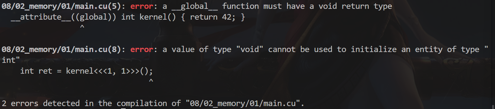
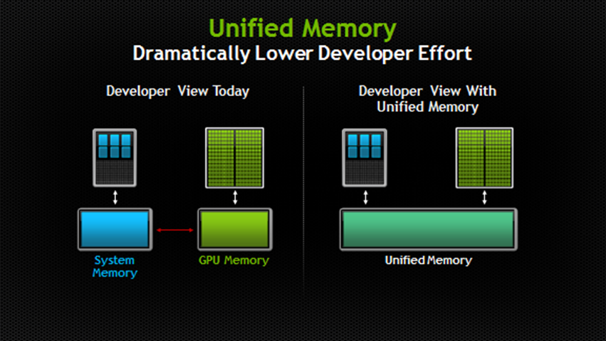

## 第二章：内存管理

### 怎样从核函数返回数据？

我们试着把 kernel 的返回类型声明为 int，试图从 GPU 返回数据到 CPU。

```cpp
#include <cuda_runtime.h>

#include <cstdio>

__global__ int kernel() { return 42; }

int main() {
  int ret = kernel<<<1, 1>>>();
  cudaDeviceSynchronize();
  printf("%d\n", ret);
  return 0;
}
```



但发现这样做会在编译期出错，为什么？

刚刚说了 kernel 的调用是**异步**的，返回的时候，并不会实际让 GPU 把核函数执行完毕，必须 cudaDeviceSynchronize() 等待它执行完毕（和线程的 join 很像）。

所以，不可能从 kernel 里通过返回值获取 GPU 数据，因为 kernel 返回时核函数并没有真正在 GPU 上执行。所以核函数返回类型必须是 void。

### 试图解决：通过指针传递

那你可能会想，既然不能返回，那作为指针传入局部变量的引用，不就好了。

```cpp
#include <cuda_runtime.h>

#include <cstdio>

__global__ void kernel(int *pret) { *pret = 42; }

int main() {
  int ret = 0;
  kernel<<<1, 1>>>(&ret);
  cudaDeviceSynchronize();
  printf("%d\n", ret);
  return 0;
}
// 0
```

这样，在 cudaDeviceSynchronize() 以后，应该可以获取数据了吧？

结果令人失望，尽管给 kernel 传了指向 ret 的指针，但 ret 的值并没有被改写成功。

### 分析返回错误的代码

CUDA 的函数，如 cudaDeviceSynchronize()。

它们出错时，并不会直接终止程序，也不会抛出 C++ 的异常，而是返回一个错误代码，告诉你出的具体什么错误，这是出于通用性考虑。

这个错误代码的类型是 cudaError_t，其实就是个 enum 类型，相当于 int。

可以通过 `cudaGetErrorName` 获取该 enum 的具体名字。这里显示错误号为 700，具体名字是 cudaErrorIllegalAddress。意思是我们访问了非法的地址，和 CPU 上的 Segmentation Fault 差不多。

```cpp
#include <cuda_runtime.h>

#include <cstdio>

__global__ void kernel(int *pret) { *pret = 42; }

int main() {
  int ret = 0;
  kernel<<<1, 1>>>(&ret);
  cudaError_t err = cudaDeviceSynchronize();
  printf("error code: %d\n", err);
  printf("error name: %s\n", cudaGetErrorName(err));
  printf("%d\n", ret);
  return 0;
}
// error code: 700
// error name: cudaErrorIllegalAddress
// 0
```

### helper_cuda.h工具

其实 CUDA toolkit 安装时，会默认附带一系列案例代码，这些案例中提供了一些非常有用的头文件和工具类，比如这个文件：

```
/opt/cuda/samples/common/inc/helper_cuda.h
```

把它和 helper_string.h 一起拷到头文件目录里，然后改一下 CMakeLists.txt 让它包含这个头文件目录。

- 如果你安装CUDA时没有选择samples包，直接在[CUDA-Sample的GitHub仓库](https://github.com/NVIDIA/cuda-samples)寻找并下载即可。

它定义了 checkCudaErrors 这个宏，使用时只需：

```
checkCudaErrors(cudaDeviceSynchronize())
```

即可自动帮你检查错误代码并打印在终端，然后退出。还会报告出错所在的行号，函数名等，很方便。

**示例：**

```cpp
#include <cuda_runtime.h>

#include <cstdio>

#include "helper_cuda.h"

__global__ void kernel(int *pret) { *pret = 42; }

int main() {
  int ret = 0;
  kernel<<<1, 1>>>(&ret);
  checkCudaErrors(cudaDeviceSynchronize());
  return 0;
}
// CUDA error at 02_memory/04/main.cu:12 code=700(cudaErrorIllegalAddress)
// "cudaDeviceSynchronize()"
```

```cmake
cmake_minimum_required(VERSION 3.10)

set(CMAKE_CXX_STANDARD 17)
set(CMAKE_BUILD_TYPE Release)

project(hellocuda LANGUAGES CXX CUDA)

add_executable(main main.cu)
target_include_directories(main PUBLIC ../../include)   # 注意添加头文件路径
```

- 注意修改为你的头文件路径

### 在堆上分配试试呢？

你可能会想，难道是因为我的 ret 创建在栈上，所以 GPU 不能访问，才出错的？

```cpp
#include <cuda_runtime.h>

#include <cstdio>

#include "helper_cuda.h"

__global__ void kernel(int *pret) { *pret = 42; }

int main() {
  int *pret = (int *)malloc(sizeof(int));	// 申请堆上内存
  kernel<<<1, 1>>>(pret);
  checkCudaErrors(cudaDeviceSynchronize());
  free(pret);
  return 0;
}
// CUDA error at /home/ming/project/cuda/08/02_memory/05/main.cu:12
// code=700(cudaErrorIllegalAddress) "cudaDeviceSynchronize()"
```

试图用 malloc 在堆上分配一个 int 来给 GPU 访问，结果还是失败了。

### 原因：GPU 使用独立的显存，不能访问 CPU 内存

原来，GPU 和 CPU 各自使用着独立的内存。CPU 的内存称为主机内存(host)。GPU 使用的内存称为设备内存(device)，它是显卡上板载的，速度更快，又称显存。

而不论栈还是 malloc 分配的都是 CPU 上的内存，所以自然是无法被 GPU 访问到。

因此可以用用 cudaMalloc 分配 GPU 上的显存，这样就不出错了，结束时 cudaFree 释放。

```cpp
#include <cuda_runtime.h>

#include <cstdio>

#include "helper_cuda.h"

__global__ void kernel(int *pret) { *pret = 42; }

int main() {
  int *pret;
  checkCudaErrors(cudaMalloc(&pret, sizeof(int)));
  kernel<<<1, 1>>>(pret);
  checkCudaErrors(cudaDeviceSynchronize());
  cudaFree(pret);
  return 0;
}
```

注意到 cudaMalloc 的返回值已经用来表示错误代码，所以返回指针只能通过 &pret 二级指针。

### 反之亦然，CPU 也不能访问 GPU 内存地址

你可能已经迫不及待想通过 *pret 访问其返回值了。但是不行，因为 GPU 访问不了 CPU 的内存地址，同理，CPU 也访问不了 GPU 的内存地址。一访问 CPU 就奔溃了。

```cpp
#include <cuda_runtime.h>

#include <cstdio>

#include "helper_cuda.h"

__global__ void kernel(int *pret) { *pret = 42; }

int main() {
  int *pret;
  checkCudaErrors(cudaMalloc(&pret, sizeof(int)));
  kernel<<<1, 1>>>(pret);
  checkCudaErrors(cudaDeviceSynchronize());
  printf("result: %d\n", *pret);
  cudaFree(pret);
  return 0;
}
// 报错：Segmentation fault (core dumped)
```

### 跨 GPU/CPU 地址空间拷贝数据

因此可以用 cudaMemcpy，它能够在 GPU 和 CPU 内存之间拷贝数据。

```cpp
#include <cuda_runtime.h>

#include <cstdio>

#include "helper_cuda.h"

__global__ void kernel(int *pret) { *pret = 42; }

int main() {
  int *pret;
  checkCudaErrors(cudaMalloc(&pret, sizeof(int)));
  kernel<<<1, 1>>>(pret);
  checkCudaErrors(cudaDeviceSynchronize());

  int ret;
  checkCudaErrors(cudaMemcpy(&ret, pret, sizeof(int), cudaMemcpyDeviceToHost));	// 数据拷贝
  printf("result: %d\n", ret);

  cudaFree(pret);
  return 0;
}
// result: 42
```

这里我们希望把 GPU 上的内存数据拷贝到 CPU 内存上，也就是从设备内存(device)到主机内存(host)，因此第四个参数指定为 cudaMemcpyDeviceToHost。

同理，还有 cudaMemcpyHostToDevice 和 cudaMemcpyDeviceToDevice。

### cudaMemcpy 会自动同步！

注意：cudaMemcpy 会自动进行同步操作，即和 cudaDeviceSynchronize() 等价！因此前面的 cudaDeviceSynchronize() 实际上可以删掉了。

```cpp
#include <cuda_runtime.h>

#include <cstdio>

#include "helper_cuda.h"

__global__ void kernel(int *pret) { *pret = 42; }

int main() {
  int *pret;
  checkCudaErrors(cudaMalloc(&pret, sizeof(int)));
  kernel<<<1, 1>>>(pret);

  // cudaDeviceSynchronize();     // cudaMemcpy隐含同步
  int ret;
  checkCudaErrors(cudaMemcpy(&ret, pret, sizeof(int), cudaMemcpyDeviceToHost));
  printf("result: %d\n", ret);

  cudaFree(pret);
  return 0;
}
// result: 42
```

### 统一内存地址技术 （Unified Memory）

还有一种在比较新的显卡上支持的特性，那就是统一内存(managed)，只需把 cudaMalloc 换成 cudaMallocManaged 即可，释放时也是通过 cudaFree。

```cpp
#include <cuda_runtime.h>

#include <cstdio>

#include "helper_cuda.h"

__global__ void kernel(int *pret) { *pret = 42; }

int main() {
  int *pret;
  checkCudaErrors(cudaMallocManaged(&pret, sizeof(int)));  // 统一内存分配
  kernel<<<1, 1>>>(pret);
  checkCudaErrors(cudaDeviceSynchronize());
  printf("result: %d\n", *pret);
  cudaFree(pret);
  return 0;
}
// result: 42
```

这样分配出来的地址，不论在 CPU 还是 GPU 上都是一模一样的，都可以访问。而且拷贝也会自动按需进行（当从 CPU 访问时），无需手动调用 cudaMemcpy，大大方便了编程人员，特别是含有指针的一些数据结构。

### 注意区分

- 主机内存(host)：malloc、free

- 设备内存(device)：cudaMalloc、cudaFree

- 统一内存(managed)：cudaMallocManaged、cudaFree

如果我没记错的话，统一内存是从 Pascal 架构开始支持的，也就是 GTX9 开头及以上。

虽然方便，但并非完全没有开销，有条件的话还是尽量用分离的设备内存和主机内存吧。



##