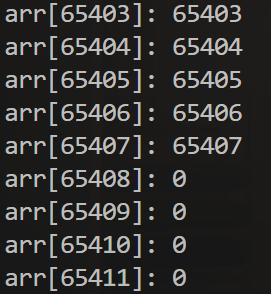

## 第三章：GPU上的数组

### 分配一个数组

```cpp
#include <cuda_runtime.h>

#include <cstdio>

#include "helper_cuda.h"

__global__ void kernel(int *arr, int n) {
  for (int i = 0; i < n; i++) {
    arr[i] = i;
  }
}

int main() {
  int n = 32;
  int *arr;
  checkCudaErrors(cudaMallocManaged(&arr, n * sizeof(int)));
  kernel<<<1, 1>>>(arr, n);
  checkCudaErrors(cudaDeviceSynchronize());
  for (int i = 0; i < n; i++) {
    printf("arr[%d]: %d\n", i, arr[i]);
  }
  cudaFree(arr);
  return 0;
}
// arr[0]: 0
// arr[1]: 1
// arr[2]: 2
// arr[3]: 3
// arr[4]: 4
// arr[5]: 5
// arr[6]: 6
// arr[7]: 7
// arr[8]: 8
// arr[9]: 9
// arr[10]: 10
// arr[11]: 11
// arr[12]: 12
// arr[13]: 13
// arr[14]: 14
// arr[15]: 15
// arr[16]: 16
// arr[17]: 17
// arr[18]: 18
// arr[19]: 19
// arr[20]: 20
// arr[21]: 21
// arr[22]: 22
// arr[23]: 23
// arr[24]: 24
// arr[25]: 25
// arr[26]: 26
// arr[27]: 27
// arr[28]: 28
// arr[29]: 29
// arr[30]: 30
// arr[31]: 31
```

如 malloc 一样，可以用 cudaMalloc 配合 n * sizeof(int)，分配一个大小为 n 的整型数组。这样就会有 n 个连续的 int 数据排列在内存中，而 arr 则是指向其起始地址。然后把 arr 指针传入 kernel，即可在里面用 arr[i] 访问它的第 i 个元素。

因为我们用的统一内存(managed)，所以同步以后 CPU 也可以直接读取。

### 多个线程并行赋值

刚刚的 for 循环是串行的，我们可以把线程数量调为 n，然后用 threadIdx.x 作为 i 索引。这样就实现了，每个线程负责给数组中一个元素的赋值。

```cpp
#include <cuda_runtime.h>

#include <cstdio>

#include "helper_cuda.h"

__global__ void kernel(int *arr, int n) {
  int i = threadIdx.x;	// 每个线程赋值一个元素
  arr[i] = i;
}

int main() {
  int n = 32;
  int *arr;
  checkCudaErrors(cudaMallocManaged(&arr, n * sizeof(int)));
  kernel<<<1, n>>>(arr, n);
  checkCudaErrors(cudaDeviceSynchronize());
  for (int i = 0; i < n; i++) {
    printf("arr[%d]: %d\n", i, arr[i]);
  }
  cudaFree(arr);
  return 0;
}
// arr[0]: 0
// arr[1]: 1
// arr[2]: 2
// arr[3]: 3
// arr[4]: 4
// arr[5]: 5
// arr[6]: 6
// arr[7]: 7
// arr[8]: 8
// arr[9]: 9
// arr[10]: 10
// arr[11]: 11
// arr[12]: 12
// arr[13]: 13
// arr[14]: 14
// arr[15]: 15
// arr[16]: 16
// arr[17]: 17
// arr[18]: 18
// arr[19]: 19
// arr[20]: 20
// arr[21]: 21
// arr[22]: 22
// arr[23]: 23
// arr[24]: 24
// arr[25]: 25
// arr[26]: 26
// arr[27]: 27
// arr[28]: 28
// arr[29]: 29
// arr[30]: 30
// arr[31]: 31
```

### 小技巧：网格跨步循环（grid-stride loop）

需要注意的是，GPU上虽然可以启动成千上万个线程，但是每个板块上的线程数量是有限的。

在大多数现代CUDA支持的GPU上，`blockDim`的最大值通常是：

- 每个维度的最大线程数：1024个线程。
- 每个线程块的总线程数：最多可以有1024个线程（即`blockDim.x`、`blockDim.y`、`blockDim.z`的乘积最多为1024）。(从这里也可以隐约感觉到CUDA虽然以三个维度组织线程管理，但在硬件实现上并不区分)

因此，如果数组很大的话，我们不能直接在一个板块上启动足够的线程，即`<<< g , b>>>`中的b不能太大。

启动多个板块的话，我们就可以通过下面的操作实现网格跨步循环：

```cpp
#include <cuda_runtime.h>

#include <cstdio>

#include "helper_cuda.h"

__global__ void kernel(int *arr, int n) {
  for (int i = threadIdx.x; i < n; i += blockDim.x) {	// 自增一个板块的大小
    arr[i] = i;
  }
}

int main() {
  int n = 7;
  int *arr;
  checkCudaErrors(cudaMallocManaged(&arr, n * sizeof(int)));

  kernel<<<1, 4>>>(arr, n);

  checkCudaErrors(cudaDeviceSynchronize());
  for (int i = 0; i < n; i++) {
    printf("arr[%d]: %d\n", i, arr[i]);
  }

  cudaFree(arr);
  return 0;
}
// arr[0]: 0
// arr[1]: 1
// arr[2]: 2
// arr[3]: 3
// arr[4]: 4
// arr[5]: 5
// arr[6]: 6
```

无论调用者指定了多少个线程（blockDim），都能自动根据给定的 n 区间循环，不会越界，也不会漏掉几个元素。

这样一个 for 循环非常符合 CPU 上常见的 parallel for 的习惯，又能自动匹配不同的 blockDim，看起来非常方便。

**补充：**

- 可以通过`cudaDeviceProp`结构中的`maxThreadsPerBlock`、`maxThreadsDim`来查询具体的硬件限制。

```cpp
cppCopy codecudaDeviceProp prop;
cudaGetDeviceProperties(&prop, device_id);
printf("Max threads per block: %d\n", prop.maxThreadsPerBlock);
printf("Max thread block dimensions: (%d, %d, %d)\n", prop.maxThreadsDim[0], prop.maxThreadsDim[1], prop.maxThreadsDim[2]);
```

- 这些限制是为了保证GPU的硬件能够高效地调度和执行线程。

### 从线程到板块

核函数内部，用之前说到的 blockDim.x + blockIdx.x + threadIdx.x 来获取线程在整个网格中编号。

外部调用者，则是根据不同的 n 决定板块的数量（gridDim），而每个板块具有的线程数量（blockDim）则是固定的 128。

因此，我们可以用 n / 128 作为 gridDim，这样总的线程数刚好的 n，实现了每个线程负责处理一个元素。

```cpp
#include <cuda_runtime.h>

#include <cstdio>

#include "helper_cuda.h"

__global__ void kernel(int *arr, int n) {
  int i = blockDim.x * blockIdx.x + threadIdx.x;
  arr[i] = i;
}

int main() {
  int n = 65536;
  int *arr;
  checkCudaErrors(cudaMallocManaged(&arr, n * sizeof(int)));

  int nthreads = 128;
  int nblocks = n / nthreads;
  kernel<<<nblocks, nthreads>>>(arr, n);

  checkCudaErrors(cudaDeviceSynchronize());
  for (int i = 0; i < n; i++) {
    printf("arr[%d]: %d\n", i, arr[i]);
  }

  cudaFree(arr);
  return 0;
}
// arr[0]: 0
// ...
// arr[65534]: 65534
// arr[65535]: 65535

```

### 边角料难题

但这样的话，n 只能是的 128 的整数倍，如果不是就会漏掉最后几个元素。

主要是 C 语言的整数除法 n / nthreads，它是向下取整的，比如 7 / 4 = 1。

比如 n 为 65535，那么最后 127 个元素是没有赋值的。

```cpp
#include <cuda_runtime.h>

#include <cstdio>

#include "helper_cuda.h"

__global__ void kernel(int *arr, int n) {
  int i = blockDim.x * blockIdx.x + threadIdx.x;
  arr[i] = i;
}

int main() {
  int n = 65535;
  int *arr;
  checkCudaErrors(cudaMallocManaged(&arr, n * sizeof(int)));

  int nthreads = 128;
  int nblocks = n / nthreads;
  kernel<<<nblocks, nthreads>>>(arr, n);

  checkCudaErrors(cudaDeviceSynchronize());
  for (int i = 0; i < n; i++) {
    printf("arr[%d]: %d\n", i, arr[i]);
  }

  cudaFree(arr);
  return 0;
}
```



### 解决边角料难题

解决方法就是：采用向上取整的除法。

可是 C 语言好像没有向上整除的除法这个运算符？没关系，用这个式子即可：

```cpp
(n + nthreads - 1) / nthreads
```

例如：(7 + 3) / 4 = 2，(8 + 3 / 4) = 2。

```cpp
#include <cuda_runtime.h>

#include <cstdio>

#include "helper_cuda.h"

__global__ void kernel(int *arr, int n) {
  int i = blockDim.x * blockIdx.x + threadIdx.x;
  if (i >= n) return;  // 防止越界，注意这里是 '>='
  arr[i] = i;
}

int main() {
  int n = 65535;
  int *arr;
  checkCudaErrors(cudaMallocManaged(&arr, n * sizeof(int)));

  int nthreads = 128;
  int nblocks =
      (n + nthreads - 1) / nthreads;  // 向上取整 (n + nthreads - 1) / nthreads
  kernel<<<nblocks, nthreads>>>(arr, n);

  checkCudaErrors(cudaDeviceSynchronize());
  for (int i = 0; i < n; i++) {
    printf("arr[%d]: %d\n", i, arr[i]);
  }

  cudaFree(arr);
  return 0;
}
```

由于向上取整，这样会多出来一些线程，因此要在 kernel 内**判断**当前 i 是否超过了 n，如果超过就要提前退出，防止越界。

### 网格跨步循环：应用于线程与板块一起的情况

解决边角料问题的另一种方法是完整的跨步循环操作：

```cpp
#include <cuda_runtime.h>

#include <cstdio>

#include "helper_cuda.h"

__global__ void kernel(int *arr, int n) {
  for (int i = blockDim.x * blockIdx.x + threadIdx.x; i < n;
       i += blockDim.x * gridDim.x) {  // 跨步访问，i < n防止了越界访问
    arr[i] = i;
  }
}

int main() {
  int n = 65536;
  int *arr;
  checkCudaErrors(cudaMallocManaged(&arr, n * sizeof(int)));

  kernel<<<32, 128>>>(arr, n);	// 每个线程处理大约 n/4096 = 16个元素
    
// int nthreads = 128;
// int nblocks = (n + nthreads - 1) / nthreads;  // 动态计算线程块数

// kernel<<<nblocks, nthreads>>>(arr, n);

  checkCudaErrors(cudaDeviceSynchronize());
  for (int i = 0; i < n; i++) {
    printf("arr[%d]: %d\n", i, arr[i]);
  }

  cudaFree(arr);
  return 0;
}
```

网格跨步循环实际上本来是这样，利用扁平化的线程数量和线程编号实现动态大小。

同样，无论调用者指定每个板块多少线程（blockDim），总共多少板块（gridDim）。都能自动根据给定的 n 区间循环，不会越界，也不会漏掉几个元素。

这样一个 for 循环非常符合 CPU 上常见的 parallel for 的习惯，又能自动匹配不同的 blockDim 和 gridDim，看起来非常方便。

上面的核函数可以这样拆开，会方便理解：

```cpp
__global__ void kernel(int *arr, int n) {
  int i = blockDim.x * blockIdx.x + threadIdx.x;	// 当前线程的全局id
  int stride = gridDim.x * blockDim.x; // 块数量 * 每个块的线程数 = 启动的总线程数 = 步长
  
  // 遍历数组中的每个元素，按跨步方式处理
  for (int idx = i; idx < n; idx += stride) {	// < n防止越界访问
    arr[idx] = idx;  // 处理数据
  }
}
```

### **举例解释：**

假设我们有以下配置：

- 数组 `arr` 的大小为 `n = 65536`，即包含 65536 个元素。

- 使用 

  ```
  kernel<<<32, 128>>>(arr, n);
  ```

   启动 CUDA 核函数。

  - `gridDim.x = 32`，表示线程网格中有 32 个线程块（blocks）。
  - `blockDim.x = 128`，表示每个线程块中有 128 个线程。
  - 因此，总线程数为 `32 * 128 = 4096` 个线程。

- 每个线程都将处理一个不同的数组元素，且使用跨步访问（stride）来分配任务。

1. **线程计算公式**

每个线程的索引 `i` 由以下公式计算：

```cpp
i = blockDim.x * blockIdx.x + threadIdx.x;
```

- `blockIdx.x` 是线程块的索引。
- `threadIdx.x` 是线程块内的线程索引。
- `blockDim.x` 是每个线程块的线程数。

例如：

- `blockIdx.x = 0` 表示第一个线程块。
- `threadIdx.x = 0` 表示第一个线程。
- 因此，`i = 128 * 0 + 0 = 0`，第一个线程处理索引 `i = 0`

2. **跨步访问(stride)**

跨步访问是通过增加 `i += stride` 来实现的，其中 `stride` 是线程网格中所有线程的总数。对于本例：

```cpp
int stride = gridDim.x * blockDim.x;  // 32 * 128 = 4096
```

这里的 `stride` 计算为 `4096`，表示每个线程在数组中跨步的大小。也就是说，每个线程处理的数据并不是相邻的，而是间隔 4096 个元素。

3. **线程的工作范围**

每个线程的工作由一个循环实现，使用跨步访问来遍历数组：

```cpp
for (int i = blockDim.x * blockIdx.x + threadIdx.x; i < n; i += stride) {
  arr[i] = i;
}
```

- `i = blockDim.x * blockIdx.x + threadIdx.x` 是线程的起始索引。
- `i += stride` 确保线程按步长 `4096` 遍历数组。

4. **每个线程块的处理**

假设我们有 32 个线程块，每个线程块有 128 个线程。那么对于每个线程块和线程的组合，线程索引 `i` 会依次进行计算。

- **第一个线程块**（`blockIdx.x = 0`）:
  - 线程 `threadIdx.x = 0`：`i = 128 * 0 + 0 = 0`，处理 `arr[0]`。
  - 线程 `threadIdx.x = 1`：`i = 128 * 0 + 1 = 1`，处理 `arr[1]`。
  - 线程 `threadIdx.x = 127`：`i = 128 * 0 + 127 = 127`，处理 `arr[127]`。
- **第二个线程块**（`blockIdx.x = 1`）:
  - 线程 `threadIdx.x = 0`：`i = 128 * 1 + 0 = 128`，处理 `arr[128]`。
  - 线程 `threadIdx.x = 127`：`i = 128 * 1 + 127 = 255`，处理 `arr[255]`。

- **第32个线程块**（`blockIdx.x = 31`）：

  - 线程 `threadIdx.x = 0`：`i = 128 * 31 + 0 = 3968`，处理 `arr[3968]`。
  - 线程 `threadIdx.x = 127`：`i = 128 * 31 + 127 = 128`，处理 `arr[4095]`。

这只是第一轮循环的内容，每次循环上面的每个线程都会跳过步长(4096)个元素。最终循环16轮

5. **分析第16轮的情况：**

- **第一个线程块**（`blockIdx.x = 0`）:
  - 线程 `threadIdx.x = 0`*
    - 索引为 `i = 0 + 15 * 4096 = 61440`。


这里我们计算一下：`65535 - 61440 = 4095`可以看出我们确实不需要再跳一次4096了

- 第32个线程块（`blockIdx.x = 31`）：
  - 线程 `threadIdx.x = 127`
    - 索引为 `i = (128 * 31 + 127) + 15 * 4096 = 65535`

终于，我们看到第16轮循环时，最后一个线程块的最后一个线程刚好访问到第65535个元素！
