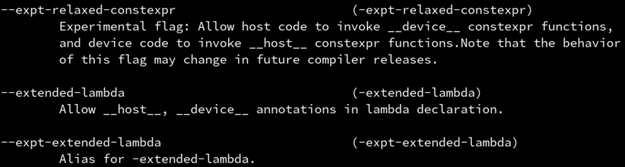
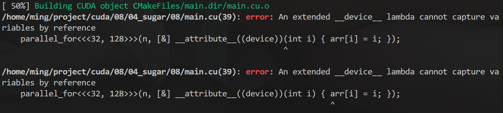
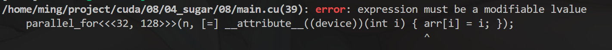

## 第四章：C++封装GPU上的数组

### std::vector的秘密：第二模板参数

**你知道吗？**std::vector 作为模板类，其实有两个模板参数：

```cpp
std::vector<T, AllocatorT>
```

那为什么我们平时只用了 std::vector<T> 呢？因为第二个参数默认是 std::allocator<T>。

也就是 std::vector<T> 等价于 std::vector<T, std::allocator<T>>。

std::allocator<T> 的功能是负责分配和释放内存，初始化 T 对象等等。

它具有如下几个成员函数：

```cpp
T *allocate(size_t n)	// 分配长度为n，类型为T的数组，返回其起始地址

void deallocate(T *p, size_t n)	// 释放长度为n，起始地址为p，类型为T的数组
```

### 抽象的 std::allocator 接口

vector 会调用 std::allocator<T> 的 allocate/deallocate 成员函数，他又会去调用标准库的 malloc/free 分配和释放内存空间（即他分配是的 CPU 内存）。

我们可以自己定义一个和 std::allocator<T> 一样具有 allocate/deallocate 成员函数的类，这样就可以“骗过”vector，让他不是在 CPU 内存中分配，而是在 CUDA 的统一内存(managed)上分配。

```cpp
#include <cuda_runtime.h>

#include <cstdio>
#include <vector>

#include "helper_cuda.h"

template <class T>
struct CudaAllocator {
  using value_type = T;

  T *allocate(size_t size) {
    T *ptr = nullptr;
    checkCudaErrors(cudaMallocManaged(&ptr, size * sizeof(T)));
    return ptr;
  }

  void deallocate(T *ptr, size_t size = 0) { checkCudaErrors(cudaFree(ptr)); }
};

__global__ void kernel(int *arr, int n) {
  for (int i = blockDim.x * blockIdx.x + threadIdx.x; i < n;
       i += blockDim.x * gridDim.x) {
    arr[i] = i;
  }
}

int main() {
  int n = 65536;
  std::vector<int, CudaAllocator<int>> arr(n);  // 第二参数是自定义的分配器

  kernel<<<32, 128>>>(arr.data(), n);

  checkCudaErrors(cudaDeviceSynchronize());
  for (int i = 0; i < n; i++) {
    printf("arr[%d]: %d\n", i, arr[i]);
  }

  return 0;
}
```

实际上这种“骗”来魔改类内部行为的操作，正是现代 C++ 的 concept 思想所在。因此替换 allocator 实际上是标准库允许的，因为他提升了标准库的泛用性。

### 进一步：避免初始化为0

vector 在初始化的时候（或是之后 resize 的时候）会调用所有元素的无参构造函数，对 int 类型来说就是零初始化。然而这个初始化会是在 CPU 上做的，因此我们需要禁用他。

可以通过给 allocator 添加 construct 成员函数，来魔改 vector 对元素的构造。默认情况下他可以有任意多个参数，而如果没有参数则说明是无参构造函数。

因此我们只需要判断是不是有参数，然后是不是传统的 C 语言类型（plain-old-data），如果是，则跳过其无参构造，从而避免在 CPU 上低效的零初始化。

```cpp
#include <cuda_runtime.h>

#include <cstdio>
#include <vector>

#include "helper_cuda.h"

template <class T>
struct CudaAllocator {
  using value_type = T;

  T *allocate(size_t size) {
    T *ptr = nullptr;
    checkCudaErrors(cudaMallocManaged(&ptr, size * sizeof(T)));
    return ptr;
  }

  void deallocate(T *ptr, size_t size = 0) { checkCudaErrors(cudaFree(ptr)); }

  template <class... Args>
  void construct(T *p, Args &&...args) {
    if constexpr (!(sizeof...(Args) == 0 && std::is_pod_v<T>))
      ::new ((void *)p) T(std::forward<Args>(args)...);
  }
};

__global__ void kernel(int *arr, int n) {
  for (int i = blockDim.x * blockIdx.x + threadIdx.x; i < n;
       i += blockDim.x * gridDim.x) {
    arr[i] = i;
  }
}

int main() {
  int n = 65536;
  std::vector<int, CudaAllocator<int>> arr(n);

  kernel<<<32, 128>>>(arr.data(), n);

  checkCudaErrors(cudaDeviceSynchronize());
  for (int i = 0; i < n; i++) {
    printf("arr[%d]: %d\n", i, arr[i]);
  }

  return 0;
}
```

- 解释一下construct函数的写法：
- `if constexpr (条件)`是 C++17的语法，根据条件在编译期选择性编译不同的代码
- `sizeof...(Args) == 0 && std::is_pod_v<T>`：判断参数包 `Args` 是否为空（没有构造参数）并且类型 `T` 是否是 POD 类型。
- `::new` 是一种使用显式地址来调用构造函数的语法，可以指定对象应该在内存的哪个位置进行构造。

### 进一步：核函数可以是一个模板函数

刚刚说过 CUDA 的优势在于对 C++ 的完全支持。所以 `__global__` 修饰的核函数自然也是可以为模板函数的。

调用模板时一样可以用自动参数类型推导，如有手动指定的模板参数（单尖括号）请放在三重尖括号的前面。

```cpp
#include <cuda_runtime.h>

#include <cstdio>
#include <vector>

#include "helper_cuda.h"

template <class T>
struct CudaAllocator {
  using value_type = T;

  T *allocate(size_t size) {
    T *ptr = nullptr;
    checkCudaErrors(cudaMallocManaged(&ptr, size * sizeof(T)));
    return ptr;
  }

  void deallocate(T *ptr, size_t size = 0) { checkCudaErrors(cudaFree(ptr)); }

  template <class... Args>
  void construct(T *p, Args &&...args) {
    if constexpr (!(sizeof...(Args) == 0 && std::is_pod_v<T>))
      ::new ((void *)p) T(std::forward<Args>(args)...);
  }
};

template <int N, class T>  // 核函数模板
__global__ void kernel(T *arr) {
  for (int i = blockDim.x * blockIdx.x + threadIdx.x; i < N;
       i += blockDim.x * gridDim.x) {
    arr[i] = i;
  }
}

int main() {
  constexpr int n = 65536;
  std::vector<int, CudaAllocator<int>> arr(n);

  kernel<n><<<32, 128>>>(arr.data());	// 手动指定模板参数 <>

  checkCudaErrors(cudaDeviceSynchronize());
  for (int i = 0; i < n; i++) {
    printf("arr[%d]: %d\n", i, arr[i]);
  }

  return 0;
}
```

### 进一步：核函数可以接受函子(functor)，实现函数式编程

- 在 C++ 中，**函子**（Functor）是一个可以像函数一样**被调用的对象**。也就是说，函子是一个重载了 `operator()` 的类或结构体的实例

```cpp
#include <cuda_runtime.h>

#include <cstdio>
#include <vector>

#include "helper_cuda.h"

template <class Func>
__global__ void parallel_for(int n, Func func) {
  for (int i = blockDim.x * blockIdx.x + threadIdx.x; i < n;
       i += blockDim.x * gridDim.x) {
    func(i);
  }
}

struct MyFunctor {  // 函数对象
  __device__ void operator()(int i) const { printf("number %d\n", i); }
};

int main() {
  int n = 65536;

  parallel_for<<<32, 128>>>(n, MyFunctor{});  // 调用一个函数对象（函子functor）

  checkCudaErrors(cudaDeviceSynchronize());

  return 0;
}
```

不过要注意三点：

1. 这里的 Func 不可以是 Func const &，那样会变成一个指向 CPU 内存地址的指针，从而出错。所以 CPU 向 GPU 的传参必须按值传。

2. 做参数的这个函数必须是一个有着成员函数 operator() 的类型，即 functor 类。而不能是独立的函数，否则报错。

3. 这个函数必须标记为 `__device__`，即 GPU 上的函数，否则会变成 CPU 上的函数。

### 进一步：函子可以是 lambda 表达式

lambda这么方便，CUDA当然也要支持，只需要开启 `--extended-lambda`选项

接下来就可以直接写 lambda 表达式，不过必须在 [] 后，() 前，插入 `__device__` 修饰符。

```
[] __device__ () { }
```

为了只对 .cu 文件开启这个开关，可以用 CMake 的生成器表达式，限制 flag 只对 CUDA 源码生效，这样可以混合其他 .cpp 文件也不会发生 gcc 报错的情况了。。

```cmake
add_executable(main main.cu)
target_include_directories(main PUBLIC ../../include)
target_compile_options(main PUBLIC $<$<COMPILE_LANGUAGE:CUDA>:--extended-lambda>)	# 开启选项
```



### 怎样捕获外部变量？

lambda表达式在CUDA上要怎样捕获变量呢？

```cpp
#include <cuda_runtime.h>

#include <cstdio>
#include <vector>

#include "helper_cuda.h"

template <class T>
struct CudaAllocator {
  using value_type = T;

  T *allocate(size_t size) {
    T *ptr = nullptr;
    checkCudaErrors(cudaMallocManaged(&ptr, size * sizeof(T)));
    return ptr;
  }

  void deallocate(T *ptr, size_t size = 0) { checkCudaErrors(cudaFree(ptr)); }

  template <class... Args>
  void construct(T *p, Args &&...args) {
    if constexpr (!(sizeof...(Args) == 0 && std::is_pod_v<T>))
      ::new ((void *)p) T(std::forward<Args>(args)...);
  }
};

template <class Func>
__global__ void parallel_for(int n, Func func) {
  for (int i = blockDim.x * blockIdx.x + threadIdx.x; i < n;
       i += blockDim.x * gridDim.x) {
    func(i);
  }
}

int main() {
  int n = 65536;
  std::vector<int, CudaAllocator<int>> arr(n);

  parallel_for<<<32, 128>>>(n, [&] __device__(int i) { arr[i] = i; });

  checkCudaErrors(cudaDeviceSynchronize());

  return 0;
}
```

如果试图用 `[&]` 捕获变量是会出错的，毕竟这时候捕获到的是堆栈（**CPU**内存）上的变量 arr 本身，而不是 arr 所指向的内存地址（**GPU**内存）。



你可能会想，是不是可以用 [=] 按值捕获，这样捕获到的就是指针了吧？

```cpp
#include <cuda_runtime.h>

#include <cstdio>
#include <vector>

#include "helper_cuda.h"

template <class T>
struct CudaAllocator {
  using value_type = T;

  T *allocate(size_t size) {
    T *ptr = nullptr;
    checkCudaErrors(cudaMallocManaged(&ptr, size * sizeof(T)));
    return ptr;
  }

  void deallocate(T *ptr, size_t size = 0) { checkCudaErrors(cudaFree(ptr)); }

  template <class... Args>
  void construct(T *p, Args &&...args) {
    if constexpr (!(sizeof...(Args) == 0 && std::is_pod_v<T>))
      ::new ((void *)p) T(std::forward<Args>(args)...);
  }
};

template <class Func>
__global__ void parallel_for(int n, Func func) {
  for (int i = blockDim.x * blockIdx.x + threadIdx.x; i < n;
       i += blockDim.x * gridDim.x) {
    func(i);
  }
}

int main() {
  int n = 65536;
  std::vector<int, CudaAllocator<int>> arr(n);

  parallel_for<<<32, 128>>>(n, [=] __device__(int i) { arr[i] = i; });

  checkCudaErrors(cudaDeviceSynchronize());

  return 0;
}

```

错了，不要忘了我们在STL中说过，vector 的拷贝是深拷贝（绝大多数C++类都是深拷贝，除了智能指针和原始指针）。这样只会把 vector 整个地拷贝到 GPU 上！而不是浅拷贝其起始地址指针。



**正确的做法**是，首先获取`arr.data()` 的值到 arr_data 变量，然后用 [=] 按值捕获 arr_data，函数体里面也通过 arr_data 来访问 arr。

```cpp
#include <cuda_runtime.h>

#include <cstdio>
#include <vector>

#include "helper_cuda.h"

template <class T>
struct CudaAllocator {
  using value_type = T;

  T *allocate(size_t size) {
    T *ptr = nullptr;
    checkCudaErrors(cudaMallocManaged(&ptr, size * sizeof(T)));
    return ptr;
  }

  void deallocate(T *ptr, size_t size = 0) { checkCudaErrors(cudaFree(ptr)); }

  template <class... Args>
  void construct(T *p, Args &&...args) {
    if constexpr (!(sizeof...(Args) == 0 && std::is_pod_v<T>))
      ::new ((void *)p) T(std::forward<Args>(args)...);
  }
};

template <class Func>
__global__ void parallel_for(int n, Func func) {
  for (int i = blockDim.x * blockIdx.x + threadIdx.x; i < n;
       i += blockDim.x * gridDim.x) {
    func(i);
  }
}

int main() {
  int n = 65536;
  std::vector<int, CudaAllocator<int>> arr(n);

  int *arr_data = arr.data();  // 先获取指针
  parallel_for<<<32, 128>>>(n, [=] __device__(int i) { arr_data[i] = i; });

  checkCudaErrors(cudaDeviceSynchronize());
  for (int i = 0; i < n; i++) {
    printf("arr[%d] = %d\n", i, arr[i]);
  }

  return 0;
}
```

为什么这样？因为 data() 返回一个起始地址的原始指针，而原始指针是浅拷贝的，所以可以拷贝到 GPU 上，让他访问。这样和之前作为核函数参数是一样的，不过是作为 Func 结构体统一传入了。

或者在 `[]` 里这样直接写自定义捕获的表达式也是可以的，这样就可以用同一变量名。

```cpp
  std::vector<int, CudaAllocator<int>> arr(n);

  parallel_for<<<32, 128>>>(
      n, [arr = arr.data()] __device__(int i) { arr[i] = i; });
```
