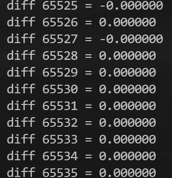
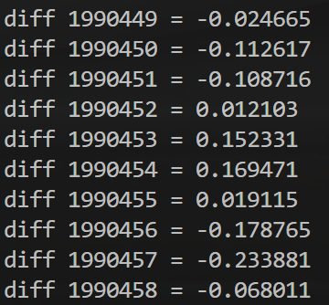
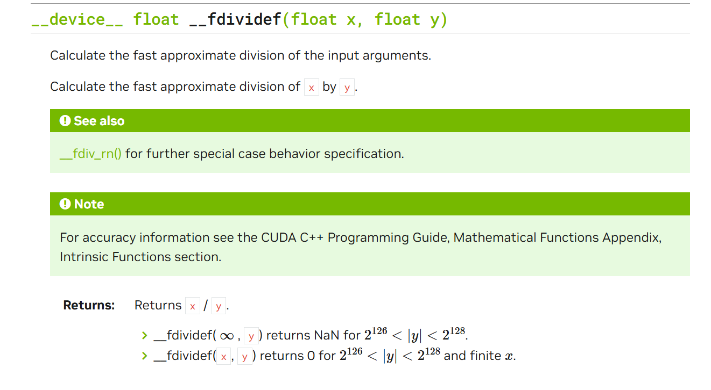

## 第五章：数学运算

### 经典案例，并行地求 sin 值

*终于可以在GPU上干点正事了(bushi*

就让我们在 GPU 上并行地计算从 sin(0) 到 sin(65535) 的值，并填入到数组 arr 中。

```cpp
#include <cuda_runtime.h>

#include <cstdio>
#include <vector>

#include "CudaAllocator.h"  // 封装刚才的内存分配器
#include "helper_cuda.h"

template <class Func>
__global__ void parallel_for(int n, Func func) {
  for (int i = blockDim.x * blockIdx.x + threadIdx.x; i < n;
       i += blockDim.x * gridDim.x) {
    func(i);
  }
}

int main() {
  int n = 65536;
  std::vector<float, CudaAllocator<float>> arr(n);

  parallel_for<<<32, 128>>>(
      n, [arr = arr.data()] __device__(int i) { arr[i] = sinf(i); });

  checkCudaErrors(cudaDeviceSynchronize());
  for (int i = 0; i < n; i++) {
    printf("diff %d = %f\n", i, arr[i] - sinf(i));
  }

  return 0;
}
```

- 这里为什么用 sinf 而不是 sin？

- 因为 sin 是 double 类型的正弦函数，而我们需要的 sinf 是 float 类型的正弦函数。
- 可不要偷懒少打一个 f 哦，否则计算过程需要对数据类型进行转换，影响性能。

完成同步之后，和 CPU 算出来的比较差值，看看 GPU 算的是否准确无误，从右边的输出可以看到基本是一致的。



### 测试一下时间

提供一个小工具：ticktock.h

可以用来打印 CPU 和 GPU的用时

```cpp
#pragma once

#include <chrono>
#include <iostream>

#ifndef __ycm__
#define TICK(x) auto bench_##x = std::chrono::steady_clock::now();
#define TOCK(x)                                                     \
  printf("%s: %lfs\n", #x,                                          \
         std::chrono::duration_cast<std::chrono::duration<double>>( \
             std::chrono::steady_clock::now() - bench_##x)          \
             .count());
#else
#define TICK(x)
#define TOCK(x)
#endif
```

**注意**，这里一定要把 TOCK 放到同步之后。原因之前说过，因为对 GPU 核函数的调用是异步的，只有 cudaDeviceSynchronize() 以后才真正完成执行，才能算出真的时间。

```cpp
#include <cuda_runtime.h>

#include <cstdio>
#include <vector>

#include "CudaAllocator.h"
#include "helper_cuda.h"
#include "ticktock.h"

template <class Func>
__global__ void parallel_for(int n, Func func) {
  for (int i = blockDim.x * blockIdx.x + threadIdx.x; i < n;
       i += blockDim.x * gridDim.x) {
    func(i);
  }
}

int main() {
  int n = 1 << 25;
  std::vector<float, CudaAllocator<float>> gpu(n);
  std::vector<float> cpu(n);

  TICK(cpu_sinf);  // cpu开始时间
  for (int i = 0; i < n; i++) {
    cpu[i] = sinf(i);
  }
  TOCK(cpu_sinf);  // cpu结束时间

  TICK(gpu_sinf);  // gpu开始时间
  parallel_for<<<n / 512, 128>>>(
      n, [gpu = gpu.data()] __device__(int i) { gpu[i] = sinf(i); });
  checkCudaErrors(cudaDeviceSynchronize());
  TOCK(gpu_sinf);  // gpu结束时间 注意放在GPU同步之后

  // for (int i = 0; i < n; i++) {
  // printf("diff %d = %f\n", i, gpu[i] - cpu[i]);
  //}

  return 0;
}
// cpu_sinf: 0.119689s
// gpu_sinf : 0.034462s
```

查看结果，发现 GPU 比 CPU 快了很多，这是当然的。

- 有时候可能出现GPU比CPU慢很多，或者两次运行GPU速度差距很大
- 这是因为GPU初始化需要准备一些资源，第二次启动时就不需要了
- 所以有时会看到，大佬会先空调用一下GPU，之后再执行任务。

适当调整板块数量 gridDim 和每板块的线程数量 blockDim，还可以更快一些。可以自己调调看，这里我们就不浪费篇幅了。

顺便一提，这样的数学函数还有 ：

| **函数**       | **简要功能**                                                 |
| -------------- | ------------------------------------------------------------ |
| `sqrtf(x)`     | 返回 `x` 的平方根。                                          |
| `rsqrtf(x)`    | 返回 `x` 的倒数平方根，即 `1/sqrtf(x)`。                     |
| `cbrtf(x)`     | 返回 `x` 的立方根。                                          |
| `rcbrtf(x)`    | 返回 `x` 的倒数立方根，即 `1/cbrtf(x)`。                     |
| `powf(x, y)`   | 返回 `x` 的 `y` 次幂（`x^y`）。                              |
| `sinf(x)`      | 返回 `x` 的正弦值，`x` 为弧度制。                            |
| `cosf(x)`      | 返回 `x` 的余弦值，`x` 为弧度制。                            |
| `sinpif(x)`    | 返回 `x * pi` 的正弦值，`x` 为倍数。                         |
| `cospif(x)`    | 返回 `x * pi` 的余弦值，`x` 为倍数。                         |
| `sincosf(x)`   | 返回一个结构体，包含 `x` 的正弦值和余弦值，`x` 为弧度制。    |
| `sincospif(x)` | 返回一个结构体，包含 `x * pi` 的正弦值和余弦值，`x` 为倍数。 |
| `logf(x)`      | 返回 `x` 的自然对数（以 `e` 为底）。                         |
| `log2f(x)`     | 返回 `x` 的以 2 为底的对数。                                 |
| `log10f(x)`    | 返回 `x` 的以 10 为底的对数。                                |
| `expf(x)`      | 返回 `e^x`，即 `e` 的 `x` 次幂。                             |
| `exp2f(x)`     | 返回 `2^x`，即 2 的 `x` 次幂。                               |
| `exp10f(x)`    | 返回 `10^x`，即 10 的 `x` 次幂。                             |
| `tanf(x)`      | 返回 `x` 的正切值，`x` 为弧度制。                            |
| `atanf(x)`     | 返回 `x` 的反正切值（`arctan(x)`），返回结果是弧度制。       |
| `asinf(x)`     | 返回 `x` 的反正弦值（`arcsin(x)`），返回结果是弧度制。       |
| `acosf(x)`     | 返回 `x` 的反余弦值（`arccos(x)`），返回结果是弧度制。       |
| `fmodf(x, y)`  | 返回 `x` 除以 `y` 后的余数。                                 |
| `fabsf(x)`     | 返回 `x` 的绝对值。                                          |
| `fminf(x, y)`  | 返回 `x` 和 `y` 中的较小值。                                 |
| `fmaxf(x, y)`  | 返回 `x` 和 `y` 中的较大值。                                 |

功能总结：

- **平方根与幂**：`sqrtf`、`rsqrtf`、`cbrtf`、`rcbrtf`、`powf` 等用于计算数值的平方根、倒数平方根、立方根、倒数立方根和幂。
- **三角函数**：`sinf`、`cosf`、`sinpif`、`cospif`、`sincosf`、`sincospif` 计算正弦、余弦、及其在 π 倍数上的变种。
- **对数与指数函数**：`logf`、`log2f`、`log10f`、`expf`、`exp2f`、`exp10f` 用于自然对数、以 2 或 10 为底的对数，及对应的指数运算。
- **反三角函数**：`atanf`、`asinf`、`acosf` 返回反正切、反正弦、反余弦函数的值。
- **数学常用操作**：`fmodf` 用于取余，`fabsf` 返回绝对值，`fminf` 和 `fmaxf` 用于选择最小值和最大值。

### 稍快，但不完全精确的 `__sinf`

两个下划线的 __sinf 是 GPU intrinstics，精度相当于 GLSL 里的那种。适合对精度要求不高，但有性能要求的图形学任务。

```cpp
#include <cuda_runtime.h>

#include <cstdio>
#include <vector>

#include "CudaAllocator.h"
#include "helper_cuda.h"
#include "ticktock.h"

template <class Func>
__global__ void parallel_for(int n, Func func) {
  for (int i = blockDim.x * blockIdx.x + threadIdx.x; i < n;
       i += blockDim.x * gridDim.x) {
    func(i);
  }
}

int main() {
  int n = 1 << 25;
  std::vector<float, CudaAllocator<float>> gpu(n);
  std::vector<float> cpu(n);

  TICK(cpu_sinf);
  for (int i = 0; i < n; i++) {
    cpu[i] = sinf(i);
  }
  TOCK(cpu_sinf);

  TICK(gpu_sinf);
  parallel_for<<<n / 512, 128>>>(
      n, [gpu = gpu.data()] __device__(int i) { gpu[i] = __sinf(i); });
  checkCudaErrors(cudaDeviceSynchronize());
  TOCK(gpu_sinf);

  // for (int i = 0; i < n; i++) {
  // printf("diff %d = %f\n", i, gpu[i] - cpu[i]);
  //}

  return 0;
}
// cpu_sinf: 0.118834s
// gpu_sinf: 0.026515s
```



类似的低精度内建函数还有 `__expf`、`__logf`、`__cosf`、`__powf` 等.

另外，`__fdividef(x, y)` 是一个专门用于浮点除法的优化函数，它提供与常规除法相同的精度，且计算速度更快。然而，当 `y` 的值位于 `2^216` 到 `2^218` 之间时，可能会返回错误的结果，因此在使用时需要避免该数值范围。



### 编译器选项：`--use_fast_math`

启用 `--use_fast_math` 选项时，编译器会对多个数学操作进行优化以提升性能，具体包括：

- **`sinf` 调用优化**：所有对 `sinf` 的调用会自动替换为 `__sinf`，以使用更快的实现。
- **`--ftz=true`**：将极小数（非规格化数，denormal）视为 0，从而避免额外的处理开销，提高运算速度。
- **`--prec-div=false`**：降低除法运算的精度，换取更快的计算速度。
- **`--prec-sqrt=false`**：降低平方根运算的精度，提升运算速度。
- **`--fmad`**：启用浮点数乘加指令（FMA），将表达式 `a * b + c` 自动优化为更高效的乘加指令。此选项默认开启，因其对性能影响显著。

开启 `--use_fast_math` 后，以上所有优化选项将自动启用。

### SAXPY（Scalar A times X Plus Y）

即标量 A 乘 X 加 Y

这是很多CUDA教科书中的“Hello, world”，我们这里也来实现一下：

```cpp
#include <cuda_runtime.h>

#include <cstdio>
#include <vector>

#include "CudaAllocator.h"
#include "helper_cuda.h"

template <class Func>
__global__ void parallel_for(int n, Func func) {
  for (int i = blockDim.x * blockIdx.x + threadIdx.x; i < n;
       i += blockDim.x * gridDim.x) {
    func(i);
  }
}

int main() {
  int n = 65536;
  float a = 3.14f;
  std::vector<float, CudaAllocator<float>> x(n);
  std::vector<float, CudaAllocator<float>> y(n);

  for (int i = 0; i < n; i++) {
    x[i] = std::rand() * (1.f / RAND_MAX);
    y[i] = std::rand() * (1.f / RAND_MAX);
  }

  parallel_for<<<n / 512, 128>>>(
      n, [a, x = x.data(), y = y.data()] __device__(int i) {
        x[i] = a * x[i] + y[i];  // 乘加操作
      });
  checkCudaErrors(cudaDeviceSynchronize());

  for (int i = 0; i < n; i++) {
    printf("x[%d] = %f\n", i, x[i]);
  }

  return 0;
}
```
