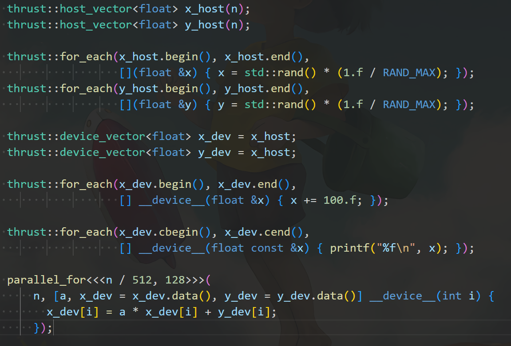

## 第六章：thrust库

### 使用 CUDA 官方提供的 thrust::universal_vector

虽然自己实现 CudaAllocator 很有趣，也帮助我们理解了底层原理。但是既然 CUDA 官方已经提供了 thrust 库，那就用他们的好啦。

```cpp
#include <cuda_runtime.h>
#include <thrust/universal_vector.h>  // trusth库

#include <cstdio>

#include "helper_cuda.h"

template <class Func>
__global__ void parallel_for(int n, Func func) {
  for (int i = blockDim.x * blockIdx.x + threadIdx.x; i < n;
       i += blockDim.x * gridDim.x) {
    func(i);
  }
}

int main() {
  int n = 65536;
  float a = 3.14f;
  thrust::universal_vector<float> x(n);  // 使用 thrust库的 universal_vector
  thrust::universal_vector<float> y(n);

  for (int i = 0; i < n; i++) {
    x[i] = std::rand() * (1.f / RAND_MAX);
    y[i] = std::rand() * (1.f / RAND_MAX);
  }

  parallel_for<<<n / 512, 128>>>(n, [a, x = x.data(), y = y.data()] __device__(
                                        int i) { x[i] = a * x[i] + y[i]; });
  checkCudaErrors(cudaDeviceSynchronize());

  for (int i = 0; i < n; i++) {
    printf("x[%d] = %f\n", i, x[i]);
  }

  return 0;
}
```

`universal_vector` 是基于统一内存分配的，因此无论在 GPU 还是 CPU 上，数据都可以直接访问。

### 使用分离的 device_vector 和 host_vector

`device_vector` 在 GPU 上分配内存，而 `host_vector` 则在 CPU 上分配内存。

可以通过 = 运算符在 device_vector 和 host_vector 之间拷贝数据，他会自动帮你调用 cudaMemcpy，非常智能。

比如这里的 `x_dev = x_host` 会将 `x_host` 中的数据复制到 GPU 上的 `x_dev`。

```cpp
#include <cuda_runtime.h>
#include <thrust/device_vector.h>
#include <thrust/host_vector.h>

#include <cstdio>

#include "helper_cuda.h"

template <class Func>
__global__ void parallel_for(int n, Func func) {
  for (int i = blockDim.x * blockIdx.x + threadIdx.x; i < n;
       i += blockDim.x * gridDim.x) {
    func(i);
  }
}

int main() {
  int n = 65536;
  float a = 3.14f;
  thrust::host_vector<float> x_host(n);
  thrust::host_vector<float> y_host(n);

  for (int i = 0; i < n; i++) {
    x_host[i] = std::rand() * (1.f / RAND_MAX);
    y_host[i] = std::rand() * (1.f / RAND_MAX);
  }

  thrust::device_vector<float> x_dev = x_host;
  thrust::device_vector<float> y_dev = x_host;

  parallel_for<<<n / 512, 128>>>(
      n, [a, x_dev = x_dev.data(), y_dev = y_dev.data()] __device__(int i) {
        x_dev[i] = a * x_dev[i] + y_dev[i];
      });

  x_host = x_dev;

  for (int i = 0; i < n; i++) {
    printf("x[%d] = %f\n", i, x_host[i]);
  }

  return 0;
}
```

### 使用 Thrust 模板函数：thrust::generate

Thrust 提供了与 C++ 标准库类似的模板函数，例如 `thrust::generate(b, e, f)`，它的作用与 `std::generate` 相似，能够批量生成数据并填充到区间 `[b, e)` 中。第三个参数是一个函数，这里我们使用了一个 lambda 表达式。

前两个迭代器参数分别是 `device_vector` 或 `host_vector` 的开始和结束迭代器，可以通过成员函数 `begin()` 和 `end()` 获取。第三个参数可以是任意函数，这里用了 lambda 表达式。

```cpp
#include <cuda_runtime.h>
#include <thrust/device_vector.h>
#include <thrust/generate.h>
#include <thrust/host_vector.h>

#include <cstdio>

#include "helper_cuda.h"

template <class Func>
__global__ void parallel_for(int n, Func func) {
  for (int i = blockDim.x * blockIdx.x + threadIdx.x; i < n;
       i += blockDim.x * gridDim.x) {
    func(i);
  }
}

int main() {
  int n = 65536;
  float a = 3.14f;
  thrust::host_vector<float> x_host(n);
  thrust::host_vector<float> y_host(n);

  auto float_rand = [] { return std::rand() * (1.f / RAND_MAX); };
  thrust::generate(x_host.begin(), x_host.end(), float_rand);
  thrust::generate(y_host.begin(), y_host.end(), float_rand);

  thrust::device_vector<float> x_dev = x_host;
  thrust::device_vector<float> y_dev = x_host;

  parallel_for<<<n / 512, 128>>>(
      n, [a, x_dev = x_dev.data(), y_dev = y_dev.data()] __device__(int i) {
        x_dev[i] = a * x_dev[i] + y_dev[i];
      });

  x_host = x_dev;

  for (int i = 0; i < n; i++) {
    printf("x[%d] = %f\n", i, x_host[i]);
  }

  return 0;
}
```

### 使用 Thrust 模板函数：thrust::for_each

同理，`thrust::for_each(b, e, f)` 对标 C++ 的 `std::for_each`，用于对区间 `[b, e)` 中的每个元素 `x` 调用函数 `f(x)`。其中，`x` 实际上是一个引用。如果使用常量迭代器，则是常引用，可以通过 `cbegin()` 和 `cend()` 获取常值迭代器。

```cpp
#include <cuda_runtime.h>
#include <thrust/device_vector.h>
#include <thrust/for_each.h>
#include <thrust/generate.h>
#include <thrust/host_vector.h>

#include <cstdio>

#include "helper_cuda.h"

template <class Func>
__global__ void parallel_for(int n, Func func) {
  for (int i = blockDim.x * blockIdx.x + threadIdx.x; i < n;
       i += blockDim.x * gridDim.x) {
    func(i);
  }
}

int main() {
  int n = 65536;
  float a = 3.14f;
  thrust::host_vector<float> x_host(n);
  thrust::host_vector<float> y_host(n);

  thrust::for_each(x_host.begin(), x_host.end(),
                   [](float &x) { x = std::rand() * (1.f / RAND_MAX); });
  thrust::for_each(y_host.begin(), y_host.end(),
                   [](float &y) { y = std::rand() * (1.f / RAND_MAX); });

  thrust::device_vector<float> x_dev = x_host;
  thrust::device_vector<float> y_dev = x_host;

  thrust::for_each(x_dev.begin(), x_dev.end(),
                   [] __device__(float &x) { x += 100.f; });

  thrust::for_each(x_dev.cbegin(), x_dev.cend(),
                   [] __device__(float const &x) { printf("%f\n", x); });

  parallel_for<<<n / 512, 128>>>(
      n, [a, x_dev = x_dev.data(), y_dev = y_dev.data()] __device__(int i) {
        x_dev[i] = a * x_dev[i] + y_dev[i];
      });

  x_host = x_dev;

  for (int i = 0; i < n; i++) {
    printf("x[%d] = %f\n", i, x_host[i]);
  }

  return 0;
}
```

- 当然还有 thrust::reduce，thrust::sort，thrust::find_if，thrust::count_if，thrust::reverse，thrust::inclusive_scan 等。

### Thrust 模板函数的特点：自动决定 CPU 或 GPU 执行

Thrust 的 `for_each` 可以作用于 `device_vector` 也可以作用于 `host_vector`。当作用于 `host_vector` 时，函数会在 CPU 上执行，而作用于 `device_vector` 时，则会在 GPU 上执行。



例如，针对 `x_host` 使用 `for_each` 时，lambda 表达式不需要修饰，而针对 `x_dev` 使用时，lambda 表达式需要加上 `__device__` 修饰符。

### 使用 counting_iterator 实现整数区间循环

Thrust 中的迭代器区间操作（如 `thrust::for_each`、`thrust::transform`、`thrust::reduce` 等）通常基于迭代器区间。`counting_iterator` 是一种特殊的迭代器，能够生成递增的整数序列，适合用于这种情况。

这是 Thrust 提供的一种特殊的迭代器，当需要在 Thrust 算法中使用一个递增整数序列时，`counting_iterator` 就可以作为迭代器传递

- `counting_iterator` 实际上是一个生成器，它的作用是 **生成一个递增的数值序列**

用 `thrust::make_counting_iterator(num)` 构建一个计数迭代器，他作为区间表示的就是整数的区间。

```cpp
#include <cuda_runtime.h>
#include <thrust/device_vector.h>
#include <thrust/for_each.h>
#include <thrust/generate.h>
#include <thrust/host_vector.h>

#include <cstdio>

int main() {
  thrust::for_each(thrust::make_counting_iterator(0),
                   thrust::make_counting_iterator(10),
                   [] __device__(int i) { printf("%d\n", i); });

  return 0;
}
//  0
//  1
//  2
//  3
//  4
//  5
//  6
//  7
//  8
//  9
```

### 使用 zip_iterator 合并多个迭代器

`zip_iterator` 可以看作是一个复合迭代器，它将多个容器（或迭代器）作为输入，生成一个新的迭代器，这个新的迭代器能够同时访问所有输入容器中对应位置的元素。在每次迭代时，`zip_iterator` 会返回多个容器中相应位置的元素。

可以通过 `thrust::make_zip_iterator(a, b)` 将多个迭代器合并，就像 Python 中的 `zip` 函数一样。

在使用时，可以通过 `auto const &tup` 来捕获每次迭代返回的元组，并使用 `thrust::get<index>(tup)` 获取其中第 `index` 个元素。之所以这么处理，是因为 Thrust 需要兼容一些使用较老标准（如 C++03）的程序，尽管现在可以更简洁地使用 C++11 的 `std::tuple` 和 C++17 的结构绑定语法。

```cpp
#include <cuda_runtime.h>
#include <thrust/device_vector.h>
#include <thrust/for_each.h>
#include <thrust/generate.h>
#include <thrust/host_vector.h>

#include <cstdio>

#include "helper_cuda.h"

template <class Func>
__global__ void parallel_for(int n, Func func) {
  for (int i = blockDim.x * blockIdx.x + threadIdx.x; i < n;
       i += blockDim.x * gridDim.x) {
    func(i);
  }
}

int main() {
  int n = 65536;
  float a = 3.14f;
  thrust::host_vector<float> x_host(n);
  thrust::host_vector<float> y_host(n);

  auto float_rand = [] { return std::rand() * (1.f / RAND_MAX); };
  thrust::generate(x_host.begin(), x_host.end(), float_rand);
  thrust::generate(y_host.begin(), y_host.end(), float_rand);

  thrust::device_vector<float> x_dev = x_host;
  thrust::device_vector<float> y_dev = x_host;

  thrust::for_each(thrust::make_zip_iterator(x_dev.begin(), y_dev.cbegin()),
                   thrust::make_zip_iterator(x_dev.end(), y_dev.cend()),
                   [a] __device__(auto const &tup) {
                     auto &x = thrust::get<0>(tup);
                     auto const &y = thrust::get<1>(tup);
                     x = a * x + y;
                   });

  x_host = x_dev;

  for (int i = 0; i < n; i++) {
    printf("x[%d] = %f\n", i, x_host[i]);
  }

  return 0;
}
```

这样，我们能够通过 `zip_iterator` 同时操作多个容器。
