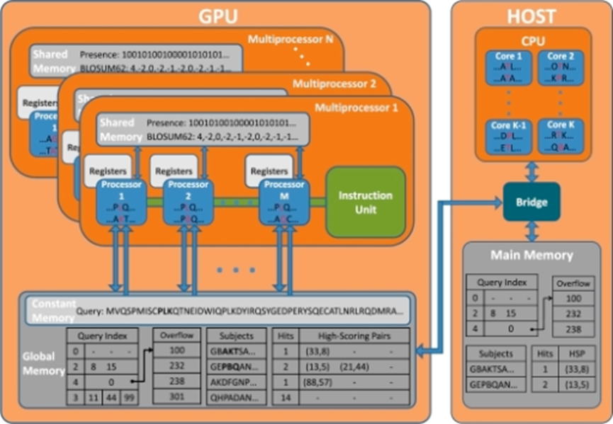

## 第8章：板块与共享内存

### 为什么需要区分出板块的概念？

之前说到实际的线程数量就是板块数量(gridDim)乘以每板块线程数量(blockDim)。

那么为什么中间要插一个板块呢？感觉很不直观，不如直接说线程数量不就好了？

这还得从 GPU 的硬件架构说起。

### SM（Streaming Multiprocessors）与板块（block）

GPU 是由多个流式多处理器（SM）组成的。每个 SM 可以处理一个或多个板块。

SM 又由多个流式单处理器（SP）组成。每个 SP 可以处理一个或多个线程。

每个 SM 都有自己的一块共享内存（shared memory），他的性质类似于 CPU 中的缓存——和主存相比很小，但是很快，用于缓冲临时数据。还有点特殊的性质，我们稍后会讲。

通常板块数量总是大于 SM 的数量，这时英伟达驱动就会在多个 SM 之间调度你提交的各个板块。正如操作系统在多个 CPU 核心之间调度线程那样……

不过有一点不同，GPU 不会像 CPU 那样做时间片轮换——板块一旦被调度到了一个 SM 上，就会一直执行，直到他执行完退出，这样的好处是不存在保存和切换上下文（寄存器，共享内存等）的开销，毕竟 GPU 的数据量比较大，禁不起这样切换来切换去……

一个 SM 可同时运行多个板块，这时多个板块共用同一块共享内存（每块分到的就少了）。

而板块内部的每个线程，则是被进一步调度到 SM 上的每个 SP。