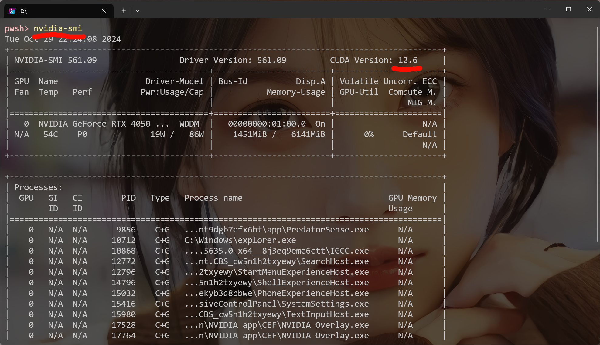
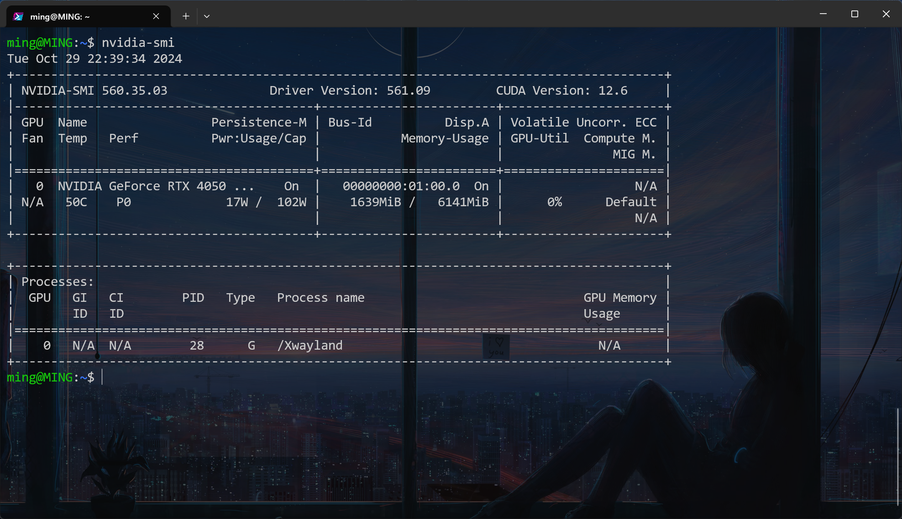
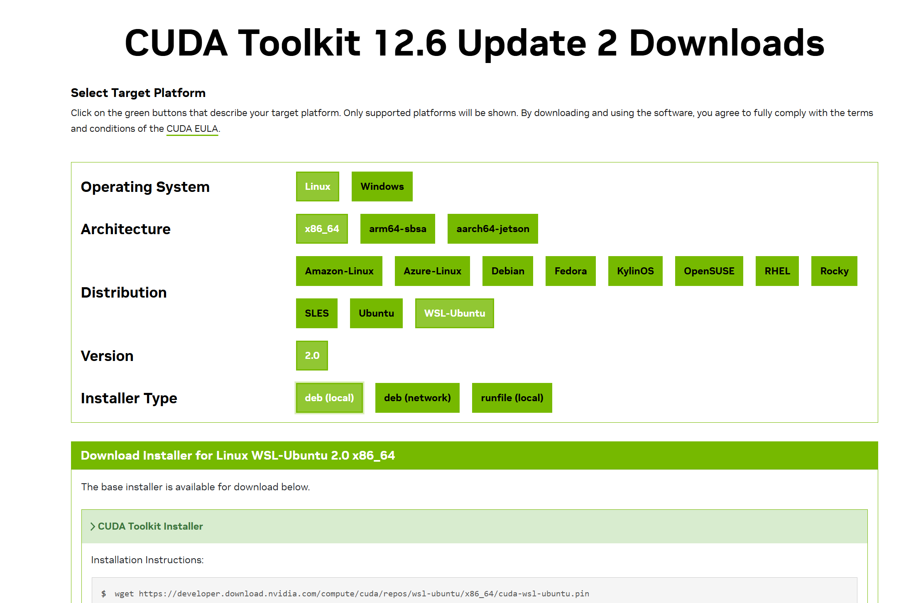
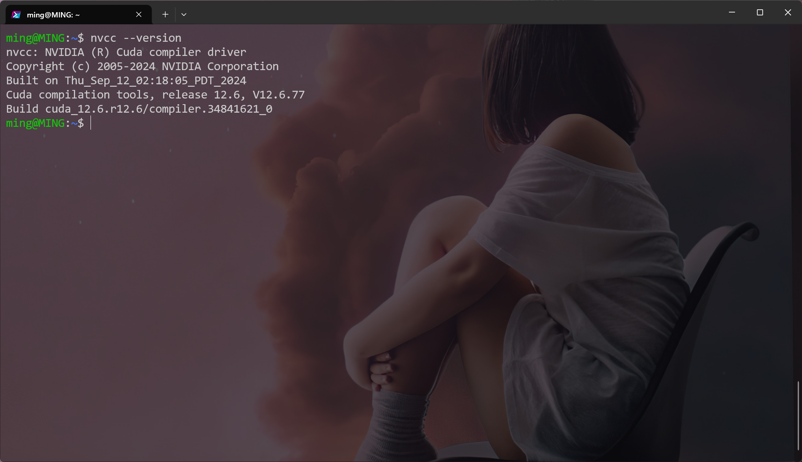
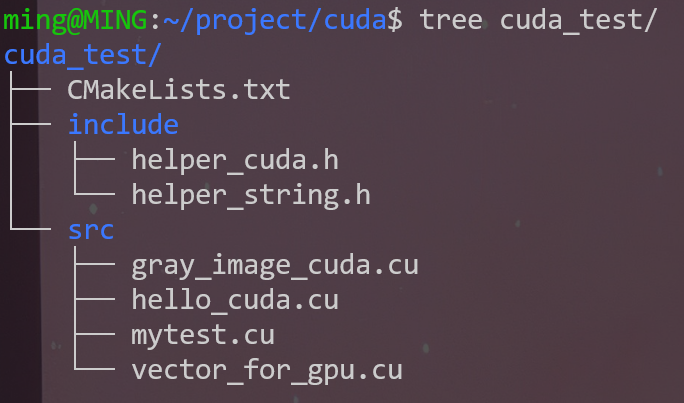
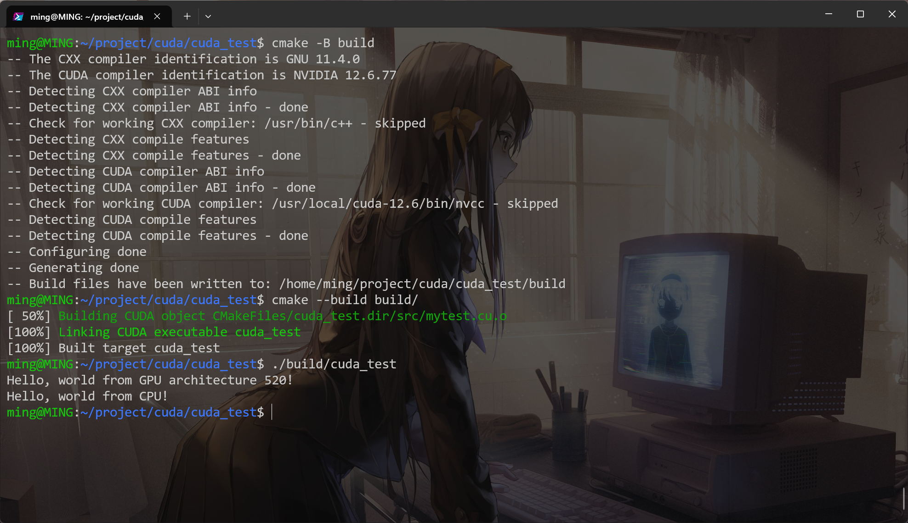

## 前言

- Windows11或Windows 10 21H2版本以上操作系统，具有 Nvidia 的 GPU，且已安装显卡驱动
- 安装了WSL2，且准备好了Ubuntu或其他Linux操作系统

之后的操作都将基于WSL2中的Ubuntu环境。

## 环境验证

打开Windows的Powershell，输入`nvidia-smi`检查自己的显卡驱动、CUDA支持。



注意左上角的 **CUDA version 12.6** 指的是当前环境所支持的CUDA的最高版本。如图，我当前的环境最高支持到12.6

- 目前我只用这个环境学习、测试CUDA编程，因此可以直接选择CUDA最新版本12.6
- 如果还需要使用Pytorch、TensorRT等深度学习相关内容，请先确认这些环境的需求。
- 原因是，CUDA一般更新后，Pytorch、TensorRT过一段时间才会跟进更新。防止出现装好CUDA后，发现Pytorch没有对应版本的尴尬。

之后进入WSL2的Linux环境，再次输入`nvidia-smi`验证WSL2能否正常连接 GPU

- Windows 11 和 Windows 10 版本 21H2 已经支持在 WSL2 实例内直通 NVIDIA CUDA 
- 为减少麻烦，就不再照顾使用旧系统版本的同学



## 安装CUDA

- [CUDA Toolkit最新版本链接](https://developer.nvidia.com/cuda-downloads)
- [CUDA Toolkit历史版本链接](https://developer.nvidia.com/cuda-toolkit-archive)

确定好需要的版本，打开上面的链接，进入相应的下载页面



- 在WSL2环境中安装的应该是Linux版本
- 选择自己的处理器架构，在Windows终端输出**`systeminfo`**可以很快查看。
- 之后选择自己的操作系统发布版本，注意！！！WSL中的Ubuntu是特殊发布WSL-Ubuntu
- 最后的 Installer Type，local会将安装包下载到本地再执行安装；network命令稍简单但容易收到网络影响；runfile应该是一个执行脚本，直接自动化全部过程（我没有尝试过）。
- 建议使用local版本，受网络状况影响小，甚至可以在宿主机Windows端下载好文件拷贝到虚拟机中安装

下面是 CUDA 12.6 local版本安装命令：

```shell
wget https://developer.download.nvidia.com/compute/cuda/repos/wsl-ubuntu/x86_64/cuda-wsl-ubuntu.pin
sudo mv cuda-wsl-ubuntu.pin /etc/apt/preferences.d/cuda-repository-pin-600
wget https://developer.download.nvidia.com/compute/cuda/12.6.2/local_installers/cuda-repo-wsl-ubuntu-12-6-local_12.6.2-1_amd64.deb
sudo dpkg -i cuda-repo-wsl-ubuntu-12-6-local_12.6.2-1_amd64.deb
sudo cp /var/cuda-repo-wsl-ubuntu-12-6-local/cuda-*-keyring.gpg /usr/share/keyrings/
sudo apt-get update
sudo apt-get -y install cuda-toolkit-12-6
```

请依次执行

## 验证安装

成功执行上面的命令后，在虚拟机终端运行`nvcc --version`验证是否安装成功



如果显示找不到nvcc命令，则可能是环境变量没有正确设置，在当前用户的`.bashrc`文件添加以下内容：

```shell
export PATH=/usr/local/cuda-12.6/bin:$PATH
export LD_LIBRARY_PATH=/usr/local/cuda-12.6/lib64:$LD_LIBRARY_PATH
```

- 注意路径需要切换成你安装的版本

- nvcc 其实就是CUDA程序的编译器哦

## Hello world from GPU！

接下来我们就可以开始体验 CUDA 程序了！

一个简单的程序，我们直接使用CMake构建项目。（不会真有人CUDA程序用nvcc命令行编译吧。。）

文件结构如下：



- 你只需要关注CMakeLists.txt文件和src文件夹
- include文件夹下是我们以后可能遇到的，这里你暂时不需要
- src文件夹下就是我们的CUDA源码文件，以.cu结尾，这里你只需要创建mytext.cu文件就可以

```cmake
# 这是CMakeLists.txt文件内容，关于现代CMake可以查看我的另一篇文章
cmake_minimum_required(VERSION 3.22)

# 指定CUDA标准版本
set(CMAKE_CUDA_STANDARD 17)
# 设置为发布模式
set(CMAKE_BUILD_TYPE Release)

project(cuda_test LANGUAGES CXX CUDA)

# 添加src目录下源文件
file(GLOB_RECURSE SOURCES "src/*.cu")

# 添加可执行文件
add_executable(cuda_test ${SOURCES})
```

```cpp
// 这是mytest.cu文件的内容
#include <cstdio>
#include <cuda_runtime.h>

__host__ __device__ void say_hello()
{
#ifdef __CUDA_ARCH__
    printf("Hello, world from GPU architecture %d!\n", __CUDA_ARCH__);
#else
    printf("Hello, world from CPU!\n");
#endif
}

__global__ void kernel()
{
    say_hello();
}

int main()
{
    kernel<<<1, 1>>>();
    cudaDeviceSynchronize();
    say_hello();
    return 0;
}
```

接下来使用CMake构建并编译，关于现代CMake的内容可以阅读我的另一篇博客：[现代CMake高级内容](https://blog.csdn.net/lurenze/article/details/143109755)

```shell
# 进入项目根目录
cd 你的目录/cuda_test
# CMake构建工程
cmake -B build
# 编译可执行程序
cmake --build build/
# 执行编译出的程序
./build/cuda_test
```

程序执行结果：



其中 `Hello, world from GPU architecture 520!`正是来自GPU的消息！

- 这里的520可不是在爱你昂，这是CUDA程序的版本标识
- 想要了解更多，参考我的博客：[GPU编程专栏](https://blog.csdn.net/lurenze/category_12818209.html)

