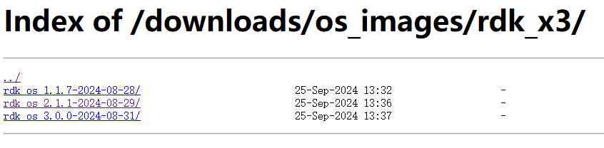
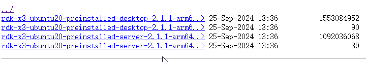
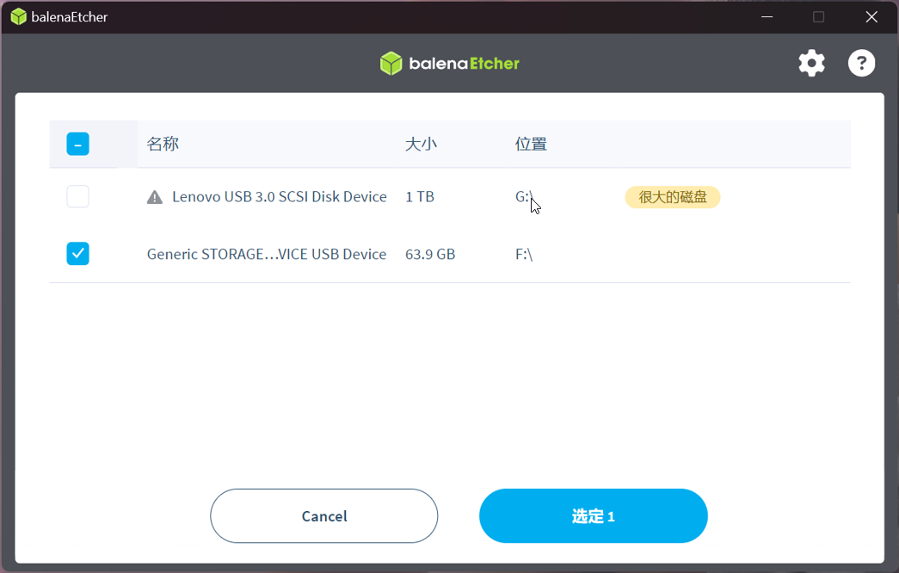
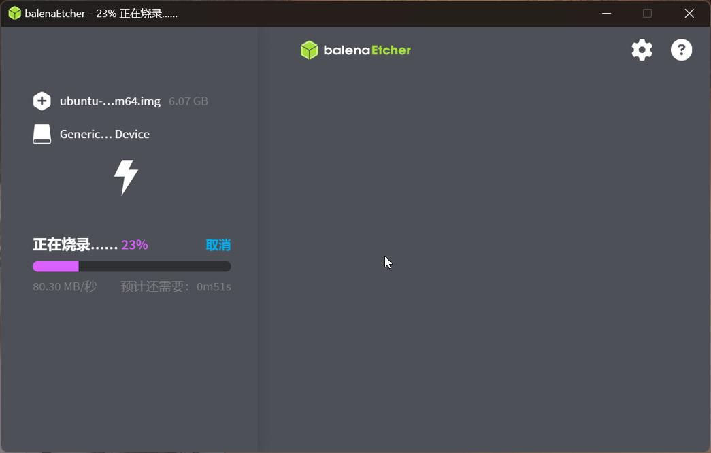

### 准备工作

硬件：RDK X3开发板、SD卡

软件：操作系统镜像、balenaEtcher烧录软件

本章相关链接：

* [balenaEtcher软件下载](https://github.com/balena-io/etcher/releases)
* [rdk_x3操作系统镜像](https://archive.d-robotics.cc/downloads/os_images/rdk_x3/)
* [地瓜开发者社区](https://developer.d-robotics.cc/)
* [比赛时官方提供的资料及基础镜像网盘链接](https://pan.baidu.com/s/1FH9txTJil7aMCIUOzhkVcg?pwd=gyh1#list/path=%2F)

### 操作系统镜像下载

官方封装了一些操作系统镜像，内置了许多工具和环境，目前共有三个大版本，1.0已经不推荐使用了，2.0基于Ubuntu-20.04，3.0基于Ubuntu-22.04。

我们这里使用的是上面的2.1.1版本。比赛时主办方在百度网盘提供了一个镜像，但是这个镜像在当时备赛过程中已经发现存在一些问题，主要是TogetherROS已经与GitHub文档无法对应，以及一些小的BUG，目前最新的镜像不存在这些问题。

(区域赛前一周意识到了上面的问题，由于只有一人开发，担心进度问题，就继续使用百度网盘中的镜像，所以如果想直接用我的源码，就得使用存在问题的镜像，已经提供在了开头的链接中)

镜像分为desktop和server两个版本，开发板性能有限，我们使用sever版本。

### 烧录系统

个人推荐使用balenaEtcher，UI更加现代化，还能提醒大容量设备，防止破坏其他硬盘（曾深受其害），类似的软件还有win32 disk imager，这里并没有强制要求。注意这类软件一般都需要以管理员身份运行，否则无法烧录。

打开软件，选择从文件烧录，选定下载好的img镜像文件

点击选择目标磁盘，选定要烧录的sd卡，注意要选择单独的磁盘设备，不是分区，一旦开始烧录会格式化选定的整个磁盘设备。

确定好之后开始烧录，烧录速度取决SD卡性能。

镜像烧录完成就可以插入开发板卡槽，上电等待，如果绿灯闪烁说明系统已经成功启动。

如果出现烧录失败，例如报错镜像可能被更改之类，需要以管理员身份运行烧录软件。