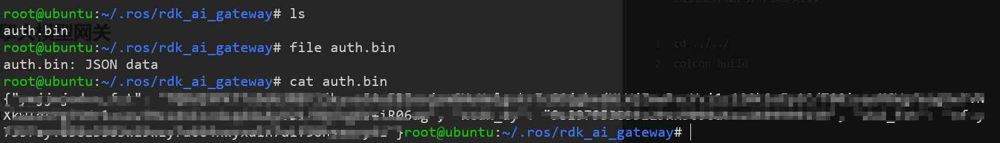
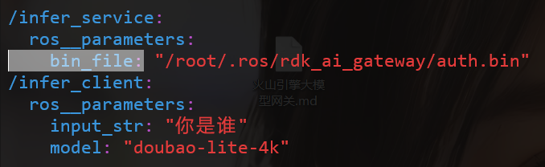
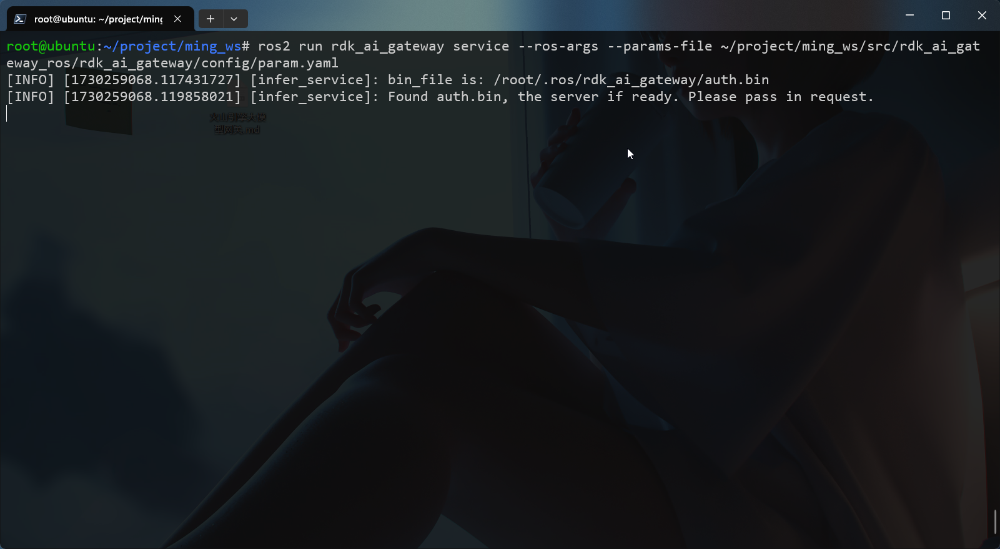
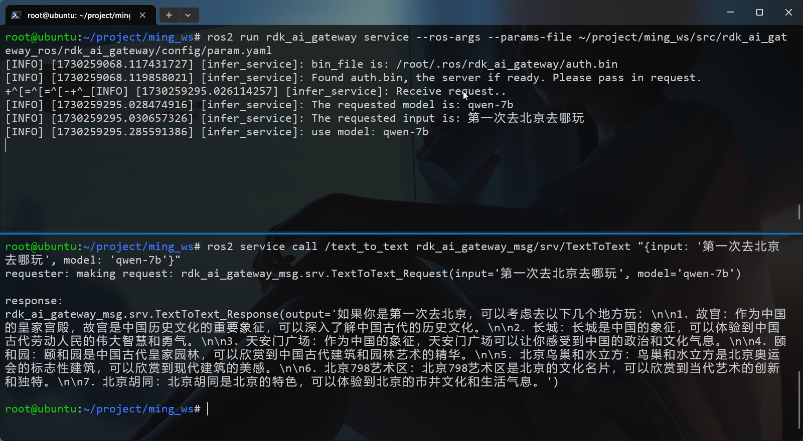

### 前言

了解到明年的智能车比赛可能会使用到大模型相关内容，因此打算尽快熟悉NodeHub中火山大模型网关项目 


准备：

- 地瓜机器人社区的账号和密码
- RDK系列开发板，且已联网

### 什么是大模型网关

来自火山引擎官网解释：大模型网关（AI Gateway）服务允许您通过一个 API 接口访问多家大模型提供商的模型。利用边缘云基础架构的优势，本平台显著提高模型访问速度，为终端用户提供更快速、更可靠的 AI 服务体验。

- 大模型网关目前处于免费测试阶段，面向所有用户开放。

### NodeHub节点使用

这个项目主要由两部分组成，申请节点和使用节点。

- 申请节点是因为这个项目是调用火山引擎的接口使用大模型，需要得到访问密钥
- 使用节点就是启动了一个ROS服务，之后其他节点只需要向服务发送请求，就会返回大模型输出的结果

#### 环境准备

默认已经安装并配置好了ROS2环境

创建工作空间：

```shell
mkdir -p my_ws/src
cd my_ws/src
```

克隆项目到src目录：

```shell
git clone https://github.com/D-Robotics/rdk_ai_gateway_ros.git
```

进入项目目录，安装依赖：

```shell
cd rdk_ai_gateway_ros
pip3 install -r requirements.txt
cd ..
```

回到工作空间，构建项目：

```shell
cd ../../
colcon build
```

激活环境：

```shell
source ./install/setup.bash
```

#### 申请节点

这一步的作用就是申请密钥，并保存下来。

在终端执行：

```shell
ros2 run rdk_gateway apply
```

输入Y，回车，同意许可协议。 输入地瓜社区的用户名、密码。

如社区用户名、密码正确，则会在`/root/.ros/rdk_ai_gateway`目录下生成`auth.bin`文件。

- 这个`auth.bin`其实就是密钥文件，以json格式保存，可以使用文件命令查看



#### 开始使用

##### 配置文件

获取到auth.bin密钥文件后，进入`my_ws/src/rdk_ai_gateway_ros/rdk_ai_gateway/config/param.yaml`中配置密钥文件的路径

```shell
vim my_ws/src/rdk_ai_gateway_ros/rdk_ai_gateway/config
```



- 修改`bin_file`参数即可

##### 启动服务

启动 ROS server节点，终端传入参数为刚才的配置文件路径：

```shell
ros2 run rdk_ai_gateway service --ros-args --params-file ~/my_ws/src/rdk_ai_gateway_ros/rdk_ai_gateway/config/param.yaml	# 注意修改为自己的路径
```

服务已经启动，保留这个终端



##### 调用服务

开启一个新的终端，记得激活刚才的ROS环境

```shell
source ./install/setup.sh
```

这个项目已经实现了两种client方式，我们先来体验一下：

1. 命令行调用：

```shell
ros2 service call /text_to_text rdk_ai_gateway_msg/srv/TextToText "{input: '第一次去北京去哪玩', model: 'qwen-7b'}"
```



可以看到成功收到回复的消息！