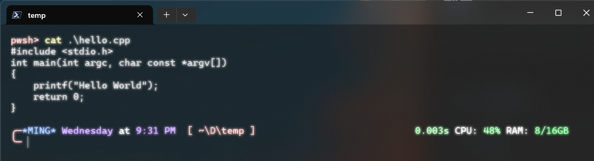
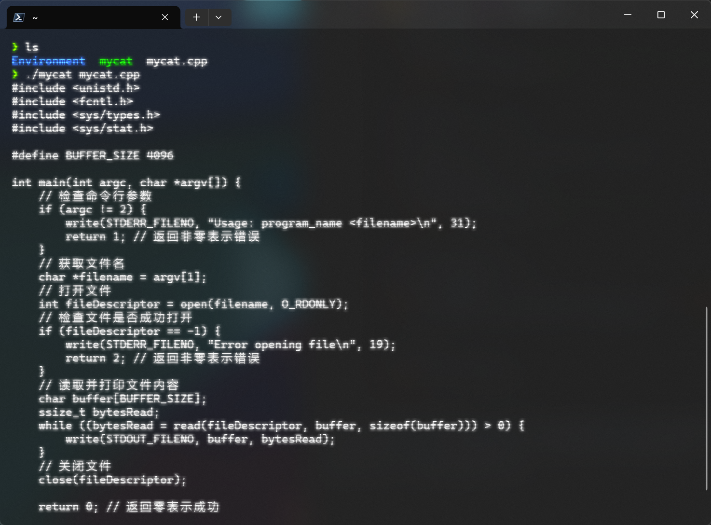
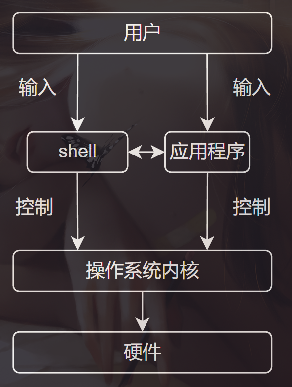
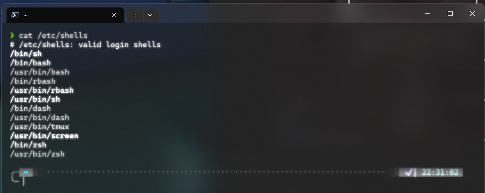
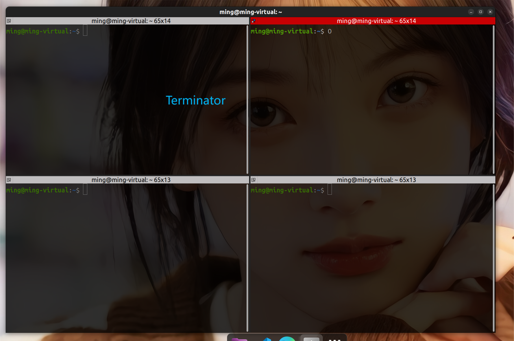
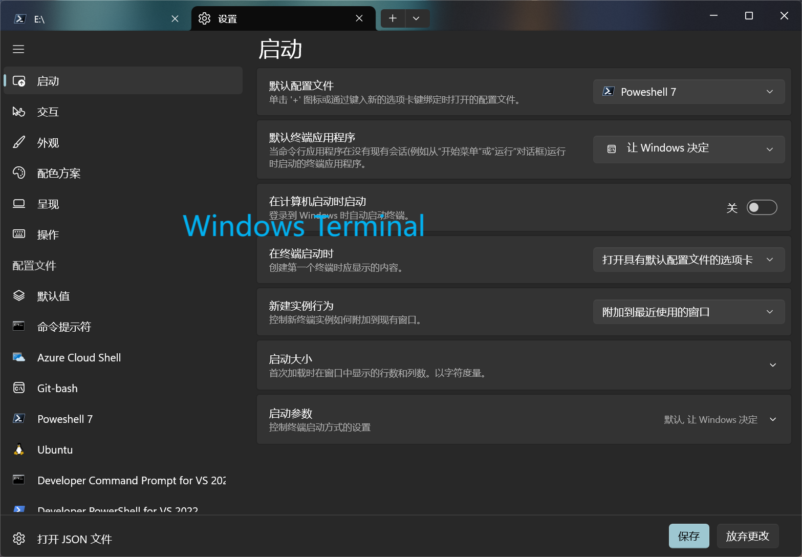

## 前言

shell（壳）、Terminal（终端），许多刚开始接触计算机的朋友可能跟以前的我一样并不清楚这两个概念，因为它们总是同时出现。配置开发环境或者学习Linux的过程中我们难免接触，所以我觉得有必要跟大家讨论一下它们的关系。

## shell是什么

shell翻译过来是“壳”，十分形象，shell就是包裹在操作系统内核上的一层外壳。shell接收用户输入的命令，并将其转换为操作系统可以理解的指令，然后执行这些指令。这里我们借助shell提供的cat指令来理解一下shell的作用。

熟悉Linux的朋友会知道，cat命令可以输出一个文件的内容到终端。这里我提前准备了一个hello.cpp文件，打开一个终端，执行下面的命令：

```shell
cat hello.cpp
```



shell会解析我们命令行里的内容并执行，可以看到，文件里的内容成功输出到了我们的终端里。接下来我们思考一下，假如没有这个命令，我们想要达到同样的目的需要怎样的步骤，由于本人对windows内核并不熟悉，这里我会在Linux环境下进行演示，原理是相通的，不会影响我们理解。

``` c++
#include <unistd.h>
#include <fcntl.h>
#include <sys/types.h>
#include <sys/stat.h>
#define BUFFER_SIZE 4096

int main(int argc, char *argv[]) {
    // 检查命令行参数
    if (argc != 2) {
        write(STDERR_FILENO, "Usage: program_name <filename>\n", 31);
        return 1; // 返回非零表示错误
    }
    // 获取文件名
    char *filename = argv[1];
    // 打开文件
    int fileDescriptor = open(filename, O_RDONLY);
    // 检查文件是否成功打开
    if (fileDescriptor == -1) {
        write(STDERR_FILENO, "Error opening file\n", 19);
        return 2; // 返回非零表示错误
    }
    // 读取并打印文件内容
    char buffer[BUFFER_SIZE];
    ssize_t bytesRead;
    while ((bytesRead = read(fileDescriptor, buffer, sizeof(buffer))) > 0) {
        write(STDOUT_FILENO, buffer, bytesRead);
    }
    // 关闭文件
    close(fileDescriptor);
    return 0; // 返回零表示成功
}
```

这是一个my_cat程序，程序使用 `open` 打开文件，然后使用 `read` 从文件中读取内容，并使用 `write` 将内容写入标准输出。最后，使用 `close` 关闭文件描述符。这几个函数就是linux内核提供的接口。

编译并运行程序，可以看到成功输出文件内容

到这你是否对这层“壳”有了一点点感觉，再借助下面这张图，估计就能理解shell扮演的角色。



用户可以通过shell和各种程序操作系统内核，shell和程序之间也可以相互操作，通过这种架构我们可以十分灵活的完成对计算机的控制

## shell命令解释器

上面提到的shell是概念级的东西，在它之下有各种解释器的实现，例如Linux中常用的bash、zsh，windows的cmd、powershell，甚至一些软件例如Git、VistualStudio都会提供一些shell工具。

在linux中我们可以查看当前系统中都有那些shell解释器：

``` shell
cat /etc/shells
```



可以看到我的ubuntu系统中有这些解释器，正在使用的是zsh，我的终端就是使用的oh-my-zsh进行的美化。

在windows环境，以前我们使用的是cmd（命令提示符），它只在windows下使用，并且很多命令都是微软自己的规范，有一定的学习成本。后来win10以后，powershell越来越完善，我们也强推使用这个。powershell是可以跨平台的。

## Terminal（终端）是什么

现在的终端和计算机刚发展时的终端概念发生了一些变化，现在我们看到的各种终端软件其实应该叫模拟终端，关于这个概念有兴趣的朋友可以查阅相关资料。

用我自己的理解来说，终端就是可以输入命令并显示程序运行信息的窗口软件。终端本身不会解释命令，它会把用户输入的命令交给shell解释器执行。由于这两者总是同时出现，所以才让我们容易混淆。

这些终端软件又会提供一些额外的功能，例如Terminator好用的拆分窗口、Windows Terminal提供的统一管理、美化等功能。





## 总结

综上：

- shell是操作系统内核的外层封装，方便用户对系统进行操作。
- Terminal是提供窗口界面，将用户的命令交给shell解释器执行

另外，shell本身还是一种脚本语言，我们可以直接将命令在命令行执行，也可以按照shell语法将这些命令写入文件中，shell解释器可以读取这个文件并执行。本人并不擅长shell编程，就不在这里献丑，有兴趣的朋友可以查看相关资料学习。