### 前言

​	我们在配置各种开发环境的时候，常常会包含一个步骤：配置环境变量。

​	那么什么是环境变量，这个步骤是为了做什么，接下来我会抛掉官方解释，逐步带大家测试。（windows环境下）

## 终端中执行的命令是什么

​	我们经常会在电脑终端(cmd或者powershell)中输入==ipconfig==命令来查看电脑的网络配置，如图：

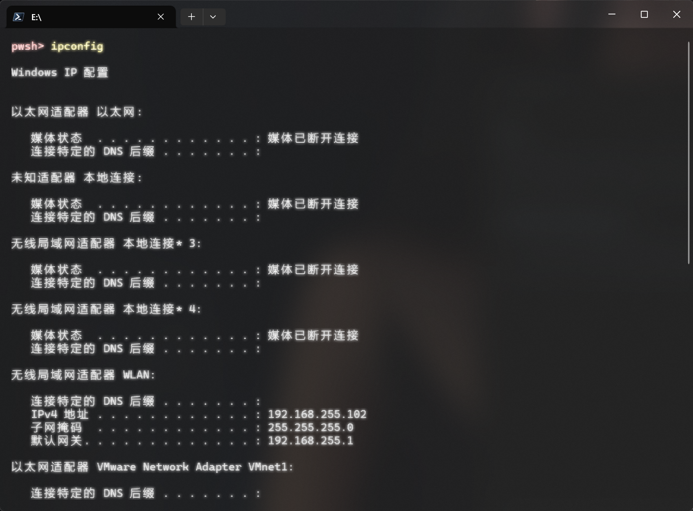

​	为什么输入ipconfig命令就会输出这些信息，这里先跟大家介绍一个新命令==get-Command==，这个命令的作用是获取其他命令的信息，这里我们目的是为了获取它的路径。（熟悉linux的朋友会不会想到where、which命令）

我们在终端输入：

```shell
get-Command ipconfig
```

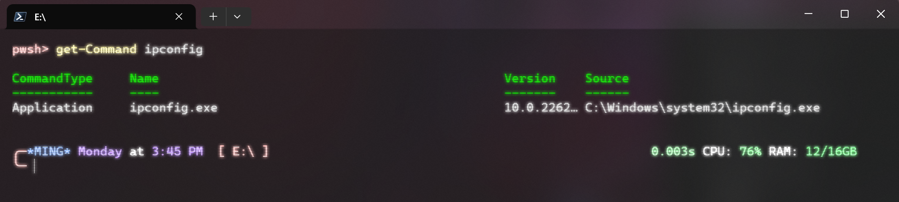

​	哦豁，看见Source条目没，首先它就是一个exe可执行程序！！其实想来也是，大一的计算机概论课就告诉我们计算机上执行的就是一堆二进制文件。

​	有兴趣的朋友可以进到这个目录双击执行下这个文件，运气好就能看到输出信息。（但是八成会一闪而过，需要修改终端的终止行为才能卡住看到信息）

## 自己的程序怎样在终端里运行

​	既然知道了Terminal里的各种命令本质就是一些二进制文件，那么我们学了c语言，成天到晚printf，我们编写的程序是不是也能这样运行呢？当然可以，程序都是人写的，微软程序员宁有种乎？！（bushi）

​	这里先准备了一个简单程序，功能就是打印"current directory"这句话。

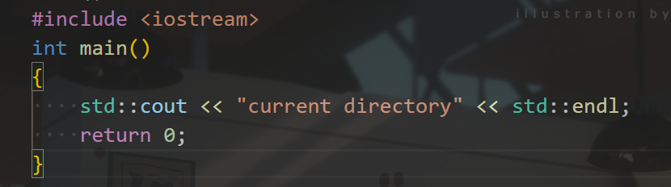

​		接下来我们进入文件所在目录，右键选择在终端中打开，就会弹出右边的窗口（你的可能和我不一样，powershell美化教程后续会出）

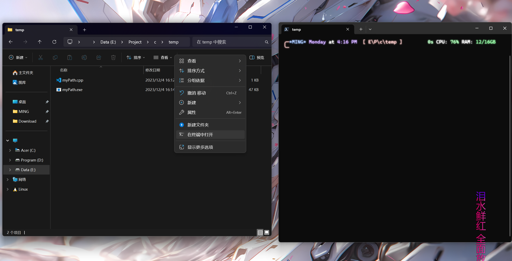

​	接下来在终端输入：

```shell
myPath
```

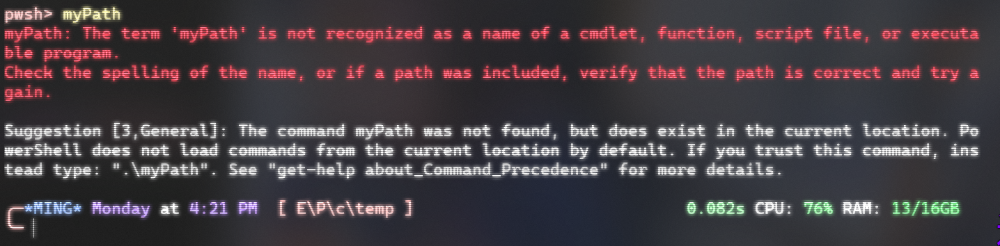

​	哦豁，翻车了这下。。但是根据提示，我们再输入

```shell
.\myPath.exe
或者
.\myPath
```

​	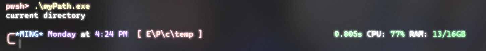

​	这下ok了，所以我们的程序在终端也是可以执行的。

###### 补充：

​	为什么我们的程序必须加上 .\ 才可以运行呢，而且注意观察刚才的报错，Suggestion中提到了它在当前目录下检测到了这个程序，说明系统其实找到了这个文件，但是为什么不直接执行。

​	这个问题有人回答是一种安全设计，防止恶意程序执行、防止环境变量与当前目录中的同名程序冲突等。本人没有继续深究，有兴趣的朋友可以继续探索。综上，这里的 .\ 就是指定了运行当前目录的程序

## 环境变量的作用

​	刚才我们想要执行程序，必须进入到程序所在的目录，或者完整指定程序的路径：

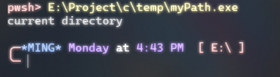

​	为什么系统中的命令，比如==ipconfig==不管我们在哪都可以执行呢？这就是环境变量的作用。

按照下图的步骤打开环境变量编辑器，

​	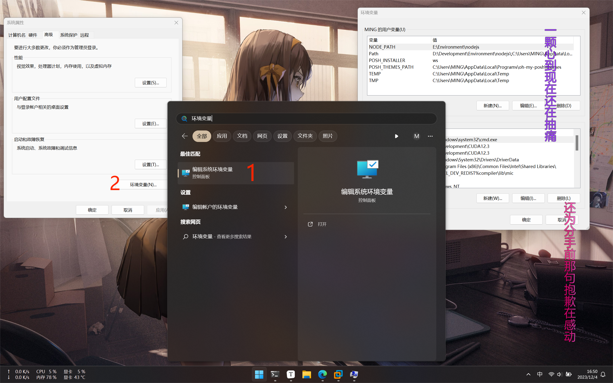

​	观察新弹出的窗口，会有一个系统环境变量和一个用户变量（以你的用户名命名），这两个窗口都包含一个Path的条目，双击可以打开：

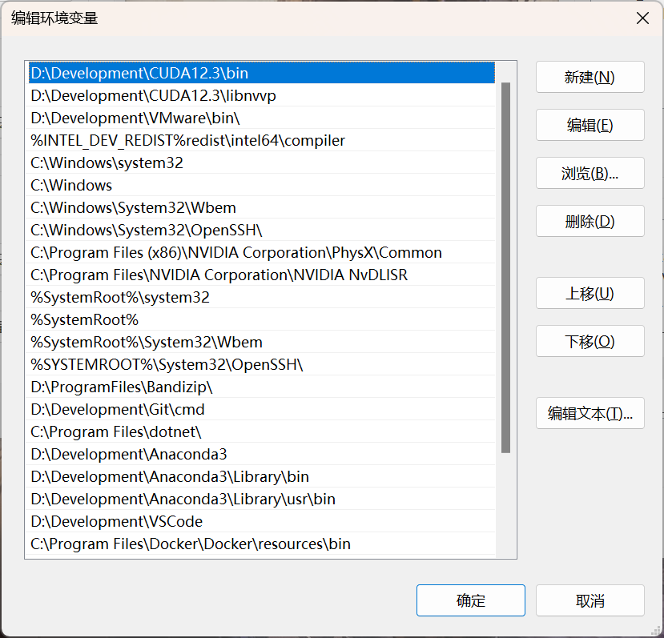

​	这里存的就是一堆路径，如果你还记得的话，==C:\Windows\system32==路径里就存着我们的==ipconfig==命令。

​	到这就可以告诉大家了，当我们在终端输入一个命令时，系统就会在这一堆路径里去查找，找到了就执行，没有就报错。

​	我们把刚才的程序所在路径添加到下边，再在终端执行（注意一定要先保存环境变量编辑，再新打开一个终端）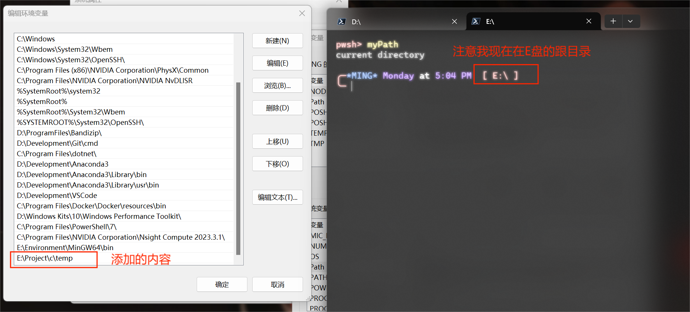

成功执行！说明系统正确查找到了我的程序。

## 系统变量与用户变量

​	但是还有一个问题，为什么还分系统变量和用户变量呢，他们有什么区别？

​	windows系统与Linux一样，都支持多用户操作（虽然我们大部分朋友都是单用户使用），比如办公室的公用电脑，为了防止开发环境冲突，或者有些程序我们并不想让其他用户使用，我们就可以只配置当前用户的环境变量。在这种要求下，我们很快也能想到，他们两个就是查找顺序的区别，并且肯定是先系统变量，再用户变量。

​	我重新生成了两个myPath程序，分别放在用户变量和系统变量中，各自输出：”SystemPath“和”UserPath“

​	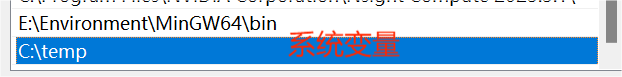

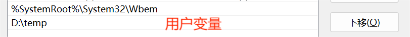

此时再执行命令，发现输出的是"systemPath"，系统环境变量的程序

接下来删掉系统变量的条目，再开新终端执行，发现输出的是"userPath"，用户变量的程序

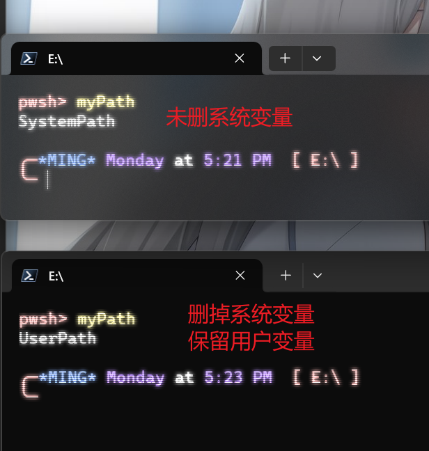

## 总结

所以，现在就可以回答之前搭建开发环境的问题，环境变量的作用就是让系统可以找到你需要的那些工具，比如Python、MinGW、JDK、conda等等。我们可以打开这些工具的bin目录，里边肯定会有一堆可执行程序，所谓的配置开发环境就是让这些工具正常使用。

### 补充

​	1.系统不会递归的查找目录的子文件夹，不然直接放个C、D、E盘三个根目录，直接把电脑翻干净了hhh

​	2.系统查找的流程是从上到下执行，只要找到程序就停止查询，配置环境有时候就会在这栽跟头

​	3.窗口中除了Path项目，其他的条目就像是在给文件夹起别名，比如我们会找到TEMP这个变量，它的值就是"C:Users\你的用户名\AppData\Local\Temp"。起完别名我们可以直接在Path中用==%别名%==来使用


最后，由于本人还在学习，能力有限，文中如有错误恳请指正，将不胜感激！