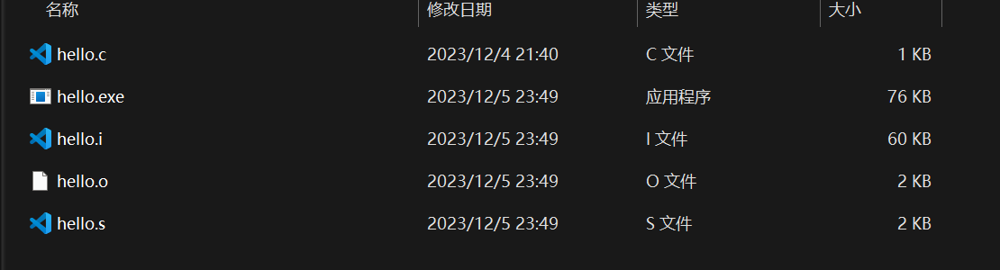

## 前言：

写这篇文章的想法源于某次课堂，老师多次将VC++6.0、CodeBlocks这些上古神器称为编译器，虽然知道它们区别的同学知道这只是老师的个人习惯，但我觉得课堂上还是应该严谨，特别是对刚接触计算机学科的同学们来说。

直接说结论：

- 编辑器：用来编辑文本文件的工具。比如windows下的记事本、Notepad++，Linux下的Vi、Vim、gedit，当然还有Vscode这种跨平台的软件。
- 编译器：按一定的规则将文本格式的源代码翻译成可执行程序的工具。例如编译c\c++的GCC、G++、MSVC、Clang等
- IDE（集成开发环境）：将上面的编译器、编辑器集成到一个软件中，再拓展更多便于开发人员使用的工具。

## 编译过程

注意这里我们只讨论c\c++这类编译型语言。

我们都知道一段程序从源码到可执行程序需要经过预处理、编译、汇编、链接这几步操作，下面是我在windows环境下使用MinGW-w64编译器（不懂的朋友先不用管它是什么，马上会解释）分步执行了这个过程：

1. **编辑（Editing）：** 你首先使用文本编辑器（如Notepad++、Visual Studio Code、或者专门的集成开发环境（IDE）如Visual Studio等）编写C++源代码文件（通常以`.cpp`为扩展名）。在这个阶段，你可以编写类、函数、变量等。

2. **预处理（Preprocessing）：** 在这个阶段，预处理器会对源代码进行处理。预处理器的任务包括处理`#include`指令，替换宏定义，以及处理条件编译等。预处理器生成一个新的临时源文件，通常以`.i`或`.ii`为扩展名。打开终端，进入源文件所在目录，执行下面的命令：

   ```shell
    gcc -E hello.c -o hello.i
   ```

3. **编译（Compiling）：** 在这个阶段，编译器将预处理后的源代码翻译成汇编代码。汇编代码是一种低级的表示，它使用符号和指令来描述程序的操作。生成的文件通常以`.s`为扩展名。继续执行如下命令：

   ```shell
    gcc -S hello.c -o hello.s
   ```

4. **汇编（Assembling）：** 汇编器将汇编代码翻译成机器码或者可重定位的目标代码。生成的文件通常以`.o`、`.obj`或者其他特定于平台的扩展名为后缀。执行命令：

   ```shell
    gcc -c hello.c -o hello.o
   ```

5. **链接（Linking）：** 在这个阶段，链接器将目标代码与其他已经编译的目标代码或者库文件链接在一起，生成最终的可执行文件。链接器的任务包括解析符号引用、地址重定向等。生成的文件通常是一个可执行文件，可以在计算机上运行。可执行文件的扩展名可能是`.exe`（Windows）或者无扩展名（Linux）。执行命令：

   ```shell
    gcc hello.o -o hello.exe
   ```

上面的过程中每一步都会生成相应的文件，其中几个文本类型文件有兴趣的朋友可以打开查看一下。



大家可以看到，我们通过gcc工具，在命令行中就实现了一个程序从源码到可执行程序的全过程（当然gcc命令还有更多使用方式，在这里不深入讨论）。

## 编译器

1. GCC\G++

   gcc 和 g++分别是GNU的c、c++的编译器，主要用于LINUX平台。现在大多Linux的发行版都会自带这两个编译器。

2. MinGW

   其实MinGW就是GCC\G++在windows环境下的移植，上面我用来演示编译过程就是用的MinGW，与Linux下使用gcc没什么区别。

3. MSVC

   这是Windows环境下的编译器，我们在安装Visual Studio之后就会自带这个编译器。

## IDE（集成开发环境）

前边说的VC++6.0、CodeBlocks其实是在这个范畴，IDE是将文件管理系统、编辑器、编译器、调试、版本管理、代码提示、远程连接等等会用到的工具进行了一个打包，让程序员尽量做到开箱即用。

在windows环境下，我们大部分初学者接触到的都是微软的那套软件，我个人推荐的就是大名鼎鼎的Visual Studio，真正让初学者做到了开箱即食，能够尽快入门，而不是把时间和热情消耗在各种奇怪的环境配置上。

另外关于VScode，它本体其实只能算一个文本编辑器（记事本同级），加上各种插件之后才得以拿来开发。喜欢定制化、有时间折腾的朋友推荐使用，我个人最喜欢的就是vscode。

## 总结

内容很简单，对大部分朋友来说这个问题可能太过低端，文中也没多少干货，但想想两年前的自己确实需要这种“启蒙”的文章，或许就有人需要呢。

最后附上本人正在使用开发工具大合集，你喜欢哪一款的风格呢？


上边两个是微软出品，下边是JetBrains全家桶中的两个
