## 前言

### Sphinx介绍

Sphinx是一种文档生成工具，主要用于生成和管理过程文档。它支持以Python为基础的丰富插件，可以输出为HTML，PDF，Latex等格式。

### reStructuredText 介绍

reStructuredText （简称reST）是一种轻量级标记语言，文件名后缀为`.rst`。是 Sphinx 使用的默认纯文本标记语言

### markdown介绍

Markdown 也是一种轻量级标记语言，文件名后缀通常为`.md`。

## 环境准备

### Python安装

#### Linux环境

1. 确保已安装Python

```shell
python3 --version
```

2. 如果未安装，使用包管理器安装：

- Ubuntu/Debian系统：

```shell
sudo apt install python3 python3-pip
```

- Red Hat/CentOS系统：

```shell
sudo yum install python3 python3-pip
```

#### Windows环境

1. 访问Python官网：https://www.python.org，下载最新版本安装包。
2. 在安装时，确保选中“Add Python to PATH”选项。
3. 确认Python安装正常：

```shell
python --version
pip --version
```

### Sphinx安装

#### 安装Sphinx本体

直接使用`pip`安装即可

```shell
pip install sphinx
```

#### *相关扩展

这一部分不是不是现在必须安装，介绍到相关内容我们会详细解释。

##### Sphinx主题

Sphinx可以自己选择编译输出的主题，常见主题可直接使用pip安装，然后在`conf.py`文件中配置。

例如，安装`Press`主题：

```shell
pip install sphinx-press-theme
```

- 可以在这个网站中寻找合适的主题：[Sphinx Themes Gallery](https://sphinx-themes.org/)

##### Markdown支持

Sphinx默认使用的是reST语言，想要支持Markdown则需要安装相应的解释器插件。

我们参考官方文档使用`pip`安装`myst-parser`，之后再`conf.py`文件中配置。当然也可以根据需求安装其他的解释器。

```shell
pip install --upgrade myst-parser
```

## 快速开始

### 创建工作目录

1. 创建一个用于存放文档的工作目录，例如：

```shell
mkdir my_sphinx_docs
cd my_sphinx_docs
```

### 建立工程

1. 使用Sphinx提供的命令初始化一个新工程：

```
sphinx-quickstart
```

2. 根据提示输入项目信息，例如项目名称、作者、语言等。各个信息的解释放在了下面的注释中：

```shell
pwsh> Sphinx-quickstart
Welcome to the Sphinx 8.1.3 quickstart utility.

Please enter values for the following settings (just press Enter to
accept a default value, if one is given in brackets).

Selected root path: .

You have two options for placing the build directory for Sphinx output.
Either, you use a directory "_build" within the root path, or you separate
"source" and "build" directories within the root path.
> Separate source and build directories (y/n) [n]: y	# 是否将源码文件（source）和构建生成的文件（build）分开存放。
The project name will occur in several places in the built documentation.
> Project name: my_sphinx_docs	# 项目的名称，会在生成的文档标题、页脚等位置显示。
> Author name(s): ming	# 文档的作者信息，同样会出现在生成的文档中，如版权声明。
> Project release []:	# 项目的版本信息，将用于文档的标题或页脚。 可以输入例如"1.0"等信息

If the documents are to be written in a language other than English,
you can select a language here by its language code. Sphinx will then
translate text that it generates into that language.

For a list of supported codes, see
https://www.sphinx-doc.org/en/master/usage/configuration.html#confval-language.
> Project language [en]: zh_CN	# 文档的语言设置。影响目录、导航等的文本。支持的语言代码可以参考上面链接的文档

Creating file E:\Project\Sphinx\source\conf.py.
Creating file E:\Project\Sphinx\source\index.rst.
Creating file E:\Project\Sphinx\Makefile.
Creating file E:\Project\Sphinx\make.bat.

Finished: An initial directory structure has been created.

You should now populate your master file E:\Project\Sphinx\source\index.rst and create other documentation
source files. Use the Makefile to build the docs, like so:
   make builder
where "builder" is one of the supported builders, e.g. html, latex or linkcheck.
```

### 工程结构介绍

如果选的是源码与生成文件分开存放，则总的工程结构如下图，随后我们将逐个介绍。

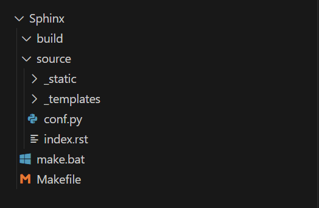

### `build`文件夹

`build`文件夹存放的是Sphinx生成的最终文档。它是一个输出目录，其中包含了生成的HTML、PDF或其他格式的文档文件。当执行构建命令（比如`make html`）时，Sphinx会将编译结果放在该目录下。这个文件夹的内容会随着每次构建而更新，因此也可以自由的删除这个目录重新进行构建。

我们在终端输入 `make html`，会发现`build`目录下多出了内容：

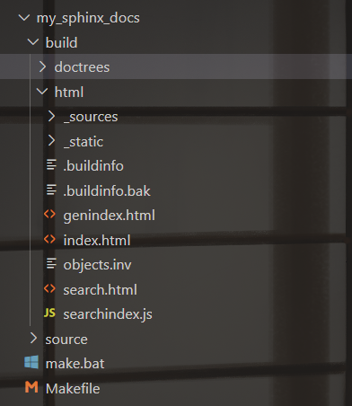

`doctrees`文件夹用于存储 Sphinx 构建过程中的中间数据，帮助加速后续的文档生成过程。

`html`文件夹就是最后输出的静态网页文件，我们可以打开`index.html`文件查看。也可以部署到web服务器上。

### `make.bat`脚本 (Windows)

`make.bat`是Windows环境下用于构建文档的批处理脚本。我们可以在命令行中执行该脚本来自动构建Sphinx文档，类似于Linux/Mac系统中的`Makefile`。例如执行`make.bat html`，Sphinx会根据配置文件生成HTML格式的文档。

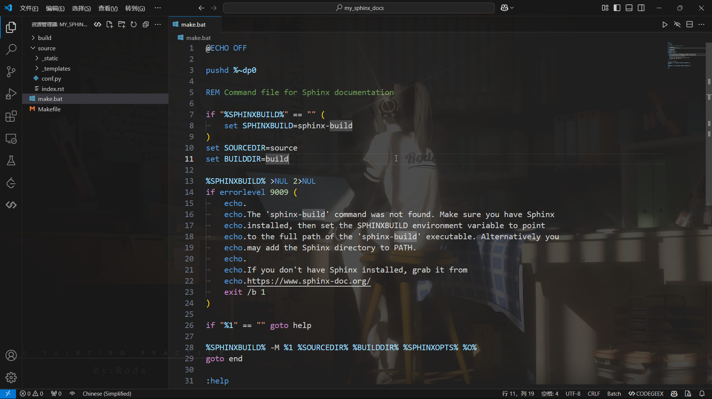

### `Makefile`文件

`Makefile`是Unix类系统（如Linux和macOS）下用来构建文档的文件。它定义了一系列的构建目标（如`html`、`latex`、`pdf`等），以及如何执行构建过程。我们可以通过命令行运行`make`命令来进行构建。例如，运行`make html`来生成HTML文档。另外也可以对这个文件进行修改，调整源路径、输出路径等。

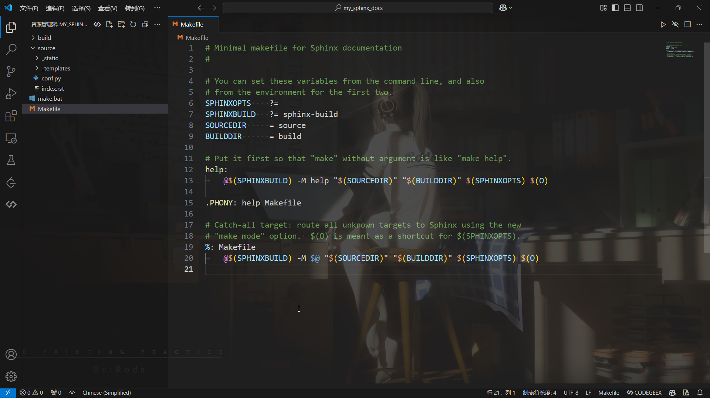

### `source`文件夹

`source`文件夹是存放文档源文件的地方，例如我们编辑的所有的`.rst`或`.md`文档文件。除了文档内容外，`source`文件夹里还包含一些辅助文件夹和配置文件：

- `_static`文件夹

  用于存放静态资源，如图片、CSS文件、JavaScript文件等。这些资源在构建过程中会被自动引入并包含在最终的文档中。

- `_templayes`文件夹

  用于存放自定义的HTML模板文件。如果需要修改文档的布局或外观，可以将自定义的HTML模板放在这个文件夹里，并在`conf.py`中进行配置。

- `conf.py`配置文件（主要关注）

  这是Sphinx工程的主要配置文件。它定义了Sphinx构建过程中的所有重要设置，如文档的标题、作者、输出格式、扩展插件等。可以在这个文件中配置主题、插件以及其他生成选项。具 体解释可以阅读下面的注释内容：

  ```shell
  # Configuration file for the Sphinx documentation builder.
  #
  # This file only contains a selection of the most common options. For a full
  # list see the documentation:
  # https://www.sphinx-doc.org/en/master/usage/configuration.html
  
  # -- Path setup --------------------------------------------------------------
  
  # If extensions (or modules to document with autodoc) are in another directory,
  # add these directories to sys.path here. If the directory is relative to the
  # documentation root, use os.path.abspath to make it absolute, like shown here.
  #
  # import os
  # import sys
  # sys.path.insert(0, os.path.abspath('.'))
  
  # -- Project information -----------------------------------------------------
  
  project = 'my_sphinx_docs'  # 项目名称
  copyright = '2024, ming'  # 版权信息
  author = 'ming'  # 作者
  
  # The full version, including alpha/beta/rc tags
  release = '1.0'  # 版本号
  
  # -- General configuration ---------------------------------------------------
  
  # Add any Sphinx extension module names here, as strings. They can be
  # extensions coming with Sphinx (named 'sphinx.ext.*') or your custom
  # ones.
  extensions = [  # 添加扩展，其中sphinx.ext.*表示sphinx自带的扩展
      'myst_parser',  # markdown支持
      'sphinx.ext.autodoc',  # 自动生成文档插件
  ]
  
  # Add any paths that contain templates here, relative to this directory.
  templates_path = ['_templates']  # 模板路径
  
  # The language for content autogenerated by Sphinx. Refer to documentation
  # for a list of supported languages.
  #
  # This is also used if you do content translation via gettext catalogs.
  # Usually you set "language" from the command line for these cases.
  language = 'zh_CN'  # 语言
  
  # List of patterns, relative to source directory, that match files and
  # directories to ignore when looking for source files.
  # This pattern also affects html_static_path and html_extra_path.
  exclude_patterns = []  # 忽略的文件
  
  # -- Options for HTML output -------------------------------------------------
  
  # The theme to use for HTML and HTML Help pages.  See the documentation for
  # a list of builtin themes.
  #
  html_theme = 'alabaster'  # 主题
  
  # Add any paths that contain custom static files (such as style sheets) here,
  # relative to this directory. They are copied after the builtin static files,
  # so a file named "default.css" will overwrite the builtin "default.css".
  html_static_path = ['_static']  # 静态文件路径
  ```

- `index.rst`文件

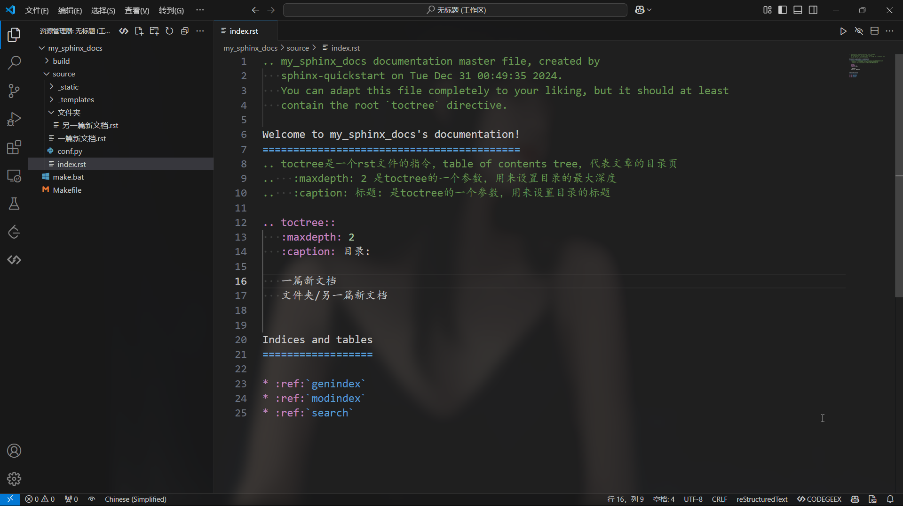

Sphinx自动生成的主页文件，是整个文档的入口。

这个文件需要有一个 `toctree` 指令来表达该文档的整体结构，例如目前的文件结构如下：

```shell
source/
    index.rst
    conf.py
    文件一.rst
    文件夹/
    	文件二.rst
```

只需要将文档名（不需要扩展名）列出在指令中，就会在目录中按照 `maxdepth` 设置的深度添加这些文档的**标题**。

```reStructuredText
.. toctree::
   :maxdepth: 2
   :caption: 目录:

   文件一
   文件夹/文件二
```

有以下注意点：

- 如果是在 source 中添加了子目录，将文档放在子目录里，填写的路径是相对于 index.rst 

- `:maxdepth: n`指的是目录的标题深度设为 n，举例解释：

  假设`文件一.rst`内容为：

  ```reStructuredText
  文件一的一级标题
  ==========================================
  
  文件一的二级标题
  ------------------------------------------
  
  文件一的三级标题
  ~~~~~~~~~~~~~~~~~~~~~~~~~~~~~~~~~~~~~~~~~~
  ```

  `maxdepth`设置为 `2` 的结果是就会是只展示前两级的标题

  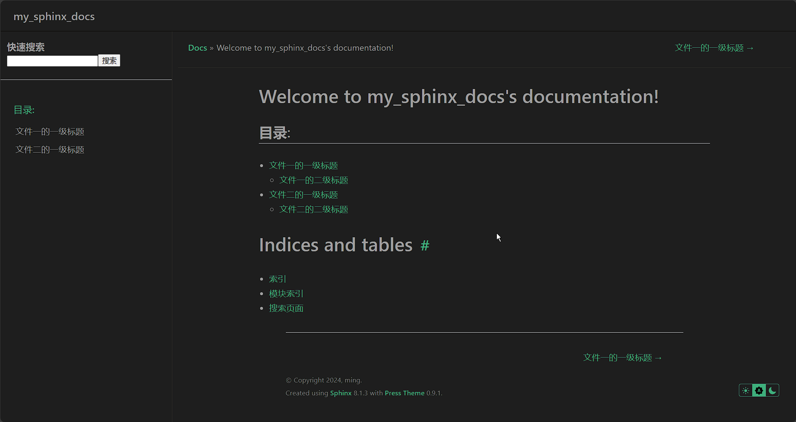

### 编写文档

`reStructuredText`是Sphinx默认支持的格式，因此不需要进行额外配置，直接将文档文件放入`source`目录下，并进行合理的目录结构管理即可。

####  Markdown格式

1. 安装`Markdown`扩展

```shell
pip install --upgrade myst-parser
```

2. 添加`myst-parser`到Sphinx扩展列表：

```shell
# 修改 source/conf.py文件
extensions = ['myst_parser']
```

- MyST-Parser 要求 Sphinx 2.1 或更高版本。

3. 假如我们的`Markdown`文件不是以`.md`结尾，我们需要在`conf.py`中添加额外设置：

```shell
# 源文件后缀名配置
source_suffix = {
    '.rst': 'restructuredtext',
    '.md': 'markdown',
    '.txt': 'markdown',  # 将txt文件当作markdown文件处理
}
```

4. 要支持Markdown表格语法，还需要安装sphinx-markdown-tables扩展，并在`conf.py`中添加：

```shell
pip install sphinx-markdown-tables
```

```shell
# 修改 source/conf.py文件
extensions = [
'myst_parser',
'sphinx_markdown_tables`,
]
```

### 设置主题

1. Sphinx支持设置文档的主题，通过`conf.py`中的变量`html_theme`设置。其中Sphinx内建的主题不需要额外安装，例如`classic` ：

```shell
html_theme = 'classic'  # 主题
```

- 特定的主题（大部分是Sphinx内置）还可以使用`html_theme_options`细化配置，例如将侧边栏放在右侧，并为关系栏添加黑色背景（在页面顶部和底部具有导航链接的栏）

```shell
html_theme_options = {
    "rightsidebar": "true",
    "relbarbgcolor": "black"
}
```

- 内建主题可以在[官方文档主题章节]([HTML theming — Sphinx documentation](https://www.sphinx-doc.org/en/master/usage/theming.html#builtin-themes))查看

2. 除了内建主题，还有以python包形式分发的，需要使用`pip`安装后使用：

```shell
pip install sphinx-rtd-theme # Sphinx官网使用的主题
```

```shell
# 修改配置文件
html_theme = 'sphinx_rtd_theme'
```

- 可以在这个网站中寻找合适的主题：[Sphinx Themes Gallery](https://sphinx-themes.org/)

3. 还有一种是以静态文件的形式提供的

- 对于静态主题, 可以是目录(包含`theme.conf`以及其他需要的文件), 或者内容相同的zip文件.必须放在Sphinx可以找到的地方, 在`conf.py`中, 通过变量`html_theme_path`设置静态主题的路径.
- 例如, 有一个主题`blue.zip`, 需要在`conf.py`中这样配置:

```shell
html_theme = 'blue'
# 目录列表，设置html theme的路径
# 可以是绝对路径或者相对conf.py的相对路径
html_theme_path = ['.']
```

### 生成文档

在工程目录（非source目录），执行`make`命令（Windows中使用`make.bat`）

```shell
make html
# .\make.bat html # Windows
```

就可以生成html静态网页。当然也可以生成dirhtml,singlehtml,epub,devhelp,latex,man,texinfo,text等多种格式。

#### 预览

生成的网页位于`build/html`目录，浏览器打开`index.html`即可预览

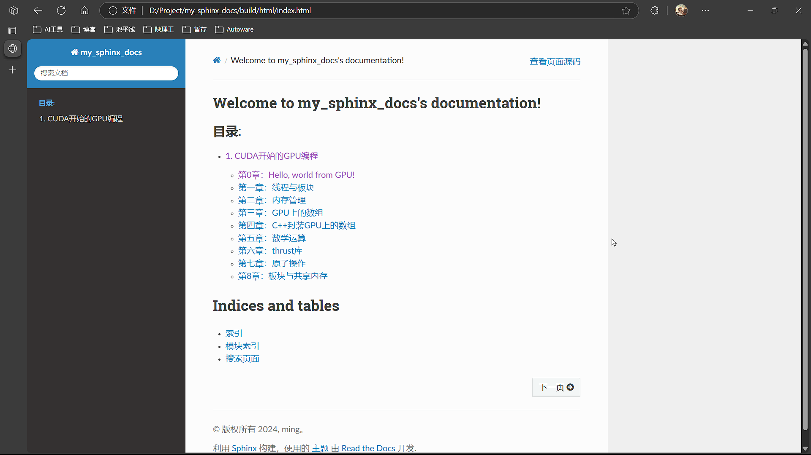

## VSCode使用优化

为了实现在`VS Code`中实时预览对文档的编辑效果，需要进行以下配置

### 安装sphinx-autobuild工具

`sphinx-autobuild`是一个Sphinx提供的工具，启动一个服务监视`source/`目录，检测到更改时将自动触发构建文档的过程。

可以使用`pip`进行安装：

```shell
pip install sphinx-autobuild
```

使用方法：

- `sphinx-autobuild <源文件目录> <输出文件路径>`

```
sphinx-autobuild ./source/ _build/html
```

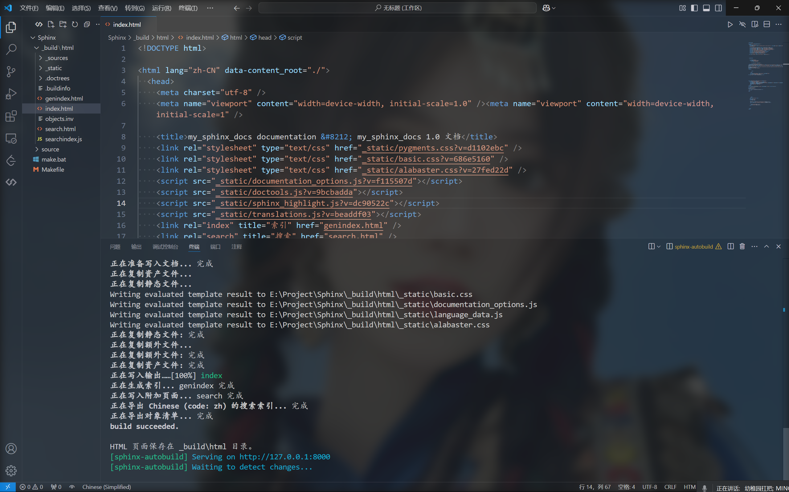

此时浏览器打开`http://127.0.0.1:8000`已经可以实现实时预览更改。

更详细的用法参考仓库文档：[sphinx-autobuild](https://github.com/sphinx-doc/sphinx-autobuild)

### 安装Live Privew插件

`Live Preview`是一个在VS Code窗口中渲染HTML网页的插件，我们借助它可以将上一步生成的html文件实时渲染在窗口中。

在vscode插件中搜索安装即可。

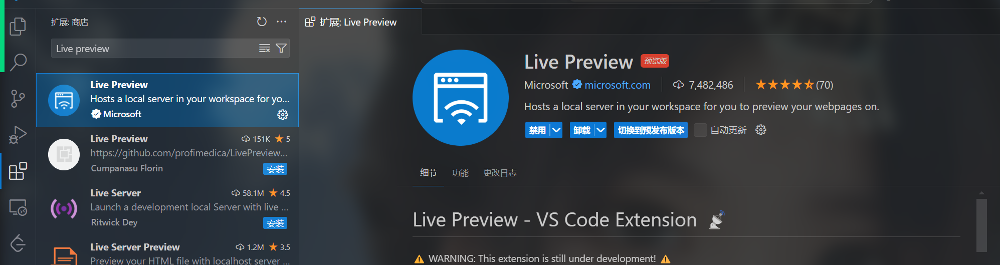

接下来打开`sphinx-autobuild`工具生成的HTML文档，点击右上角实现预览：

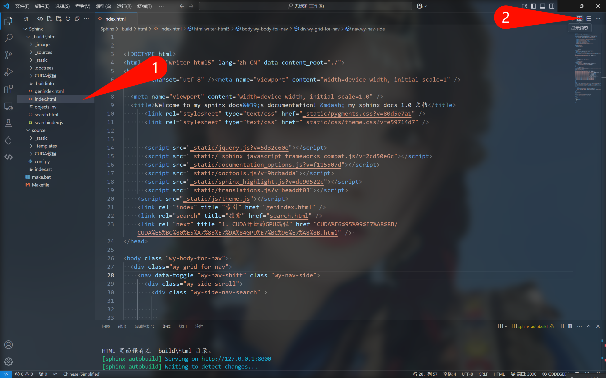

最终实现效果如图：

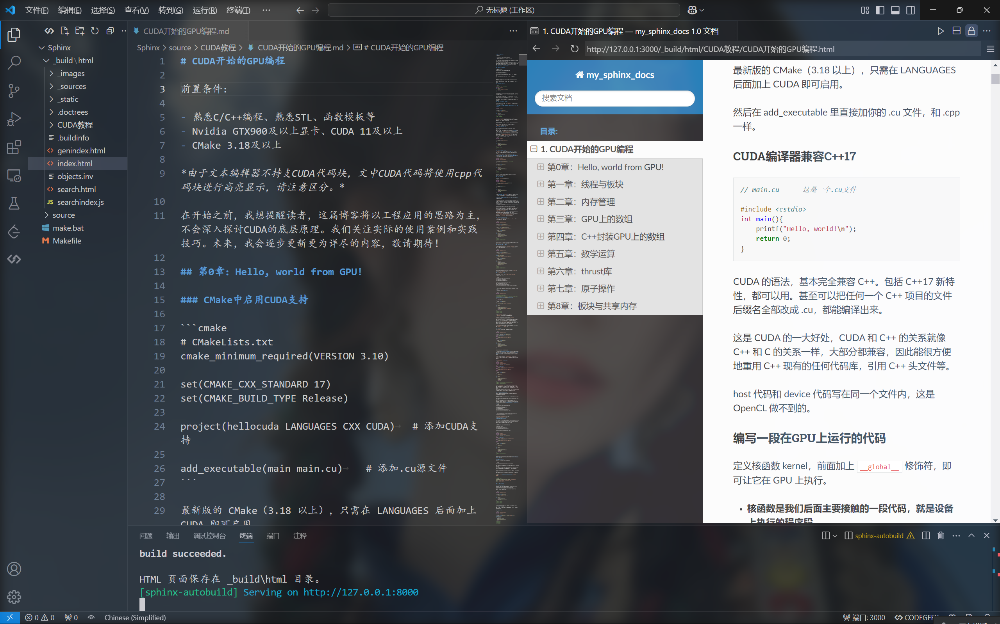

### 配置 VSCode 任务来快速启动 `sphinx-autobuild`

为了进一步简化操作，我们可以创建一个VSCode任务，通过快捷键快速打开。

创建`.vscode/tasks.json`，内容如下：

```json
{
  "version": "2.0.0",
  "tasks": [
    {
      "label": "Start Sphinx Autobuild",
      "type": "shell",
      "command": "sphinx-autobuild",
      "args": [
        "./source",
        "_build/html"
      ],
      "group": {
        "kind": "build",
        "isDefault": true
      }
    }
  ]
}
```

之后就可以使用快捷键`Ctrl+Shift+B` 来启动该任务，或者通过 `Ctrl+Shift+P` 打开命令面板，选择 `Tasks: Run Build Task`。

## 补充说明

1. Sphinx需要使用额外的扩展才能支持Markdown格式的文档，这些扩展对非ASCII字符(中文)不友好，目前在Windows环境下测试发现，Markdown文档中不能引用包含中文路径的图片。